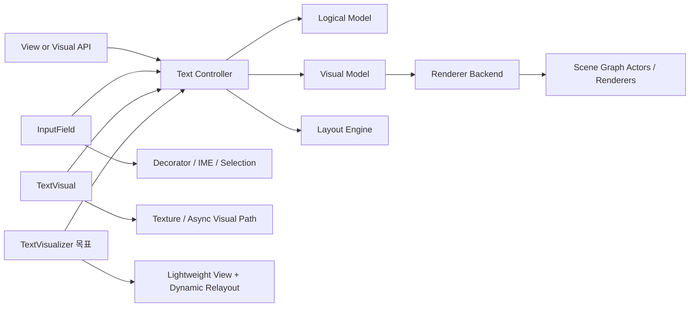

# TextVisualizer 분석 개요

## 목적

이 문서는 `Dali::Ui::TextVisualizer` 구현을 위한 기준 문서의 출발점이다.
`TextVisualizer`의 목표는 기존 `TextVisual`처럼 정적 텍스처를 만들어 붙이는 방식도 아니고,
`InputField`처럼 편집기 전체 스택을 안고 가는 방식도 아닌,
동적 레이아웃 변화에 강한 텍스트 전용 View를 만드는 것이다.

핵심 요구는 다음과 같다.

- 부모 레이아웃 변경에 자주 반응해도 relayout / rerender 비용이 과도하게 커지지 않아야 한다.
- 읽기 전용 표시가 기본이며, 편집기용 상태 머신과 입력 장치 의존성을 기본 탑재하지 않아야 한다.
- `PreText` 계열이 기대하는 "빠른 재측정 + 빠른 재배치 + 안정적인 표시" 특성을 제공해야 한다.
- 기존 Dali text 모듈의 재사용 범위를 분명히 하고, 제거해야 할 오버헤드와 신규 구조를 명확히 정의해야 한다.

## 분석 범위

이번 분석은 아래 축으로 나눠 진행한다.

1. 현재 Dali UI text pipeline 전체 구조
2. `InputField`가 text stack을 어떻게 감싸고 있는지
3. `Text::Controller`가 실제로 어떤 책임을 떠안고 있는지
4. `AtlasRenderer`가 동적 glyph 렌더링에 어떤 장단점을 가지는지
5. 위 분석을 바탕으로 `TextVisualizer` 설계안과 구현 계획

## 현재 구조에 대한 1차 결론

현재 Dali text 모듈은 크게 두 갈래로 사용된다.

- `TextVisual`
  - 비편집형 visual 중심 경로
  - relayout 후 텍스처 기반 렌더러를 갱신하는 흐름
  - 비동기 렌더링과 tiling 지원이 강점
  - View 자체가 아니라 visual이므로 레이아웃 변화에 대한 제어권이 제한적이다.
- `InputField`
  - `View` + `Text::Controller` + `Decorator` + gesture/IME + renderer 조합
  - 편집/선택/커서/포커스 처리가 모두 포함된 무거운 경로
  - 동적 레이아웃 대응은 가능하지만 읽기 전용 표시용 View로 쓰기에는 책임이 과도하다.

즉, `TextVisualizer`는 둘 중 하나를 그대로 재사용하는 대상이 아니라,
아래처럼 "중간 계층"으로 설계하는 것이 맞다.

- 레이아웃/모델 계산은 `Text::Controller` 계열에서 재사용
- 편집 관련 상태와 장식(decorator), IME, selection handle은 제거
- 렌더링은 동적 relayout에 유리한 경로를 선택
  - 1차 후보: `AtlasRenderer`
  - 대안 후보: 기존 `TextVisual`의 bitmap/tiling 경로 일부 차용

## 재사용 우선순위

### 그대로 재사용 가치가 높은 영역

- `Text::Controller`의 logical/visual model 갱신 체계
- script / bidi / shaping / glyph metrics / layout engine
- style parsing 및 markup 처리
- background / underline / strikethrough 계산 결과
- `CommonTextUtils::RenderText()`가 가진 actor 배치 보조 로직 일부

### 조건부 재사용 영역

- `Text::Controller` 자체
  - editable 기능을 끄고 사용하면 많은 코드를 재사용할 수 있다.
  - 하지만 내부 상태가 너무 넓어서 `TextVisualizer` 전용 facade가 필요하다.
- `AtlasRenderer`
  - 텍스처 재생성보다 glyph atlas 재사용 측면에서 유리하다.
  - 그러나 actor/mesh 단위 구성이 세밀해서 텍스트 블록이 많을 때 scene graph 비용이 생길 수 있다.
- `TextVisual` async pipeline
  - 큰 텍스트나 비동기 size 계산에는 참고 가치가 있다.
  - 다만 visual 중심 설계라 View 기준 동적 레이아웃에 바로 맞지는 않는다.

### 기본 제거 대상

- IME 연동
- selection / cursor / grab handle / popup
- edit state machine
- text input event queue
- hidden input / password 편집 로직
- editable/selectable control interface 일체

## TextVisualizer가 가져야 할 방향

`TextVisualizer`는 "표시용 text controller wrapper + layout-aware view + lightweight renderer host"여야 한다.

다음 성질이 중요하다.

- View가 직접 measure / arrange / relayout lifecycle을 가진다.
- 텍스트가 바뀌지 않아도 width/height 제약 변경에 빠르게 반응한다.
- property 변경 시 어떤 단계까지 다시 계산할지 명확한 dirty mask를 가진다.
- 편집 기능이 없는 만큼 actor 수, 상태 수, signal 수를 줄인다.

## 문서 산출물

이 분석 작업의 최종 산출물은 아래 문서들이다.

- `00-overview.ko.md`
- `01-current-text-pipeline.ko.md`
- `02-input-field-analysis.ko.md`
- `03-text-controller-analysis.ko.md`
- `04-atlas-renderer-analysis.ko.md`
- `05-text-visualizer-design.ko.md`
- `06-implementation-plan.ko.md`

## 전체 구조 미리보기

## 구현 기준 원칙

이후 문서와 구현은 아래 원칙을 따른다.

- 기존 모듈을 "대체"하기보다 "분해해서 재조립"한다.
- `TextVisualizer`는 읽기 전용 표시 최적화가 기본값이다.
- 편집기 스택과 visual 스택의 장점만 취하고, 서로의 과한 책임은 들고 오지 않는다.
- 신규 구조는 향후 `TextLabel`, `PreText`, `Marquee`, `rich text view`에도 확장 가능해야 한다.
