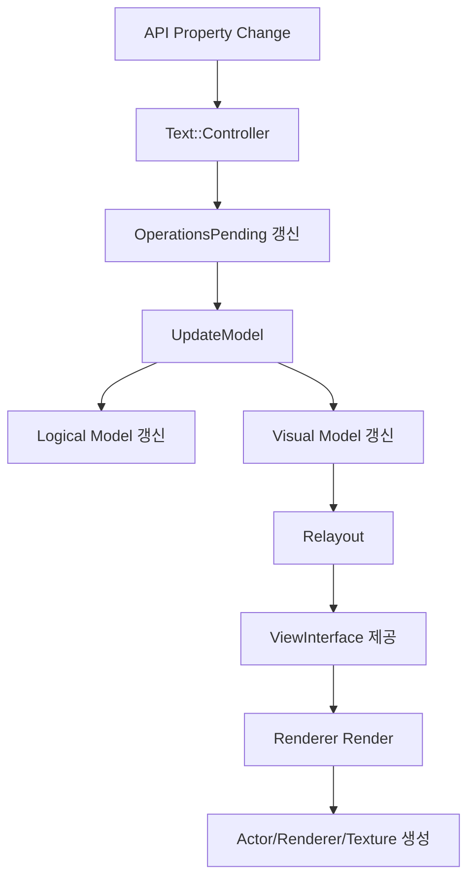
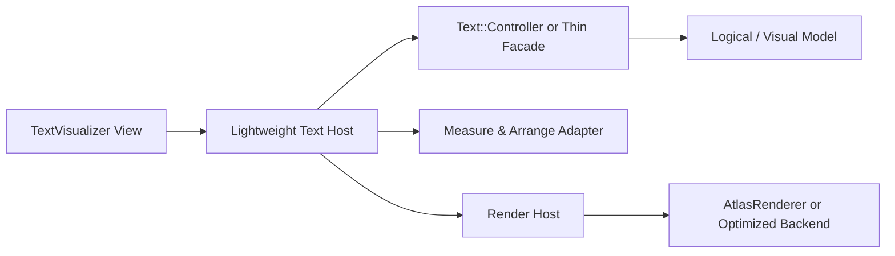

# 현재 Dali UI Text Pipeline 분석

## 한눈에 보는 결론

현재 Dali UI text pipeline은 "하나의 controller가 모델 계산, 레이아웃, 편집 이벤트, 장식 상태를 폭넓게 관리하고,
상위 계층이 이를 각자 다른 방식으로 렌더링"하는 구조다.

이 구조는 기능 재사용성은 높지만, `TextVisualizer` 관점에서는 다음 문제가 있다.

- 표시 전용 View에도 편집기 수준의 상태 구조가 따라오기 쉽다.
- relayout과 render invalidation 경계가 넓어, 동적 크기 변화에 비해 계산 범위가 커질 수 있다.
- `TextVisual` 경로와 `InputField` 경로가 같은 controller를 공유하지만 최적화 목표가 다르다.

## 핵심 구성 요소

### 1. 상위 진입점

- `internal/visuals/text/text-visual.cpp`
  - visual 기반 텍스트 표시
  - actor에 renderer를 붙이는 방향
  - async size/render, tiling, shader feature 조합 지원
- `integration-api/input-field-impl.cpp`
  - View 기반 텍스트 입력/표시
  - measure / arrange / relayout lifecycle 보유
  - focus, gesture, IME, selection, decorator 포함

### 2. 공통 중심축

- `internal/text/controller/text-controller.*`
  - text stack의 중심
  - property 변경, model 업데이트, relayout, selection, scrolling, placeholder 등 통합 관리
- `internal/text/text-model.*`
  - logical model + visual model 보관
- `internal/text/layouts/layout-engine.*`
  - 줄바꿈, line layout, alignment, ellipsis, cursor geometry 계산

### 3. 렌더링 백엔드

- `internal/text/rendering/atlas/text-atlas-renderer.cpp`
  - glyph atlas 기반 actor/mesh 렌더링
- `internal/visuals/text/text-visual.cpp` + typesetter
  - pixel data / texture / tiling 기반 visual 렌더링

## 파이프라인 흐름

## Controller 내부 처리 단계

`Text::Controller`는 `OperationsMask`를 이용해 다음 단계를 선택적으로 수행한다.

- `CONVERT_TO_UTF32`
- `GET_SCRIPTS`
- `VALIDATE_FONTS`
- `GET_LINE_BREAKS`
- `BIDI_INFO`
- `SHAPE_TEXT`
- `GET_GLYPH_METRICS`
- `LAYOUT`
- `UPDATE_LAYOUT_SIZE`
- `REORDER`
- `ALIGN`
- `COLOR`
- `UPDATE_DIRECTION`

이 점은 중요하다.

- 장점
  - property 변경 종류에 따라 전체 재계산을 피할 수 있는 구조를 이미 갖고 있다.
  - `TextVisualizer`가 새 controller를 만들기보다 이 dirty pipeline을 재사용하는 편이 낫다.
- 한계
  - 실제 사용처에서는 pending mask를 넓게 잡는 경우가 많아, 표시 전용 View의 최소 비용 경로가 명확히 드러나지 않는다.
  - 편집 관련 처리와 순수 layout 처리가 같은 impl에 섞여 있다.

## InputField 경로

`InputFieldImpl::OnRelayout()`의 실제 흐름은 다음과 같다.

1. padding을 제외한 content size 계산
2. stencil / active layer / cursor layer 크기 조정
3. `mController->Relayout(contentSize, layoutDirection)` 호출
4. decorator relayout
5. renderer 없으면 backend에서 생성
6. `CommonTextUtils::RenderText()`로 actor 재배치

특징은 아래와 같다.

- View lifecycle에 잘 통합되어 있다.
- text 변경이 없어도 레이아웃 제약이 바뀌면 controller relayout이 자연스럽게 호출된다.
- 대신 decorator, clipping decoration, cursor layer 등 표시 전용 View에는 불필요한 요소가 항상 주변에 있다.

## TextVisual 경로

`TextVisual::UpdateRenderer()`의 실제 흐름은 다음과 같다.

1. visual transform 기준 relayout size 계산
2. `mController->Relayout(relayoutSize, layoutDirection)` 호출
3. glyph/color/style 존재 여부 검사
4. shader feature 결정
5. texture set 또는 tiled texture 생성
6. renderer를 actor에 부착

특징은 아래와 같다.

- visual 시스템에 자연스럽게 맞는다.
- async rendering과 large texture tiling 대응이 좋다.
- 그러나 View의 measure/arrange 중심 제약 변화 대응보다는, "현재 visual rect 안에 어떻게 그릴 것인가"에 초점이 맞춰져 있다.

## Model 구조

`Text::Model`은 외부에 `ModelInterface`를 제공하며, 내부적으로는 다음 두 모델을 묶는다.

- `LogicalModel`
  - 문자, script run, line break, style run 등 텍스트 의미 단위 중심
- `VisualModel`
  - glyph, layout position, color index, line run, scroll position 등 렌더링 직전 데이터 중심

이 분리는 `TextVisualizer`에 매우 유리하다.

- 텍스트 내용 변경이 없고 폭만 변하는 경우
  - logical model은 대부분 재사용 가능
  - visual model/layout만 다시 계산하면 된다
- style 일부만 바뀌는 경우
  - pending operation을 좁혀 partial recompute 여지가 있다

## 공통 병목 후보

### 1. Controller 책임 과대

controller 하나가 아래를 모두 안고 있다.

- 텍스트 모델 갱신
- 레이아웃 계산
- scroll state
- placeholder
- selection
- cursor
- decorator sync
- IME / preedit
- popup / handle / gesture queue

표시 전용 View에서는 이중 절반 이상이 불필요하다.

### 2. Render invalidation 경계가 넓음

`InputFieldImpl`에서는 style 변경 시 `mRenderer.Reset()`으로 renderer를 재생성하는 코드가 반복된다.
이는 단순하고 안전하지만, `TextVisualizer`에는 더 세분화된 dirty 정책이 필요함을 의미한다.

예를 들어 아래는 분리 가능하다.

- layout dirty
- glyph cache dirty
- material dirty
- scene attachment dirty

### 3. 상위 계층별 렌더링 전략이 분리되어 있음

동일 controller 결과를 사용하지만 렌더링 경로가 둘로 나뉜다.

- `InputField`는 backend renderer + actor tree
- `TextVisual`은 visual renderer + texture/tiling

`TextVisualizer`는 새 View이므로 어느 쪽을 기본으로 삼을지 명확히 정해야 한다.

## TextVisualizer 관점의 재사용 판단

### 바로 가져갈 것

- `Text::Controller::Relayout()` 중심의 model/layout 파이프라인
- `Text::Model` 및 `ViewInterface`
- `Layout::Engine`
- markup / style 처리

### 그대로 가져오면 안 되는 것

- `InputFieldImpl`의 focus/IME/gesture 의존 구조
- editable/selectable interface
- selection/cursor decorator 생태계
- `TextVisual`의 visual-only transform 중심 제어 모델

### 새로 감싸야 할 것

- 표시 전용 controller facade
- View lifecycle에 맞는 measure/arrange/repaint 조정기
- renderer 교체 비용을 줄이는 dirty-state 설계

## 권장 파이프라인 방향

`TextVisualizer`는 아래 구조가 적절하다.

핵심 포인트는 두 가지다.

- controller는 재사용하되, View 쪽에서는 "표시용으로 필요한 subset"만 노출한다.
- renderer는 relayout이 잦을 때 전체 texture 재생성보다 유리한 경로를 우선 검토한다.

## 현재 pipeline이 TextVisualizer에 주는 시사점

1. 새 텍스트 엔진을 만드는 것은 불필요하다.
2. 하지만 현재 상위 계층은 각각 너무 무겁거나, 너무 visual 지향적이다.
3. 따라서 `TextVisualizer`는 controller 재사용 + View 전용 경량 wrapper + renderer host 분리 구조가 가장 현실적이다.
