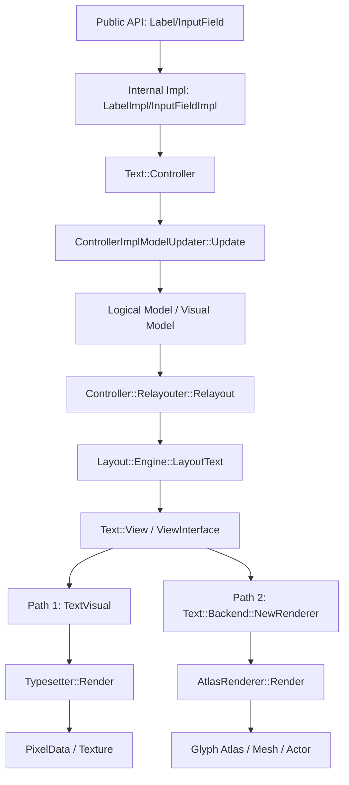

# 현재 Dali UI Text Rendering Pipeline 분석

## 목적

이 문서의 목적은 현재 Dali UI의 텍스트 렌더링 파이프라인을 `Label`, `InputField`, `text-controller`, `text-view`, `model`, `layout`, `text-atlas-renderer`, `typesetter` 기준으로 정리하는 것이다.

이번 문서에서는 다음 항목을 명확히 구분한다.

- `TextVisualizer` 구현에 직접 필요한 내용
- 구조 이해를 위한 참고용 내용

또한 분석 단계 규칙에 따라, 코드에서 확인한 사실만 기록하고 애매한 내용은 `확인 필요`로 표시한다.

## 분석 대상 파일

### 직접 분석한 파일

- `dali-ui-foundation/public-api/label.h`
- `dali-ui-foundation/public-api/label.cpp`
- `dali-ui-foundation/integration-api/label-impl.cpp`
- `dali-ui-foundation/public-api/input-field.h`
- `dali-ui-foundation/integration-api/input-field-impl.cpp`
- `dali-ui-foundation/internal/text/controller/text-controller.h`
- `dali-ui-foundation/internal/text/controller/text-controller.cpp`
- `dali-ui-foundation/internal/text/controller/text-controller-relayouter.cpp`
- `dali-ui-foundation/internal/text/controller/text-controller-impl-model-updater.cpp`
- `dali-ui-foundation/internal/text/text-view-interface.h`
- `dali-ui-foundation/internal/text/text-view.h`
- `dali-ui-foundation/internal/text/text-model.h`
- `dali-ui-foundation/internal/text/text-model.cpp`
- `dali-ui-foundation/internal/text/layouts/layout-engine.h`
- `dali-ui-foundation/internal/text/rendering/text-backend.cpp`
- `dali-ui-foundation/internal/text/rendering/text-backend-impl.cpp`
- `dali-ui-foundation/internal/text/rendering/text-typesetter.h`
- `dali-ui-foundation/internal/text/rendering/text-typesetter.cpp`
- `dali-ui-foundation/internal/text/rendering/text-typesetter-impl.cpp`
- `dali-ui-foundation/internal/text/rendering/atlas/text-atlas-renderer.cpp`
- `dali-ui-foundation/internal/visuals/text/text-visual.cpp`

### 참고 대상

- `dali-ui-foundation/internal/controls/text-controls/common-text-utils.cpp`
- `dali-ui-foundation/internal/text/rendering/atlas/atlas-glyph-manager-impl.cpp`
- `dali-ui-foundation/internal/text/rendering/atlas/atlas-manager-impl.cpp`

## 현재 구조 요약

현재 Dali UI 텍스트 파이프라인은 크게 두 경로로 사용된다.

- `Label`
  - public API는 `Label`이고, internal 구현은 `LabelImpl`
  - 내부적으로 `TextVisual`과 `Text::Controller`를 사용한다
  - 기본 표시 경로는 `TextVisual` + `Typesetter` 계열이다
- `InputField`
  - public API는 `InputField`이고, internal 구현은 `InputFieldImpl`
  - 내부적으로 `Text::Controller`와 `Text::Backend::NewRenderer()`를 사용한다
  - 현재 `Text::Backend::NewRenderer()`는 `AtlasRenderer::New()`를 반환한다

공통 중심축은 `Text::Controller`이다.

- property 반영
- model 갱신
- relayout
- natural size / height-for-width 계산
- 최종 렌더링용 `Text::View` 제공

즉, 현재 구조는 "상위 View 또는 Visual이 `Text::Controller`를 사용하고, 렌더러 경로만 서로 다르다"는 형태다.

## public API에서 internal impl로 전달되는 흐름

### Label 경로

`Label` public API에서 internal impl로 내려가는 대표 흐름은 다음과 같다.

1. `dali-ui-foundation/public-api/label.cpp`
2. `Label::SetText()` 등 public method 호출
3. `GetImpl(*this).SetText(...)`
4. `dali-ui-foundation/integration-api/label-impl.cpp`
5. `LabelImpl::SetText()`
6. `mController->SetText(...)`

초기화 흐름은 다음과 같다.

1. `Label::New()` in `public-api/label.cpp`
2. `Integration::LabelImpl::New()`
3. `LabelImpl::Initialize()`
4. `LabelImpl::OnInitialize()` in `integration-api/label-impl.cpp`
5. `Ui::VisualFactory::Get().CreateVisual(...)`
6. `Internal::TextVisual::GetController(mVisual)`

즉, `Label`은 직접 renderer를 만들지 않고 `TextVisual` 내부 controller를 끌어와 사용하는 구조다.

### InputField 경로

`InputField` public API에서 internal impl로 내려가는 대표 흐름은 다음과 같다.

1. `dali-ui-foundation/public-api/input-field.h`
2. public setter 호출
3. `dali-ui-foundation/integration-api/input-field-impl.cpp`
4. `InputFieldImpl::SetText()`, `SetFontSize()`, `SetTextColor()` 등
5. `mController->SetText(...)`, `SetDefaultFontSize(...)` 등 호출

relayout 시 실제 렌더링 흐름은 다음과 같다.

1. `InputFieldImpl::OnRelayout()`
2. `mController->Relayout(contentSize, layoutDirection)`
3. renderer가 없으면 `Text::Backend::Get().NewRenderer()`
4. `InputFieldImpl::RenderText()`
5. `CommonTextUtils::RenderText(...)`

`InputField`는 `View`가 직접 controller와 renderer를 호스팅하는 구조다.

## Controller가 담당하는 단계

### 관련 파일

- `internal/text/controller/text-controller.h`
- `internal/text/controller/text-controller.cpp`
- `internal/text/controller/text-controller-relayouter.cpp`
- `internal/text/controller/text-controller-impl-model-updater.cpp`

### 실제로 확인되는 단계

`Text::Controller::OperationsMask`에는 아래 단계가 정의되어 있다.

- `CONVERT_TO_UTF32`
- `GET_SCRIPTS`
- `VALIDATE_FONTS`
- `GET_LINE_BREAKS`
- `BIDI_INFO`
- `SHAPE_TEXT`
- `GET_GLYPH_METRICS`
- `LAYOUT`
- `UPDATE_LAYOUT_SIZE`
- `REORDER`
- `ALIGN`
- `COLOR`
- `UPDATE_DIRECTION`

이 단계는 실제로 `ControllerImplModelUpdater::Update()`와 `Controller::Relayouter::*`에서 사용된다.

### 단계별 의미

#### 직접 필요한 내용

- `GET_SCRIPTS`
  - script 분리
- `VALIDATE_FONTS`
  - font fallback 포함 font validation
- `GET_LINE_BREAKS`
  - line break 정보 생성
- `BIDI_INFO`
  - bidi 정보 계산
- `SHAPE_TEXT`
  - glyph shaping
- `GET_GLYPH_METRICS`
  - glyph metrics 수집
- `LAYOUT`
  - visual position 계산

#### 참고용 내용

- `COLOR`
  - markup/style color 반영
- `UPDATE_DIRECTION`
  - layout direction 갱신
- selection/cursor/decorator 갱신에 연계되는 나머지 상태 처리

### 현재 controller의 실제 역할

`Text::Controller`는 단순 layout 계산기보다 훨씬 넓은 역할을 가진다.

- text property 저장
- text update tracking
- logical model 갱신
- visual model 갱신
- natural size / height-for-width 계산
- relayout
- scroll state 관리
- `InputField` 계열에서는 selection / cursor / decorator / event queue / IME 상태까지 관리

즉, `TextVisualizer` 관점에서는 prepare와 layout에 필요한 핵심 엔진이 들어 있지만, 입력기 오버헤드도 함께 들어 있다.

## Layout이 수행되는 위치

### 관련 파일

- `internal/text/controller/text-controller-relayouter.cpp`
- `internal/text/layouts/layout-engine.h`
- `internal/text/layouts/layout-engine.cpp`

### 실제 수행 위치

최종 relayout entry point는 아래다.

- `Text::Controller::Relayout()` in `text-controller.cpp`
- 내부에서 `Controller::Relayouter::Relayout()` 호출

그 안에서 핵심 흐름은 다음과 같다.

1. `impl.UpdateModel(...)`
2. `Controller::Relayouter::DoRelayout(...)`
3. `Layout::Engine::LayoutText(...)`
4. `Layout::Engine::Align(...)`

즉, layout의 핵심 계산 위치는 `Layout::Engine`이고, 이를 orchestration 하는 계층은 `Controller::Relayouter`이다.

### 의미

#### 직접 필요한 내용

- 실제 glyph position 계산은 `Layout::Engine`이 수행한다
- 상위 View는 보통 `Controller::Relayout()`만 호출한다
- `GetNaturalSize()`, `GetHeightForWidth()`, `CalculateLayoutSize()`도 `Controller::Relayouter`를 통해 같은 계열 계산을 재사용한다

#### 참고용 내용

- `InputField`의 경우 relayout 뒤에 decorator 재배치가 따라온다
- `Label`의 경우 relayout 뒤에 visual transform 갱신이 따라온다

## text-view와 model의 위치

### 관련 파일

- `internal/text/text-view-interface.h`
- `internal/text/text-view.h`
- `internal/text/text-model.h`
- `internal/text/text-model.cpp`

### Model

`Text::Model`은 logical model과 visual model을 묶는 container다.

- logical model
  - text buffer
  - script run
  - font run
  - line break 정보
- visual model
  - glyphs
  - glyph positions
  - lines
  - colors
  - style 관련 visual data

`text-model.cpp`에서 실제 getter가 대부분 `mLogicalModel`, `mVisualModel`을 그대로 노출한다.

### Text::View / Text::ViewInterface

`Text::ViewInterface`는 renderer가 요구하는 렌더링용 데이터 접근 인터페이스다.
`Text::View`는 이 인터페이스의 기본 구현이다.

핵심 함수:

- `GetControlSize()`
- `GetLayoutSize()`
- `GetNumberOfGlyphs()`
- `GetGlyphs(...)`
- `GetColors()`
- `GetColorIndices()`
- style 관련 getter 다수

즉, controller가 계산한 `Model`을 renderer가 쓰기 좋은 형태로 풀어 주는 계층이 `Text::View`다.

## Typesetter와 AtlasRenderer가 각각 사용되는 위치

## Typesetter 사용 위치

### 관련 파일

- `internal/visuals/text/text-visual.cpp`
- `internal/text/rendering/text-typesetter.h`
- `internal/text/rendering/text-typesetter.cpp`

### 확인된 사용 위치

`TextVisual`은 생성 시 다음을 가진다.

- `mController(Text::Controller::New())`
- `mTypesetter(Text::Typesetter::New(mController->GetTextModel()))`

실제 렌더링 시 `text-visual.cpp`에서 `mTypesetter->Render(...)` 또는 `RenderWithPixelBuffer(...)`를 호출한다.

대표 호출 위치:

- `mTypesetter->Render(size, textDirection, Text::Typesetter::RENDER_NO_STYLES, ...)`
- `mTypesetter->Render(size, textDirection, Text::Typesetter::RENDER_NO_TEXT, ...)`
- `mTypesetter->Render(size, textDirection, Text::Typesetter::RENDER_OVERLAY_STYLE, ...)`
- `mTypesetter->Render(size, textDirection, Text::Typesetter::RENDER_MASK, ...)`

즉, `Typesetter`는 주로 `TextVisual` 계열에서 pixel buffer / texture 생성용으로 사용된다.

### 의미

#### 직접 필요한 내용

- `TextVisualizer` 기본 방향이 `AtlasRenderer`라면 `Typesetter`는 1차 구현 필수 경로가 아니다

#### 참고용 내용

- `Label`의 기본 visual 렌더링 경로 이해에는 중요하다
- 비동기 texture render, cutout, style overlay 처리 이해에는 참고 가치가 있다

## AtlasRenderer 사용 위치

### 관련 파일

- `internal/text/rendering/text-backend-impl.cpp`
- `internal/text/rendering/atlas/text-atlas-renderer.cpp`
- `integration-api/input-field-impl.cpp`

### 확인된 사용 위치

`Text::Backend::NewRenderer()` in `text-backend-impl.cpp`는 현재 다음을 반환한다.

- `return Dali::Ui::Text::AtlasRenderer::New();`

즉, `InputFieldImpl::OnRelayout()`에서 renderer가 없을 때 호출하는 backend renderer는 현재 atlas renderer다.

따라서 현재 `InputField`의 표시 경로는 사실상 `AtlasRenderer` 기반이다.

### 의미

#### 직접 필요한 내용

- `InputField` 구조를 참고해 `TextVisualizer`를 만들면 atlas renderer 흐름을 그대로 참고할 수 있다

#### 참고용 내용

- backend abstraction은 얇고 현재 구현은 atlas renderer 고정이다

## AtlasRenderer가 렌더링에 필요한 데이터

### 관련 파일

- `internal/text/rendering/atlas/text-atlas-renderer.cpp`
- `internal/text/text-view-interface.h`

### `Render()` 시 직접 사용하는 데이터

`AtlasRenderer::Render(Text::ViewInterface& view, ...)`는 먼저 아래를 사용한다.

- `view.GetNumberOfGlyphs()`
- `view.GetGlyphs(...)`
- `view.GetColors()`
- `view.GetColorIndices()`
- `view.GetTextColor()`

이후 `AddGlyphs(...)` 내부에서 style 관련 데이터를 추가로 읽는다.

- `view.GetShadowOffset()`
- `view.GetShadowColor()`
- `view.GetOutlineWidth()`
- `view.GetOutlineColor()`
- `view.GetOutlineOffset()`
- `view.IsUnderlineEnabled()`
- `view.IsMarkupUnderlineSet()`
- `view.GetNumberOfUnderlineRuns()`
- `view.GetUnderlineRuns(...)`
- `view.IsStrikethroughEnabled()`
- `view.IsMarkupStrikethroughSet()`
- `view.GetNumberOfStrikethroughRuns()`
- `view.GetStrikethroughRuns(...)`
- `view.GetHyphens()`
- `view.GetHyphenIndices()`
- `view.GetHyphensCount()`
- ellipsis 관련 getter들

### TextVisualizer 관점 해석

#### 직접 필요한 내용

이번 범위에서 `TextVisualizer`가 style, ellipsis, underline, shadow를 무시한다면, atlas renderer가 실제 plain glyph 렌더링에 꼭 필요한 핵심 데이터는 아래로 좁아진다.

- glyph 목록
- glyph position
- 기본 text color
- 필요 시 glyph별 color index

#### 참고용 내용

- 현재 `AtlasRenderer`는 `Text::ViewInterface` 전부를 기준으로 설계되어 있다
- 따라서 1차 구현에서는 `TextVisualizer`용 adapter가 `ViewInterface`를 부분적으로 채우는 방식이 유력하다

#### 확인 필요 사항

- `AtlasRenderer`를 `TextVisualizer`용으로 더 축소한 별도 renderer adapter 없이 바로 사용할지
- 아니면 `Text::ViewInterface` 최소 subset 구현으로 충분한지

## mermaid flowchart

## TextVisualizer에 필요한 부분

### 직접 필요한 내용

- `InputField`의 public/internal `View` 구조
  - 참고 파일: `public-api/input-field.h`, `integration-api/input-field-impl.cpp`
- `Text::Controller`가 담당하는 prepare 전 단계
  - script
  - font fallback
  - shaping
  - glyph metrics
  - line break candidate
- `Text::Model`
  - glyph와 glyph position 전후 데이터를 보관하는 역할
- `Layout::Engine`
  - 실제 layout 계산 위치
- `Text::ViewInterface`
  - atlas renderer가 요구하는 출력 데이터 계약
- `Text::Backend::NewRenderer()` -> `AtlasRenderer::New()`
  - 현재 atlas renderer 진입점

### 참고용 내용

- `LabelImpl`의 `TextVisual` 기반 visual transform 처리
- `Typesetter`의 pixel buffer 생성 방식
- async render, cutout, marquee 관련 로직

## TextVisualizer에서 피해야 할 부분

### 직접 버려야 할 부분

- `InputFieldImpl`의 cursor, selection, decorator 구조
- `InputFieldImpl`의 input method, popup, clipboard, gesture 처리
- `Text::Controller`의 event queue / editing state / IME 연동
- `Typesetter` 중심 texture bake 경로
- style, ellipsis, underline, shadow 관련 1차 구현 범위

### 참고만 할 부분

- `Label`의 marquee, text-fit, async rendering
- `TextVisual`의 style texture 합성

## 설계 결론

현재 파이프라인은 "controller가 대부분의 텍스트 준비와 layout을 수행하고, 마지막 렌더링 경로만 `Typesetter` 계열과 `AtlasRenderer` 계열로 갈라진다"는 구조다.

이 구조에서 `TextVisualizer`는 다음을 선택하는 것이 적절하다.

- 상위 구조는 `InputField`처럼 `View + Impl` 형태로 간다
- 렌더링은 `Text::Backend`가 반환하는 `AtlasRenderer` 경로를 기준으로 삼는다
- 다만 기존 `Text::Controller`는 입력기 오버헤드가 크므로 prepare/layout에 필요한 부분만 분리한 경량 모델이 필요하다
- `Text::ViewInterface`는 atlas renderer에 데이터를 넘기는 최소 계약으로 다시 해석해야 한다

## 확인 필요 사항

- `Label`의 기본 표시 경로에서 `TextVisual` 내부 `Typesetter` 호출과 visual renderer 갱신 범위를 더 세밀하게 추적할 필요가 있다
- `TextVisualizer` 1차 구현에서 `Text::Controller`를 부분 재사용할지, prepare 전용 모델을 별도로 만들지 확정이 필요하다
- `AtlasRenderer`가 plain glyph rendering만 사용할 때 요구하는 `ViewInterface` 최소 구현 집합을 코드 수준에서 더 좁힐 수 있는지 확인이 필요하다

## TextVisualizer 설계에 주는 결론

1. 현재 Dali UI 텍스트 파이프라인에서 `TextVisualizer`가 직접 참고해야 할 주 경로는 `InputFieldImpl -> Text::Controller -> Text::Backend::NewRenderer() -> AtlasRenderer`이다.
2. `Label` 경로는 구조 이해에는 유용하지만, 기본 렌더링이 `TextVisual`과 `Typesetter` 중심이므로 `TextVisualizer`의 1차 구현 기준 경로로 삼기에는 맞지 않는다.
3. `TextVisualizer`는 기존 `Text::Controller` 전체를 들고 가기보다, prepare에 필요한 단계와 layout 결과를 보관하는 경량 model/controller 계층을 별도로 설계해야 한다.
4. `AtlasRenderer`가 실제로 중요한 입력은 glyph와 glyph position이므로, `TextVisualizer`는 최종적으로 `Text::ViewInterface` 또는 그에 준하는 adapter를 통해 plain glyph 데이터를 공급하는 구조가 적절하다.
