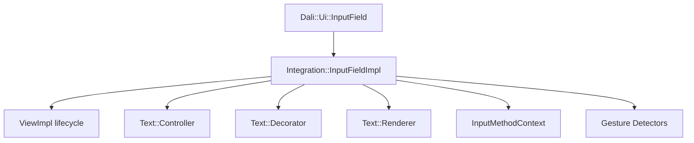
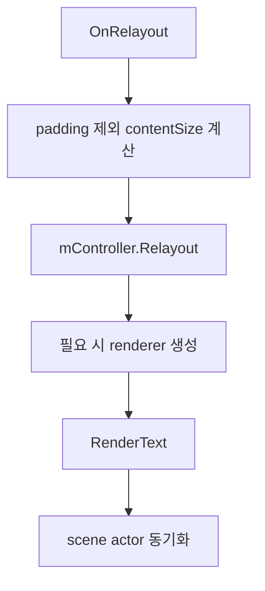

# InputField 구조 분석

## 목적

이 문서의 목적은 `InputField`가 Dali UI `View`로 어떻게 구성되는지 분석하고, `TextVisualizer` 구현 시 참고할 부분과 제거해야 할 편집기 구조를 구분하는 것이다.

특히 아래 항목을 명확히 정리한다.

- `Handle / Impl` 구조
- `New()`, `DownCast()`, constructor 패턴
- property registration 방식
- `OnInitialize()`, `OnRelayout()`, `OnMeasure()`, `OnPropertySet()` 사용 방식
- `Text::Controller` 연결 방식
- rendering object 연결 방식
- `TextVisualizer`에 재사용할 수 있는 구조
- `TextVisualizer`에서 제거해야 할 editing 관련 구조

애매한 내용은 추측하지 않고 `확인 필요`로 표시한다.

## 분석 대상 파일

### 직접 분석한 파일

- `dali-ui-foundation/public-api/input-field.h`
- `dali-ui-foundation/public-api/input-field.cpp`
- `dali-ui-foundation/integration-api/input-field-impl.h`
- `dali-ui-foundation/integration-api/input-field-impl.cpp`
- `dali-ui-foundation/integration-api/input-field-property-handler.h`
- `dali-ui-foundation/integration-api/input-field-property-handler.cpp`
- `automated-tests/src/dali-ui-foundation/utc-Dali-InputField.cpp`

### 함께 참고한 파일

- `dali-ui-foundation/public-api/text/input-field-properties.h`
- `dali-ui-foundation/internal/controls/text-controls/common-text-utils.h`
- `dali-ui-foundation/internal/controls/text-controls/common-text-utils.cpp`
- `dali-ui-foundation/internal/text/rendering/text-backend.h`

## 현재 구조 요약

`InputField`는 public handle인 `Dali::Ui::InputField`와 internal implementation인 `Dali::Ui::Integration::InputFieldImpl`로 분리되어 있다.

핵심 구조는 아래와 같다.



즉, `InputFieldImpl`은 단순한 텍스트 뷰가 아니라 아래를 한 객체 안에서 함께 가진다.

- `ViewImpl` 기반 수명주기
- `Text::Controller` 기반 text model / layout / render data 생성
- `Text::Decorator` 기반 cursor / selection / handle / popup 표현
- `InputMethodContext` 기반 IME 연결
- tap / pan / long press / key event 처리

`TextVisualizer` 입장에서는 이 중 `ViewImpl + Controller + Renderer host` 구조는 참고 가치가 높고, 나머지 interactive runtime은 제거 대상이다.

## Handle / Impl 구조

### public handle

`dali-ui-foundation/public-api/input-field.h`의 `Dali::Ui::InputField`는 `View`를 상속하는 handle 클래스다.

주요 특징:

- 데이터 멤버가 없다
- 대부분의 setter/getter는 `GetImpl(*this)`를 통해 internal impl에 위임한다
- property enum은 `Text::InputFieldPropertyIndex`를 그대로 노출한다

관련 함수:

- `InputField::New()`
- `InputField::DownCast(BaseHandle handle)`
- `InputField::SetText(...)`
- `InputField::SetFontFamily(...)`
- `InputField::SetFontSize(...)`

### internal impl

`dali-ui-foundation/integration-api/input-field-impl.h`의 `InputFieldImpl`은 실제 동작을 수행한다.

상속 구조:

- `ViewImpl`
- `Text::ControlInterface`
- `Text::EditableControlInterface`
- `Text::SelectableControlInterface`
- `Text::AnchorControlInterface`

이 상속 구조만 봐도 `InputFieldImpl`이 표시용 view가 아니라 편집용 text host임을 알 수 있다.

### TextVisualizer 관점

#### 재사용할 수 있는 구조

- public handle / internal impl 이원화
- public API는 얇게 유지하고 internal impl에서 실제 로직 수행
- `ViewImpl` lifecycle 기반으로 text layout/render를 통합하는 방식

#### 버릴 부분

- `EditableControlInterface`
- `SelectableControlInterface`
- `AnchorControlInterface`

`TextVisualizer`는 1차 구현에서 위 3개 인터페이스를 기본 구조에 넣지 않는 편이 맞다.

## New(), DownCast(), constructor 패턴

### 관련 함수

- `InputField::InputField()` in `public-api/input-field.cpp`
- `InputField::New()` in `public-api/input-field.cpp`
- `InputField::DownCast(BaseHandle)` in `public-api/input-field.cpp`
- `InputField::InputField(Integration::InputFieldImpl&)` in `public-api/input-field.cpp`
- `InputFieldImpl::New()` in `integration-api/input-field-impl.cpp`

### 실제 흐름

`InputField::New()`는 아래 패턴을 따른다.

1. `Integration::InputFieldImpl::New()`로 impl 생성
2. `InputField(*impl)`로 handle 생성
3. `impl->Initialize()` 호출
4. initialized handle 반환

핵심 코드:

- `Integration::InputFieldImplPtr impl = Integration::InputFieldImpl::New();`
- `InputField inputField = InputField(*impl);`
- `impl->Initialize();`

`DownCast()`는 다음 패턴이다.

- `return Ui::View::DownCast<InputField, Integration::InputFieldImpl>(handle);`

### 테스트에서 확인되는 점

`automated-tests/src/dali-ui-foundation/utc-Dali-InputField.cpp`에는 아래 UTC가 있다.

- `UtcDaliInputFieldConstructorP`
- `UtcDaliInputFieldNewP`
- `UtcDaliInputFieldCopyConstructorP`
- `UtcDaliInputFieldMoveConstructor`
- `UtcDaliInputFieldAssignmentOperatorP`
- `UtcDaliInputFieldMoveAssignment`
- `UtcDaliInputFieldDownCastP`
- `UtcDaliInputFieldDownCastN`

즉, handle 생성 / 복사 / 이동 / downcast 패턴은 이미 표준화되어 있고, `TextVisualizer`도 같은 패턴을 따르는 것이 자연스럽다.

## property registration 방식

### 관련 위치

- `input-field-impl.cpp`
- `input-field-property-handler.cpp`
- `input-field.h`

### type registration

`input-field-impl.cpp` 상단에서 Dali type/property registration을 수행한다.

관련 매크로:

- `DALI_TYPE_REGISTRATION_BEGIN(InputFieldImpl, ViewImpl, Create)`
- `INPUT_FIELD_PROPERTY_REGISTRATION(...)`
- `INPUT_FIELD_PROPERTY_REGISTRATION_READ_ONLY(...)`
- `DALI_TYPE_REGISTRATION_END()`

등록되는 property 예:

- `"text"`
- `"fontFamily"`
- `"fontSize"`
- `"textColor"`
- `"placeholder"`
- `"cursorWidth"`
- `"cursorColor"`
- `"selectionEnabled"`
- `"editable"`

### property dispatch

실제 property set/get은 아래 구조를 따른다.

1. Dali property system이 `InputFieldImpl::SetProperty()` / `GetProperty()` 호출
2. 내부에서 `PropertyHandler::SetProperty()` / `GetProperty()`로 위임
3. `switch(index)`로 각 setter/getter 호출

관련 함수:

- `InputFieldImpl::SetProperty(BaseObject*, Property::Index, const Property::Value&)`
- `InputFieldImpl::GetProperty(BaseObject*, Property::Index)`
- `InputFieldImpl::PropertyHandler::SetProperty(...)`
- `InputFieldImpl::PropertyHandler::GetProperty(...)`

### 테스트에서 확인되는 점

`utc-Dali-InputField.cpp`에는 아래 검증이 있다.

- `UtcDaliInputFieldGetProperty`
- `UtcDaliInputFieldSetProperty`

여기서 property name과 index 매핑, `SetProperty()/GetProperty()` round-trip을 확인한다.

### TextVisualizer 관점

#### 재사용할 수 있는 구조

- public property enum -> internal property handler 분리
- registration과 실제 property 처리 로직 분리
- read-only property를 별도 registration 매크로로 구분하는 방식

#### 버릴 부분

- cursor / selection / editable / selectedText 등 editing 전용 property

`TextVisualizer`는 property 수를 크게 줄여야 한다.

권장되는 1차 범위:

- `text`
- `fontFamily`
- `fontSize`
- `textColor`
- `layoutDirectionMode`

추가 검토 대상:

- `fontWeight`
- `fontWidth`
- `fontSlant`
- `fontVariation`

## OnInitialize / OnRelayout / OnMeasure / OnPropertySet 사용 방식

### OnInitialize()

관련 함수:

- `InputFieldImpl::OnInitialize()` in `input-field-impl.cpp`

`OnInitialize()`에서 수행하는 핵심 작업:

1. `ViewImpl::OnInitialize()`
2. `mController = Text::Controller::New(this, this, this, this)`
3. `mController->SetGlyphType(TextAbstraction::BITMAP_GLYPH)`
4. `mDecorator = Text::Decorator::New(*mController, *mController)`
5. `mInputMethodContext = InputMethodContext::New(self)`
6. `mController->GetLayoutEngine().SetLayout(Text::Layout::Engine::SINGLE_LINE_BOX)`
7. `mController->EnableTextInput(mDecorator, mInputMethodContext)`
8. scrolling / gesture / focus / locale / clipping 설정
9. `ApplyInitialConfig()`

해석:

- `InputField`의 핵심 runtime은 `OnInitialize()`에서 거의 모두 구성된다
- `InputField`는 생성 직후부터 single-line editable control로 세팅된다

`TextVisualizer`에서 참고할 부분:

- controller 생성 시점
- glyph type 지정 시점
- locale/layoutDirection signal 연결
- 기본 config 적용 위치

`TextVisualizer`에서 제거할 부분:

- `Text::Decorator::New(...)`
- `InputMethodContext::New(...)`
- `EnableTextInput(...)`
- gesture detector 생성/attach
- scroll / no-text tap / grab handle 관련 설정

### OnRelayout()

관련 함수:

- `InputFieldImpl::OnRelayout(const Vector2&, RelayoutContainer&)`

핵심 흐름:

1. padding 제외한 `contentSize` 계산
2. RTL이면 padding start/end swap
3. stencil / active layer / cursor layer 크기 갱신
4. `mController->Relayout(contentSize, layoutDirection)` 호출
5. 필요한 경우 `mDecorator->Relayout(contentSize, container)`
6. renderer가 없으면 `Text::Backend::Get().NewRenderer()`로 생성
7. `RenderText(updateTextType)` 호출
8. cursor/selection signal emit

이 흐름은 `TextVisualizer`에 가장 직접적으로 재사용 가능한 구조다.



### OnMeasure()

관련 함수:

- `InputFieldImpl::OnMeasure(float widthConstraint, float heightConstraint)`
- `InputFieldImpl::GetNaturalSize()`
- `InputFieldImpl::GetHeightForWidth(float width)`

핵심 흐름:

1. requested/min/max constraint 수집
2. `GetNaturalSize()` 호출
3. empty text면 `mController->GetDefaultFontLineHeight()`를 사용해 height 보정
4. `WRAP_CONTENT`, `MATCH_PARENT`, explicit size를 구분해 measured size 계산

의미:

- 측정 로직은 `ViewImpl`에서 수행하지만 실제 텍스트 자연 크기는 controller에 위임한다
- text가 비어 있을 때 line height로 높이를 보정하는 특수 규칙이 있다

`TextVisualizer`에서 재사용할 수 있는 구조:

- controller natural size 기반 measure
- padding 반영 방식
- wrap-content일 때만 measure invalidation을 거는 방식

확인 필요:

- `TextVisualizer`가 항상 multi-line이라면 empty text 측정 규칙을 `InputField`와 동일하게 가져갈지 별도 정의할지 결정 필요

### OnPropertySet()

관련 함수:

- `InputFieldImpl::OnPropertySet(Dali::Property::Index, const Dali::Property::Value&)`

현재 구현은 거의 비어 있다.

```cpp
switch(index)
{
  default:
  {
    ViewImpl::OnPropertySet(index, propertyValue);
    break;
  }
}
```

즉, `InputField`는 대부분의 자체 property를 `PropertyHandler` 경로로 처리하고, `OnPropertySet()`은 base view property fallback 정도로만 사용한다.

### TextVisualizer 관점

이 구조는 그대로 참고할 수 있다.

- custom text property는 static property handler에서 처리
- `OnPropertySet()`은 view 공통 property forwarding 중심으로 유지

## Controller 연결 방식

### 관련 코드

- `mController = Text::Controller::New(this, this, this, this);`
- `mController->SetGlyphType(TextAbstraction::BITMAP_GLYPH);`
- `mController->GetLayoutEngine().SetLayout(Text::Layout::Engine::SINGLE_LINE_BOX);`

`InputFieldImpl`은 자기 자신을 아래 인터페이스 구현체로 controller에 넘긴다.

- `Text::ControlInterface`
- `Text::EditableControlInterface`
- `Text::SelectableControlInterface`
- `Text::AnchorControlInterface`

즉, controller는 view를 직접 아는 것이 아니라 interface를 통해 host와 상호작용한다.

이 점은 `TextVisualizer`에 매우 중요하다.

### TextVisualizer에 재사용할 수 있는 구조

- controller가 host interface를 통해 relayout / measure invalidation / decoration actor 추가를 요청하는 방식
- handle과 controller를 직접 결합하지 않고 impl이 중간 host 역할을 하는 방식

### TextVisualizer에서 바꿔야 할 부분

`TextVisualizer`는 아래 인터페이스만 남기는 것이 적절하다.

- `Text::ControlInterface` 유사 최소 host

제거 대상:

- `EditableControlInterface`
- `SelectableControlInterface`
- `AnchorControlInterface`

즉, `TextVisualizer`는 controller와의 결합 폭을 줄여야 한다.

## rendering object 연결 방식

### 관련 코드

- `mRenderer = Text::Backend::Get().NewRenderer();`
- `RenderText(updateTextType);`
- `CommonTextUtils::RenderText(...)`

`InputFieldImpl`의 rendering 연결은 다음 흐름이다.

1. `OnRelayout()`에서 `mController->Relayout(...)`
2. renderer가 없으면 `Text::Backend::Get().NewRenderer()`로 생성
3. `RenderText(updateTextType)` 호출
4. 내부에서 `CommonTextUtils::RenderText(Self(), mRenderer, mController, mDecorator, ...)`

즉, impl은 직접 glyph draw를 하지 않고, renderer와 actor tree를 동기화하는 host 역할을 한다.

### TextVisualizer에 재사용할 수 있는 구조

- `OnRelayout()` 시점에서 renderer를 lazy-create 하는 방식
- render host 함수가 actor attach/detach를 담당하는 방식
- text model/layout 계산과 실제 scene graph 반영을 분리하는 구조

### TextVisualizer에서 제거해야 할 부분

`CommonTextUtils::RenderText(...)` 호출 인자 중 아래는 1차 구현에서 제거 또는 null-path가 필요하다.

- `mDecorator`
- `mCursorLayer`
- `mClippingDecorationActors`
- `mAnchorActors`

확인 필요:

- `CommonTextUtils::RenderText(...)`를 decorator 없이 재사용 가능한지, 또는 `TextVisualizer`용 경량 render helper가 필요한지 추가 확인 필요

## editing 관련 구조와 오버헤드

`InputFieldImpl`의 멤버와 callback만 보아도 편집기 runtime이 큰 비중을 차지한다.

### cursor 관련

- `mDecorator`
- `mCursorLayer`
- `SetCursorWidth()`
- `SetCursorColor()`
- `SetCursorBlinkEnabled()`
- `SetCursorBlinkInterval()`
- `SetCursorPosition()`
- `EmitCursorPositionChanged()`

### selection 관련

- `SetSelectionEnabled()`
- `SetSelectionColor()`
- `GetSelectedText()`
- `SelectText()`
- `SelectWholeText()`
- `ClearSelection()`
- `SelectionChanged()`
- `mSelectionStarted`, `mSelectionChanged`, `mSelectionCleared`

### decorator 관련

- `Text::Decorator::New(...)`
- `mDecorator->Relayout(...)`
- `AddDecoration(...)`
- `GetBoundingBox()`, `SetBoundingBox()`
- `FlipHandleVertically(...)`

### input method 관련

- `mInputMethodContext`
- `OnInputMethodContextEvent(...)`
- `OnFocusGained()`에서 IME activate
- `OnFocusLost()`에서 IME deactivate
- `OnKeyboardStatusChanged(...)`

### grab handle / popup 관련

- `mController->SetGrabHandleEnabled(false);`
- `mController->SetGrabHandlePopupEnabled(false);`

현재는 일부 비활성화되어 있지만, 구조 자체는 여전히 input control 전제다.

### event handling 관련

- `OnKeyEvent(...)`
- `OnTapDetected(...)`
- `OnPanDetected(...)`
- `OnLongPressDetected(...)`
- `self.TouchedSignal().Connect(...)`
- `TapGestureDetector`
- `PanGestureDetector`
- `LongPressGestureDetector`

### TextVisualizer에서 제거해야 할 부분

아래는 1차 구현에서 기본적으로 제거하는 것이 맞다.

- cursor
- selection
- decorator
- input method
- grab handle
- popup
- key/tap/pan/long press event handling

## 관련 automated tests가 보여주는 구조

`utc-Dali-InputField.cpp`는 주로 아래를 검증한다.

- handle 생명주기
- property enum / property name 매핑
- public setter/getter 동작
- property set/get 동작
- cursor/selection/editable 관련 public API 존재 여부

이 테스트에서 확인되는 중요한 점:

1. `InputField`는 public API surface가 매우 넓다.
2. 많은 API가 편집기 기능을 노출한다.
3. `TextVisualizer`는 같은 패턴을 쓰더라도 public API는 훨씬 작아야 한다.

## TextVisualizer에 필요한 부분

### 직접 필요한 내용

- `InputField::New()`와 같은 handle/impl 생성 패턴
- `DownCast()` 패턴
- public API는 thin wrapper, internal impl이 실제 로직 수행하는 구조
- `ViewImpl` lifecycle 기반 `OnInitialize()` / `OnMeasure()` / `OnRelayout()` 통합
- `mController->Relayout(...)` 후 renderer host 호출 구조
- padding / clipping / renderer lazy creation 패턴
- property registration + property handler 분리 구조

### 참고용 내용

- locale/layoutDirection signal 연결
- `ApplyInitialConfig()` 방식
- `GetNaturalSize()` / `GetHeightForWidth()`의 controller 위임 구조

## 버릴 부분

- `EditableControlInterface`
- `SelectableControlInterface`
- `AnchorControlInterface`
- `Text::Decorator`
- `InputMethodContext`
- focus와 결합된 editing state
- `OnKeyEvent()`
- `OnTapDetected()`
- `OnPanDetected()`
- `OnLongPressDetected()`
- clipboard / cut / copy / paste
- cursor / selection signal
- grab handle / popup 관련 설정
- single-line layout 고정

## 설계 결론

`InputField`는 `TextVisualizer`의 기반 클래스로 재사용할 대상은 아니다. 하지만 `View` 위에 텍스트 controller와 renderer를 얹는 host 구조는 매우 좋은 참고 구현이다.

따라서 `TextVisualizer`는 아래 방향이 적절하다.

- public handle / internal impl 구조는 `InputField`를 따른다
- `ViewImpl` lifecycle에서 measure / relayout / render를 통합하는 방식은 유지한다
- controller와 renderer 연결 방식은 참고하되, editing runtime은 제거한다
- property system은 단순한 표시용 API만 남기고 크게 축소한다

## 확인 필요 사항

- `TextVisualizer`가 `InputField`처럼 `Text::Controller`를 직접 host할지, 별도 경량 controller를 둘지 이후 단계에서 확정 필요
- `CommonTextUtils::RenderText(...)`를 decorator 없이 재사용할 수 있는지 추가 확인 필요
- `TextVisualizer` 1차 구현에서 anchor 처리도 완전히 제외할지 여부 확정 필요

## TextVisualizer 설계에 주는 결론

1. `InputField`에서 가장 중요한 재사용 포인트는 `Handle/Impl + ViewImpl lifecycle + controller/renderer host` 구조다.
2. `InputField`의 편집기 기능은 `TextVisualizer`에 그대로 가져오면 안 된다.
3. 특히 `Decorator`, `InputMethodContext`, gesture/key handling, selection/cursor API는 기본 구조에서 제거해야 한다.
4. `TextVisualizer`는 `InputField`를 "복사"하는 것이 아니라, `InputField`의 view hosting 패턴만 추출한 display-only view로 설계하는 것이 맞다.
