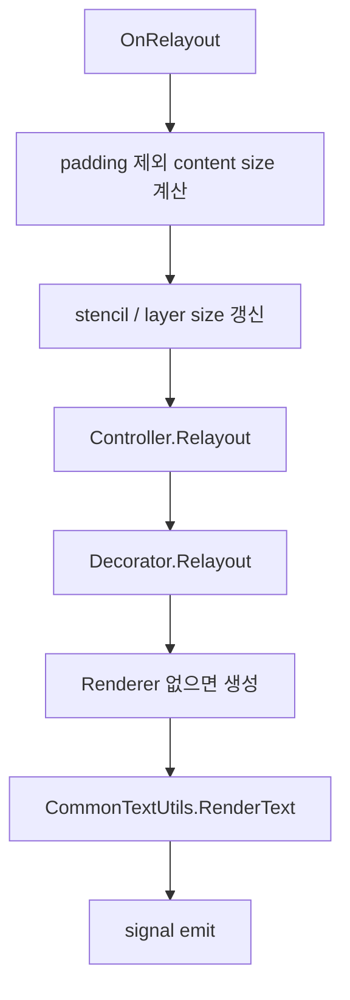
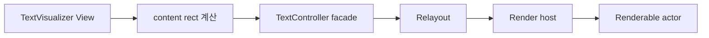

# InputField 분석

## 결론

`InputField`는 `TextVisualizer`의 직접적인 기반 클래스로 쓰기에는 너무 무겁다.
하지만 `View` 관점에서 텍스트를 measure / arrange / relayout / render하는 방식은 매우 유용하다.

즉, `InputField`에서 가져가야 하는 것은 "구조"이고,
버려야 하는 것은 "편집기 기능 덩어리"다.

## 역할

`InputFieldImpl`은 아래 역할을 동시에 수행한다.

- `ViewImpl` 기반 measure / arrange / relayout lifecycle
- `Text::ControlInterface`
- `Text::EditableControlInterface`
- `Text::SelectableControlInterface`
- `Text::AnchorControlInterface`
- focus, gesture, key event, IME 연결
- text renderer host
- decorator host

이 조합은 입력 컨트롤에는 적합하지만, 표시 전용 View에는 과하다.

## 실제 relayout 경로

`InputFieldImpl::OnRelayout()` 흐름은 다음과 같다.

이 경로의 장점은 명확하다.

- View lifecycle에 텍스트 레이아웃이 자연스럽게 통합된다.
- layout bound가 바뀔 때마다 controller relayout이 안정적으로 호출된다.
- 자연 크기(`GetNaturalSize`)와 `GetHeightForWidth`도 controller 기반으로 일관되게 동작한다.

`TextVisualizer`가 가장 직접적으로 참고해야 하는 부분이 바로 이 경로다.

## 좋은 점

### 1. View와 텍스트 레이아웃의 결합 방식이 적절하다

`InputField`는 `TextVisual`과 달리 View 자체가 텍스트의 크기 계산을 주도한다.
이는 `TextVisualizer`에 꼭 필요하다.

특히 다음 지점이 좋다.

- `OnMeasure()`에서 natural size를 직접 사용
- `OnArrange()`에서 bounds를 확정
- `OnRelayout()`에서 content size를 기반으로 controller를 다시 layout

이 구조 덕분에 동적 레이아웃 변화에 반응하기 쉽다.

### 2. padding, RTL, clipping을 View 차원에서 처리한다

텍스트 엔진 자체가 아니라 View wrapper에서 아래를 책임진다.

- padding 제외한 content size 계산
- RTL일 때 start/end padding swap
- stencil / clipping actor 처리

이 분리는 `TextVisualizer`에도 그대로 유지할 가치가 있다.

### 3. renderer host라는 관점이 분명하다

`InputFieldImpl`은 직접 glyph를 그리지 않고,

- `Text::Backend::Get().NewRenderer()`
- `CommonTextUtils::RenderText()`

를 통해 "렌더링 결과를 씬에 붙이는 host" 역할을 한다.

`TextVisualizer`도 같은 관점이 바람직하다.

## 문제점

### 1. 표시용 View에 필요 없는 인터페이스가 너무 많다

`InputFieldImpl`은 본질적으로 편집 컨트롤이다.
다음 책임이 기본적으로 따라온다.

- IME 활성화 / 비활성화
- key input focus 관리
- tap / pan / long press gesture
- selection range 변경
- clipboard copy / cut / paste
- cursor blink
- placeholder editing state
- selection handle / popup 관련 상태

`TextVisualizer`는 이런 책임을 기본 탑재하면 안 된다.

### 2. decorator 의존도가 높다

`InputField` 경로는 거의 모든 interactive 상태를 decorator와 함께 움직인다.

- cursor
- selection highlight
- handle
- popup 위치 갱신
- scroll to cursor

표시 전용 텍스트 View에서는 decorator 자체를 제거해야 한다.

### 3. style 변경 시 renderer reset이 자주 발생한다

아래 종류의 setter에서 반복적으로 `mRenderer.Reset()`이 호출된다.

- underline
- shadow
- outline
- line-through
- background

이 방식은 구현이 단순하지만,
동적 레이아웃 변화가 많은 환경에서는 "renderer 전면 교체"가 너무 거친 invalidation 정책이 된다.

`TextVisualizer`는 더 세밀한 dirty 분리가 필요하다.

### 4. focus와 text state가 강하게 결합되어 있다

`OnFocusGained()` / `OnFocusLost()`는 IME, keyboard status, controller state를 함께 건드린다.
이는 입력 컨트롤로서는 맞지만, 표시 전용 View에는 부적절하다.

`TextVisualizer`는 focus를 가져도 텍스트 상태가 변하지 않는 것이 기본이어야 한다.

## InputField에서 재사용할 것

### 그대로 참고할 구조

- View 기반 `OnMeasure` / `OnArrange` / `OnRelayout` 흐름
- padding, RTL, clipping 처리 위치
- content rect 계산 방식
- controller relayout 이후 render host를 호출하는 구조

### 부분 차용할 유틸리티

- `CommonTextUtils::RenderText()`
  - actor 부착/재배치 보조
  - 단, decorator 관련 부분은 제거 또는 우회 필요
- natural size, height-for-width 계산을 controller에 위임하는 방식

## InputField에서 버릴 것

- `EditableControlInterface`
- `SelectableControlInterface`
- `AnchorControlInterface`
- `Decorator`
- IME 관련 멤버와 연결
- key / tap / pan / long press event 처리
- selection / cursor / popup signal
- clipboard / cut / paste

## TextVisualizer에 필요한 InputField 축소판

`TextVisualizer`는 아래 정도의 축소판이면 충분하다.

빠져야 하는 요소는 아래다.

- focus-driven text state
- IME
- decorator
- event queue
- selection / editing mode

## 설계 시사점

1. `InputFieldImpl`을 상속하거나 복사해 쓰는 방향은 피해야 한다.
2. 대신 View lifecycle 구조만 추출한 경량 host를 새로 만드는 것이 맞다.
3. `TextVisualizer`는 "읽기 전용 text view"를 기본값으로 두고,
   향후 selection 같은 기능이 필요하면 별도 레이어로 붙이는 방식이 안전하다.

## 권장 추출 대상

### 후보 1. `TextViewHost` 같은 내부 보조 계층

책임:

- padding/content rect 계산
- natural size / height-for-width 위임
- relayout 시 controller 호출
- renderable actor attach/detach

### 후보 2. `CommonTextUtils` 확장

현재 `RenderText()`는 편집기와 표시용 View 모두에 재사용될 수 있는 잠재력이 있다.
다만 인자가 너무 많고 decorator 전제가 남아 있으므로,
`TextVisualizer`를 만들면서 다음처럼 나누는 것이 좋다.

- `RenderRenderableTextActor()`
- `AttachTextBackgroundActor()`
- `SyncTextAnchorsIfNeeded()`

## 최종 판단

`InputField`는 `TextVisualizer` 구현의 베이스 클래스가 아니라,
View 라이프사이클 통합 방식의 참고 구현이다.

재사용 원칙은 아래 한 줄로 정리할 수 있다.

> `InputField`에서는 measure/arrange/relayout 구조만 가져오고, 편집기 기능은 들고 오지 않는다.
