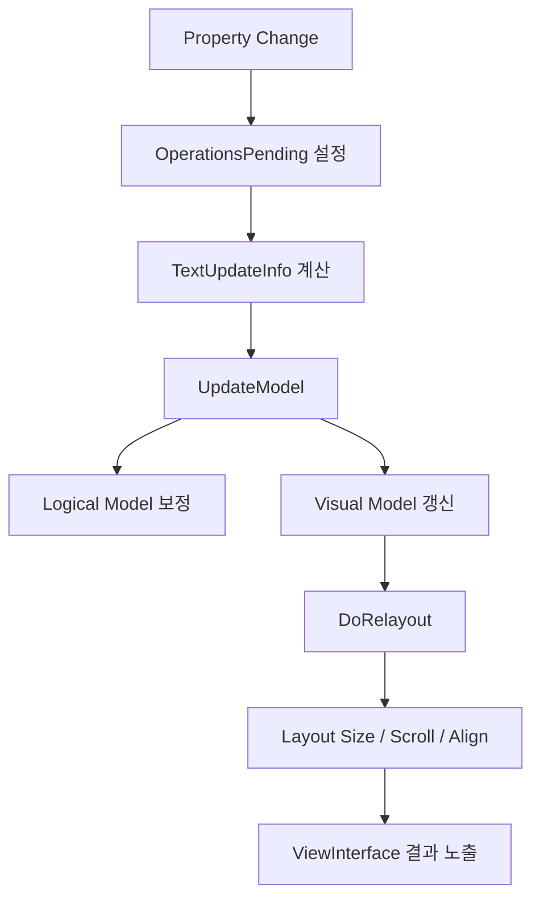
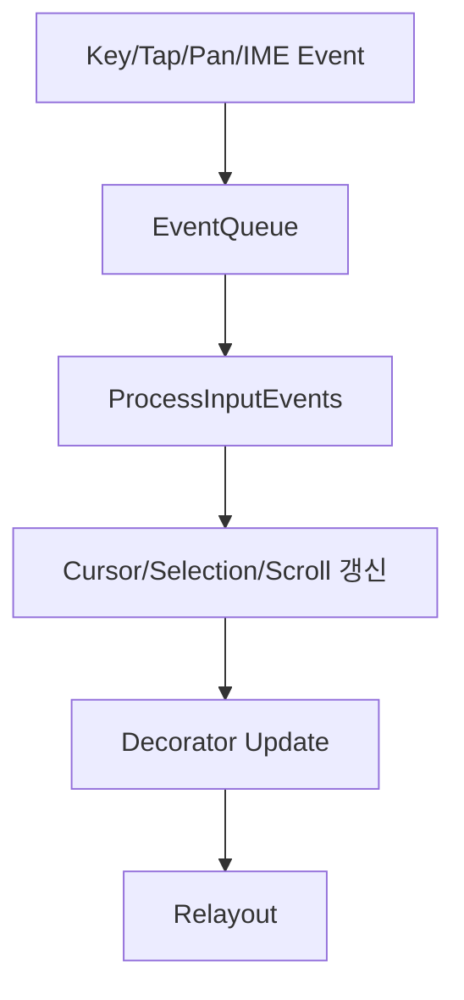

# TextController 분석

## 결론

`Text::Controller`는 현재 Dali text 모듈에서 가장 재사용 가치가 높은 핵심 엔진이다.
하지만 동시에 `TextVisualizer`에 그대로 노출하면 안 되는 가장 큰 덩어리이기도 하다.

이유는 단순하다.

- 모델 계산 파이프라인은 훌륭하다.
- 그러나 편집기 상태, 입력 이벤트, selection/decorator, placeholder, hidden text까지 함께 품고 있다.

따라서 `TextVisualizer`는 `Text::Controller`를 버리는 것이 아니라,
"표시 전용 facade 뒤에 숨겨서" 써야 한다.

## Controller가 담당하는 실제 책임

현재 controller는 아래를 모두 담당한다.

- text property 반영
- logical model 갱신
- visual model 갱신
- shaping / bidi / font validation / line break / layout
- natural size / height-for-width 계산
- scrolling
- placeholder 표시
- hidden text / password substitute
- cursor / selection / highlight
- decorator sync
- input style tracking
- IME preedit / commit
- gesture / key event queue 처리

이미 이름이 `Controller`라기보다 "text runtime 전체"에 가깝다.

## 구조적으로 좋은 점

### 1. `OperationsMask` 기반 dirty pipeline

이 구조는 `TextVisualizer`가 반드시 재사용해야 한다.

현재 controller는 작업 단계를 비트마스크로 관리한다.

- UTF-32 변환
- script 분석
- font validation
- line break 계산
- bidi 정보
- shaping
- glyph metrics
- layout
- reorder / align / color / direction

이 덕분에 property 변경 종류에 따라 재계산 범위를 줄일 수 있다.

`TextVisualizer`를 새로 만들 때 별도의 텍스트 엔진을 만들 이유가 없는 핵심 근거가 여기 있다.

### 2. logical / visual model 분리

controller는 `Text::Model`을 통해 logical model과 visual model을 다룬다.

- logical model
  - 문자, style run, script run, paragraph 정보
- visual model
  - glyph, line, layout position, color, scroll position

이 구조 덕분에 아래 최적화가 가능하다.

- width만 바뀌는 relayout
- style 일부만 바뀌는 relayout
- 동일 텍스트에 대한 반복 측정

### 3. natural size 계산 경로가 이미 준비되어 있다

`Relayouter::GetNaturalSize()`는 controller를 기준으로 natural size를 계산하고 캐시한다.
이는 `TextVisualizer`의 `OnMeasure()` 구현에 직접 연결 가능하다.

### 4. model updater가 실제 text engine 역할을 한다

`text-controller-impl-model-updater.cpp`를 보면,
controller는 실제로 다음 엔진 단계를 orchestration 한다.

- line break segmentation
- ICU line break 보정
- hyphenation
- script run 추출
- font validation
- shaping
- glyph metrics
- visual model rebuild

이 영역은 새로 구현하면 위험하다.
그대로 재사용하는 편이 맞다.

## 구조적으로 무거운 점

### 1. `EventData`가 너무 넓다

`EventData`는 편집기 상태 머신 전체를 담고 있다.

- 상태 enum
  - `INACTIVE`
  - `EDITING`
  - `SELECTING`
  - `EDITING_WITH_POPUP`
  - `GRAB_HANDLE_PANNING`
  - `TEXT_PANNING`
  - 그 외 다수
- cursor position
- selection position
- preedit range
- event queue
- input style changed queue
- decorator update flags
- placeholder 표시 상태
- blink / selection / grab handle / popup flags

이 구조는 `TextVisualizer`에서 사실상 불필요하다.

### 2. 편집 이벤트 처리와 레이아웃 엔진이 강하게 결합돼 있다

controller는 key/tap/pan/long-press를 event queue에 쌓고,
relayout 시점에 이를 처리한다.

이 방식은 interactive control에는 유효하지만,
표시 전용 View에는 오히려 불필요한 복잡성이다.

특히 다음 결합이 무겁다.

- 이벤트 처리 후 cursor/selection 위치 갱신
- scroll to cursor
- decorator 위치 갱신
- input style signal queue 반영

### 3. placeholder / hidden input / password 로직이 중심부에 있다

`UpdateModel()` 단계에서도 placeholder 여부와 hidden input substitute를 고려한다.
즉, 표시 전용 텍스트와 입력 전용 텍스트가 완전히 분리되어 있지 않다.

이는 `TextVisualizer`에 두 가지 시사점을 준다.

- controller는 재사용하되 editable 관련 entry point는 철저히 막아야 한다.
- 장기적으로는 display-only controller facade가 별도여야 한다.

### 4. scrolling state도 controller 내부에 있다

controller는 단순 layout 엔진이 아니라 scroll position까지 포함한다.
이는 marquee나 editable text에는 유용하지만,
일반 표시용 text view에서는 host 쪽에서 결정하는 편이 더 단순할 수 있다.

## 내부 흐름 정리

interactive control일 경우에는 여기에 다음이 추가된다.

`TextVisualizer`는 첫 번째 흐름만 필요하다.

## TextVisualizer에서 필요한 Controller subset

### 필요한 기능

- 텍스트 설정
- 글꼴/스타일/markup 설정
- natural size 계산
- height-for-width 계산
- relayout
- model/view 조회
- background / underline / strikethrough / outline 정보
- layout direction / alignment / elide

### 불필요한 기능

- `EnableTextInput()`
- key/tap/pan/long press event 처리
- selection API
- clipboard API
- input style API
- hidden input / password 전용 동작
- popup / handle / decorator 관련 API

## 권장 접근

### 1. `Text::Controller`를 직접 public field처럼 쓰지 않는다

`TextVisualizer` 내부에 아래 같은 얇은 래퍼가 필요하다.

- `TextLayoutHost`
- `DisplayTextController`
- 또는 유사한 이름의 facade

역할은 단순하다.

- 표시용 속성만 노출
- editable/selectable 관련 진입 차단
- dirty reason을 host 친화적으로 재정리

### 2. controller의 "display-only contract"를 문서화한다

구현 전에 반드시 확정해야 할 규칙:

- `mEventData`를 만들지 않는다.
- `EnableTextInput()`을 호출하지 않는다.
- placeholder를 지원하더라도 editing state와 결합하지 않는다.
- selection/cursor state를 기본값으로 배제한다.

이렇게 하면 controller를 상당 부분 "표시 엔진"처럼 사용할 수 있다.

### 3. dirty mask를 View 관점으로 다시 감싼다

controller 내부 mask와 별개로,
`TextVisualizer`는 host 관점의 dirty state가 필요하다.

- `kTextContentDirty`
- `kStyleDirty`
- `kLayoutConstraintDirty`
- `kRendererMaterialDirty`
- `kSceneAttachmentDirty`

이렇게 한 번 더 감싸야 상위 View 구현이 단순해진다.

## 장기적으로 분리하면 좋은 영역

### 분리 후보 1. display-only controller facade

현재 최우선 후보다.
실제 구현은 controller를 재사용하되, 외부에는 표시용 subset만 제공한다.

### 분리 후보 2. event/decorator bundle

지금은 `EventData`가 너무 큰데,
장기적으로는 아래처럼 분리가 가능하다.

- `TextEditingRuntime`
- `TextSelectionRuntime`
- `TextDisplayRuntime`

이번 `TextVisualizer` 구현에서 여기까지 대수술할 필요는 없지만,
문서 기준으로는 이 방향이 맞다.

## 최종 판단

`Text::Controller`는 `TextVisualizer`의 핵심 재사용 대상이다.
하지만 "그대로 쓰는 것"과 "그대로 노출하는 것"은 다르다.

최종 원칙은 아래와 같다.

> `TextVisualizer`는 `Text::Controller`의 layout/model 엔진은 재사용하되, 편집기 runtime은 facade 뒤로 숨긴다.
