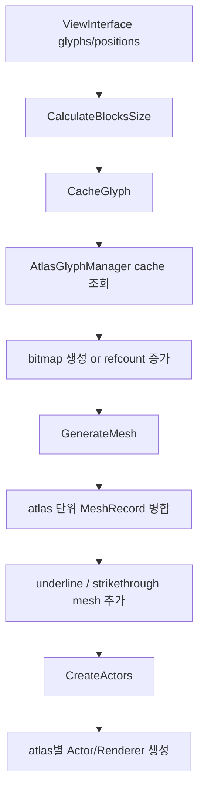
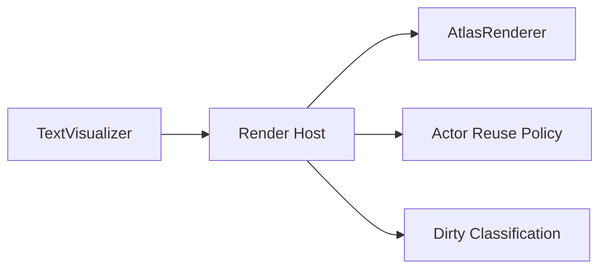

# AtlasRenderer 분석

## 결론

`AtlasRenderer`는 `TextVisualizer`의 기본 렌더링 후보로 충분히 가치가 있다.
가장 큰 이유는 "레이아웃이 자주 바뀌어도 glyph bitmap 자체를 매번 새 texture로 만들지 않아도 된다"는 점이다.

하지만 그대로 쓰면 다음 비용이 있다.

- atlas 단위로 mesh actor가 분리되어 actor/renderer 수가 늘어날 수 있다.
- render마다 mesh를 다시 조립하는 비용이 있다.
- 표시용 View 하나에 대해 너무 세밀한 scene graph 조각이 생길 수 있다.

즉, `AtlasRenderer`는 유력한 1차 선택지이지만,
`TextVisualizer`에서는 "renderer host + dirty 정책 + actor 재사용 전략"과 함께 써야 한다.

## 현재 동작 방식

`AtlasRenderer::Render()`는 `ViewInterface`로부터 glyph와 position을 받아,
`Impl::AddGlyphs()`에서 실제 atlas cache 조회, mesh 생성, actor 생성을 수행한다.

흐름은 아래와 같다.

## 강점

### 1. glyph bitmap 재생성을 줄일 수 있다

`CacheGlyph()`는 먼저 `AtlasGlyphManager::IsCached()`를 확인하고,
이미 atlas에 있는 glyph라면 reference count만 증가시킨다.

이 구조의 의미는 크다.

- 텍스트 내용이 일부만 바뀌거나
- 같은 글리프가 반복되거나
- 레이아웃만 바뀌고 glyph set이 비슷할 때

전체 텍스트 texture를 다시 굽는 방식보다 훨씬 유리할 수 있다.

`TextVisualizer`가 동적 relayout에 강해야 한다는 요구와 잘 맞는다.

### 2. atlas 단위 병합이 이미 존재한다

glyph마다 actor를 하나씩 만드는 구조가 아니라,
같은 atlas를 참조하는 glyph mesh를 `MeshRecord` 단위로 합친다.

즉, 내부적으로는 어느 정도 병합 최적화가 이미 되어 있다.

이 점은 중요하다.

- 최악의 경우 glyph 수만큼 actor가 생기지는 않는다.
- atlas 수만큼 renderer가 생기는 구조에 가깝다.

### 3. underline / strikethrough도 atlas mesh에 합쳐진다

장식선이 별도 actor 폭증으로 가지 않고,
해당 mesh record에 덧붙는 구조라는 점은 장점이다.

표시 전용 View에서 필요한 기본 스타일을 수용하기 좋다.

### 4. color glyph와 일반 glyph를 함께 다룬다

- L8 shader
- RGBA shader

를 상황에 따라 분리해 사용하므로, emoji/color glyph 처리도 이미 갖춰져 있다.

## 약점

### 1. render마다 mesh 재조립 비용이 있다

glyph cache는 atlas에 남아도,
현재 레이아웃 위치에 맞는 vertex/index mesh는 다시 조립한다.

즉, 다음 비용은 여전히 남는다.

- glyph 순회
- position 계산
- mesh append
- underline/strikethrough extent 계산
- actor 생성 또는 재구성

`TextVisualizer`에서 레이아웃이 초당 자주 바뀌는 경우,
texture bake 비용은 줄지만 CPU 쪽 mesh 조립 비용은 계속 볼 수 있다.

### 2. actor/renderers 수가 atlas 개수에 비례한다

`CreateActors()`는 mesh record마다 actor를 만든다.
mesh record는 atlas 단위로 분리되므로,

- glyph 종류가 많아 atlas가 늘거나
- outline / shadow가 켜져 atlas 사용이 늘면

scene graph 비용이 증가할 수 있다.

이는 `TextVisual`의 단일 texture renderer와 비교되는 약점이다.

### 3. 이전 텍스트 캐시를 매 렌더마다 정리한다

`RemoveText()`는 이전 `mTextCache`를 순회하면서 refcount를 감소시킨다.
새 cache를 만든 뒤 swap하는 구조는 안전하지만,
"완전히 동일한 glyph 집합"에 대해서도 bookkeeping 비용은 발생한다.

### 4. layout 변화와 material 변화가 강하게 엮여 있다

현재 구조상 `Render()` 호출은 사실상 전체 rebuild에 가깝다.
즉, 아래 변경을 세밀하게 나누는 host 정책이 부족하다.

- 위치만 변경
- glyph 집합 변경
- 색만 변경
- shadow/outline만 변경

`TextVisualizer`는 이 차이를 상위에서 구분해 줄 필요가 있다.

## AtlasGlyphManager / AtlasManager 관점

### AtlasGlyphManager의 역할

- `(fontId, glyphIndex, outline, italic, bold)` 조합으로 glyph cache 관리
- atlas slot 조회
- reference count 관리
- atlas texture set 제공

이 구조는 `TextVisualizer`에 매우 적합하다.

- glyph identity가 명확하다
- text instance 수명과 atlas 수명이 분리된다
- 반복되는 문자에 강하다

### AtlasManager의 역할

- atlas texture 생성
- block 단위 슬롯 배정
- 이미지 업로드
- freed block 재사용
- mesh용 UV/quad 계산

특히 2-pixel padding과 strip blit을 두는 이유는 texture filtering artifact를 줄이기 위함이다.
이는 텍스트 품질 유지에 중요한 요소다.

## TextVisualizer와의 적합성 평가

### 잘 맞는 이유

- width/height 변경이 잦아도 glyph texture 전체 재생성을 피할 수 있다.
- 같은 텍스트 스타일이 반복되는 UI에서 재사용성이 높다.
- 표시용 View에 필요한 스타일선 처리까지 기본 지원한다.

### 주의할 점

- 텍스트 블록이 매우 많고 글리프 종류도 다양하면 actor 수가 늘 수 있다.
- full rebuild형 host 위에서 쓰면 atlas 이점이 희석된다.
- relayout 빈도가 높을수록 CPU mesh 조립 최적화가 중요해진다.

## TextVisual(texture bake)과 비교

### AtlasRenderer가 유리한 경우

- relayout이 자주 발생
- 동일 glyph 재사용이 많음
- 텍스트 길이는 중간 수준
- 전체 texture bake 비용이 더 부담스러운 경우

### TextVisual 경로가 유리한 경우

- 결과를 한 장 또는 소수의 texture로 관리하고 싶음
- actor/renderers 수를 최소화하고 싶음
- 비동기 렌더와 대형 텍스트 tiling이 중요함

## 권장 적용 방식

`TextVisualizer`에서 `AtlasRenderer`를 그대로 노출하기보다,
아래처럼 감싸는 방식이 좋다.

필요한 정책은 다음과 같다.

- 레이아웃 dirty와 style dirty 분리
- actor tree 재사용
- 동일 glyph 집합일 때 불필요한 refcount churn 최소화
- 필요 시 fallback renderer 선택 가능 구조

## TextVisualizer용 개선 아이디어

### 1. actor 재사용 계층 추가

현재는 render마다 actor parent를 재구성하는 방향에 가깝다.
`TextVisualizer`에서는 atlas별 actor pool 또는 stable actor container를 두면 좋다.

### 2. "position-only update" 경로 고려

glyph 집합은 같고 위치만 바뀌는 경우,
가능하다면 mesh 전체를 다시 만들지 않고 일부 갱신하는 경로를 검토할 가치가 있다.

이번 단계에서 꼭 구현할 필요는 없지만,
설계는 이 확장 여지를 막지 않아야 한다.

### 3. display-only renderer host 도입

`InputField`의 renderer host는 decorator와 함께 움직이고,
`TextVisual`의 renderer host는 visual transform 중심이다.
`TextVisualizer`는 atlas renderer에 맞는 전용 host를 가져야 한다.

## 최종 판단

현재 기준에서 `AtlasRenderer`는 `TextVisualizer`의 1차 기본 렌더링 후보로 적절하다.
다만 정답은 "AtlasRenderer 단독"이 아니라 아래 조합이다.

> `TextVisualizer = display-only controller facade + View lifecycle host + AtlasRenderer + 더 세밀한 dirty 정책`
