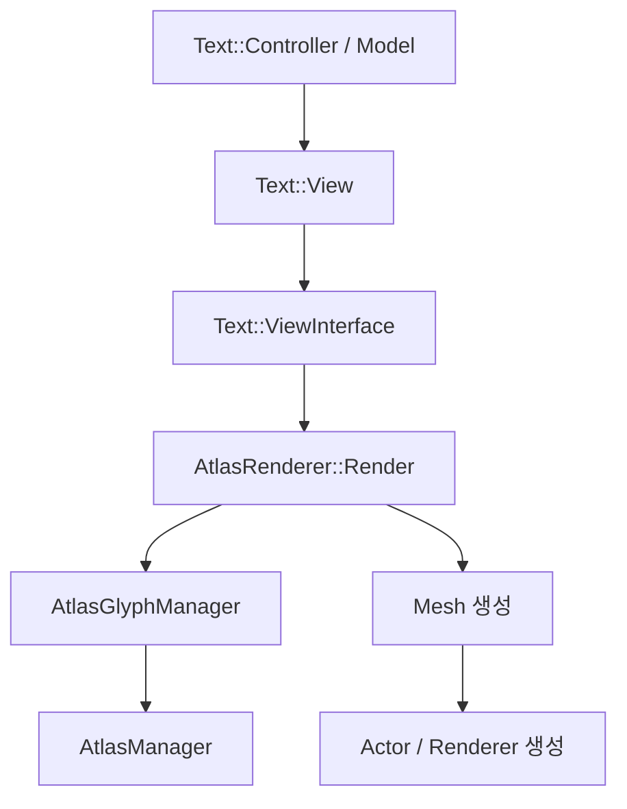
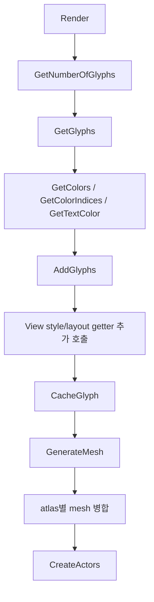
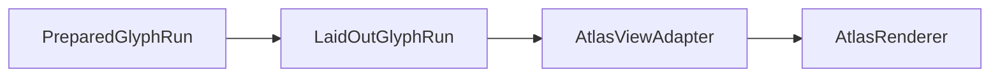

# AtlasRenderer 분석

## 목적

이 문서의 목적은 `AtlasRenderer`가 실제 렌더링에 필요로 하는 최소 데이터를 식별하고, `TextVisualizer`가 기존 `Text::Controller` 전체에 의존하지 않고도 `AtlasRenderer`를 직접 사용할 수 있는지 검토하는 것이다.

특히 아래를 명확히 정리한다.

- `AtlasRenderer` 생성 방식
- public/internal API 구조
- `Render()` 호출 흐름
- 현재 controller/view/model로부터 가져오는 데이터 목록
- 실제 최소 glyph / layout 데이터
- style / ellipsis / selection 없이 필요한 최소 렌더링 계약
- `TextVisualizer`용 adapter / interface 설계 방향
- 기존 `AtlasRenderer` 수정 필요 여부와 최소 변경 방향

애매한 내용은 추측하지 않고 `확인 필요`로 표시한다.

## 분석 대상 파일

### 직접 분석한 파일

- `dali-ui-foundation/internal/text/rendering/atlas/text-atlas-renderer.h`
- `dali-ui-foundation/internal/text/rendering/atlas/text-atlas-renderer.cpp`
- `dali-ui-foundation/internal/text/rendering/text-renderer.h`
- `dali-ui-foundation/internal/text/rendering/text-renderer.cpp`
- `dali-ui-foundation/internal/text/text-view-interface.h`
- `dali-ui-foundation/internal/text/text-view.h`
- `dali-ui-foundation/internal/text/text-view.cpp`
- `dali-ui-foundation/internal/text/rendering/atlas/atlas-glyph-manager.h`
- `dali-ui-foundation/internal/text/rendering/atlas/atlas-manager.h`
- `dali-ui-foundation/internal/text/rendering/atlas/atlas-mesh-factory.h`

### 함께 참고한 파일

- `dali-ui-foundation/internal/text/text-model.h`
- `dali-ui-foundation/internal/text/visual-model-impl.h`
- `dali-ui-foundation/internal/text/glyph-metrics-helper.h`
- `dali-ui-foundation/internal/graphics/shaders/text-atlas-shader.vert`
- `dali-ui-foundation/internal/graphics/shaders/text-atlas-l8-shader.frag`
- `dali-ui-foundation/internal/graphics/shaders/text-atlas-rgba-shader.frag`

## 현재 구조 요약

`AtlasRenderer`는 `Text::Renderer`의 구현체이며, 입력은 `Text::ViewInterface` 하나다.

즉, 직접적으로는 `Text::Controller`를 받지 않는다.

핵심 구조:

중요한 점은 다음과 같다.

1. `AtlasRenderer`는 표면적으로 `ViewInterface`만 알면 된다.
2. 그러나 현재 `ViewInterface` 구현체인 `Text::View`는 사실상 `VisualModel`과 `LogicalModel`에 연결되어 있다.
3. 따라서 controller 의존성은 직접 의존이 아니라 `Text::ViewInterface` 구현을 통해 우회적으로 들어온다.

## AtlasRenderer 생성 방식

### 관련 함수

- `Text::RendererPtr AtlasRenderer::New()` in `text-atlas-renderer.cpp`
- `AtlasRenderer::AtlasRenderer()` in `text-atlas-renderer.cpp`

### 실제 생성 흐름

생성은 매우 단순하다.

1. `AtlasRenderer::New()` 호출
2. `new AtlasRenderer()`
3. constructor에서 `mImpl = new Impl()`
4. `Impl` constructor에서 singleton/서비스 획득

`Impl` constructor가 가져오는 핵심 dependency:

- `mGlyphManager = AtlasGlyphManager::Get()`
- `mFontClient = TextAbstraction::FontClient::Get()`

즉, `AtlasRenderer`는 내부적으로 아래 두 축에 강하게 의존한다.

- glyph bitmap 생성: `FontClient`
- glyph atlas cache / texture / mesh: `AtlasGlyphManager`, `AtlasManager`

### TextVisualizer 관점

`AtlasRenderer` 생성 자체는 controller와 무관하다. 따라서 `TextVisualizer`는 기존처럼 `Text::Backend::Get().NewRenderer()` 경로를 통해 만들거나, atlas renderer를 직접 생성하는 wrapper를 둘 수 있다.

## AtlasRenderer public/internal API

### public API

`text-atlas-renderer.h`에 드러난 외부 API는 사실상 두 개다.

- `static RendererPtr New()`
- `Actor Render(ViewInterface& view, Actor textControl, Property::Index animatablePropertyIndex, float& alignmentOffset, int depth)`

즉, 외부 계약은 `ViewInterface` 기반 렌더링 하나뿐이다.

### internal API

`Impl` 내부 주요 함수:

- `AddGlyphs(...)`
- `CacheGlyph(...)`
- `GenerateMesh(...)`
- `CreateActors(...)`
- `CreateMeshActor(...)`
- `StitchTextMesh(...)`
- `AdjustExtents(...)`
- `CalculateBlocksSize(...)`
- `GenerateUnderlines(...)`
- `GenerateStrikethrough(...)`
- `RemoveText()`

내부 역할 분해:

- glyph atlas 캐시: `CacheGlyph`
- vertex/index 생성: `GenerateMesh`, `StitchTextMesh`
- atlas별 actor 생성: `CreateActors`, `CreateMeshActor`
- 캐시 참조 수 정리: `RemoveText`

## Render 호출 흐름

### 관련 함수

- `AtlasRenderer::Render(...)`
- `Impl::AddGlyphs(...)`

### 실제 흐름

`Render()`의 핵심 코드는 아래 순서다.

1. `UnparentAndReset(mImpl->mActor)`
2. `Length numberOfGlyphs = view.GetNumberOfGlyphs()`
3. glyph / position buffer 할당
4. `view.GetGlyphs(...)`
5. `view.GetColors()`, `view.GetColorIndices()`, `view.GetTextColor()`
6. `mImpl->AddGlyphs(...)`
7. actor가 생성되지 않았으면 빈 actor 생성
8. actor 반환

즉, 렌더링 준비 데이터는 `Render()`에서 거의 전부 `ViewInterface`에서 읽어 온다.

`AddGlyphs()` 내부 흐름:

## Controller에서 가져오는 데이터 목록

정확히 말하면 `AtlasRenderer`는 controller에서 직접 가져오지 않고 `ViewInterface`에서 가져온다. 그러나 현재 `Text::View` 구현은 controller/model이 만든 데이터를 노출하므로, 결과적으로 아래 데이터가 controller/model 계층에서 온다.

### `Render()`와 `AddGlyphs()`가 실제로 호출하는 `ViewInterface` getter

- `GetNumberOfGlyphs()`
- `GetGlyphs(...)`
- `GetColors()`
- `GetColorIndices()`
- `GetTextColor()`
- `GetLayoutSize()`
- `GetShadowOffset()`
- `GetShadowColor()`
- `IsUnderlineEnabled()`
- `GetOutlineWidth()`
- `GetOutlineColor()`
- `GetOutlineOffset()`
- `GetHyphens()`
- `GetHyphenIndices()`
- `GetHyphensCount()`
- `IsStrikethroughEnabled()`
- `GetCharacterSpacing()`
- `GetNumberOfUnderlineRuns()`
- `GetUnderlineRuns(...)`
- `GetUnderlineType()`
- `GetUnderlineColor()`
- `GetUnderlineHeight()`
- `GetDashedUnderlineGap()`
- `GetDashedUnderlineWidth()`
- `GetNumberOfStrikethroughRuns()`
- `GetStrikethroughRuns(...)`
- `GetStrikethroughColor()`
- `GetStrikethroughHeight()`
- `GetTextBuffer()`
- `GetGlyphsToCharacters()`
- `GetStartIndexOfElidedGlyphs()`
- `GetFirstMiddleIndexOfElidedGlyphs()`
- `GetSecondMiddleIndexOfElidedGlyphs()`

### 해석

현재 `AtlasRenderer`는 이름만 보면 glyph renderer 같지만, 실제 구현은 아래 기능까지 직접 포함한다.

- glyph atlas cache
- color glyph 처리
- shadow 처리
- outline 처리
- underline 처리
- strikethrough 처리
- hyphen insertion 처리
- ellipsis 관련 index 처리
- character spacing 보정

즉, `TextVisualizer` 1차 범위에서 style/ellipsis 등을 무시한다면, 현재 `ViewInterface`의 상당 부분은 불필요하다.

## 실제로 필요한 glyph 데이터 목록

style / ellipsis / selection을 제외한 최소 glyph 렌더링에 필요한 데이터는 다음과 같다.

### 필수 glyph identity 데이터

- `GlyphInfo::fontId`
- `GlyphInfo::index`
- `GlyphInfo::width`
- `GlyphInfo::height`
- `GlyphInfo::xBearing`
- `GlyphInfo::yBearing`
- `GlyphInfo::isItalicRequired`
- `GlyphInfo::isBoldRequired`

설명:

- `fontId + index + italic/bold + outline` 조합으로 atlas cache key가 만들어진다
- `width/height == 0`이면 whitespace처럼 처리되어 mesh 생성이 생략된다
- `xBearing / yBearing`는 최종 mesh 기준 위치 계산에 사용된다

### 조건부 glyph 데이터

- `GlyphInfo::advance`

이 값은 현재 구현에서 hyphen insertion / character spacing 보정 경로에서 사용된다.
`TextVisualizer` 1차 범위에서 hyphen insertion과 custom character spacing을 빼면 직접 필요성은 낮아질 수 있다.

## layout result에서 필요한 position 데이터 목록

최소 layout 결과 데이터는 다음이다.

- glyph count
- glyph별 `Vector2 position`
- 전체 `layoutSize`
- `alignmentOffset` 또는 그 효과가 반영된 glyph position

현재 구현에서는 `view.GetGlyphs(...)`가 다음을 한 번에 해 준다.

- glyph array 제공
- glyph position array 제공
- line ascender / line spacing / line alignment offset 반영
- ellipsis glyph 치환

즉, `AtlasRenderer`는 line layout 자체를 하지 않는다. 이미 layout된 glyph position을 소비할 뿐이다.

## style / ellipsis / selection 없이 최소 렌더링에 필요한 데이터

`TextVisualizer` 1차 범위가 다음을 무시한다면:

- style
- ellipsis
- selection
- cursor
- editing
- underline
- shadow
- strikethrough
- outline

`AtlasRenderer`가 실제로 필요한 최소 입력은 크게 줄어든다.

### 최소 `ViewInterface` 수준 계약

- `GetNumberOfGlyphs()`
- `GetGlyphs(...)`
- `GetTextColor()`
- `GetColors()` 또는 `nullptr`
- `GetColorIndices()` 또는 `nullptr`
- `GetLayoutSize()`

### 최소 glyph/layout 데이터

- glyph array
- glyph positions
- 전체 레이아웃 크기
- 기본 텍스트 색상

### 사실상 불필요한 데이터

- shadow 관련 getter 전부
- underline 관련 getter 전부
- strikethrough 관련 getter 전부
- hyphen 관련 getter 전부
- outline 관련 getter 전부
- ellipsis 관련 getter 전부
- `GetTextBuffer()`
- `GetGlyphsToCharacters()`
- `GetCharacterSpacing()`

단, 현재 소스 코드는 이 getter들을 직접 호출하므로, "불필요"하더라도 인터페이스 차원에서는 stub 구현이 필요하거나 renderer 수정이 필요하다.

## AtlasRenderer가 실제로 필요로 하는 최소 데이터 계약

`TextVisualizer` 입장에서 다시 정리하면 최소 계약은 아래처럼 표현할 수 있다.

`AtlasViewAdapter`가 제공해야 할 핵심:

- glyph count
- glyph array
- glyph position array
- layout size
- default color

선택 사항:

- per-glyph color array

즉, `TextVisualizer`가 atlas renderer를 직접 쓰려면 controller 전체보다 `ViewInterface`의 축소 구현체가 더 중요하다.

## TextVisualizer에서 AtlasRenderer를 직접 쓰기 위해 필요한 adapter/interface 설계

### 권장 방향 1: `TextVisualizerAtlasView` 같은 `ViewInterface` adapter

가장 현실적인 1차 방법은 `Text::ViewInterface`를 구현하는 경량 adapter를 새로 두는 것이다.

가칭:

- `TextVisualizerAtlasView`
- 또는 `AtlasRenderViewAdapter`

이 adapter의 입력:

- prepared glyph array
- glyph positions
- layout size
- default color

이 adapter가 하는 일:

- `GetNumberOfGlyphs()` 구현
- `GetGlyphs(...)` 구현
- 사용하지 않는 style getter는 zero / false / null 반환

장점:

- 기존 `AtlasRenderer::Render()`를 거의 그대로 재사용 가능
- `Text::Controller`와 `Text::View`를 직접 끌고 오지 않아도 됨

단점:

- 현재 `ViewInterface`가 너무 넓어서 stub 함수가 많다

### 권장 방향 2: `AtlasRenderer` 전용 경량 interface 추가

더 구조적으로 좋은 방향은 `AtlasRenderer`가 요구하는 최소 getter만 가진 별도 interface를 두는 것이다.

가칭:

- `AtlasRenderDataInterface`

최소 메서드 예:

- `GetNumberOfGlyphs()`
- `GetGlyphs(...)`
- `GetLayoutSize()`
- `GetTextColor()`
- `GetColors()`
- `GetColorIndices()`

장점:

- `TextVisualizer` 요구사항에 더 정확히 맞는다
- `AtlasRenderer`가 style-heavy `ViewInterface`에 묶이지 않는다

단점:

- 기존 renderer API 변경이 필요하다
- 현재 `Text::Renderer` 추상 계층과 호환을 어떻게 둘지 추가 설계 필요

## 기존 AtlasRenderer 수정이 필요한지 여부

### 결론

`TextVisualizer` 1차 구현을 빠르게 가져가려면 `AtlasRenderer`를 크게 수정하지 않고, `ViewInterface` adapter로 우회하는 방법이 가능하다.

하지만 장기적으로 보면 수정 필요성이 있다.

이유:

1. 현재 `AtlasRenderer`는 최소 glyph renderer가 아니라 style 처리까지 같이 가진다.
2. `TextVisualizer` 1차 범위에서 쓰지 않는 getter를 너무 많이 요구한다.
3. `ViewInterface`는 `AtlasRenderer` 입장에서 과도하게 넓다.

즉, "당장 반드시 수정해야 하느냐"는 질문에는 `아니오`에 가깝고, "장기적으로 수정 가치가 있느냐"는 질문에는 `예`에 가깝다.

## 수정한다면 최소 변경 방향

### 최소 변경 방향 1: `Render()` 내부 분기 단순화

`TextVisualizer` 1차 범위에 맞춰 아래 기능이 꺼져 있으면 관련 getter 접근을 피하는 방향으로 정리할 수 있다.

- underline disabled
- strikethrough disabled
- outline width 0
- shadow offset zero
- hyphens 없음
- ellipsis 비활성
- character spacing 0

이렇게 하면 adapter가 제공해야 하는 유효 데이터도 줄어든다.

### 최소 변경 방향 2: `AddGlyphsMinimal(...)` 같은 경량 경로 추가

예:

- `AddGlyphsMinimal(const Vector<Vector2>& positions, const Vector<GlyphInfo>& glyphs, const Vector4& defaultColor, ...)`

이 경로는:

- hyphen 미지원
- underline/strikethrough 미지원
- outline/shadow 미지원
- text buffer / glyph-to-character map 미사용

장점:

- `TextVisualizer` 1차 구현과 매우 잘 맞는다
- 기존 `AtlasRenderer`를 크게 깨지 않고 확장 가능하다

### 최소 변경 방향 3: `ViewInterface` 의존 부분을 helper로 분리

예:

- `ExtractAtlasRenderDataFromView(ViewInterface&, AtlasRenderData&)`
- `RenderAtlasGlyphs(const AtlasRenderData&, ...)`

이렇게 하면 장기적으로 `Text::View`와 `TextVisualizer`가 같은 atlas backend를 공유하기 쉬워진다.

## TextVisualizer에 필요한 부분

### 직접 필요한 내용

- `AtlasRenderer::Render()`의 최소 입력 경계는 사실상 `ViewInterface`
- 실제 렌더 핵심은 glyph array + glyph positions + layout size + color
- glyph bitmap 캐시/atlas 관리 로직은 그대로 재사용 가치가 높음
- `TextVisualizer`는 controller 대신 `ViewInterface` adapter를 제공하는 방향이 현실적임

### 참고용 내용

- shadow / outline / underline / strikethrough 지원 구조
- emoji/color glyph 처리 방식
- atlas block size 계산 및 glyph cache reference count 처리 방식

## 버릴 부분

`TextVisualizer` 1차 범위에서는 아래를 제공하지 않아도 되는 방향이 적절하다.

- underline
- strikethrough
- shadow
- outline
- hyphen insertion
- ellipsis
- text buffer 기반 spacing 보정
- selection / cursor / editing 관련 모든 데이터

단, 현재 renderer를 그대로 쓸 경우에는 zero / false / null 형태의 dummy 반환은 필요할 수 있다.

## 설계 결론

현재 `AtlasRenderer`는 controller를 직접 요구하지 않는다. 대신 `Text::ViewInterface`가 제공하는 glyph/layout/style 데이터 집합을 요구한다.

따라서 `TextVisualizer`는 아래 두 가지 중 하나로 atlas renderer를 사용할 수 있다.

- 1차 구현: `Text::ViewInterface`를 구현하는 경량 adapter를 제공하여 기존 `AtlasRenderer`를 그대로 사용
- 장기 방향: `AtlasRenderer`를 최소 glyph/layout 데이터 중심으로 리팩터링하여 `ViewInterface` 의존을 축소

즉, controller 의존성은 제거 가능하다. 다만 그 자리를 대체할 `atlas render adapter`는 필요하다.

## 확인 필요 사항

- `Text::Backend::Get().NewRenderer()`가 항상 `AtlasRenderer`를 반환하는지, 또는 backend 설정에 따라 다른 renderer가 선택되는지 추가 확인 필요
- `CommonTextUtils::RenderText(...)`가 `TextVisualizer`의 atlas adapter actor와 바로 연결 가능한지 추가 확인 필요
- `TextVisualizer` 1차 범위에서 per-glyph color도 제외할지 여부 확정 필요

## TextVisualizer 설계에 주는 결론

1. `AtlasRenderer`는 controller 자체보다 `ViewInterface` 구현체를 요구한다.
2. `TextVisualizer`는 기존 controller를 우회하고도 atlas renderer를 사용할 수 있다.
3. 핵심은 `Prepare + Layout` 결과를 `ViewInterface` 형태로 노출하는 경량 adapter를 두는 것이다.
4. 1차 구현에서는 adapter 방식이 가장 현실적이고, 장기적으로는 `AtlasRenderer`의 style-heavy 의존을 줄이는 리팩터링이 바람직하다.

## AtlasRenderer 요구 데이터 표

| AtlasRenderer 요구 데이터 | 현재 출처 | TextVisualizer 제공 방식 | 필수 여부 |
|---|---|---|---|
| glyph count | `Text::View::GetNumberOfGlyphs()` -> `VisualModel::mGlyphs/mGlyphPositions` | layout 결과에서 직접 제공 | 필수 |
| glyph array (`GlyphInfo`) | `Text::View::GetGlyphs()` -> `VisualModel::GetGlyphs()` | prepare 결과 + layout 결과 조합으로 제공 | 필수 |
| glyph positions (`Vector2`) | `Text::View::GetGlyphs()` -> `VisualModel::GetGlyphPositions()` | layout 결과에서 직접 제공 | 필수 |
| layout size | `Text::View::GetLayoutSize()` -> `VisualModel::GetLayoutSize()` | layout 결과에서 직접 제공 | 필수 |
| default text color | `Text::View::GetTextColor()` -> `VisualModel` | property 또는 prepared style 기본값 제공 | 필수 |
| per-glyph colors | `Text::View::GetColors()` / `GetColorIndices()` | 1차 구현에서는 `nullptr` / `nullptr` 또는 단색 제공 | 선택 |
| shadow offset/color | `VisualModel` | zero 값 반환 adapter | 1차 구현 비필수 |
| underline runs / style | `VisualModel` | disabled / empty 반환 adapter | 1차 구현 비필수 |
| strikethrough runs / style | `VisualModel` | disabled / empty 반환 adapter | 1차 구현 비필수 |
| outline width/color/offset | `VisualModel` | zero 값 반환 adapter | 1차 구현 비필수 |
| hyphen glyph/index/count | `VisualModel` | null / 0 반환 adapter | 1차 구현 비필수 |
| ellipsis indices | `VisualModel` | 0 또는 비활성 상태 반환 adapter | 1차 구현 비필수 |
| text buffer | `LogicalModel::mText` via `Text::View` | 1차 구현에서는 필요 없으므로 dummy 반환 가능 | 1차 구현 비필수 |
| glyph-to-character map | `VisualModel::mGlyphsToCharacters` | 1차 구현에서는 필요 없으므로 dummy 반환 가능 | 1차 구현 비필수 |
| character spacing | `VisualModel::GetCharacterSpacing()` | 0 반환 | 1차 구현 비필수 |
