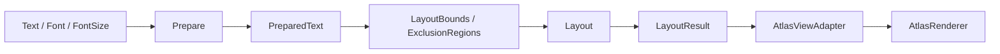
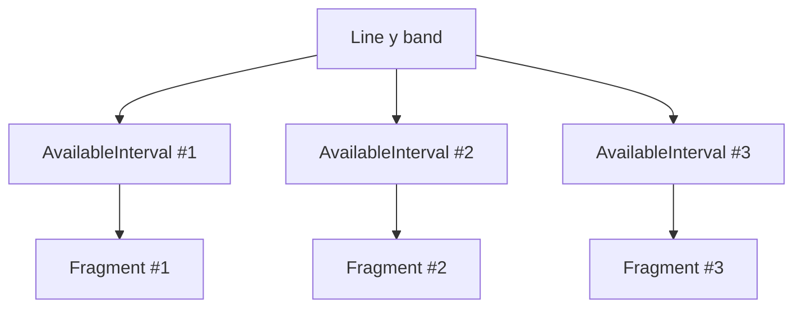
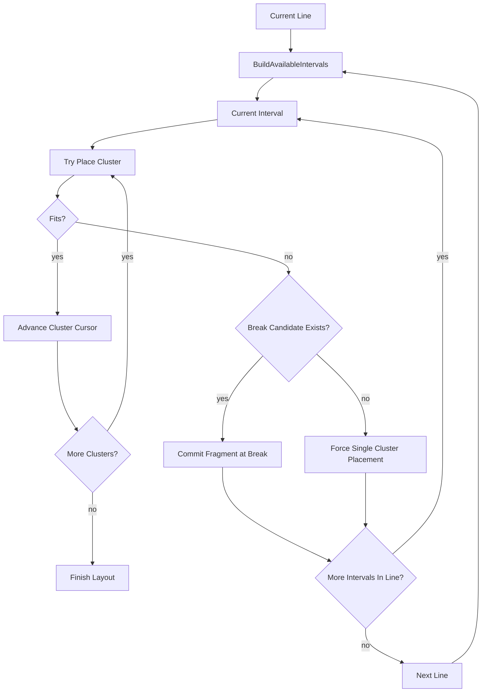

# TextVisualizer Layout Engine 설계

## 목적

이 문서의 목적은 `Prepared glyph / cluster` 데이터를 기반으로 여러 `exclusion bounds`를 피해 multi-line layout하는 `TextVisualizer` 전용 layout engine 구조를 설계하는 것이다.

이 문서는 구현 기준 문서로 사용되므로, 단순 개념 설명이 아니라 아래를 분명히 정의한다.

- `Prepare`와 `Layout`의 책임 경계
- `PreparedText`가 보유해야 할 최소 데이터
- cluster 기준 layout이 필요한 이유
- exclusion region을 interval로 변환하는 알고리즘
- line / fragment / glyph placement 결과 구조
- `prepare-only` / `layout-only` invalidation 규칙
- 1차 구현에서 제외할 기능과 향후 확장 가능성

애매한 내용은 추측하지 않고 `확인 필요`로 표시한다.

## 전제

- `TextVisualizer`는 항상 multi-line이다.
- `style`, `ellipsis`, `selection`, `cursor`는 이번 구현에서 제외한다.
- 입력된 `exclusion bounds` 영역에는 텍스트가 배치되지 않아야 한다.
- 한 줄 안에 여러 개의 `available interval`이 생길 수 있다.
- `text / font / fontSize`가 바뀌지 않는 한 shaping은 다시 하지 않는다.

## 현재 구조 요약

`TextVisualizer`의 text pipeline은 아래 두 단계로 분리한다.



핵심 원칙:

1. `Prepare`는 expensive text processing 단계다.
2. `Layout`은 prepared 결과를 소비하는 geometry 단계다.
3. `Layout`은 width / height / exclusion 변경에 빠르게 재실행되어야 한다.
4. cluster를 깨지 않고 줄바꿈과 fragment 분할을 수행해야 한다.

## Prepare 단계와 Layout 단계의 분리

## Prepare 단계

`Prepare`는 text 내용과 font 조건이 바뀔 때만 다시 수행한다.

책임:

- UTF-32 text 준비
- font fallback
- shaping
- glyph metrics 확보
- cluster 경계 계산
- cluster -> glyph 범위 매핑
- line break candidate 계산

특징:

- layout bounds를 보지 않는다
- exclusion region을 보지 않는다
- glyph position을 계산하지 않는다

즉, `Prepare`는 "어떤 glyph들이 어떤 cluster 구조로 존재하는가"까지 확정하고 끝난다.

## Layout 단계

`Layout`은 `PreparedText`를 입력으로 받아 geometry만 계산한다.

책임:

- line height / baseline progression
- line별 available interval 계산
- cluster 단위 줄바꿈 결정
- fragment 단위 glyph placement
- line / fragment / glyph placement 결과 생성
- 전체 layout size 계산

특징:

- shaping을 다시 하지 않는다
- font fallback을 다시 하지 않는다
- glyph metrics를 다시 계산하지 않는다

즉, `Layout`은 "prepared glyph들을 어디에 둘 것인가"만 결정한다.

## PreparedText에 필요한 데이터 구조

`PreparedText`는 최소한 아래 데이터를 가져야 한다.

```cpp
struct PreparedCluster
{
  uint32_t characterStart;
  uint32_t characterEnd;
  uint32_t glyphStart;
  uint32_t glyphEnd;
  float    advance;
  bool     mandatoryBreakBefore;
  bool     allowBreakBefore;
  bool     allowBreakAfter;
};

struct PreparedText
{
  Vector<Character>         text;
  Vector<GlyphInfo>         glyphs;
  Vector<Vector2>           glyphOffsets;
  Vector<float>             glyphAdvances;
  Vector<PreparedCluster>   clusters;
  Vector<uint8_t>           lineBreakFlags;
  Vector<CharacterIndex>    glyphsToCharacters;
  Vector<uint32_t>          charactersToClusters;
  float                     defaultLineHeight;
  float                     defaultAscender;
  float                     defaultDescender;
};
```

### 필수 의미

- `glyphs`
  - atlas renderer가 최종적으로 필요로 하는 glyph identity
- `glyphOffsets`
  - cluster origin 기준 glyph local offset
- `glyphAdvances`
  - width accumulation 및 cluster advance 계산 보조
- `clusters`
  - layout의 최소 원자 단위
- `lineBreakFlags`
  - break 가능 지점 정보를 저장
- `glyphsToCharacters`
  - 디버깅 및 향후 hit-test 확장 기반
- `charactersToClusters`
  - character index에서 cluster index로 빠르게 접근하기 위한 보조 맵

### TextVisualizer 관점

`PreparedText`는 `TextVisualizer`의 가장 중요한 캐시다. 이 객체가 살아 있는 동안 bounds/exclusion이 바뀌어도 shaping을 다시 하지 않는다.

## Cluster 기준 layout이 필요한 이유

`TextVisualizer`는 glyph 하나씩이 아니라 cluster 단위로 layout해야 한다.

이유:

1. 하나의 cluster가 여러 glyph로 구성될 수 있다.
2. 하나의 glyph가 여러 character를 대표할 수 있다.
3. ligature, combining mark, emoji sequence 등은 중간을 잘라 배치하면 안 된다.
4. exclusion region 때문에 fragment가 잘리더라도 cluster 내부는 분해하지 않아야 한다.

예:

- 한글 조합 / 자모 결합
- Arabic shaping
- emoji ZWJ sequence
- Latin ligature

따라서 line breaking과 fragment 분할의 최소 단위는 `glyph`가 아니라 `cluster`여야 한다.

## line break candidate 저장 방식

1차 구현에서는 `cluster` 기준 break candidate를 저장하는 방식이 적절하다.

권장 구조:

```cpp
enum LineBreakFlag : uint8_t
{
  LINE_BREAK_NONE             = 0,
  LINE_BREAK_ALLOW_BEFORE     = 1u << 0,
  LINE_BREAK_ALLOW_AFTER      = 1u << 1,
  LINE_BREAK_MANDATORY_BEFORE = 1u << 2,
};
```

저장 단위:

- `lineBreakFlags[clusterIndex]`

의미:

- `ALLOW_BEFORE`
  - 현재 cluster 앞에서 줄바꿈 가능
- `ALLOW_AFTER`
  - 현재 cluster 뒤에서 줄바꿈 가능
- `MANDATORY_BEFORE`
  - 현재 cluster 앞에서 강제 줄바꿈

이 방식의 장점:

- layout 단계가 character 단위 탐색을 하지 않아도 된다
- cluster scan만으로 break 지점을 판단할 수 있다
- 향후 line break penalty를 추가하기 쉽다

확인 필요:

- `allowBreakBefore` / `allowBreakAfter`를 둘 다 둘지, 하나의 canonical 규칙으로 단순화할지는 구현 시점에 추가 정리 필요

## line별 available interval 계산 방식

한 line은 하나의 연속 폭이 아니라 여러 개의 사용 가능한 interval로 구성될 수 있다.

예시 구조:

```cpp
struct TextExclusionRegion
{
  Rect<float> bounds;
};

struct AvailableInterval
{
  float x;
  float width;
};
```

line 계산 입력:

- content bounds
- current line top / bottom
- exclusion region 목록

출력:

- 현재 line band에서 사용 가능한 `AvailableInterval` 목록

기본 원칙:

1. 먼저 line band와 수직으로 겹치는 exclusion만 수집한다.
2. 그 exclusion들의 x-range를 line 기준 blocked interval로 본다.
3. content bounds 전체 구간에서 blocked interval을 뺀 나머지를 `AvailableInterval`로 만든다.

## 여러 exclusion bounds가 있을 때 interval을 만드는 알고리즘

1차 구현 알고리즘은 다음이 적절하다.

### 입력

- `Rect<float> contentBounds`
- `float lineTop`
- `float lineBottom`
- `Vector<TextExclusionRegion> exclusions`

### 알고리즘

1. `blockedRanges`를 빈 배열로 시작한다.
2. 각 exclusion region에 대해:
   - `region.bounds.y < lineBottom`
   - `region.bounds.y + region.bounds.height > lineTop`
   - 위 조건을 만족하면 line band와 수직 overlap이 있으므로 채택
3. 채택된 region의 x-range를 `blockedRanges`에 추가한다.
4. `blockedRanges`를 `x` 기준 정렬한다.
5. 겹치거나 맞닿는 blocked range를 merge한다.
6. `contentBounds`의 `[left, right)`에서 merged blocked range를 차례로 빼서 `AvailableInterval`을 만든다.
7. width가 0 이하인 interval은 제거한다.

### 예시 의사코드

```cpp
Vector<AvailableInterval> BuildAvailableIntervals(
  const Rect<float>& contentBounds,
  float lineTop,
  float lineBottom,
  const Vector<TextExclusionRegion>& exclusions)
{
  Vector<Range> blockedRanges;

  for(const auto& region : exclusions)
  {
    if(OverlapsVertically(region.bounds, lineTop, lineBottom))
    {
      blockedRanges.PushBack({region.bounds.x, region.bounds.x + region.bounds.width});
    }
  }

  SortAndMerge(blockedRanges);

  Vector<AvailableInterval> result;
  float cursor = contentBounds.x;
  float right  = contentBounds.x + contentBounds.width;

  for(const auto& blocked : blockedRanges)
  {
    if(cursor < blocked.start)
    {
      result.PushBack({cursor, blocked.start - cursor});
    }
    cursor = std::max(cursor, blocked.end);
  }

  if(cursor < right)
  {
    result.PushBack({cursor, right - cursor});
  }

  return result;
}
```

### 복잡도

- region 수를 `N`이라 하면 line당 대략 `O(N log N)`

1차 구현에서는 충분히 단순하고 디버깅 가능하다.

향후 최적화:

- y-range index
- interval cache
- region 변경분 기반 partial rebuild

## 한 line이 여러 fragment로 나뉘는 구조

하나의 line에는 여러 fragment가 존재할 수 있다.

예시 구조:

```cpp
struct TextLineFragment
{
  uint32_t glyphStart;
  uint32_t glyphEnd;
  uint32_t clusterStart;
  uint32_t clusterEnd;
  float    x;
  float    y;
  float    width;
};

struct TextLine
{
  float                     y;
  float                     height;
  float                     ascender;
  float                     descender;
  Vector<TextLineFragment>  fragments;
};
```

### 의미

- `TextLine`
  - 동일 baseline band를 공유하는 line
- `TextLineFragment`
  - 같은 line 안의 하나의 available interval에 실제로 배치된 cluster 덩어리

즉, line은 논리적 줄이고, fragment는 그 줄 안의 물리적 배치 조각이다.



### 배치 규칙

1. 한 line의 fragment는 x 순서대로 정렬된다.
2. fragment 사이에는 exclusion region이 존재한다.
3. cluster는 한 fragment 안에서만 연속 배치된다.
4. fragment가 끝나고 cluster가 남으면 같은 line의 다음 interval로 이동한다.
5. 다음 interval에도 못 들어가면 다음 line으로 이동한다.

## glyph placement 결과 구조

최종 layout 결과는 atlas renderer adapter가 직접 소비할 수 있어야 한다.

권장 구조:

```cpp
struct GlyphPlacement
{
  uint32_t glyphIndex;
  float    x;
  float    y;
};

struct LayoutResult
{
  Vector<GlyphPlacement> placements;
  Vector<TextLine>       lines;
  Vector2                layoutSize;
  uint32_t               laidOutGlyphCount;
  uint32_t               laidOutClusterCount;
};
```

### 설계 포인트

- `placements`
  - atlas renderer adapter가 바로 glyph position 배열로 변환 가능해야 한다
- `lines`
  - 디버깅, natural size, 향후 selection/hit-test 확장 기반
- `layoutSize`
  - view measure / render actor size에 사용

### 추가 권장 정보

추후 확장을 고려하면 아래 정보도 유용하다.

```cpp
struct ClusterPlacement
{
  uint32_t clusterIndex;
  uint32_t glyphStart;
  uint32_t glyphEnd;
  uint32_t lineIndex;
  uint32_t fragmentIndex;
  float    x;
  float    width;
};
```

1차 구현에서 필수는 아니지만, hit-test와 selection 확장을 생각하면 유지 가치가 높다.

## Layout 알고리즘 개요

권장 알고리즘은 cluster streaming 방식이다.

### 입력

- `PreparedText`
- content bounds
- exclusion regions

### 반복

1. 현재 line의 y band를 계산한다.
2. line에서 사용 가능한 interval 목록을 만든다.
3. 각 interval에 대해:
   - 현재 cluster가 들어갈 수 있는지 검사
   - 들어가면 fragment에 배치
   - 못 들어가면 break candidate를 역추적
4. line이 끝나면 다음 line으로 이동한다.

### 핵심 규칙

- interval 내부에서 cluster advance를 누적한다
- overflow 시 직전 break candidate로 되돌린다
- break candidate가 없으면 긴 cluster를 단독 line 처리한다
- 같은 line의 다음 interval로 넘어갈지, 다음 line으로 갈지는 overflow 시점과 잔여 interval 폭으로 결정한다



## layout-only invalidation 조건

아래 조건은 `Prepare`를 다시 하지 않고 `Layout`만 다시 수행할 수 있다.

- content width 변경
- content height 변경
- padding 변경으로 usable bounds 변경
- exclusion region 추가 / 제거 / 이동 / 크기 변경
- line spacing 정책 변경
- line height 정책 변경
- layout origin 변경

핵심 원칙:

- glyph set이 유지되고
- cluster 경계가 유지되며
- font fallback / shaping 결과가 유지되면

`Layout-only invalidation`이다.

## prepare invalidation 조건

아래 조건은 `Prepare`를 다시 수행해야 한다.

- text 변경
- font family 변경
- font size 변경
- font variation 변경
- font weight / width / slant 변경
- locale 또는 fallback 결과에 영향을 주는 font environment 변경
- script/bidi/shaping 결과가 달라질 수 있는 속성 변경

핵심 원칙:

- glyph identity가 바뀔 가능성이 있으면 `Prepare invalidation`
- cluster 경계가 바뀔 가능성이 있으면 `Prepare invalidation`

## 지원하지 않을 기능 목록

1차 구현에서는 아래 기능을 지원하지 않는다.

- ellipsis
- cursor
- selection
- decorator
- underline
- shadow
- strikethrough
- outline
- background
- editing / IME
- clipboard
- per-character style run
- vertical text
- justification
- non-rectangular exclusion geometry

위 기능들은 `LayoutResult`와 `PreparedText`를 더 복잡하게 만들므로 초기 구현에서는 의도적으로 제외한다.

## 향후 확장 가능성

현재 설계는 아래 기능으로 확장 가능해야 한다.

### 1. style run

- per-fragment color
- underline / background / shadow

### 2. hit-test / selection

- `ClusterPlacement`
- `TextLineFragment`
- `TextLine`

위 구조를 유지하면 확장 가능하다.

### 3. ellipsis

- line별 overflow 판정
- 마지막 fragment의 trailing cluster 치환

### 4. incremental layout

- exclusion region 일부만 바뀌면 영향 받는 line부터 재계산
- line interval cache 도입

### 5. non-rectangular exclusion

현재는 rectangle subtraction이지만, 향후 line band와 shape intersection 결과를 interval로 환원하는 구조로 확장 가능하다.

## TextVisualizer에 필요한 부분

### 직접 필요한 내용

- `Prepare`와 `Layout`의 캐시 분리
- cluster 단위 line breaking
- line별 available interval 계산
- multi-fragment line 구조
- `Layout-only invalidation`과 `Prepare invalidation` 분리
- atlas renderer adapter가 바로 소비할 수 있는 glyph placement 결과

### 참고용 내용

- `glyphsToCharacters`
- `charactersToClusters`
- `ClusterPlacement`
- 향후 style / hit-test 확장 포인트

## 버릴 부분

이 설계 문서 범위에서는 아래를 의도적으로 다루지 않는다.

- editing state machine
- selection / cursor geometry
- decorator actor
- IME 연동
- style decoration mesh
- ellipsis replacement

## 설계 결론

`TextVisualizer`의 layout engine은 기존 단일 box line layout이 아니라, `Prepared cluster stream + line별 available interval + multi-fragment line` 모델로 설계하는 것이 맞다.

핵심은 다음 세 가지다.

1. `Prepare`는 glyph/cluster 캐시를 만든다.
2. `Layout`은 exclusion-aware geometry만 계산한다.
3. 최종 결과는 atlas renderer가 바로 소비할 수 있는 glyph placement 배열로 정리한다.

## 확인 필요 사항

- line height를 font metrics 기반 단일 값으로 둘지, cluster/font별 line metrics를 더 세밀하게 가져갈지 구현 시 확정 필요
- cluster가 어떤 interval에도 들어가지 못할 정도로 폭이 큰 경우 강제 배치 정책을 어떻게 둘지 구현 시 확정 필요
- 1차 구현에서 bidi 재배치를 `Prepare` 결과로 완전히 고정할지 추가 검토 필요

## TextVisualizer 설계에 주는 결론

1. `TextVisualizer`는 shaping 결과를 재사용하는 `Prepare / Layout` 2단계 구조여야 한다.
2. layout의 최소 단위는 glyph가 아니라 cluster여야 한다.
3. exclusion region 대응은 line별 blocked-range subtraction으로 interval을 만드는 방식이 가장 단순하고 구현 가능성이 높다.
4. line은 하나의 box가 아니라 여러 fragment를 가지는 구조로 모델링해야 한다.
5. 1차 구현은 style/ellipsis/editing을 제외한 plain glyph placement에 집중하는 것이 맞다.
