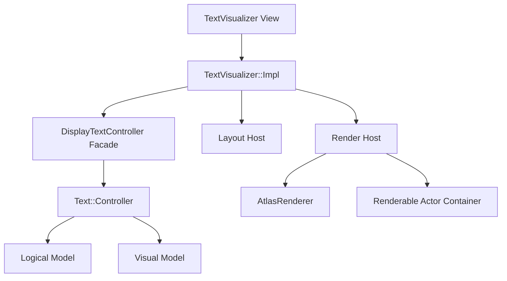
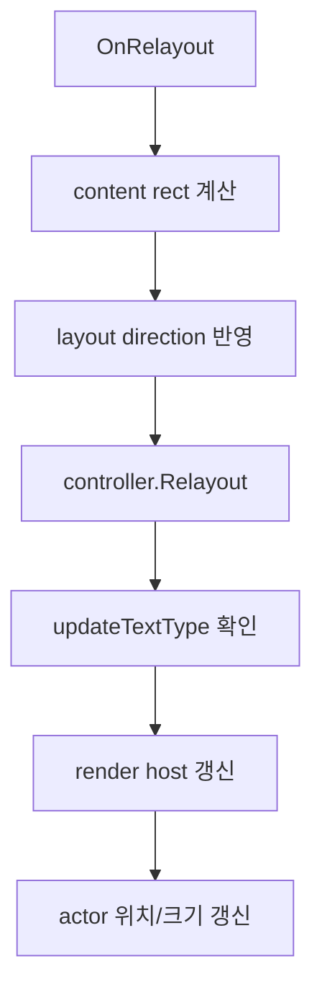

# TextVisualizer 설계안

## 목표 재정의

`Dali::Ui::TextVisualizer`는 다음 조건을 만족하는 읽기 전용 텍스트 View다.

- `View` 기반 measure / arrange / relayout lifecycle을 가진다.
- 동적 레이아웃 변화에 강하다.
- 기존 Dali text engine의 model/layout 파이프라인을 재사용한다.
- 편집기 기능과 visual 전용 제약을 기본 설계에서 제거한다.
- 1차 렌더링 경로로 `AtlasRenderer`를 사용하되, 교체 가능성을 열어 둔다.

## 설계 원칙

1. 텍스트 엔진은 새로 만들지 않는다.
2. `Text::Controller`는 재사용하되 표시 전용 facade 뒤에 숨긴다.
3. `InputField`의 View lifecycle 구조만 차용한다.
4. `TextVisual`의 visual-centric 구조는 직접 가져오지 않는다.
5. 렌더링은 atlas 기반을 우선하되 dirty 분류를 더 세밀하게 만든다.

## 제안 구조



## 주요 컴포넌트

### 1. `TextVisualizer`

public API를 제공하는 `View`.

권장 역할:

- text / font / color / alignment / markup / style property 노출
- `GetNaturalSize()`
- `GetHeightForWidth()`
- relayout 진입점

제외할 것:

- editable API
- selection API
- cursor API
- IME / clipboard API

### 2. `TextVisualizer::Impl`

실제 orchestration 계층.

역할:

- content rect 계산
- dirty state 관리
- controller facade 호출
- renderer host 호출
- renderable actor attach/detach

이 계층이 사실상 `InputFieldImpl`의 경량 표시용 버전이 된다.

### 3. `DisplayTextController Facade`

가장 중요한 신규 구조다.

역할:

- 내부에 `Text::Controller` 보유
- 표시용 subset만 노출
- `EnableTextInput()` 같은 API 차단
- layout/model/query API만 외부에 노출

추천 인터페이스 예시:

- `SetText()`
- `SetDefaultFontFamily()`
- `SetDefaultFontSize()`
- `SetDefaultColor()`
- `SetHorizontalAlignment()`
- `SetVerticalAlignment()`
- `SetMarkupProcessorEnabled()`
- `SetTextElideEnabled()`
- `Relayout(contentSize, layoutDirection)`
- `GetNaturalSize()`
- `GetHeightForWidth()`
- `GetTextModel()`
- `GetView()`

### 4. `Render Host`

역할:

- renderer 생성/보유
- `Controller::UpdateTextType` 해석
- renderable actor를 scene에 연결
- background actor/anchor actor 처리

이 계층은 `CommonTextUtils::RenderText()`를 활용하거나,
필요하면 `TextVisualizer`용으로 더 얇게 다시 쪼갠다.

## Dirty State 설계

현재 모듈에는 controller 내부 `OperationsMask`가 있지만,
상위 View는 더 단순한 dirty 분류를 가져야 한다.

추천안:

```cpp
enum class DirtyFlags : uint32_t
{
  NONE                = 0,
  TEXT_CONTENT        = 1u << 0,
  TEXT_STYLE          = 1u << 1,
  LAYOUT_CONSTRAINT   = 1u << 2,
  RENDER_MATERIAL     = 1u << 3,
  SCENE_ATTACHMENT    = 1u << 4,
};
```

설명:

- `TEXT_CONTENT`
  - 문자열 변경
  - markup 변경
- `TEXT_STYLE`
  - 폰트/색/underline/outline 등
- `LAYOUT_CONSTRAINT`
  - width/height/padding/layout direction 변경
- `RENDER_MATERIAL`
  - renderer reset 또는 shader/material 재구성 필요
- `SCENE_ATTACHMENT`
  - actor attach/detach 또는 clipping 구조 변경

이 dirty는 내부에서 controller의 `OperationsMask`로 변환된다.

## Lifecycle 설계

### Measure

- controller natural size 사용
- padding 추가
- text가 비어 있으면 기본 line height 사용 여부를 정책으로 결정

### Arrange

- bounds를 View에 적용

### Relayout



중요한 차이점:

- decorator 없음
- selection/cursor layer 없음
- focus 기반 상태 전환 없음

## 렌더링 전략

### 기본 전략: `AtlasRenderer`

채택 이유:

- glyph atlas 재사용
- relayout 빈도가 높을 때 texture bake보다 유리할 가능성
- underline / strikethrough / outline / color glyph 지원

### 추상화 유지

다만 구현은 아래 형태가 좋다.

- `Text::RendererPtr mRenderer`
- 기본 생성은 `Text::Backend::Get().NewRenderer()`
- 단, backend가 atlas renderer를 반환하는 현재 구조를 활용

이렇게 해 두면 향후 renderer 교체 실험도 가능하다.

## property 범위 제안

1차 구현에서 권장하는 property:

- `text`
- `fontFamily`
- `fontSize`
- `textColor`
- `horizontalAlignment`
- `verticalAlignment`
- `multiLine`
- `ellipsis`
- `enableMarkup`
- `underline`
- `outline`
- `shadow`
- `lineThrough`
- `backgroundColor`
- `padding`

1차에서 제외 권장:

- placeholder
- editable
- selection enabled
- cursor 관련 전부
- IME 옵션
- input filter

## 재사용 가능한 기존 코드

### 적극 재사용

- `Text::Controller`
- `Text::Model`
- `Layout::Engine`
- `Text::Backend`
- `AtlasRenderer`

### 부분 재사용

- `CommonTextUtils::RenderText()`
- `InputFieldImpl`의 measurement / relayout 패턴

### 재사용 금지

- `InputFieldImpl`의 이벤트 처리/IME/selection 경로
- `TextController`의 입력 관련 entry point

## 내부 상태 최소안

`TextVisualizer::Impl` 권장 멤버 예시:

- `Text::ControllerPtr` 또는 facade
- `Text::RendererPtr`
- `Actor mRenderableActor`
- `Actor mBackgroundActor`
- `float mAlignmentOffset`
- `DirtyFlags mDirtyFlags`
- `bool mMeasureInvalidated`

없어야 하는 멤버:

- `DecoratorPtr`
- `InputMethodContext`
- cursor/selection signal state
- gesture detector
- event queue mirror

## 확장 포인트

향후 확장은 아래 방향으로 가능해야 한다.

- `PreText`가 요구하는 pre-layout hint
- lightweight text selection overlay
- async size computation
- alternative renderer backend

중요한 것은 1차 구조가 이를 막지 않아야 한다는 점이다.

## 최종 구조 요약

`TextVisualizer`의 최종 형태는 아래 한 문장으로 요약된다.

> `TextVisualizer`는 `InputField`의 View 생명주기 구조와 `Text::Controller`의 layout/model 엔진을 결합하고, 편집기 runtime을 제거한 읽기 전용 text View다.
