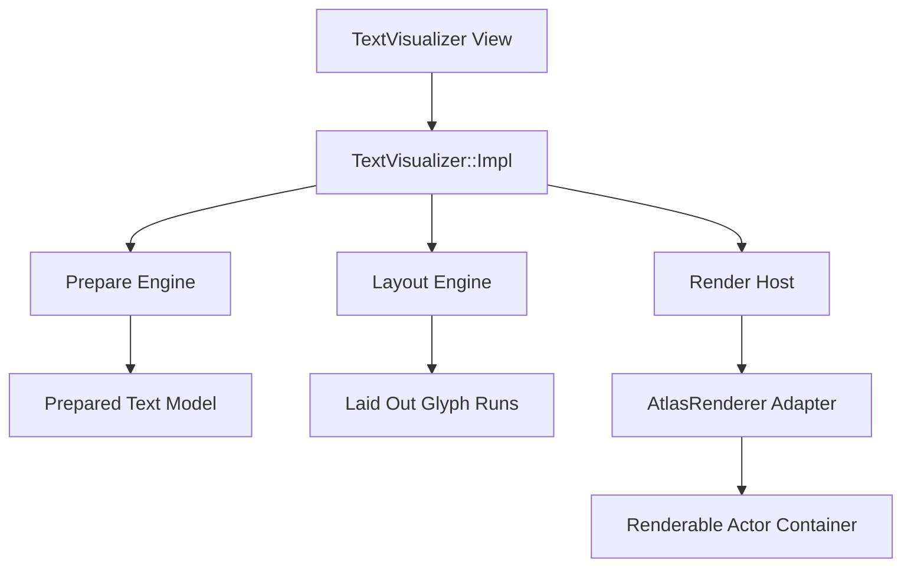
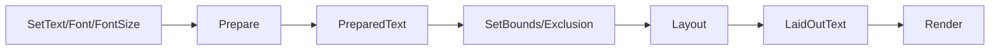
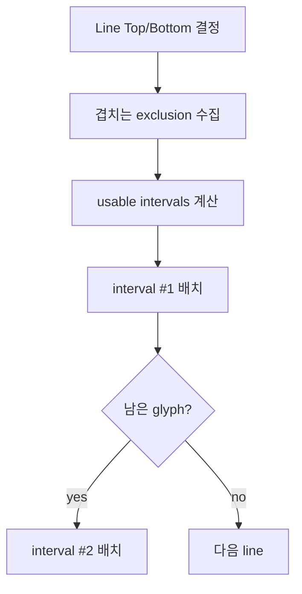
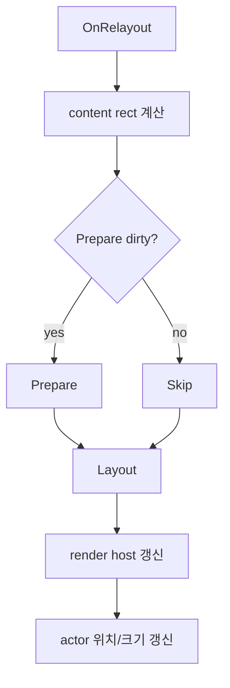

# TextVisualizer 설계안

## 목표 재정의

`Dali::Ui::TextVisualizer`는 다음 조건을 만족하는 읽기 전용 텍스트 View다.

- `InputField`를 참고한 public/internal `View` 구조를 가진다.
- `Typesetter` 기반이 아니라 `AtlasRenderer` 기반 렌더링을 목표로 한다.
- 편집기 기능과 visual 전용 제약을 기본 설계에서 제거한다.
- 텍스트 준비(`Prepare`)와 레이아웃(`Layout`)을 분리한다.
- exclusion region이 포함된 복수 bounds 레이아웃을 지원한다.
- 1차 구현에서는 style, ellipsis, selection, cursor, underline, shadow를 모두 무시한다.

## 설계 원칙

1. `InputField`의 public/internal `View` 패턴을 기준으로 구조를 잡는다.
2. `InputField`의 editing, cursor, selection, decorator 구조는 가져오지 않는다.
3. `Text::Controller`는 직접 노출하지 않고, `TextVisualizer`용 경량 prepare/layout 계층으로 분리한다.
4. 비싼 작업은 `Prepare`, 빈번한 bounds 변화는 `Layout`에서 처리한다.
5. 렌더링은 `AtlasRenderer`를 쓰되, 실제로 필요한 glyph 데이터만 공급하는 방향으로 재구성한다.

## 제안 구조



## 주요 컴포넌트

### 1. `TextVisualizer`

public API를 제공하는 `View`.

권장 역할:

- text / font / fontSize 설정
- prepare 관련 API
- bounds / exclusion region 설정
- 필요 시 명시적 layout API
- `GetNaturalSize()`
- `GetHeightForWidth()`
- relayout 진입점

제외할 것:

- editable API
- selection API
- cursor API
- IME / clipboard API
- style API 전반

### 2. `TextVisualizer::Impl`

실제 orchestration 계층.

역할:

- content rect 계산
- dirty state 관리
- prepare/layout 엔진 호출
- renderer host 호출
- renderable actor attach/detach

이 계층이 사실상 `InputFieldImpl`의 경량 표시용 버전이 된다.

### 3. `Prepare Engine`

가장 중요한 신규 구조다.

역할:

- text / font / fontSize를 받아 expensive prepare 수행
- font fallback
- shaping
- glyph metrics
- cluster / character-to-glyph 매핑
- 이후 layout에서 재사용할 prepared 결과 생성

prepare 단계 산출물 예시:

- UTF-32 text buffer
- script / bidi segmentation 결과
- shaped glyph run
- glyph metrics
- cluster map
- line-break 가능한 지점 정보

### 4. `Layout Engine`

역할:

- prepared 결과를 기반으로 layout만 수행
- width / height / bounds / exclusion region 반영
- 여러 line interval에 glyph 배치
- shaping 재수행 금지

핵심 규칙:

- 항상 multi-line
- 한 줄 안에 여러 사용 가능 interval 허용
- exclusion region으로 인해 잘린 공간을 건너뛰며 배치

### 5. `Render Host`

역할:

- renderer 생성/보유
- layout 결과를 atlas renderer adapter에 전달
- renderable actor를 scene에 연결

1차에서는 background/anchor/decorator 처리 없이,
텍스트 actor 부착에만 집중한다.

## Prepare / Layout 2단계 모델



### Prepare 단계

비싼 작업을 모은다.

- text normalization이 필요하면 여기서 수행
- font fallback 결정
- shaping
- glyph metrics 획득
- cluster 정보 생성

이 단계는 text/font/fontSize 변경 시 다시 수행된다.

### Layout 단계

prepared 결과를 재사용한다.

- line breaking
- interval 선택
- glyph positioning
- line advance 계산
- exclusion region 회피

이 단계는 bounds/exclusion 변경 시 반복적으로 호출될 수 있다.

## Exclusion layout 모델

`TextVisualizer`의 핵심은 일반 사각형 박스 layout이 아니라,
복수 bounds / exclusion region 기반 line interval layout이다.

한 줄마다 다음 과정을 수행해야 한다.

1. 현재 line y 범위와 겹치는 exclusion region 수집
2. 해당 line에서 사용 가능한 x interval 계산
3. interval들을 좌에서 우로 채우며 glyph run 배치
4. interval이 소진되면 같은 line의 다음 interval 또는 다음 line으로 이동

예시:



이 구조는 기존 `Text::Controller`의 단일 rectangular layout과 다른 핵심 차이점이다.

## 기존 text-controller와의 관계

현재 `Text::Controller`는 prepare와 layout이 강하게 엮여 있고,
편집기 오버헤드도 크다.

따라서 `TextVisualizer`는 아래 방향이 적절하다.

- 1차: 기존 text-controller 내부 로직 중 prepare에 해당하는 부분을 참고해 경량 prepare 모델 설계
- 1차: layout은 `TextVisualizer` 전용 다중 interval engine으로 별도 설계
- 목표: "controller를 감싼다"보다 "prepare에 필요한 부분을 추출 가능한 구조로 정리한다"

즉, 이전 문서의 `display-only controller facade` 개념은 유지하되,
실체는 더 prepare-centric한 모델로 보는 것이 맞다.

## Dirty State 설계

상위 View는 prepare와 layout을 분리한 dirty 분류를 가져야 한다.

추천안:

```cpp
enum class DirtyFlags : uint32_t
{
  NONE                = 0,
  PREPARE_REQUIRED    = 1u << 0,
  LAYOUT_REQUIRED     = 1u << 1,
  RENDER_REQUIRED     = 1u << 2,
  SCENE_ATTACHMENT    = 1u << 3,
};
```

설명:

- `PREPARE_REQUIRED`
  - text 변경
  - font 변경
  - fontSize 변경
- `LAYOUT_REQUIRED`
  - width/height 변경
  - bounds / exclusion region 변경
- `RENDER_REQUIRED`
  - layout 결과 변경
- `SCENE_ATTACHMENT`
  - actor attach/detach 또는 clipping 구조 변경

## Lifecycle 설계

### Measure

- prepared 결과 또는 layout 결과 기반 natural size 사용
- padding 추가
- text가 비어 있으면 기본 line height 사용 여부를 정책으로 결정

### Arrange

- bounds를 View에 적용

### Relayout



중요한 차이점:

- decorator 없음
- selection/cursor layer 없음
- focus 기반 상태 전환 없음
- layout은 항상 multi-line
- shaping은 relayout에서 다시 하지 않음

## 렌더링 전략

### 기본 전략: `AtlasRenderer`

채택 이유:

- glyph atlas 재사용
- relayout 빈도가 높을 때 texture bake보다 유리할 가능성
- glyph 기반 렌더링 결과만 있으면 display view에 붙이기 좋다

### 이번 구현에서 무시할 요소

- style
- ellipsis
- selection
- cursor
- underline
- shadow
- background

즉, 이번 1차 구현은 "plain multi-line glyph rendering"에 집중한다.

## AtlasRenderer 최소 데이터 계약

현재 `AtlasRenderer`는 `Text::ViewInterface`를 받지만,
이번 범위에서 실제로 중요한 데이터는 생각보다 적다.

1차 구현 기준 최소 요구 데이터는 아래다.

- `GetControlSize()`
- `GetLayoutSize()`
- `GetNumberOfGlyphs()`
- `GetGlyphs()`
- `GetTextColor()`
- `GetColors()` / `GetColorIndices()`는 기본 색 단일 사용 시 null 또는 최소 구현 가능

이번 구현에서 불필요하거나 dummy 처리 가능한 항목:

- underline 관련 전체
- strikethrough 관련 전체
- outline 관련 전체
- shadow 관련 전체
- ellipsis / hyphen 관련 전체
- background 관련 전체

즉, `TextVisualizer`는 장기적으로 `AtlasRenderer`가 요구하는 `ViewInterface` 전체를 구현하기보다,
plain glyph rendering 전용 adapter 또는 subset view를 두는 편이 바람직하다.

## property 범위 제안

1차 구현에서 권장하는 property:

- `text`
- `fontFamily`
- `fontSize`
- `textColor`
- `padding`
- `bounds`
- `exclusionRegions`

1차에서 제외 권장:

- placeholder
- editable
- selection enabled
- cursor 관련 전부
- IME 옵션
- input filter
- underline / outline / shadow / lineThrough / background
- ellipsis

## Public API naming 제안

Dali UI 스타일을 유지하면서도 phase 분리를 드러내는 이름이 필요하다.

추천안:

- `SetText(const Dali::String&)`
- `SetFontFamily(const Dali::String&)`
- `SetFontSize(float)`
- `SetTextColor(const UiColor&)`
- `Prepare()`
- `SetLayoutBounds(const Dali::Vector<Rect<float>>&)`
- `SetExclusionRegions(const Dali::Vector<Rect<float>>&)`

검토 대상:

- `Layout()`
  - 장점: phase 2를 명시적으로 노출
  - 단점: Dali UI의 일반 relayout lifecycle과 중복 가능

권장 방향:

- public explicit API로는 `Prepare()`만 우선 도입
- layout은 기본적으로 internal relayout lifecycle에서 수행
- 필요하면 나중에 `UpdateLayout()` 또는 `CalculateLayout()` 계열을 검토

## 재사용 가능한 기존 코드

### 적극 재사용

- `InputField`의 public/internal `View` 패턴
- `Text::Backend`
- `AtlasRenderer`
- shaping/fallback/glyph metric 관련 기존 text 내부 로직 참조

### 부분 재사용

- `CommonTextUtils::RenderText()`의 actor 부착 관점
- `InputFieldImpl`의 measurement / relayout 패턴
- 기존 `Text::Controller`의 prepare 단계 로직

### 재사용 금지

- `InputFieldImpl`의 이벤트 처리/IME/selection 경로
- `TextController`의 입력 관련 entry point
- `TextController`의 편집기 상태 구조 전체

## 내부 상태 최소안

`TextVisualizer::Impl` 권장 멤버 예시:

- `PreparedTextModel`
- `LaidOutTextModel`
- `Text::RendererPtr`
- `Actor mRenderableActor`
- `float mAlignmentOffset`
- `DirtyFlags mDirtyFlags`
- `bool mMeasureInvalidated`
- `Vector<Rect<float>> mLayoutBounds`
- `Vector<Rect<float>> mExclusionRegions`

없어야 하는 멤버:

- `DecoratorPtr`
- `InputMethodContext`
- cursor/selection signal state
- gesture detector
- event queue mirror
- style run 편집 상태

## 확장 포인트

향후 확장은 아래 방향으로 가능해야 한다.

- `PreText`가 요구하는 pre-layout hint
- lightweight text selection overlay
- async size computation
- alternative renderer backend

중요한 것은 1차 구조가 이를 막지 않아야 한다는 점이다.

## 최종 구조 요약

`TextVisualizer`의 최종 형태는 아래 한 문장으로 요약된다.

> `TextVisualizer`는 `InputField`의 View 구조를 따르되, 텍스트를 Prepare와 Layout으로 분리하고, 복수 interval layout 결과를 `AtlasRenderer`로 표시하는 읽기 전용 text View다.
