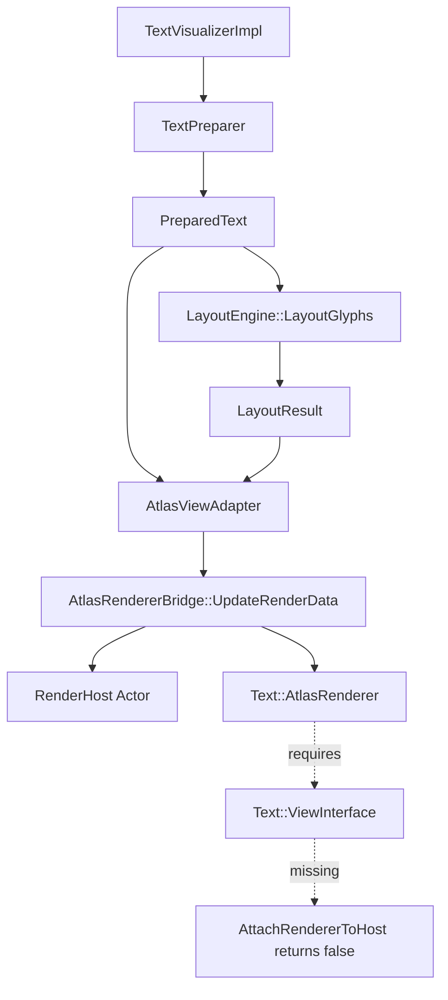

# TextVisualizer Renderer Integration Status

## 목적

이 문서는 자동 compact 이후에도 다음 작업자가 현재 `TextVisualizer`의 renderer integration 상태를 정확히 이어받을 수 있도록 정리한 인수인계 문서이다.

특히 아래를 분명히 고정한다.

- 현재 구현된 `Prepare -> Layout -> Adapter -> Bridge -> RenderHost` 경로
- `AtlasRenderer` attach 단계에서 확인된 실제 제약
- 다음 커밋이 건드리면 안 되는 기존 `TextController / TextView / AtlasRenderer` 경계
- 다음 구현의 권장 방향과 금지 사항

애매한 내용은 추측하지 않고 `확인 필요`로 표시한다.

## 분석 대상 파일

- `dali-ui-foundation/internal/text/text-visualizer/atlas-view-adapter.h`
- `dali-ui-foundation/internal/text/text-visualizer/atlas-view-adapter.cpp`
- `dali-ui-foundation/internal/text/text-visualizer/atlas-renderer-bridge.h`
- `dali-ui-foundation/internal/text/text-visualizer/atlas-renderer-bridge.cpp`
- `dali-ui-foundation/integration-api/text-visualizer-impl.h`
- `dali-ui-foundation/integration-api/text-visualizer-impl.cpp`
- `dali-ui-foundation/internal/text/rendering/atlas/text-atlas-renderer.h`
- `dali-ui-foundation/internal/text/rendering/atlas/text-atlas-renderer.cpp`
- `dali-ui-foundation/internal/text/rendering/text-renderer.h`
- `dali-ui-foundation/internal/text/text-view.h`
- `dali-ui-foundation/internal/text/text-view-interface.h`

## 1. 현재 최신 커밋 상태

최근 커밋:

- `Add TextVisualizer atlas renderer attach skeleton`
- 커밋 해시: `1e03a14`

현재 중요한 사실:

- `TextVisualizer`는 `Prepare / Layout / Adapter / Bridge / RenderHost`까지 구현되었다.
- `PreparedText`에는 shaped glyph와 glyph metrics까지 저장된다.
- `LayoutEngine::LayoutGlyphs()`는 동작한다.
- `AtlasViewAdapter`와 `AtlasRendererBridge`는 존재한다.
- `TextVisualizerImpl`은 `Actor mRenderHost`를 생성하고 소유할 수 있다.
- 하지만 실제 화면 표시, glyph geometry upload, renderer output attach는 아직 되지 않는다.

## 2. 현재 구현된 렌더링 준비 경로

현재 코드 기준 렌더링 준비 경로는 다음과 같다.

각 단계 상태:

- `TextVisualizerImpl`
  - 완료
  - `Prepare()`, `OnMeasure()`, `OnRelayout()`에서 prepare/layout/render dirty를 분리 관리한다.
- `TextPreparer`
  - 완료
  - UTF-8 -> UTF-32, line break, paragraph, script/font run, shaping, glyph metrics까지 준비한다.
- `PreparedText`
  - 완료
  - renderer/layout에 필요한 glyph data cache 역할을 한다.
- `LayoutEngine::LayoutGlyphs`
  - 완료
  - glyph advance 기반 multi-line layout과 exclusion interval 사용이 구현되어 있다.
- `LayoutResult`
  - 완료
  - line / fragment / glyph placement 결과를 보관한다.
- `AtlasViewAdapter`
  - 완료
  - `PreparedText + LayoutResult`를 renderer-friendly getter로 노출한다.
- `AtlasRendererBridge::UpdateRenderData`
  - 완료
  - adapter의 glyph / placement를 bridge 내부 temporary render data로 변환한다.
- `RenderHost Actor`
  - 완료
  - `TextVisualizerImpl`이 host actor lifecycle을 가진다.
- 실제 `AtlasRenderer` output attach
  - 미완료
  - `Text::ViewInterface` bridge 부재 때문에 실제 attach 경로가 없다.
- 실제 화면 표시
  - 미완료
  - geometry upload와 renderer output attach가 아직 없다.

## 3. AtlasRenderer attach 조사 결과

현재 코드와 기존 renderer 계약을 다시 확인한 결과는 다음과 같다.

- `Text::AtlasRenderer::New()`로 renderer 객체 생성은 가능하다.
- 하지만 attach 가능한 output actor는 renderer 객체 생성만으로 나오지 않는다.
- `Text::Renderer`의 실제 외부 계약은 `Render(ViewInterface& view, Actor textControl, Property::Index animatablePropertyIndex, float& alignmentOffset, int depth)` 이다.
  - 파일: `dali-ui-foundation/internal/text/rendering/text-renderer.h`
- `Text::AtlasRenderer`도 동일하게 `Render(ViewInterface& view, ...)`를 override 한다.
  - 파일: `dali-ui-foundation/internal/text/rendering/atlas/text-atlas-renderer.h`
- 즉, 현재 `AtlasRenderer` output actor는 `Renderer::Render(ViewInterface& view, Actor textControl, ...)` 경로에서만 얻을 수 있다.
- 따라서 현재 `TextVisualizer`에는 `Text::ViewInterface` bridge가 없어서 실제 output attach를 진행할 수 없다.
- 이 이유로 `AtlasRendererBridge::AttachRendererToHost()`는 현재 `false`를 반환하는 skeleton 상태다.
  - 파일: `dali-ui-foundation/internal/text/text-visualizer/atlas-renderer-bridge.cpp`
- `IsRendererAttached()`도 현재 실제 `true`가 되는 경로가 없다.

핵심 결론:

- 지금 막혀 있는 지점은 `AtlasRenderer` 객체 생성이 아니라 `Render(ViewInterface&, ...)`에 들어갈 최소 `ViewInterface` 구현 부재다.

## 4. 현재 AtlasRendererBridge 상태

파일:

- `dali-ui-foundation/internal/text/text-visualizer/atlas-renderer-bridge.h`
- `dali-ui-foundation/internal/text/text-visualizer/atlas-renderer-bridge.cpp`

현재 API와 실제 동작:

- `SetAdapter(const AtlasViewAdapter* adapter)`
  - 한다:
    - non-owning adapter pointer를 저장한다.
  - 하지 않는다:
    - adapter 소유권을 갖지 않는다.
    - data validation을 즉시 수행하지 않는다.

- `Clear()`
  - 한다:
    - `DetachRendererFromHost()`
    - adapter pointer clear
    - bridge 내부 temporary render data clear
    - render host handle reset
    - renderer reset
  - 하지 않는다:
    - host actor를 scene에서 직접 제거하지 않는다.
    - 실제 atlas actor detach는 하지 않는다.

- `HasRenderableGlyphs()`
  - 한다:
    - adapter 존재 여부와 `adapter->HasRenderableGlyphs()`를 확인한다.
  - 하지 않는다:
    - 실제 renderer draw-ready 상태를 의미하지 않는다.

- `EnsureRenderer()`
  - 한다:
    - renderable glyph가 있을 때 `Text::AtlasRenderer::New()`를 호출한다.
  - 하지 않는다:
    - output actor를 만들지 않는다.
    - render host에 attach하지 않는다.

- `IsRendererCreated()`
  - 한다:
    - 내부 `Text::RendererPtr` 보유 여부만 반환한다.
  - 하지 않는다:
    - attach 여부나 geometry 준비 여부를 의미하지 않는다.

- `UpdateRenderData()`
  - 한다:
    - adapter의 glyph placements를 순회한다.
    - glyph index 검증과 glyph info fetch를 수행한다.
    - bridge 내부 `AtlasGlyphRenderData` 임시 벡터를 채운다.
    - 좌표는 현재 `LayoutResult`의 top-left 기준을 그대로 사용한다.
  - 하지 않는다:
    - `AtlasRenderer::Render()`를 호출하지 않는다.
    - geometry upload를 하지 않는다.
    - text color, bearing, baseline offset을 아직 적용하지 않는다.

- `SetRenderHost(Actor renderHost)`
  - 한다:
    - render host handle copy를 저장한다.
  - 하지 않는다:
    - ownership을 가져가지 않는다.

- `HasRenderHost()`
  - 한다:
    - render host handle 존재 여부를 확인한다.
  - 하지 않는다:
    - attach 가능성까지 보장하지 않는다.

- `AttachRendererToHost()`
  - 한다:
    - attached 상태가 이미 `true`면 no-op 처리한다.
    - host/renderer/renderable glyph 존재 여부를 사전 확인한다.
  - 하지 않는다:
    - 실제 attach를 수행하지 않는다.
    - 이유는 `ViewInterface` bridge가 없어서 `Render()`를 호출할 수 없기 때문이다.
  - 현재 정책:
    - host가 있어도 `false` 반환이 기대 동작이다.

- `IsRendererAttached()`
  - 한다:
    - bridge 내부 bool 상태를 반환한다.
  - 하지 않는다:
    - 현재 코드상 `true`가 되는 경로는 없다.

- `DetachRendererFromHost()`
  - 한다:
    - attached 상태 bool만 false로 되돌린다.
  - 하지 않는다:
    - 실제 output actor detach는 하지 않는다.

## 5. 현재 RenderHost 상태

파일:

- `dali-ui-foundation/integration-api/text-visualizer-impl.h`
- `dali-ui-foundation/integration-api/text-visualizer-impl.cpp`

현재 상태:

- `TextVisualizerImpl`이 `Actor mRenderHost`를 소유한다.
- `EnsureRenderHost()`에서 `Actor::New()`를 사용한다.
- 설정:
  - `ParentOrigin::TOP_LEFT`
  - `Pivot::TOP_LEFT`
  - `ResizePolicy::FILL_TO_PARENT`
- child 추가:
  - `IntegrationView::AddActorChild(Ui::View::DownCast(Self()), mRenderHost);`
- `ClearRenderHost()`에서는:
  - `mAtlasRendererBridge.DetachRendererFromHost()`
  - `mAtlasRendererBridge.SetRenderHost(Actor())`
  - `mRenderHost.Unparent()`
  - `mRenderHost.Reset()`

현재 중요한 사실:

- host actor는 존재할 수 있다.
- 하지만 renderer output actor는 아직 host에 붙지 않는다.
- 즉, host lifecycle만 준비된 상태이고 render content는 비어 있다.

## 6. 현재 테스트 상태

현재 기준 test 상태:

- `tct-dali-ui-foundation-core -s -m TextVisualizer` 통과
- `gcov timestamp warning`은 실패가 아니다.
- render attach 관련 UTC는 skeleton 정책에 맞게 통과한다.
- `AttachRendererToHost()`는 host가 있어도 `false`인 것이 현재 기대 동작이다.

현재 UTC가 검증하는 핵심:

- bridge empty state
- empty adapter / renderable adapter state
- `UpdateRenderData()` success / failure skeleton
- host setter / clear path
- attach without host / with host / duplicate attach / clear path
- `TextVisualizerImpl` relayout path에서 crash가 없는지

## 7. 다음 선택지 비교

### A. TextVisualizer용 최소 Text::ViewInterface 구현

장점:

- 기존 `AtlasRenderer`를 수정하지 않고 사용할 가능성이 높다.
- 기존 renderer lifecycle과 `Render(ViewInterface&, ...)` 계약을 최대한 유지한다.

단점:

- `ViewInterface`가 요구하는 method 수가 많다.
- dummy / no-op 구현이 커질 수 있다.
- 기존 `TextView / Controller` 방식이 다시 유입될 위험이 있다.

원칙:

- selection / editing / decorator 관련 method는 `no-op / false / empty`로 제한한다.
- `PreparedText / LayoutResult` 기반 getter만 구현한다.
- `TextVisualizer`에 없는 상태를 맞추기 위해 `TextController`를 다시 끌어오면 안 된다.

### B. AtlasRenderer에 minimal render data 입력 API 추가

장점:

- `TextVisualizer`의 data 구조와 직접 연결 가능하다.
- 큰 `ViewInterface` dummy 구현을 피할 수 있다.

단점:

- 기존 `AtlasRenderer` API 수정이 필요하다.
- 기존 `Label / InputField` path에 영향이 갈 수 있다.

원칙:

- 기존 path를 깨지 않는 additive API만 검토한다.
- 수정 전 반드시 별도 문서 또는 검토 커밋이 필요하다.

### C. TextVisualizer 전용 lightweight atlas renderer 구현

장점:

- `TextVisualizer` 요구사항에 맞게 최적화할 수 있다.
- `Controller / ViewInterface` 의존을 제거할 수 있다.

단점:

- 구현 범위가 커진다.
- 기존 atlas/cache/render behavior를 다시 구현할 위험이 있다.

원칙:

- 지금 당장 구현하지 않는다.
- 장기 대안으로만 문서화한다.

## 8. 권장 다음 단계

현재 기준 권장 방향:

- 다음 커밋은 `TextVisualizer minimal ViewInterface adapter 조사/스켈레톤`으로 가는 것이 가장 안전하다.
- 즉, 기존 `AtlasRenderer`를 수정하지 않고 `Render(ViewInterface&, ...)` 경로에 진입할 수 있는지 먼저 확인해야 한다.
- 다음 커밋의 성공 기준은 “실제 rendering success”가 아니라 “`ViewInterface`가 요구하는 최소 method 목록과 `TextVisualizer` mapping을 고정하는 것”이다.

다음 커밋 후보:

- `Add TextVisualizer minimal ViewInterface adapter skeleton`

## 추가 확인: minimal ViewInterface skeleton

`Text::ViewInterface`는 method 수가 많지만, 현재 `AtlasRenderer::Render()`와 `AddGlyphs()`가 직접 읽는 핵심 subset은 아래와 같다.

- 반드시 실제 값을 연결해야 할 가능성이 큰 method
  - `GetNumberOfGlyphs()`
  - `GetGlyphs(...)`
  - `GetColors()`
  - `GetColorIndices()`
  - `GetTextColor()`
  - `GetLayoutSize()`
  - `GetTextBuffer()`
  - `GetGlyphsToCharacters()`
- 현재 `TextVisualizer` 1차 범위에서 `no-op / false / empty`로 닫아도 되는 method
  - underline / shadow / outline
  - strikethrough
  - hyphen insertion
  - ellipsis
  - bounded paragraph runs
  - cutout

즉, 다음 구현의 핵심은 `TextController`를 다시 끌어오는 것이 아니라, `PreparedText / LayoutResult / TextColor / ControlSize`만으로 위 subset을 어떻게 채울지 고정하는 것이다.

## 9. 다음 커밋에서 반드시 지킬 금지 사항

- 기존 `TextController` 수정 금지
- 기존 `TextView` 수정 금지
- 기존 `internal/text/layouts/layout-engine.*` 수정 금지
- editing / selection / cursor / decorator / IME 경로 수정 금지
- public API 추가 금지
- `text-atlas-renderer.*` 수정은 아직 금지
- `render dirty` clear 금지
- 실제 화면 표시까지 무리하지 않기

## 10. 다음 커밋 전에 확인할 파일

- `dali-ui-foundation/internal/text/rendering/text-renderer.h`
- `dali-ui-foundation/internal/text/rendering/atlas/text-atlas-renderer.h`
- `dali-ui-foundation/internal/text/rendering/atlas/text-atlas-renderer.cpp`
- `dali-ui-foundation/internal/text/text-view.h`
- `dali-ui-foundation/internal/text/text-view.cpp`
- `dali-ui-foundation/internal/text/text-view-interface.h`
- `ControllerInterface` 정의 파일이 실제로 분리되어 있다면 해당 파일도 확인 필요

## 확인 필요 사항

- `docs/text-visualizer/09-current-implementation-status.ko.md`는 현재 저장소에 없다.
  - 자동 compact 이후 기준 문서가 필요하다면, 본 문서가 사실상 그 역할을 일부 대체한다.
- `ViewInterface` 최소 구현 시 실제로 필수인 method subset이 어느 정도인지 추가 확인 필요
- `AtlasRenderer::Render()` 호출 이후 actor ownership과 detach lifecycle 정리 필요
- baseline / `xBearing` / `yBearing` / offset / textColor 적용 위치 정리 필요
- render host를 장기적으로 `Actor`로 유지할지 `View` 기반 host로 올릴지 확인 필요

## TextVisualizer 설계에 주는 결론

- 현재 `TextVisualizer`는 `Prepare -> Layout -> Adapter -> Bridge -> RenderHost`까지는 분리 목표에 맞게 구현되었다.
- 지금 막힌 지점은 shaping/layout이 아니라 `AtlasRenderer`가 요구하는 `ViewInterface` bridge다.
- 따라서 다음 단계는 기존 `TextController / TextView / AtlasRenderer`를 수정하는 것이 아니라, `TextVisualizer` 전용 최소 `ViewInterface` adapter를 조사하고 스켈레톤으로 고정하는 것이 맞다.
