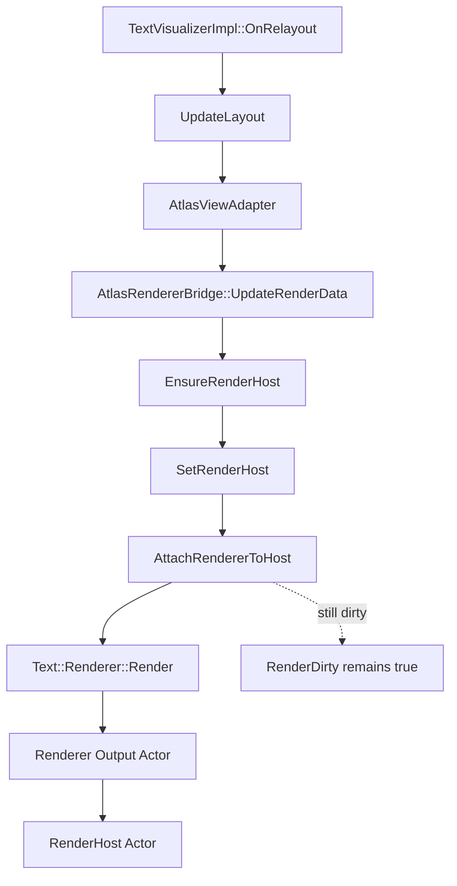

# TextVisualizer Renderer Render-Call Status

## 목적

이 문서는 `Renderer::Render()` 호출 skeleton 구현 이후의 `TextVisualizer` 상태를 compact 이후에도 다음 작업자가 정확히 이어받을 수 있도록 정리한 인수인계 문서이다.

특히 아래를 분명히 고정한다.

- `Renderer::Render()` 호출 경로가 현재 어디까지 열렸는지
- output actor attach 정책이 현재 어떻게 동작하는지
- `render dirty`를 아직 clear하면 안 되는 이유
- baseline / bearing / geometry correctness가 아직 미완료라는 점
- 다음 작업자가 기존 `TextController / TextView / AtlasRenderer`를 잘못 건드리지 않도록 하는 금지 사항

애매한 내용은 추측하지 않고 `확인 필요`로 표시한다.

## 분석 대상 파일

- `dali-ui-foundation/internal/text/text-visualizer/atlas-renderer-bridge.h`
- `dali-ui-foundation/internal/text/text-visualizer/atlas-renderer-bridge.cpp`
- `dali-ui-foundation/internal/text/text-visualizer/text-visualizer-view-interface.h`
- `dali-ui-foundation/internal/text/text-visualizer/text-visualizer-view-interface.cpp`
- `dali-ui-foundation/internal/text/text-visualizer/atlas-view-adapter.h`
- `dali-ui-foundation/internal/text/text-visualizer/atlas-view-adapter.cpp`
- `dali-ui-foundation/integration-api/text-visualizer-impl.cpp`
- `dali-ui-foundation/internal/text/rendering/text-renderer.h`
- `dali-ui-foundation/internal/text/rendering/atlas/text-atlas-renderer.h`
- `dali-ui-foundation/internal/text/rendering/atlas/text-atlas-renderer.cpp`

## 1. 현재 최신 커밋 상태

최신 커밋:

- `Add TextVisualizer renderer render-call skeleton`
- 커밋 해시: `f804f4c`

현재 중요한 사실:

- `TextVisualizer`는 `Prepare -> Layout -> Adapter -> Bridge -> RenderHost` 뒤에 `Renderer::Render()` 호출 skeleton까지 연결되었다.
- `TextVisualizerViewInterface`는 존재한다.
- `AtlasRendererBridge::AttachRendererToHost()`는 이제 실제로 `Render()`를 호출한다.
- `Render()`가 반환한 output actor는 현재 bridge가 host에 직접 attach할 수 있다.
- `TextVisualizerViewInterface::GetGlyphs()`는 이제 renderer가 기대하는 glyph quad origin에 더 가깝게 최소 position adjustment를 적용한다.
- 그러나 geometry correctness, baseline/bearing/offset, textColor 정확성은 아직 미완료다.
- 따라서 `render dirty`는 아직 clear하지 않는다.

## 2. 현재 render pipeline 상태

현재 코드 기준 흐름은 다음과 같다.

각 단계 상태:

- `TextVisualizerImpl`
  - 완료
  - `OnRelayout()`에서 layout 결과와 render path를 연결한다.
- `UpdateLayout()`
  - 완료
  - glyph data/metrics가 있으면 `LayoutEngine::LayoutGlyphs()`를 사용한다.
- `AtlasViewAdapter`
  - 완료
  - `PreparedText / LayoutResult / TextColor / ControlSize`를 bridge에 제공한다.
- `AtlasRendererBridge::UpdateRenderData()`
  - 완료
  - glyph/placement를 bridge 내부 temporary render data로 변환한다.
- `EnsureRenderHost()`
  - 완료
  - host actor lifecycle을 보장한다.
- `SetRenderHost()`
  - 완료
  - bridge가 host handle을 보관한다.
- `AttachRendererToHost()`
  - 완료
  - 이제 `Renderer::Render()`를 호출하고 output actor attach를 시도한다.
- `Text::Renderer::Render()`
  - 완료
  - 호출 경로는 열렸지만 correctness는 아직 미완료다.
- `output actor -> RenderHost Actor attach`
  - 부분 완료
  - attach 정책은 구현되었지만 시각 품질 검증은 아직 없다.
- `render dirty clear`
  - 미완료
  - 의도적으로 아직 하지 않는다.

## 3. Renderer::Render() 호출 조사 결과

현재 코드와 실제 renderer 흐름을 다시 확인한 결과는 다음과 같다.

- `Text::Renderer::Render(ViewInterface&, Actor, Property::Index, float&, int)` 호출 자체는 가능하다.
- `Text::AtlasRenderer::Render()`는 내부 actor를 만들거나 재사용한 뒤 actor를 반환한다.
- 반환 actor는 자동으로 `textControl / renderHost`에 attach되지 않는다.
- 그래서 현재 bridge가 parent가 없는 output actor를 `mRenderHost.Add(output)`으로 직접 attach한다.
- 반환 actor가 이미 `mRenderHost`에 붙어 있으면 중복 add하지 않는다.
- 반환 actor가 다른 parent를 갖고 있으면 강제로 빼앗지 않고 실패 처리한다.

즉, 현재 구현은 아래 정책을 가진다.

1. `Render()` 호출
2. output actor가 없으면 실패
3. parent가 없으면 host에 직접 add
4. parent가 이미 host면 성공으로 간주
5. parent가 다른 actor면 강제 이동 없이 실패

## 4. 현재 AtlasRendererBridge 상태

현재 보유 상태:

- `mAdapter`
- `mRenderer`
- `mRenderHost`
- `mRendererOutput`
- `mRendererAttached`
- `mAnimatablePropertyIndex`
- `mAlignmentOffset`
- `mDepth`
- `mViewInterface`
- `mImpl` render data

현재 API와 책임:

- `SetAdapter()`
  - `AtlasViewAdapter`를 non-owning으로 저장하고 `mViewInterface.SetAdapter()`까지 함께 수행한다.
- `Clear()`
  - detach, adapter clear, view interface clear, render data clear, host reset, renderer reset까지 수행한다.
- `HasRenderableGlyphs()`
  - adapter가 renderable glyph를 제공하는지 확인한다.
- `IsRendererCreated()`
  - `Text::RendererPtr` 생성 여부만 확인한다.
- `HasRenderHost()`
  - render host handle 존재 여부를 확인한다.
- `IsRendererAttached()`
  - 현재 bridge가 attach 성공 상태로 판단하는 bool을 반환한다.
- `HasViewInterfaceAdapter()`
  - `TextVisualizerViewInterface`가 adapter를 참조 중인지 확인한다.
- `GetRendererOutput()`
  - 최근 `Render()` 호출 결과로 얻은 output actor handle을 반환한다.
- `EnsureRenderer()`
  - 필요 시 `Text::AtlasRenderer::New()`를 통해 renderer를 생성한다.
- `ResetRenderer()`
  - detach 후 renderer handle을 reset한다.
- `UpdateRenderData()`
  - adapter의 glyph placements를 bridge 내부 temporary render data로 변환한다.
- `SetRenderHost()`
  - host actor handle을 저장한다.
- `GetRenderHost()`
  - 현재 host handle을 반환한다.
- `AttachRendererToHost()`
  - `Render()` 호출, output actor 획득, duplicate attach 방지, host attach를 담당한다.
- `DetachRendererFromHost()`
  - output actor가 있으면 `Unparent()` 후 reset하고 attached bool을 false로 돌린다.

## 5. ViewInterface 현재 mapping

파일:

- `dali-ui-foundation/internal/text/text-visualizer/text-visualizer-view-interface.h`
- `dali-ui-foundation/internal/text/text-visualizer/text-visualizer-view-interface.cpp`

실제로 연결한 것:

- `GetNumberOfGlyphs()`
- `GetGlyphs()`
- `GetControlSize()`
- `GetLayoutSize()`
- `GetTextColor()`
- `GetTextBuffer()`
- `GetGlyphsToCharacters()`

empty / no-op 처리한 것:

- `GetColors()` / `GetColorIndices()`
- `GetBackgroundColors()` / `GetBackgroundColorIndices()`
- underline
- shadow
- outline
- hyphen
- ellipsis
- strikethrough
- bounded paragraph runs
- character spacing
- cutout

중요한 주의점:

- `colors / color indices`는 현재 `nullptr`이다.
- `textColor`는 `GetTextColor()` 경로로만 전달된다.
- per-glyph color path는 아직 연결하지 않았다.

## 추가 확인: glyph position adjustment

`TextVisualizer`의 현재 glyph placement와 `AtlasRenderer`가 기대하는 좌표계를 다시 확인한 결과는 다음과 같다.

- `Text::View::GetGlyphs()`는 기존 path에서 line alignment offset과 line ascender를 glyph position에 더한 뒤 renderer에 전달한다.
  - 파일: `dali-ui-foundation/internal/text/text-view.cpp`
- `Text::AtlasRenderer::AddGlyphs()`는 전달받은 `position`을 glyph mesh origin으로 사용하고, `baseLine = position.y + glyph.yBearing`로 baseline을 계산한다.
  - 파일: `dali-ui-foundation/internal/text/rendering/atlas/text-atlas-renderer.cpp`
- 즉 `AtlasRenderer`가 기대하는 `glyphPositions`는 baseline origin이 아니라 glyph quad의 top-left 성격에 가깝다.

현재 `TextVisualizer`의 `LayoutEngine::LayoutGlyphs()`는 아래 좌표를 저장한다.

- `placement.x`
  - exclusion interval 안에서 누적 advance로 계산한 pen x 성격의 값
- `placement.y`
  - line top y

이 좌표를 그대로 `Render()`에 넘기면 `xBearing / yBearing`가 빠져 기존 `TextView` path보다 glyph가 치우칠 수 있다.

그래서 이번 단계에서는 renderer 경계에서만 최소 보정을 적용했다.

- 위치:
  - `dali-ui-foundation/internal/text/text-visualizer/atlas-view-adapter.cpp`
  - `dali-ui-foundation/internal/text/text-visualizer/text-visualizer-view-interface.cpp`
- 적용식:
  - `x = placement.x + glyph.xBearing`
  - `baselineOffset = same line의 glyph들 중 max(yBearing)`
  - `y = placement.y + baselineOffset - glyph.yBearing`

현재 의미:

- `LayoutResult`는 여전히 layout 좌표를 유지한다.
- renderer-specific adjustment는 `TextVisualizerViewInterface::GetGlyphs()` 경계에서만 적용한다.
- `minLineOffset`는 아직 alignment offset path를 구현하지 않았기 때문에 `0.0f`를 유지한다.

확인 필요:

- 현재 `baselineOffset = max(yBearing)`는 ascender/line metrics가 없는 상태에서 잡은 임시 규칙이다.
- font ascender/descender 기반 line baseline을 별도로 계산하면 이 보정식은 바뀔 수 있다.
- glyph offset, RTL/Bidi visual order, combining mark / zero-advance glyph 정밀 배치는 아직 미완료다.
- `textColor`는 `GetTextColor()` defaultColor path로만 전달되며, shader 반영 correctness는 아직 별도 확인이 필요하다.

## 추가 확인: text color render path

`AtlasRenderer`의 color path를 다시 확인한 결과, 현재 `TextVisualizer` 1차 구현은 단일 `textColor`만으로 충분히 연결 가능하다.

- `Text::AtlasRenderer::Render()`는 `view.GetColors()`, `view.GetColorIndices()`, `view.GetTextColor()`를 읽는다.
- `AddGlyphs()` 내부에서 `colorsBuffer == nullptr`이면 `useDefaultColor = true`가 된다.
- 이 경우 모든 glyph vertex color는 `defaultColor`, 즉 `view.GetTextColor()` 반환값을 사용한다.
- `GetColors()`와 `GetColorIndices()`가 모두 비어 있지 않은 경우에만 per-glyph color path가 열린다.
- background color path는 별도 getter를 통해 처리되며, 현재 `TextVisualizer` 1차 구현 범위와는 분리되어 있다.

현재 `TextVisualizer` 정책:

- rich style / per-glyph color는 지원하지 않는다.
- `TextVisualizerViewInterface::GetColors()`와 `GetColorIndices()`는 계속 `nullptr`를 반환한다.
- `TextVisualizerViewInterface::GetTextColor()`는 `AtlasViewAdapter::GetTextColor()`를 그대로 반환한다.
- 따라서 현재 구현은 `AtlasRenderer`의 `defaultColor` 경로만 사용한다.

추가로 확인한 구현 정책:

- `textColor` 변경은 여전히 `render dirty`만 세운다.
- 다만 `OnRelayout()`에서 layout dirty 여부와 무관하게 `SyncRenderStateToAdapter()`를 호출해 최신 `controlSize`와 `textColor`를 adapter에 반영한다.
- 즉, layout dirty가 없어도 다음 render path에서 최신 색을 `GetTextColor()`로 읽을 수 있다.

중요:

- 이 커밋에서도 `render dirty`는 clear하지 않는다.
- 이유는 color path가 연결되어도 geometry correctness, baseline/bearing/offset, `animatablePropertyIndex / alignmentOffset / depth` 의미가 아직 완전히 정리되지 않았기 때문이다.

확인 필요:

- 실제 shader에 `textColor`가 기대한 색으로 반영되는지는 manual/sample 검증이 아직 필요하다.
- per-glyph color 지원은 1차 범위 밖이며, 필요할 경우 `GetColors()` / `GetColorIndices()` path를 별도로 설계해야 한다.
- color animation과 `animatablePropertyIndex`의 관계는 아직 검토 전이다.

## 6. 현재 render dirty 정책

현재 정책은 다음과 같다.

- `render dirty`는 아직 clear하지 않는다.

이유:

- geometry correctness가 완성되지 않았다.
- baseline / bearing / offset 보정이 아직 없다.
- `textColor`가 실제 shader/renderer에 제대로 반영되는지 확인 전이다.
- `animatablePropertyIndex / alignmentOffset / depth` 의미가 확정되지 않았다.

따라서 다음 작업에서도 아래 원칙을 반드시 지켜야 한다.

- 실제 draw-ready 상태가 명확해지기 전까지 `render dirty`를 clear하면 안 된다.

## 7. 현재 UTC 상태

현재 기준 test 상태:

- `tct-dali-ui-foundation-core -s -m TextVisualizer` 통과
- `gcov timestamp warning`은 실패가 아니다.

render call 관련 UTC가 현재 검증하는 내용:

- host 없음: `false`
- host 있음: `true / false` 허용 + state consistency 확인
- duplicate attach no-op 확인
- detach / clear 상태 정리 확인
- `TextVisualizer` render-call smoke

즉, 현재 테스트의 성공 기준은 “정확한 화면 표시”가 아니라 “crash 없이 render-call path와 actor 상태가 일관적인가”이다.

## 8. 남은 핵심 문제

아래는 아직 남아 있는 핵심 문제다.

- `animatablePropertyIndex`에 어떤 property index를 넣어야 하는지 미정
- `alignmentOffset` 의미 미정
- `depth` 의미 미정
- baseline / `xBearing` / `yBearing` / glyph offset 적용 위치 미정
- `textColor`가 실제 rendering에 반영되는지 확인 필요
- renderer output actor ownership 장기 정책 필요
- `render dirty` clear 시점 미정
- 실제 화면 표시 품질 검증 필요
- exclusion region이 실제 render output에서 시각적으로 비워지는지 manual / sample 검증 필요

## 9. 다음 선택지

### A. Render correctness 보강

- baseline / bearing / glyph offset 적용
- glyph position coordinate 보정
- `textColor` 전달 확인

장점:

- 실제 draw 결과와 layout data의 의미를 맞출 수 있다.

단점:

- coordinate 의미를 잘못 고정하면 이후 수정 비용이 커진다.

### B. render dirty clear 조건 정리

- `AttachRendererToHost()` 성공만으로 clear할지
- `UpdateRenderData + Render + output actor attach` 성공까지 clear할지
- geometry correctness 확인 전에는 clear하지 않는 것이 현재 권장이다.

### C. sample app 추가

- 실제 화면에서 `TextVisualizer`가 보이는지 확인
- exclusion region 회피가 시각적으로 되는지 확인
- 동적 bounds 이동 smoke 확인

현재 권장:

- 다음 구현은 sample보다 먼저 render correctness 조사 / 보강을 작게 진행하는 것이 안전하다.
- 단, 화면 확인이 꼭 필요하면 매우 작은 sample app을 먼저 추가해도 된다.

## 10. 다음 커밋 금지 사항

- 기존 `TextController` 수정 금지
- 기존 `TextView` 수정 금지
- 기존 `internal/text/layouts/layout-engine.*` 수정 금지
- editing / selection / cursor / decorator / IME 경로 수정 금지
- public API 추가 금지
- `text-atlas-renderer.*` 수정은 아직 금지
- `render dirty` clear 금지
- 대규모 refactor 금지

## 확인 필요 사항

- 최신 커밋 이후 `10-renderer-integration-status.ko.md`의 일부 내용은 오래된 상태를 포함할 수 있다.
  - 본 문서는 `Render()` 호출 이후 상태를 우선 기준으로 삼는다.
- output actor ownership을 장기적으로 bridge가 가질지, renderer가 내부적으로 재생성/회수할지 확인 필요
- per-glyph color path를 언제 연결할지 확인 필요

## TextVisualizer 설계에 주는 결론

- 현재 `TextVisualizer`는 `Render()` 호출 경로까지는 열렸지만, draw correctness는 아직 미완료다.
- 따라서 다음 단계의 핵심은 “더 많이 붙이는 것”이 아니라 “현재 attach된 actor가 올바른 좌표/색/offset을 쓰는지”를 작게 검증하고 보강하는 것이다.
- 이 단계에서 `render dirty`를 조급하게 clear하거나 기존 `TextController / TextView / AtlasRenderer`를 수정하는 방향으로 가면 설계 원칙에서 벗어나기 쉽다.
