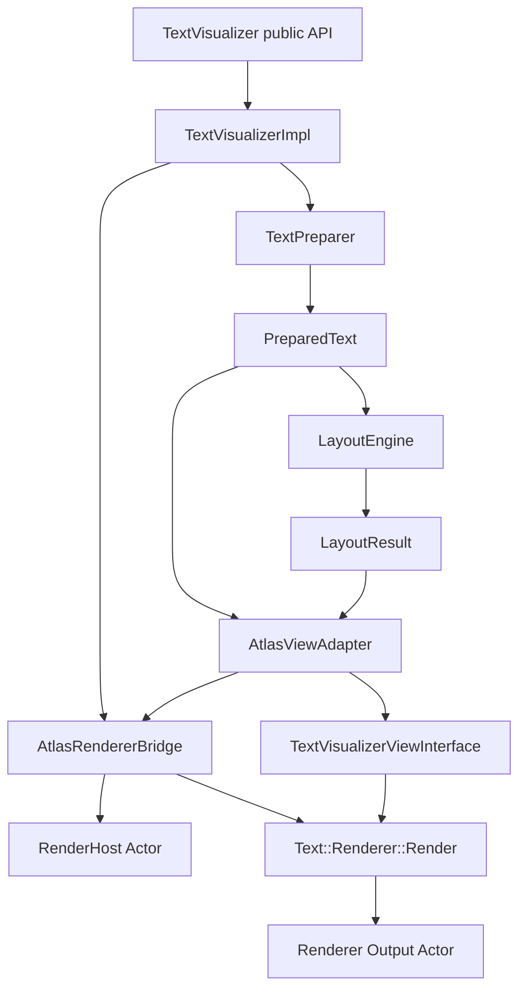
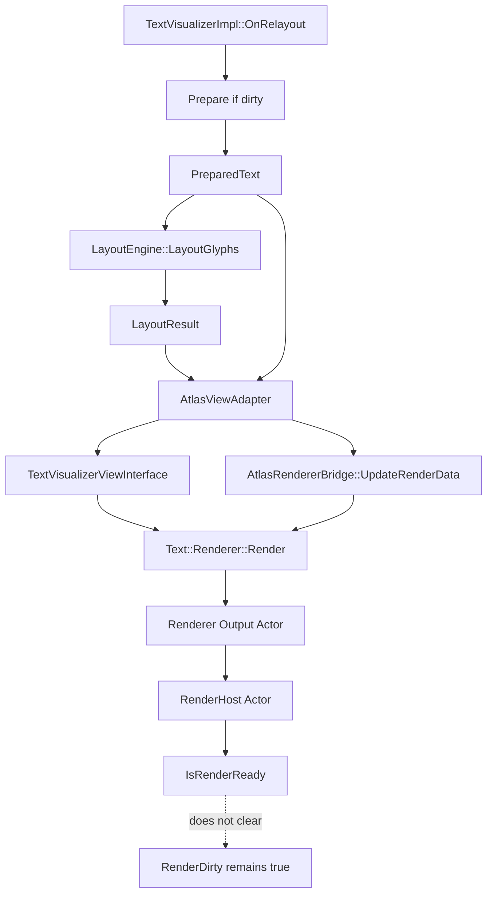

# TextVisualizer Current Status After Render-Ready

## 목적

이 문서는 `render-ready state tracking`까지 반영된 현재 `TextVisualizer` 구현 상태를 compact 이후에도 다음 작업자가 정확히 이어받을 수 있도록 정리한 인수인계 문서이다.

특히 아래를 분명히 고정한다.

- 현재 구현이 `Prepare -> Layout -> Adapter -> ViewInterface -> Bridge -> RenderHost -> Renderer::Render()`까지 어디에 도달했는지
- `IsRenderReady()`가 현재 무엇을 의미하고, 무엇을 의미하지 않는지
- 아직 `render dirty`를 clear하면 안 되는 이유
- 다음 작업 후보와 금지 사항

애매한 내용은 추측하지 않고 `확인 필요`로 표시한다.

## 1. 현재 최신 커밋 상태

최신 커밋:

- `Add TextVisualizer render-ready state tracking`
- 커밋 해시: `65c8c10`

이전 중요 커밋:

- `Add TextVisualizer renderer render-call skeleton`
- 커밋 해시: `f804f4c`
- `Adjust TextVisualizer glyph render positions`
- 커밋 해시: `5a6b74c`
- `Verify TextVisualizer text color render path`
- 커밋 해시: `c1ac606`

## 2. 전체 구현 상태 요약

현재 구현 상태를 전체 흐름으로 정리하면 다음과 같다.

단계별 현재 상태:

- `TextVisualizer public API`
  - 완료
  - handle/property/method skeleton과 기본 property가 존재한다.
- `TextVisualizerImpl`
  - 완료
  - prepare/layout/render dirty, render host lifecycle, adapter/bridge 연결을 담당한다.
- `TextPreparer`
  - 완료
  - shaping 직전이 아니라 shaping + glyph metrics까지 포함한 prepare cache 생성 경로가 구현되어 있다.
- `PreparedText`
  - 완료
  - prepare-stage 데이터와 glyph 관련 vector를 복사 저장한다.
- `LayoutEngine`
  - 완료
  - placeholder layout과 glyph advance 기반 layout이 모두 존재한다.
- `LayoutResult`
  - 완료
  - line / fragment / cluster placement / glyph placement를 저장한다.
- `AtlasViewAdapter`
  - 완료
  - `PreparedText`와 `LayoutResult`를 non-owning으로 참조하며 renderer-friendly getter를 제공한다.
- `TextVisualizerViewInterface`
  - 완료
  - `Text::ViewInterface` 최소 구현체가 존재한다.
- `AtlasRendererBridge`
  - 완료
  - renderer 생성, render data 변환, `Renderer::Render()` 호출, output actor attach, render-ready state 추적이 구현되어 있다.
- `RenderHost Actor`
  - 완료
  - `TextVisualizerImpl`이 host actor를 생성/소유한다.
- `Text::Renderer::Render()`
  - 완료
  - 실제 호출 경로가 열려 있다.
- `Renderer Output Actor`
  - 부분 완료
  - bridge가 actor를 보관하고 host에 attach할 수 있다.
  - 다만 visual correctness와 ownership 정책은 아직 확정 전이다.

## 3. Prepare 단계 현재 상태

완료된 것:

- UTF-8 -> UTF-32 변환
- line break info 생성
- paragraph info 생성
- script run 생성
- font run / fallback validation
- `ShapeText()`
- glyph mapping 생성
- `Metrics::GetGlyphMetrics()`
- `PreparedText`에 필요한 vector만 복사 저장
- `TextController / TextView / VisualModel` 전체를 소유하지 않음

현재 `PreparedText`가 보유하는 핵심 데이터:

- original text
- font family / font size
- characters
- line break info
- paragraph info
- script runs
- font runs
- glyphs
- glyph-to-character map
- characters-per-glyph
- character-to-glyph table
- glyphs-per-character table
- new paragraph glyphs

아직 미완료:

- cluster correctness
- emoji ZWJ cluster 처리
- font variation 완전 반영
- style / rich text

주의:

- 현재 `clusterCount`는 여전히 실제 cluster 수가 아니라 character count 기반 placeholder 성격이 강하다.
- `PreparedText`는 “layout-only 재계산”을 가능하게 하는 cache이지만, cluster-quality line break까지는 아직 완성되지 않았다.

## 4. Layout 단계 현재 상태

완료된 것:

- exclusion region 기반 available interval 생성
- placeholder layout 유지
- glyph advance 기반 `LayoutGlyphs()`
- `GlyphPlacement`
- `TextLineFragment.glyphStart / glyphEnd`
- `TextVisualizerImpl`이 glyph data/metrics가 있으면 `LayoutGlyphs()`, 아니면 `LayoutPlaceholder()` 사용

현재 layout 관련 핵심 구조:

- `AvailableInterval`
- `TextLineFragment`
- `TextLine`
- `ClusterPlacement`
- `GlyphPlacement`
- `LayoutResult`

현재 동작 요약:

- exclusion region과 vertical overlap이 있는 blocked interval만 line에서 제거한다.
- interval은 merge / clamp / zero-width 제거를 거친다.
- glyph layout은 glyph advance 기준으로 interval을 순회하며 line을 구성한다.
- output은 `LayoutResult.lines`, `clusterPlacements`, `glyphPlacements`에 저장된다.

아직 미완료:

- word / cluster 기반 line break 품질
- bidi visual reorder
- RTL
- zero advance / combining mark 정밀 처리
- ascender / descender 기반 line metrics

## 5. Renderer/ViewInterface 단계 현재 상태

완료된 것:

- `AtlasViewAdapter`
  - `PreparedText / LayoutResult` 비소유 참조
  - renderable glyph validation
  - glyph info / glyph placement / text buffer / glyph-to-character map accessor
  - control size / layout size / text color 보관
  - renderer glyph position adjustment 제공

- `TextVisualizerViewInterface`
  - `Text::ViewInterface` 직접 구현
  - 실제 연결한 method:
    - `GetNumberOfGlyphs()`
    - `GetGlyphs()`
    - `GetControlSize()`
    - `GetLayoutSize()`
    - `GetTextColor()`
    - `GetTextBuffer()`
    - `GetGlyphsToCharacters()`
  - no-op / empty 처리한 method:
    - colors / color indices
    - background colors
    - underline / shadow / outline
    - hyphen
    - ellipsis
    - strikethrough
    - bounded paragraph runs
    - character spacing
    - cutout

- `AtlasRendererBridge`
  - `Text::AtlasRenderer::New()`
  - `UpdateRenderData()`
  - `Renderer::Render()` 호출
  - renderer output actor 보관
  - output actor를 `RenderHost Actor`에 attach
  - `Detach / Clear / Reset` 상태 정리

현재 renderer 경로 의미:

- `TextVisualizer`는 더 이상 “renderer 생성 가능 여부” 수준이 아니라 실제 `Render()` 호출과 output actor attach skeleton까지 도달했다.
- 하지만 이 상태를 아직 “draw correctness 완료”로 보면 안 된다.

## 6. glyph render position adjustment 현재 정책

현재 glyph 위치 정책은 다음과 같다.

- `LayoutResult`는 layout 좌표를 유지한다.
- renderer-specific 보정은 `AtlasViewAdapter / TextVisualizerViewInterface` 경계에서 수행한다.
- 현재 보정식:
  - `x = placement.x + glyph.xBearing`
  - `baselineOffset = 같은 line의 glyph들 중 max(yBearing)`
  - `y = placement.y + baselineOffset - glyph.yBearing`
- 이 보정은 임시 규칙이다.
- ascender / descender 기반 line metrics가 들어오면 조정될 수 있다.
- `minLineOffset`은 아직 `0.0f` 유지다.

현재 해석:

- `LayoutEngine::LayoutGlyphs()`는 pen/line-top 성격의 좌표를 만든다.
- `AtlasRenderer`는 glyph quad origin에 가까운 좌표를 기대하므로, renderer 직전 경계에서 bearing을 반영한다.
- 이 설계는 `LayoutResult`를 renderer-specific 좌표로 오염시키지 않기 위한 선택이다.

## 7. textColor render path 현재 정책

현재 정책은 다음과 같다.

- `AtlasRenderer`는 `GetColors()`, `GetColorIndices()`, `GetTextColor()`를 읽는다.
- `GetColors() / GetColorIndices()`가 `nullptr`이면 `defaultColor` path를 사용한다.
- `defaultColor`는 `GetTextColor()` 반환값이다.
- `TextVisualizer` 1차 구현은 per-glyph color를 지원하지 않는다.
- `GetColors() / GetColorIndices()`는 `nullptr` 유지한다.
- `GetTextColor()`만 `TEXT_COLOR`를 전달한다.
- `SyncRenderStateToAdapter()`가 layout dirty 여부와 무관하게 render 직전 `controlSize / textColor`를 adapter에 반영한다.

현재 의미:

- `TEXT_COLOR` 변경은 prepare/layout을 다시 하지 않아도 된다.
- 색만 바뀐 경우에도 다음 render path에서 최신 색을 보게 된다.
- 다만 실제 shader 반영 correctness는 아직 manual/sample 검증 전이다.

## 8. render-ready state 현재 정책

현재 bridge에 추가된 API:

- `HasRendererOutput()`
- `IsRenderReady()`

`IsRenderReady()` 조건:

- `IsRendererCreated()`
- `HasRenderHost()`
- `HasRendererOutput()`
- `IsRendererAttached()`
- `HasViewInterfaceAdapter()`
- `HasRenderableGlyphs()`

`IsRenderReady()`의 의미:

- renderer 생성, view adapter 연결, host 보관, output actor 보관, attach 상태가 bridge 내부에서 일관적이라는 뜻이다.

`IsRenderReady()`가 의미하지 않는 것:

- geometry correctness 완료
- baseline / bearing / offset 검증 완료
- 화면 품질 보장
- `render dirty` clear 가능

즉, `IsRenderReady()`는 “bridge 내부 상태가 논리적으로 준비되었는가”를 말할 뿐, “지금 픽셀이 올바르게 보인다”를 뜻하지 않는다.

## 9. render dirty 현재 정책

현재 정책은 매우 명확하다.

- `render dirty`는 아직 clear하지 않는다.

이유:

- geometry correctness가 아직 완전히 검증되지 않음
- baseline / bearing / offset이 임시 규칙
- textColor shader 반영은 manual/sample 검증 전
- `animatablePropertyIndex / alignmentOffset / depth` 의미 미정
- 실제 화면 품질 검증 전

중요한 금지 사항:

- 다음 작업에서도 `IsRenderReady()`만으로 `render dirty`를 clear하면 안 된다.

## 10. 현재 UTC 상태

현재 테스트 상태:

- `tct-dali-ui-foundation-core -s -m TextVisualizer` 통과
- `gcov timestamp warning`은 실패 아님

현재 검증 범위:

- public handle / property
- prepare data
- line break / script / font / shaping / glyph metrics
- interval builder
- placeholder layout
- glyph advance layout
- adapter / ViewInterface
- `Render()` call skeleton
- render host
- render-ready state

아직 없는 검증:

- 실제 pixel output
- visual correctness
- sample app visual verification
- exclusion region이 실제 화면에서 비워지는지

## 11. 다음 작업 후보

다음 후보를 비교하면 아래와 같다.

### A. Minimal sample app 추가

목적:

- 실제 화면에 `TextVisualizer`가 보이는지 확인
- `textColor`가 보이는지 확인
- exclusion region이 시각적으로 비워지는지 확인

장점:

- 지금까지의 render path가 실제로 의미 있는지 빠르게 검증 가능

단점:

- sample은 automated correctness를 보장하지 않음

### B. Line metrics / baseline 보강

목적:

- `max(yBearing)` 임시 `baselineOffset`을 ascender / descender 기반으로 개선

장점:

- render correctness에 직접 기여

단점:

- 기존 text metrics 구조를 더 깊게 조사해야 함

### C. render dirty clear 조건 실험

목적:

- `IsRenderReady()` 이후 `render dirty`를 clear할 수 있는지 검토

현재 권장:

- 아직 하지 말 것
- sample / manual 검증 전에는 보류

현재 권장 방향:

- 다음 커밋은 sample app을 작게 추가해서 실제 visual path를 확인하는 것이 좋다.
- 단, sample은 별도 커밋으로 작게 진행한다.
- `render dirty clear`는 sample/manual 확인 이후로 미룬다.

## 추가 확인: visual verification sample

- sample 파일:
  - `samples/text/text-visualizer-example.cpp`
- sample 목적:
  - 실제 화면에 `TextVisualizer`가 보이는지 수동 확인
  - `TEXT_COLOR`가 defaultColor path로 반영되는지 수동 확인
  - exclusion region이 시각적으로 비워지는지 수동 확인
  - repeated relayout에서 crash가 없는지 수동 확인
- 수동 확인 항목:
  - 기본 텍스트 표시 여부
  - 키 입력에 따른 text color 변경 여부
  - 오른쪽 패널의 exclusion overlay 위치와 실제 text 회피 여부
  - exclusion on/off 및 이동 반복 시 crash 여부
- 아직 없는 것:
  - pixel automated test
  - sample 기반 visual correctness 자동 검증

## 추가 확인: measure / relayout visibility diagnosis

- 텍스트가 보이지 않을 때는 renderer 경로만이 아니라 `measure / relayout / host size`도 함께 확인해야 한다.
- `TextVisualizer`가 `0 x 0`으로 측정되거나 `OnRelayout()`의 `size.x`가 `0`이면 `LayoutGlyphs()` 결과가 empty가 되어 renderable glyph가 사라질 수 있다.
- 현재 보강 정책:
  - sample에서는 `TextVisualizer`에 explicit requested size를 준다.
  - `TextVisualizerImpl`은 `RenderHost Actor`에 explicit size sync를 적용한다.
- `RenderHost`는 `ResizePolicy::FILL_TO_PARENT`를 유지하되, relayout 시점에 control size를 한 번 더 명시적으로 맞춘다.
- `OnRelayout()` base call 순서는 이번 커밋에서 바꾸지 않는다.
  - 확인 결과 `Label / InputField`는 `ViewImpl::OnRelayout()`를 명시적으로 호출하지 않는다.
  - `TextVisualizer`는 현재 padding/margin 기반 child arrange에 의존하지 않으므로, 우선 size sync만 보강하고 base call 순서는 유지한다.

## 12. 다음 커밋 금지 사항

- 기존 `TextController` 수정 금지
- 기존 `TextView` 수정 금지
- 기존 `internal/text/layouts/layout-engine.*` 수정 금지
- editing / selection / cursor / decorator / IME 경로 수정 금지
- public API 추가 금지
- `text-atlas-renderer.*` 수정 금지
- `render dirty` clear 금지
- 대규모 refactor 금지

## 13. mermaid 구조도

