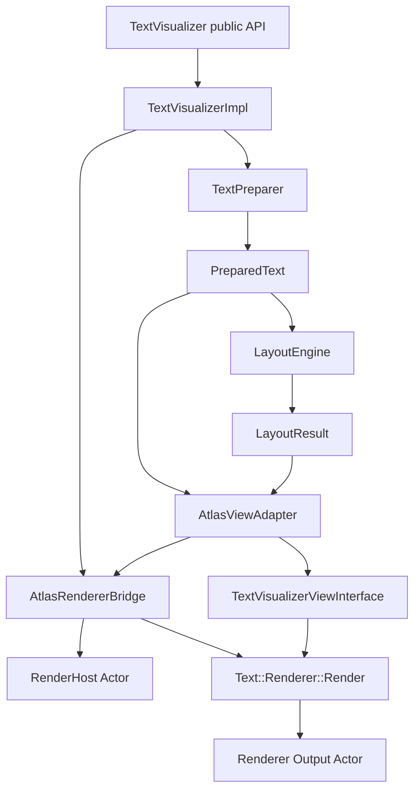
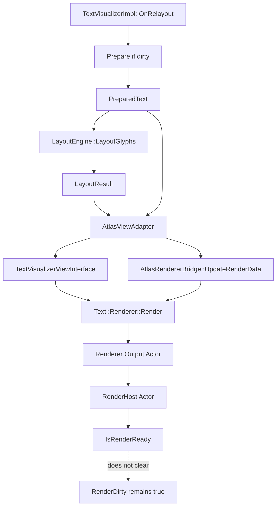

# TextVisualizer Current Status After Render-Ready

## 목적

이 문서는 `render-ready state tracking`까지 반영된 현재 `TextVisualizer` 구현 상태를 compact 이후에도 다음 작업자가 정확히 이어받을 수 있도록 정리한 인수인계 문서이다.

특히 아래를 분명히 고정한다.

- 현재 구현이 `Prepare -> Layout -> Adapter -> ViewInterface -> Bridge -> RenderHost -> Renderer::Render()`까지 어디에 도달했는지
- `IsRenderReady()`가 현재 무엇을 의미하고, 무엇을 의미하지 않는지
- 아직 `render dirty`를 clear하면 안 되는 이유
- 다음 작업 후보와 금지 사항

애매한 내용은 추측하지 않고 `확인 필요`로 표시한다.

## 1. 현재 최신 커밋 상태

최신 커밋:

- `Add TextVisualizer render-ready state tracking`
- 커밋 해시: `65c8c10`

이전 중요 커밋:

- `Add TextVisualizer renderer render-call skeleton`
- 커밋 해시: `f804f4c`
- `Adjust TextVisualizer glyph render positions`
- 커밋 해시: `5a6b74c`
- `Verify TextVisualizer text color render path`
- 커밋 해시: `c1ac606`

## 2. 전체 구현 상태 요약

현재 구현 상태를 전체 흐름으로 정리하면 다음과 같다.

단계별 현재 상태:

- `TextVisualizer public API`
  - 완료
  - handle/property/method skeleton과 기본 property가 존재한다.
- `TextVisualizerImpl`
  - 완료
  - prepare/layout/render dirty, render host lifecycle, adapter/bridge 연결을 담당한다.
- `TextPreparer`
  - 완료
  - shaping 직전이 아니라 shaping + glyph metrics까지 포함한 prepare cache 생성 경로가 구현되어 있다.
- `PreparedText`
  - 완료
  - prepare-stage 데이터와 glyph 관련 vector를 복사 저장한다.
- `LayoutEngine`
  - 완료
  - placeholder layout과 glyph advance 기반 layout이 모두 존재한다.
- `LayoutResult`
  - 완료
  - line / fragment / cluster placement / glyph placement를 저장한다.
- `AtlasViewAdapter`
  - 완료
  - `PreparedText`와 `LayoutResult`를 non-owning으로 참조하며 renderer-friendly getter를 제공한다.
- `TextVisualizerViewInterface`
  - 완료
  - `Text::ViewInterface` 최소 구현체가 존재한다.
- `AtlasRendererBridge`
  - 완료
  - renderer 생성, render data 변환, `Renderer::Render()` 호출, output actor attach, render-ready state 추적이 구현되어 있다.
- `RenderHost Actor`
  - 완료
  - `TextVisualizerImpl`이 host actor를 생성/소유한다.
- `Text::Renderer::Render()`
  - 완료
  - 실제 호출 경로가 열려 있다.
- `Renderer Output Actor`
  - 부분 완료
  - bridge가 actor를 보관하고 host에 attach할 수 있다.
  - 다만 visual correctness와 ownership 정책은 아직 확정 전이다.

## 3. Prepare 단계 현재 상태

완료된 것:

- UTF-8 -> UTF-32 변환
- line break info 생성
- paragraph info 생성
- script run 생성
- font run / fallback validation
- `ShapeText()`
- glyph mapping 생성
- `Metrics::GetGlyphMetrics()`
- `PreparedText`에 필요한 vector만 복사 저장
- `TextController / TextView / VisualModel` 전체를 소유하지 않음

현재 `PreparedText`가 보유하는 핵심 데이터:

- original text
- font family / font size
- characters
- line break info
- paragraph info
- script runs
- font runs
- glyphs
- glyph-to-character map
- characters-per-glyph
- character-to-glyph table
- glyphs-per-character table
- new paragraph glyphs

아직 미완료:

- cluster correctness
- emoji ZWJ cluster 처리
- font variation 완전 반영
- style / rich text

주의:

- 현재 `clusterCount`는 여전히 실제 cluster 수가 아니라 character count 기반 placeholder 성격이 강하다.
- `PreparedText`는 “layout-only 재계산”을 가능하게 하는 cache이지만, cluster-quality line break까지는 아직 완성되지 않았다.

## 4. Layout 단계 현재 상태

완료된 것:

- exclusion region 기반 available interval 생성
- placeholder layout 유지
- glyph advance 기반 `LayoutGlyphs()`
- `GlyphPlacement`
- `TextLineFragment.glyphStart / glyphEnd`
- `TextVisualizerImpl`이 glyph data/metrics가 있으면 `LayoutGlyphs()`, 아니면 `LayoutPlaceholder()` 사용

현재 layout 관련 핵심 구조:

- `AvailableInterval`
- `TextLineFragment`
- `TextLine`
- `ClusterPlacement`
- `GlyphPlacement`
- `LayoutResult`

현재 동작 요약:

- exclusion region과 vertical overlap이 있는 blocked interval만 line에서 제거한다.
- interval은 merge / clamp / zero-width 제거를 거친다.
- glyph layout은 glyph advance 기준으로 interval을 순회하며 line을 구성한다.
- output은 `LayoutResult.lines`, `clusterPlacements`, `glyphPlacements`에 저장된다.

아직 미완료:

- word / cluster 기반 line break 품질
- bidi visual reorder
- RTL
- zero advance / combining mark 정밀 처리
- ascender / descender 기반 line metrics

## 5. Renderer/ViewInterface 단계 현재 상태

완료된 것:

- `AtlasViewAdapter`
  - `PreparedText / LayoutResult` 비소유 참조
  - renderable glyph validation
  - glyph info / glyph placement / text buffer / glyph-to-character map accessor
  - control size / layout size / text color 보관
  - renderer glyph position adjustment 제공

- `TextVisualizerViewInterface`
  - `Text::ViewInterface` 직접 구현
  - 실제 연결한 method:
    - `GetNumberOfGlyphs()`
    - `GetGlyphs()`
    - `GetControlSize()`
    - `GetLayoutSize()`
    - `GetTextColor()`
    - `GetTextBuffer()`
    - `GetGlyphsToCharacters()`
  - no-op / empty 처리한 method:
    - colors / color indices
    - background colors
    - underline / shadow / outline
    - hyphen
    - ellipsis
    - strikethrough
    - bounded paragraph runs
    - character spacing
    - cutout

- `AtlasRendererBridge`
  - `Text::AtlasRenderer::New()`
  - `UpdateRenderData()`
  - `Renderer::Render()` 호출
  - renderer output actor 보관
  - output actor를 `RenderHost Actor`에 attach
  - `Detach / Clear / Reset` 상태 정리

현재 renderer 경로 의미:

- `TextVisualizer`는 더 이상 “renderer 생성 가능 여부” 수준이 아니라 실제 `Render()` 호출과 output actor attach skeleton까지 도달했다.
- 하지만 이 상태를 아직 “draw correctness 완료”로 보면 안 된다.

## 6. glyph render position adjustment 현재 정책

현재 glyph 위치 정책은 다음과 같다.

- `LayoutResult`는 layout 좌표를 유지한다.
- renderer-specific 보정은 `AtlasViewAdapter / TextVisualizerViewInterface` 경계에서 수행한다.
- 현재 보정식:
  - `x = placement.x + glyph.xBearing`
  - `baselineOffset = 같은 line의 glyph들 중 max(yBearing)`
  - `y = placement.y + baselineOffset - glyph.yBearing`
- 이 보정은 임시 규칙이다.
- ascender / descender 기반 line metrics가 들어오면 조정될 수 있다.
- `minLineOffset`은 아직 `0.0f` 유지다.

현재 해석:

- `LayoutEngine::LayoutGlyphs()`는 pen/line-top 성격의 좌표를 만든다.
- `AtlasRenderer`는 glyph quad origin에 가까운 좌표를 기대하므로, renderer 직전 경계에서 bearing을 반영한다.
- 이 설계는 `LayoutResult`를 renderer-specific 좌표로 오염시키지 않기 위한 선택이다.

## 7. textColor render path 현재 정책

현재 정책은 다음과 같다.

- `AtlasRenderer`는 `GetColors()`, `GetColorIndices()`, `GetTextColor()`를 읽는다.
- `GetColors() / GetColorIndices()`가 `nullptr`이면 `defaultColor` path를 사용한다.
- `defaultColor`는 `GetTextColor()` 반환값이다.
- `TextVisualizer` 1차 구현은 per-glyph color를 지원하지 않는다.
- `GetColors() / GetColorIndices()`는 `nullptr` 유지한다.
- `GetTextColor()`만 `TEXT_COLOR`를 전달한다.
- `SyncRenderStateToAdapter()`가 layout dirty 여부와 무관하게 render 직전 `controlSize / textColor`를 adapter에 반영한다.

현재 의미:

- `TEXT_COLOR` 변경은 prepare/layout을 다시 하지 않아도 된다.
- 색만 바뀐 경우에도 다음 render path에서 최신 색을 보게 된다.
- 다만 실제 shader 반영 correctness는 아직 manual/sample 검증 전이다.

## 8. render-ready state 현재 정책

현재 bridge에 추가된 API:

- `HasRendererOutput()`
- `IsRenderReady()`

`IsRenderReady()` 조건:

- `IsRendererCreated()`
- `HasRenderHost()`
- `HasRendererOutput()`
- `IsRendererAttached()`
- `HasViewInterfaceAdapter()`
- `HasRenderableGlyphs()`

`IsRenderReady()`의 의미:

- renderer 생성, view adapter 연결, host 보관, output actor 보관, attach 상태가 bridge 내부에서 일관적이라는 뜻이다.

`IsRenderReady()`가 의미하지 않는 것:

- geometry correctness 완료
- baseline / bearing / offset 검증 완료
- 화면 품질 보장
- `render dirty` clear 가능

즉, `IsRenderReady()`는 “bridge 내부 상태가 논리적으로 준비되었는가”를 말할 뿐, “지금 픽셀이 올바르게 보인다”를 뜻하지 않는다.

## 9. render dirty 현재 정책

현재 정책은 매우 명확하다.

- `render dirty`는 아직 clear하지 않는다.

이유:

- geometry correctness가 아직 완전히 검증되지 않음
- baseline / bearing / offset이 임시 규칙
- textColor shader 반영은 manual/sample 검증 전
- `animatablePropertyIndex / alignmentOffset / depth` 의미 미정
- 실제 화면 품질 검증 전

중요한 금지 사항:

- 다음 작업에서도 `IsRenderReady()`만으로 `render dirty`를 clear하면 안 된다.

## 10. 현재 UTC 상태

현재 테스트 상태:

- `tct-dali-ui-foundation-core -s -m TextVisualizer` 통과
- `gcov timestamp warning`은 실패 아님

현재 검증 범위:

- public handle / property
- prepare data
- line break / script / font / shaping / glyph metrics
- interval builder
- placeholder layout
- glyph advance layout
- adapter / ViewInterface
- `Render()` call skeleton
- render host
- render-ready state

아직 없는 검증:

- 실제 pixel output
- visual correctness
- sample app visual verification
- exclusion region이 실제 화면에서 비워지는지

## 11. 다음 작업 후보

다음 후보를 비교하면 아래와 같다.

### A. Minimal sample app 추가

목적:

- 실제 화면에 `TextVisualizer`가 보이는지 확인
- `textColor`가 보이는지 확인
- exclusion region이 시각적으로 비워지는지 확인

장점:

- 지금까지의 render path가 실제로 의미 있는지 빠르게 검증 가능

단점:

- sample은 automated correctness를 보장하지 않음

### B. Line metrics / baseline 보강

목적:

- `max(yBearing)` 임시 `baselineOffset`을 ascender / descender 기반으로 개선

장점:

- render correctness에 직접 기여

단점:

- 기존 text metrics 구조를 더 깊게 조사해야 함

### C. render dirty clear 조건 실험

목적:

- `IsRenderReady()` 이후 `render dirty`를 clear할 수 있는지 검토

현재 권장:

- 아직 하지 말 것
- sample / manual 검증 전에는 보류

현재 권장 방향:

- 다음 커밋은 sample app을 작게 추가해서 실제 visual path를 확인하는 것이 좋다.
- 단, sample은 별도 커밋으로 작게 진행한다.
- `render dirty clear`는 sample/manual 확인 이후로 미룬다.

## 추가 확인: visual verification sample

- sample 파일:
  - `samples/text/text-visualizer-example.cpp`
- sample 목적:
  - 실제 화면에 `TextVisualizer`가 보이는지 수동 확인
  - `TEXT_COLOR`가 defaultColor path로 반영되는지 수동 확인
  - exclusion region이 시각적으로 비워지는지 수동 확인
  - repeated relayout에서 crash가 없는지 수동 확인
- 수동 확인 항목:
  - 기본 텍스트 표시 여부
  - 키 입력에 따른 text color 변경 여부
  - 오른쪽 패널의 exclusion overlay 위치와 실제 text 회피 여부
  - exclusion on/off 및 이동 반복 시 crash 여부
- 아직 없는 것:
  - pixel automated test
  - sample 기반 visual correctness 자동 검증

## 추가 확인: measure / relayout visibility diagnosis

- 텍스트가 보이지 않을 때는 renderer 경로만이 아니라 `measure / relayout / host size`도 함께 확인해야 한다.
- `TextVisualizer`가 `0 x 0`으로 측정되거나 `OnRelayout()`의 `size.x`가 `0`이면 `LayoutGlyphs()` 결과가 empty가 되어 renderable glyph가 사라질 수 있다.
- 현재 보강 정책:
  - sample에서는 `TextVisualizer`에 explicit requested size를 준다.
  - `TextVisualizerImpl`은 `RenderHost Actor`에 explicit size sync를 적용한다.
- `RenderHost`는 `ResizePolicy::FILL_TO_PARENT`를 유지하되, relayout 시점에 control size를 한 번 더 명시적으로 맞춘다.
- `OnRelayout()` base call 순서는 이번 커밋에서 바꾸지 않는다.
  - 확인 결과 `Label / InputField`는 `ViewImpl::OnRelayout()`를 명시적으로 호출하지 않는다.
  - `TextVisualizer`는 현재 padding/margin 기반 child arrange에 의존하지 않으므로, 우선 size sync만 보강하고 base call 순서는 유지한다.

## 추가 확인: atlas output visibility diagnosis

- 현재 sample 관찰 기준:
  - `TextVisualizer` text area background는 보인다.
  - exclusion overlay와 relayout 반응도 보인다.
  - 하지만 glyph text는 여전히 보이지 않는다.
- 따라서 현재 의심 지점은 `measure/layout` 자체보다 `AtlasRenderer output actor visibility` 쪽이 더 크다.

현재 조사 결과:

- `Text::AtlasRenderer::Render()`는 최종적으로 `mActor`를 반환한다.
- 이 `mActor`는 text mesh를 직접 가진 actor가 아니라, mesh renderer를 가진 child actor들을 담는 container actor다.
- 즉 output actor 자체의 `GetRendererCount()`는 `0`일 수 있고, 실제 draw content는 child actor들에 있을 수 있다.
- `CommonTextUtils::RenderText()`를 보면 stencil이 없는 경우에도 renderable actor를 text control에 직접 붙이는 경로가 존재한다.
  - 따라서 “stencil이 없어서 절대 안 보인다”는 결론은 현재 코드만으로는 확정할 수 없다.
- `InputField`는 clipping/cursor/decoration 때문에 stencil actor를 쓰지만, 이는 곧바로 glyph visibility의 필수 조건이라고 단정할 수는 없다.

비교 요약:

| 항목 | Label/InputField/TextView 기존 path | TextVisualizer 현재 path | 차이/위험 |
|---|---|---|---|
| `Renderer::Render()` 입력 actor | 기존 text control self | `RenderHost Actor` | 현재 `animatablePropertyIndex`가 `INVALID_INDEX`라 즉시 치명적이라고 단정할 수는 없지만, 후속 확인 필요 |
| output actor 구조 | container actor + child mesh actors | 동일한 `AtlasRenderer` output actor | output actor 자체에 renderer가 없어도 이상 아님 |
| stencil/clipping | `InputField`는 stencil 사용, `CommonTextUtils`는 stencil 없는 direct attach 경로도 보유 | 현재 stencil 없음 | stencil 필수 여부는 아직 미확정 |
| attach 위치 | text control 또는 stencil actor | `RenderHost Actor` | attach 자체는 가능, 실제 draw 여부는 별도 검증 필요 |
| size sync | control/stencil size를 기존 path가 맞춤 | `RenderHost` explicit size sync 추가 | host size는 보강됐지만 output actor draw 보장은 아님 |

현재 진단 helper:

- `HasRendererOutput()`
- `IsRendererOutputParentedToHost()`
- `GetRendererOutputChildCount()`
- `GetRendererOutputRendererCount()`
- `GetRendererOutputSize()`
- `GetRenderHostSize()`
- `IsRendererOutputVisible()`

현재 판단:

- `TextVisualizer`는 이미 output actor를 host에 붙일 수 있다.
- 하지만 그 actor가 실제로 보이는지, child mesh actor들이 정상 geometry/atlas/shader 상태인지까지는 아직 확인되지 않았다.
- 다음 조사 포인트는:
  - `Render()`에 넘기는 actor를 `RenderHost`로 유지하는 것이 맞는지
  - output actor child mesh가 실제로 생성되는지
  - sample에서 fallback `Label`은 보이는데 `TextVisualizer`만 안 보이는지

## 추가 확인: stencil requirement verification

이번 단계에서는 “`TextVisualizer`에 stencil이 없어서 glyph가 안 보인다”는 가정을 기존 구현 기준으로 다시 검증했다.

핵심 결론부터 적으면 다음과 같다.

- 결론: **B. stencil은 현재 코드 근거만으로 필수라고 볼 수 없고, 더 가능성이 큰 문제는 output child mesh 생성 또는 `ViewInterface`/`Render()` 입력 mismatch 쪽이다.**

근거는 아래와 같다.

### 1. `CommonTextUtils::RenderText()`는 stencil 없는 direct attach 경로를 실제로 가진다

`CommonTextUtils::RenderText()`를 보면 `stencil` actor를 인자로 받지만, `stencil == nullptr`인 경우에도 별도 direct attach 경로가 존재한다.

- `stencil`이 있으면:
  - `self = stencil`
  - `renderableActor`를 stencil 아래에 붙인다.
- `stencil`이 없으면:
  - `self = textActor`
  - `IntegrationView::AddActorChild(Ui::View::DownCast(self), child)`로 text control에 직접 붙인다.

즉 기존 공용 text rendering helper 자체는 “stencil이 없으면 glyph visibility가 불가능하다”는 전제를 갖고 있지 않다.

아래는 현재 코드 의미를 정리한 표다.

| 조건 | parent actor | renderable actor attach 위치 | stencil 사용 여부 | 실제 glyph visibility 전제 |
|---|---|---|---|---|
| `stencil != nullptr` | stencil actor | stencil actor 아래 | 사용 | clipping/scroll/decorator 합성이 필요한 경우 |
| `stencil == nullptr` | text control actor | text control 아래 direct attach | 미사용 | direct renderable actor path가 유효하다는 전제 |

### 2. `AtlasRenderer` 자체는 stencil을 전혀 알지 못한다

`Text::AtlasRenderer::Render()`와 `AddGlyphs()`를 보면 stencil/clipping/render task를 직접 다루지 않는다.

- `Render()`는:
  - `view.GetNumberOfGlyphs()`
  - `view.GetGlyphs()`
  - `view.GetTextColor()` 등에서 데이터만 읽는다.
  - 이후 `AddGlyphs()`로 mesh를 만들고 output actor를 반환한다.
- `CreateActors()` / `CreateMeshActor()`는:
  - container actor `mActor`
  - child mesh actor들
  - geometry / renderer / shader / texture
  만 생성한다.
- stencil actor, clipping actor, render task 생성 코드는 없다.

즉 `AtlasRenderer`는 “어떤 parent 아래에 attach될지”는 외부가 결정하지만, 자체적으로 stencil을 요구하는 구조는 아니다.

### 3. `InputField`의 stencil 사용은 glyph visibility 자체보다 clipping/composition 요구와 더 강하게 연결돼 있다

`InputFieldImpl`은 `EnableClipping()`에서 stencil actor를 만들고:

- `CLIP_TO_BOUNDING_BOX`
- `FILL_TO_PARENT`
- cursor layer / decoration / selection / scroll offset

과 함께 사용한다.

`OnRelayout()`에서도 stencil과 cursor layer size/position을 별도로 맞춘다.

즉 `InputField`의 stencil 사용 이유는:

- scrolling text
- cursor clipping
- selection / highlight / decoration composition

같은 input-specific 요구가 강하다. 이것만으로 “glyph text 자체가 stencil 없이는 절대 보이지 않는다”고 결론내리기는 어렵다.

### 4. `Label`은 현재 direct `AtlasRenderer` + stencil 경로의 기준 사례가 아니다

현재 `LabelImpl`은 `TextVisual` 기반 path를 사용한다.

- visual 생성 / 등록
- async renderer update
- cutout / mask effect

등이 얽혀 있고, `InputField`처럼 `CommonTextUtils::RenderText()` + direct `Text::Renderer` 경로를 기준 사례로 삼기 어렵다.

즉 `Label`은 “stencil이 있어야 atlas glyph가 보인다”는 주장을 뒷받침하는 직접 비교군이 아니다.

### 5. 현재 `TextVisualizer`와 기존 path 비교

| 항목 | 기존 Label/InputField/TextView | TextVisualizer 현재 | 차이 | 위험도 |
|---|---|---|---|---|
| `textControl` actor | 기존 text control self를 주는 경향이 강함 (`InputField`, `CommonTextUtils`) | `RenderHost Actor`를 `Render()`에 전달 | control self가 아님 | 높음 |
| stencil actor | `InputField`는 사용, `CommonTextUtils`는 optional | 없음 | stencil direct path 사용 중 | 중간 |
| renderable actor parent | stencil 또는 text control | `RenderHost Actor` | parent가 별도 host | 중간 |
| clipping mode | `InputField`는 stencil clipping | host 자체는 별도 stencil 없음 | clipping setup 단순 | 낮음~중간 |
| render task | 명시적 text-only render task는 현재 조사 범위에서 없음 | 없음 | 큰 차이 미확정 | 낮음 |
| output actor size | renderer/container actor가 `view.GetLayoutSize()` 기반 size를 가짐 | host size sync는 있음, output size는 renderer 내부 | 직접 mismatch 여부 미확정 | 중간 |
| child mesh actor 생성 | `AtlasRenderer` 내부 child mesh actor 생성 | 동일 renderer 사용 | child mesh 생성 여부 runtime 확인 필요 | 높음 |
| parent origin/pivot | `TOP_LEFT` 정렬 | host/output 모두 `TOP_LEFT` 지향 | 큰 차이 없음 | 낮음 |
| depth/z-order | renderer depth index 사용 | 동일 renderer 사용 | 값 자체는 후속 검토 필요 | 낮음~중간 |
| actor color/opacity | renderer child actor가 `USE_OWN_MULTIPLY_PARENT_COLOR` | 동일 | 큰 차이 없음 | 낮음 |
| renderer count | output actor는 0일 수 있고 child mesh actor가 renderer를 가질 수 있음 | 동일 | output actor만 보고 판단하면 오진 가능 | 높음 |

### 6. direct attach path의 실제 의미

이번 조사 기준으로 direct attach path는 “legacy/no-op fallback”이 아니라, 현재 공용 text helper 안에 실제로 남아 있는 정상 경로다.

다만 이것이 자동으로 현재 `TextVisualizer`에서도 잘 보인다는 뜻은 아니다.

현재 더 유력한 문제 후보는 다음이다.

1. `Render()`에 넘기는 `textControl` actor가 `RenderHost`인 점
2. `ViewInterface`가 제공하는 glyph/layout/control data가 기존 path 기대와 미세하게 어긋나는 점
3. output actor는 붙었지만 child mesh actor가 실제로 생성되지 않거나 renderer count가 0인 점
4. glyph atlas upload / mesh generation 조건이 runtime에서 충족되지 않는 점

### 7. 최종 결론

결론은 다음과 같다.

- **B. stencil은 필요 없고, 문제는 output child mesh 생성 또는 `ViewInterface` data mismatch다.**

이 결론을 택한 이유:

- `CommonTextUtils`에 stencil 없는 direct attach path가 실제로 존재한다.
- `AtlasRenderer` 자체는 stencil을 모른다.
- `InputField`의 stencil은 input/decorator/clipping 요구와 강하게 결합돼 있다.
- 따라서 현재 `TextVisualizer` 미표시 문제를 stencil 부재 하나로 단정하는 것은 코드 근거상 과도하다.

### 8. 다음 커밋 계획

다음 권장 커밋:

- `Commit 26: Trace TextVisualizer AtlasRenderer glyph mesh generation`

포함할 내용:

- `Render()` 직후 output actor child count / child renderer count를 더 강하게 확인
- `ViewInterface::GetGlyphs()` return count와 `Render()` 입력 glyph count 비교
- `Render()`에 넘기는 actor를 `RenderHost` 대신 `Self()`로 바꿔 보는 제한적 실험 여부 검토
- output child mesh actor의 renderer/size/visibility/runtime parent 상태 확인
- atlas glyph upload가 실제로 일어나는지 간접 확인

주의:

- 다음 커밋에서도 `render dirty`는 clear하지 않는다.
- `text-atlas-renderer.*`, `TextController`, `TextView` 수정은 계속 금지다.

## 추가 확인: atlas glyph mesh generation trace

이번 단계에서는 “stencil이 꼭 필요한가”에서 한 단계 더 나아가, 실제 `Render()` 호출 중 glyph mesh 경로가 열리는지 직접 추적하는 방향으로 진단 기준을 잡는다.

추적 포인트는 다음과 같다.

- `TextVisualizerViewInterface::GetGlyphs()` 호출 횟수
- `GetGlyphs()`에 요청된 glyph count
- `GetGlyphs()`가 실제로 반환한 glyph count
- `Renderer Output Actor`의 direct child count
- `Renderer Output Actor` 아래 descendant actor 수
- `Renderer Output Actor` 아래 total renderer count
- 첫 child actor의 size / visible 상태
- `Render()`에 넘기는 `textControl` actor를 `RenderHost` 대신 `TextVisualizer self`로 분리해 볼 때 차이가 있는지

현재 실험 정책:

- output attach parent는 계속 `RenderHost Actor`로 유지한다.
- `Render()`에 넘기는 `textControl` actor는 internal-only로 분리 가능하게 두고, 우선 `TextVisualizer self`를 전달해 본다.
- 이 변경은 public API를 늘리지 않고, 기존 `CommonTextUtils`/`InputField` path가 “text control self”를 기준으로 동작하는 점과 맞춰 보기 위한 진단 실험이다.

판단 기준은 다음과 같다.

- `GetGlyphs()` 호출 0회
  - `Render()`가 glyph path에 실제로 들어가지 못한 것이다.
  - `ViewInterface` 상태 또는 `Render()` 호출 조건 문제 가능성이 크다.
- `GetGlyphs()` 반환 count > 0, descendant renderer count = 0
  - `AtlasRenderer::AddGlyphs()` 또는 mesh creation 조건 문제 가능성이 크다.
  - `ViewInterface` data mismatch 가능성도 높다.
- descendant renderer count > 0, 여전히 화면에 안 보임
  - actor visibility / z-order / shader / texture / atlas upload 쪽 문제로 범위를 더 좁힐 수 있다.
- `textControl self` 사용으로 증상이 달라짐
  - `Render()` 입력 actor mismatch가 원인 후보가 된다.

이번 추적에서 여전히 확인이 필요한 항목:

- `AtlasRenderer::AddGlyphs()` 내부 mesh creation skip 조건
- glyph atlas texture upload 성공 여부
- output actor child renderer count가 0인 경우의 정확한 runtime 원인
- 장기적으로 `textControl` actor를 self로 넘기는 것이 맞는지
- output attach parent를 계속 `RenderHost`로 둘지, self로 옮겨야 하는지
- `render dirty` clear 시점

## 추가 확인: RenderHost vs stencil actor

이번 단계에서는 `TextVisualizerImpl`의 `mRenderHost`가 이미 “중간 attach host / stencil-like actor” 역할을 하고 있다는 가정 아래, 기존 `InputField` stencil actor와 설정 차이를 다시 비교했다.

핵심 결론은 다음과 같다.

- `mRenderHost`는 이미 별도 output actor attach parent 역할을 수행하고 있다.
- 따라서 지금 단계에서 `StencilHost` actor를 하나 더 추가하는 것은 중복 계층만 늘릴 가능성이 크다.
- 기존 stencil actor와 비교했을 때 안전하게 빠져 있던 설정은 주로 `CLIPPING_MODE`였다.
- 그래서 별도 actor 추가 대신, `mRenderHost` 자체를 stencil-like host에 더 가깝게 맞추는 최소 보강만 적용했다.

비교 요약은 아래와 같다.

| 항목 | 기존 stencil actor | TextVisualizer `mRenderHost` | 차이 | 조치 |
|---|---|---|---|---|
| `ParentOrigin` | `TOP_LEFT` | `TOP_LEFT` | 없음 | 유지 |
| `Pivot` | `TOP_LEFT` | `TOP_LEFT` | 없음 | 유지 |
| `ResizePolicy` | `FILL_TO_PARENT` | `FILL_TO_PARENT` | 없음 | 유지 |
| explicit size sync | relayout에서 별도 size sync 사용 | `SyncRenderHostSize()` 사용 | 의미상 유사 | 유지 |
| attach parent | control self 아래 | control self 아래 | 없음 | 유지 |
| `CLIPPING_MODE` | `CLIP_TO_BOUNDING_BOX` | 이전에는 없음 | 차이 있음 | `mRenderHost`에 추가 |
| explicit position | 보통 `TOP_LEFT` 기준 | 이전에는 암묵적 | 약한 차이 | `POSITION = ZERO` 명시 |
| visible | 기본값 의존 가능 | 기본값 의존 가능 | 약한 차이 | `VISIBLE = true` 명시 |

현재 적용한 최소 보강:

- `mRenderHost.SetProperty(Actor::Property::CLIPPING_MODE, ClippingMode::CLIP_TO_BOUNDING_BOX);`
- `mRenderHost.SetProperty(Actor::Property::POSITION, Vector3::ZERO);`
- `mRenderHost.SetProperty(Actor::Property::VISIBLE, true);`

이번 단계에서 별도 `StencilHost`를 만들지 않은 이유:

- `mRenderHost`가 이미 output actor attach parent 역할을 하고 있다.
- 추가 actor를 하나 더 만드는 것만으로는 `GetGlyphs()` 호출 여부, output child mesh 생성 여부, renderer descendant count 같은 핵심 진단 지점이 바뀌지 않는다.
- 지금 더 유력한 문제 후보는:
  - `Render()` 입력 actor mismatch
  - output child mesh / renderer 생성 조건
  - atlas / shader / visibility 문제
  이다.

따라서 현재 방향은:

- host 계층을 더 늘리지 않는다.
- `mRenderHost`를 기존 stencil actor에 최대한 가깝게 맞춘다.
- 그 위에서 existing diagnostics:
  - `GetGlyphs()` call / returned count
  - output child count
  - descendant renderer count
  를 계속 본다.

아직 남은 문제 후보:

- `Render()`에 `Self()`를 넘기는 정책이 장기적으로 맞는지
- output child mesh actor가 실제로 생성되는지
- descendant renderer count가 0인 runtime 원인
- clipping 추가 후에도 glyph가 계속 안 보이면 atlas/shader/mesh generation 쪽으로 더 좁혀야 하는지

## 12. 다음 커밋 금지 사항

- 기존 `TextController` 수정 금지
- 기존 `TextView` 수정 금지
- 기존 `internal/text/layouts/layout-engine.*` 수정 금지
- editing / selection / cursor / decorator / IME 경로 수정 금지
- public API 추가 금지
- `text-atlas-renderer.*` 수정 금지
- `render dirty` clear 금지
- 대규모 refactor 금지

## 13. mermaid 구조도

