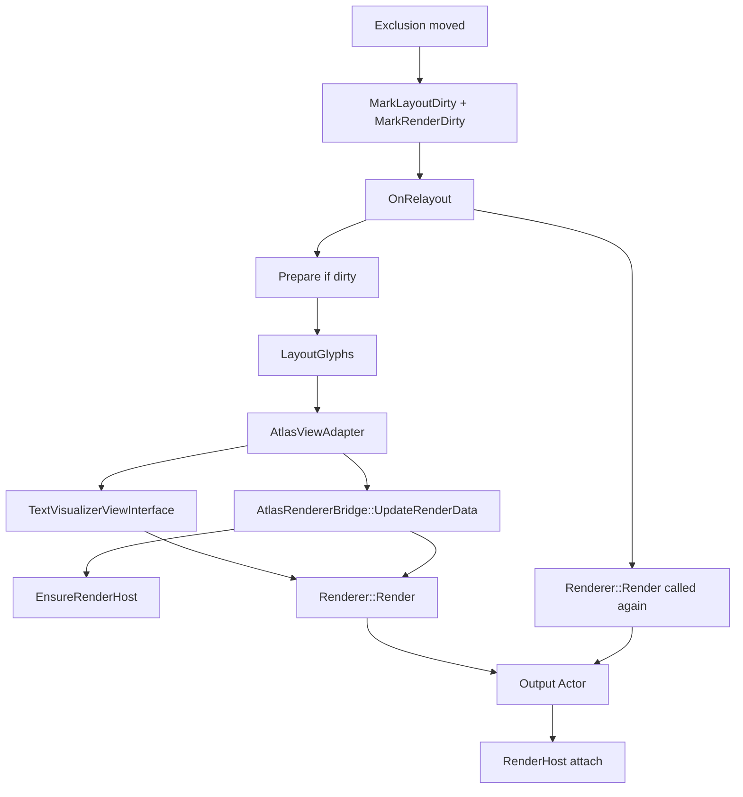

# TextVisualizer Working Render Pipeline Status

## 목적

이 문서는 `TextVisualizer`가 실제로 화면에 보이고, exclusion region 이동 후에도 glyph가 다시 배치되는 현재 성공 상태를 고정하기 위한 인수인계 문서이다.

이제 초점은 “보이게 만들기”가 아니라 다음 단계의 품질 개선이다.

특히 아래를 분명히 남긴다.

- 현재 render pipeline이 실제로 동작한다는 점
- 어떤 문제가 핵심 원인이었고 어떻게 해결됐는지
- 현재 actor hierarchy와 bridge 정책
- 이후 작업은 품질 개선과 정리 단계라는 점

## 1. 현재 최신 커밋 상태

최근 중요 커밋:

- `66f3761` `Diagnose TextVisualizer measure and relayout visibility`
- `898e717` `Compare TextVisualizer render host with stencil actor`
- `c9241c4` `Trace TextVisualizer atlas glyph mesh generation`
- `ec1ff34` `Re-render TextVisualizer atlas output on layout changes`

최신 동작 상태:

- sample에서 `TextVisualizer` glyph text가 실제로 보인다.
- 최초 layout에서 exclusion region을 피해 배치된다.
- exclusion region 이동 후에도 glyph가 새 region을 피해 재배치된다.
- fallback `Label`도 비교용으로 유지된다.

## 2. 현재 동작 성공 상태

완료:

- `TextVisualizer` 영역 background 표시
- glyph text 표시
- `TEXT_COLOR` defaultColor path 반영
- exclusion region 기반 glyph layout
- exclusion region 이동 시 relayout
- relayout 후 `AtlasRenderer` 재-render
- output actor duplicate attach 방지
- fallback `Label`과 비교 가능
- sample build 성공
- `TextVisualizer` UTC 통과

미완료:

- pixel automated test
- visual correctness 자동 검증
- word/cluster 기반 line break
- bidi visual reorder
- precise line metrics
- `render dirty` clear
- performance optimization
- diagnostics cleanup
- public API 정리

## 3. 핵심 문제 원인과 해결

문제:

- 최초 render 이후 `mRendererAttached == true`이면 `AttachRendererToHost()`가 early return했다.
- 그래서 exclusion region 변경으로 `LayoutResult`는 갱신되어도 `Renderer::Render()`가 다시 호출되지 않았다.
- 결과적으로 output mesh는 이전 glyph placement를 유지했다.
- sample에서는 높이/영역은 바뀌는 듯 보였지만 glyph 재배치는 되지 않았다.

추가로 확인된 선행 원인:

- `TextVisualizer`는 `Ui::View` 계열 size negotiation 경로를 타므로, standalone child로 쓸 때 `OnRelayout()`에 도달하려면 자기 자신이 parent 크기를 실제로 받는 상태여야 했다.
- `OnInitialize()`에서 `FILL_TO_PARENT` resize policy를 설정하지 않았을 때 relayout/size update가 기대와 다르게 동작할 수 있었다.
- 이 보강 이후 glyph가 실제로 보이기 시작했고, 그 다음 단계에서 “최초 render 후 재-render 안 됨” 문제가 분리되어 확인됐다.

해결:

- `mRendererAttached == true`여도 `Renderer::Render()`를 다시 호출하도록 변경했다.
- output actor attach는 parent가 없을 때만 수행한다.
- 이미 host에 attach되어 있으면 중복 add하지 않는다.
- 새 output actor가 이전 actor와 다르면 이전 actor를 안전하게 detach하고 교체한다.
- `GetRenderCallCount()` / `GetAttachCallCount()` diagnostics를 추가했다.
- size change 시 `MarkLayoutDirty()`뿐 아니라 `MarkRenderDirty()`도 호출하도록 했다.

## 4. 현재 render pipeline 구조

현재 기준 실제 흐름은 다음과 같다.



요약:

- `TextVisualizerImpl::OnRelayout()`
  - prepare dirty면 `Prepare()`
  - layout dirty면 `LayoutGlyphs()`
  - adapter/view interface/bridge 상태 갱신
  - `UpdateRenderData()`
  - `EnsureRenderHost()`
  - `Renderer::Render()`
  - output actor attach 또는 재사용

## 5. current actor hierarchy

현재 actor 구조는 다음과 같다.

```text
TextVisualizer
  └── mRenderHost
        └── AtlasRenderer output actor
              └── mesh child actors
```

추가 설명:

- 별도 `StencilHost`는 추가하지 않았다.
- `mRenderHost`가 stencil-like attach host 역할을 한다.
- `mRenderHost`에는 아래가 적용되어 있다.
  - `TOP_LEFT` origin/pivot
  - `FILL_TO_PARENT`
  - explicit size sync
  - `CLIP_TO_BOUNDING_BOX`
  - `VISIBLE = true`
- 기존 `InputField` stencil actor와 비교했을 때 핵심 attach/clipping host 역할은 `mRenderHost`가 담당한다.

## 6. current renderer bridge policy

`AtlasRendererBridge` 정책은 다음과 같다.

- `UpdateRenderData()`
  - adapter glyph placements를 temporary render data로 변환한다.

- `AttachRendererToHost()`
  - 이름은 attach지만 현재는 render update도 함께 수행한다.
  - attached 상태여도 `Renderer::Render()`를 호출한다.
  - output actor attach는 필요한 경우에만 한다.

- `GetRenderCallCount()`
  - `Render()` 호출 횟수다.

- `GetAttachCallCount()`
  - 실제 `Add(output)` 횟수다.

- `IsRenderReady()`
  - bridge 내부 상태 일관성만 의미한다.
  - `render dirty` clear 가능을 의미하지 않는다.

중요:

- 추후 이름을 `RenderAndAttachToHost()`나 `UpdateRendererOutput()`처럼 바꾸는 것도 검토 가능하다.
- 현재는 API churn을 줄이기 위해 기존 이름을 유지했다.

## 7. current ViewInterface policy

`TextVisualizerViewInterface` 실제 연결:

- `GetNumberOfGlyphs()`
- `GetGlyphs()`
- `GetControlSize()`
- `GetLayoutSize()`
- `GetTextColor()`
- `GetTextBuffer()`
- `GetGlyphsToCharacters()`

no-op / empty:

- color indices / per-glyph color
- background
- underline / shadow / outline
- hyphen
- ellipsis
- strikethrough
- bounded paragraph
- cutout

glyph position:

- `LayoutResult`는 layout 좌표를 유지한다.
- renderer 직전 `adapter / view interface`에서 position adjustment를 적용한다.
- 현재 보정:
  - `x = placement.x + glyph.xBearing`
  - `baselineOffset = same line max(yBearing)`
  - `y = placement.y + baselineOffset - glyph.yBearing`
- 아직 임시 규칙이며 line metrics 보강이 필요하다.

## 8. current layout policy

`LayoutEngine` 정책:

- exclusion region을 line band와 교차 검사
- blocked interval 생성
- merge / clamp / zero-width 제거
- available interval에 glyph advance 기반 배치
- line 안에 여러 fragment 가능
- moving exclusion region은 `SetExclusionRegions()`로 layout/render dirty를 발생시킨다

제한:

- word break 품질 부족
- cluster 단위 line break 미완성
- zero advance / combining mark 정교 처리 부족
- bidi/RTL 미지원
- hyphenation/ellipsis 제외

## 9. current sample state

sample:

- 파일: `samples/text/text-visualizer-example.cpp`
- target: `text-visualizer.example`

수동 확인된 내용:

- glyph text가 보임
- baseline panel 정상 표시
- exclusion panel에서 exclusion box 영역을 피해서 배치됨
- key `3`으로 exclusion box 이동 시 glyph가 새 위치 기준으로 재배치됨
- fallback `Label` toggle 가능
- text area background로 layout 영역 확인 가능

sample에서 아직 확인할 것:

- color change 정확성
- long text clipping
- repeated movement stability
- different font sizes
- emoji fallback visual quality
- window resize behavior

## 10. 현재 금지 사항 / 유지할 원칙

다음은 계속 유지한다.

- 기존 `TextController` 수정 금지
- 기존 `TextView` 수정 금지
- existing `Label`/`InputField` 수정 금지
- `text-atlas-renderer.*` 수정 금지
- `internal/text/layouts/layout-engine.*` 수정 금지
- editing/selection/cursor/decorator/IME 경로 수정 금지
- public API 추가는 신중히
- `render dirty clear`는 아직 보류
- 대규모 refactor 금지

## 11. 다음 품질 개선 후보

우선순위와 함께 정리하면 다음과 같다.

### A. diagnostics/log cleanup

- 현재 `DALI_LOG_ERROR`, diagnostic counters가 많다.
- sample 성공이 확인됐으므로 debug log를 정리하거나 debug level / compile-time flag로 낮출 필요가 있다.
- 우선순위: 높음

### B. API/name cleanup

- `AttachRendererToHost()`가 render update까지 수행하므로 이름이 부정확하다.
- `RenderAndAttachToHost()` 또는 `UpdateRendererOutput()` 등 검토 가능하다.
- 우선순위: 중간

### C. line metrics / baseline quality

- `max(yBearing)` 기반 `baselineOffset`은 임시 규칙이다.
- ascender/descender/font metrics 기반으로 개선이 필요하다.
- 우선순위: 높음

### D. word/cluster line break quality

- 현재 glyph advance 순차 배치다.
- break candidate를 사용해 word/cluster 단위 줄바꿈 개선이 필요하다.
- 우선순위: 높음

### E. render dirty clear

- 이제 보이기는 하지만 geometry correctness와 update policy가 더 안정화된 뒤 검토해야 한다.
- 우선순위: 중간

### F. performance

- `Render()`를 relayout마다 호출하는 비용
- exclusion 이동 시 update 비용
- prepared data reuse는 됐지만 mesh regeneration 최적화는 아직 남아 있다.
- 우선순위: 중간

### G. tests

- exclusion move after initial render를 더 명시적으로 검증
- layout result 변화 검증
- render call count 증가 검증
- 우선순위: 높음

## 12. 다음 권장 작업

현재 권장 다음 커밋:

- `Clean up TextVisualizer temporary diagnostics`

이유:

- 동작이 확인됐으므로 `DALI_LOG_ERROR`와 과도한 diagnostics를 정리할 타이밍이다.
- 필요한 diagnostics는 유지하되 error log 대신 debug log나 compile-time condition으로 낮추는 편이 안전하다.
- 그 다음 baseline/line-break 품질 개선으로 넘어가는 흐름이 가장 자연스럽다.

## 추가 확인: performance demo sample

성능/안정성 관찰용 sample이 추가되었다.

- 파일: `samples/text/text-visualizer-performance-example.cpp`
- target: `text-visualizer-performance.example`

목적:

- 1920 x 1080 큰 화면 기준으로 긴 텍스트와 여러 moving bounds를 동시에 표시한다.
- `TextVisualizer`가 moving exclusion region에 따라 계속 relayout/re-render 되는 상황을 수동으로 관찰한다.
- rough FPS, frame count, bounds count, update count, text length 같은 관찰용 상태를 화면에 표시한다.

조작 키:

- `Space`: animation pause/resume
- `1 / 2`: bound count 줄이기 / 늘리기
- `3 / 4`: font size 줄이기 / 늘리기
- `5`: exclusion on/off
- `6`: text color 변경
- `ESC / BACK`: 종료

확인할 항목:

- moving bounds를 text가 계속 피해 배치하는지
- bound count와 font size가 바뀌어도 안정적으로 다시 그려지는지
- exclusion off 시 text가 overlay bounds를 무시하고 통과하는지
- rough FPS가 큰 폭으로 흔들리지 않는지

주의:

- 이 sample은 profiler 수준의 정확한 성능 측정 도구가 아니다.
- `TextVisualizer` core 구현은 바꾸지 않고 sample만 추가해 관찰 경로를 만든 것이다.
