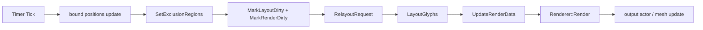
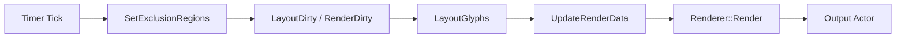
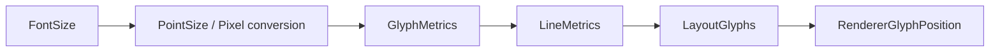

# TextVisualizer 성능 및 품질 개선 계획

## 목적

이 문서는 현재 동작 중인 `TextVisualizer` 구현을 기준으로, 이후 작업을 “성능 최적화”와 “텍스트 품질 개선”으로 분리해 정리한 계획 문서이다.

핵심 목표는 다음과 같다.

- moving bounds가 많은 상황에서 relayout / rerender 비용이 어디서 커지는지 분해한다.
- line height / baseline / font size 처리 품질이 왜 낮은지 현재 코드 기준으로 정리한다.
- 이후 작업을 작은 커밋 단위로 나눌 수 있도록 우선순위와 금지 사항을 고정한다.

이 문서는 구현 제안 문서이며, 실제 코드를 변경하지 않는다.

## 1. 현재 성능 경로 요약

현재 performance demo sample에서 moving bounds가 움직일 때 발생하는 흐름은 아래와 같다.

현재 코드 기준 단계별 비용 후보:

- `Timer Tick`
  - sample은 `Timer::New(16)`을 사용한다.
  - 실제 render frame과 tick이 동기화되어 있지 않으므로, update 요청 수와 실제 draw cadence가 어긋날 수 있다.
- `bound positions update`
  - active bound count만큼 매 tick 위치/속도/bounce 계산을 수행한다.
- `SetExclusionRegions`
  - 기존 `mExclusionRegions`와 새 region 벡터를 전체 비교한 뒤 복사한다.
- `MarkLayoutDirty + MarkRenderDirty`
  - 이후 relayout/render 경로를 모두 다시 열어 둔다.
- `LayoutGlyphs`
  - 현재 glyph advance 기반 전체 배치를 다시 수행한다.
  - line별 exclusion interval 계산도 다시 한다.
- `UpdateRenderData`
  - adapter glyph placements를 render data로 다시 변환한다.
- `Renderer::Render`
  - attached 상태여도 현재는 다시 호출된다.
- `output actor / mesh update`
  - output actor 재사용 여부와 관계없이 renderer 내부 geometry/update 비용이 다시 들어갈 수 있다.

## 2. 현재 성능 병목 후보

| 병목 후보 | 현재 동작 | 비용 | 개선 방향 | 우선순위 |
|---|---|---|---|---|
| `SetExclusionRegions()`마다 full vector compare/copy | `AreExclusionRegionsEqual()`가 count와 각 `Rect<float>`를 전부 비교하고, 다르면 전체 벡터를 복사한다 | bounds 수가 많아질수록 tick마다 O(N) 비교 + 복사 | epsilon 비교 또는 unchanged skip 정책 검토 | 중간 |
| 매 tick full `LayoutGlyphs()` | bounds 이동 시 전체 glyph를 처음부터 다시 배치한다 | glyph 수가 길수록 O(glyph count * line count) 성격으로 커진다 | partial relayout 또는 unchanged layout skip | 높음 |
| 매 tick full `Renderer::Render()` | `AttachRendererToHost()`가 attached 상태여도 `Render()`를 다시 호출한다 | relayout 뒤 geometry/update 비용이 누적된다 | layout 변경이 없으면 render skip, 중기적으로 geometry-only update 검토 | 높음 |
| output actor/mesh regeneration | output actor 재사용 여부와 별개로 내부 child mesh actor/renderer update가 발생할 수 있다 | actor/renderer 구조가 커질수록 비용 증가 가능 | output actor/mesh actor 재사용 정책 조사 | 중간 |
| `GetLineBaselineOffset()`의 same-line scan | `AtlasViewAdapter::GetRendererGlyphPosition()`가 glyph마다 같은 line의 glyph placements를 다시 훑는다 | 렌더 직전 좌표 보정에서 line당 반복 scan이 발생한다 | line baseline cache 추가 | 높음 |
| exclusion interval 계산 시 line마다 모든 bounds scan | `BuildAvailableIntervals()`가 현재 line마다 모든 exclusion region을 확인한다 | bounds 수와 line 수가 모두 커질수록 비용 증가 | y축 sort/cache로 line band candidate 축소 | 중간 |
| `Dali::Vector` / `std::vector` 재할당 | layout 결과와 render data가 `Clear()` 후 반복 push-back 된다 | 긴 텍스트에서 allocation/reallocation이 잦을 수 있다 | glyph count 기반 reserve/preallocate | 중간 |
| logging / diagnostics overhead | 현재 `DALI_LOG_ERROR`와 diagnostics getter가 살아 있다 | sample/benchmark 시 관측값을 왜곡할 수 있다 | debug level 또는 compile-time flag로 낮춤 | 높음 |
| `render dirty` 미해제 구조 | 현재는 성공 후에도 clear하지 않는다 | relayout이 다시 오면 render path가 계속 열린 상태다 | 별도 커밋에서 clear 조건 도입 | 중간 |
| sample timer tick과 actual render frame mismatch | 16ms timer가 draw frame과 항상 맞지 않는다 | update 요청 수와 실제 frame rate 체감이 달라질 수 있다 | frame callback 또는 throttled status update 검토 | 낮음 |

## 3. 빠른 최적화 후보

### A. diagnostics / log cleanup

- 현재 `TextVisualizerImpl::LogRenderDiagnostics()`는 `DALI_LOG_ERROR`를 사용한다.
- runtime diagnostics counter도 bridge / view interface 쪽에 다수 남아 있다.
- 동작 확인이 끝난 상태에서는 release path 영향이 가장 적은 형태로 내려야 한다.

권장 방향:

- `DALI_LOG_ERROR`를 debug level 또는 compile-time guard로 낮춘다.
- diagnostics counter는 유지하되 기본 실행 경로에서 문자열 formatting 비용이 생기지 않게 한다.

### B. render dirty clear 실험

- 현재는 render 성공 후에도 `mRenderDirty`를 clear하지 않는다.
- 성능 관점에서는 이 상태가 불필요한 render path 재실행 비용을 키운다.

주의:

- `IsRenderReady()`만으로 clear하면 안 된다.
- 최소 조건은 아래 수준이 필요하다.
  - `UpdateRenderData()` 성공
  - `Renderer::Render()` 성공
  - output actor attach/parent 상태 일관성 확보
  - glyph count / returned glyph count 일관성 확인

### C. redundant `SetExclusionRegions()` 회피

- bounds 값이 실질적으로 거의 같다면 `SetExclusionRegions()` 자체를 skip할 수 있다.
- 현재는 `Rect<float>`의 exact compare만 사용하므로 미세한 float noise에도 dirty가 발생할 수 있다.

검토 포인트:

- epsilon compare를 도입할지
- sample 수준에서는 tick 수를 줄일지
- 실서비스에서는 unchanged region update를 upstream에서 줄일지

### D. layout unchanged 시 `Render()` skip

- 현재는 layout dirty가 해소되면 바로 `UpdateRenderData()`와 `Render()`로 간다.
- `LayoutResult`가 이전과 사실상 같다면 render를 생략할 여지가 있다.

후보:

- `LayoutResult` version/hash 추가
- glyph placement count / x/y/advance 변화가 없으면 render skip

### E. `LayoutResult` / render data reserve

- 현재 `LayoutResult` 내부 `Dali::Vector`와 `AtlasRendererBridge::Impl::mRenderData`는 반복 push-back 위주다.
- glyph count를 이미 알고 있으므로 reserve 기반 최적화 여지가 크다.

### F. line baseline cache

- `GetRendererGlyphPosition()`는 glyph마다 `GetLineBaselineOffset()`를 호출한다.
- 현재 `GetLineBaselineOffset()`는 같은 line의 placements를 다시 scan한다.

빠른 개선 방향:

- line별 baseline offset cache를 `LayoutResult` 또는 adapter 내부에 저장
- renderer 좌표 계산 시 O(1) 조회로 변경

### G. interval optimization

- 현재 `BuildAvailableIntervals()`는 매 line마다 모든 exclusion region을 scan한다.
- bounds를 y 기준으로 sort/cache하면 현재 line band와 겹칠 가능성이 있는 bounds만 확인하도록 줄일 수 있다.

## 4. 중기 최적화 후보

- `Renderer::Render()` 전체 재호출 대신 geometry만 update 가능한지 조사
- `AtlasRenderer`에 direct update API를 추가하는 것이 타당한지 검토
- output actor / mesh actor 재사용 정책 확립
- moving bounds가 작게 움직일 때 partial layout 가능한지 검토
- dirty region / affected lines만 relayout
- layout result와 render data double buffering
- timer tick과 render frame sync 또는 throttling

이 항목들은 공수가 커질 수 있으므로, 빠른 최적화와 분리해서 다뤄야 한다.

## 5. 현재 품질 문제 요약

현재 품질 문제는 다음과 같다.

- pixel size 계산이 부정확해 보인다.
- `fontSize`가 point size처럼 처리되는지 pixel size처럼 처리되는지 혼재 가능성이 있다.
- line height가 너무 빡빡하다.
- baseline offset이 `max(yBearing)` 기반 임시 규칙이다.
- ascender / descender / line gap 기반 line metrics가 없다.
- glyph advance만으로 line 배치가 결정된다.
- emoji / fallback font가 섞이면 line height와 baseline이 더 어긋날 수 있다.

현재 코드 기준 근거:

- `TextPreparer::GetDefaultPointSize()`는 `fontSize * GetNumberOfPointsPerOneUnitOfPointSize()`를 사용한다.
- `LayoutEngine::UpdateLayout()` 경로는 현재 `lineHeight = 0.0f`를 넘기고, 실제 line height는 `GetPlaceholderLineHeight()`로 대체된다.
- `GetPlaceholderLineHeight()`는 사실상 `fontSize * 1.2f` 기반 임시값이다.
- renderer 좌표 보정은 `same line max(yBearing)`을 baseline처럼 사용한다.

## 6. font size / pixel size 문제 조사 계획

현재 `TextPreparer::Prepare()`에서 font size는 아래처럼 point size로 들어간다.

- `fontSize > 0`이면 그 값을 그대로 사용
- `FONT_SIZE_SCALE = 1.0f`
- `fontClient.GetNumberOfPointsPerOneUnitOfPointSize()`를 곱해 `PointSize26Dot6`로 변환

현재 확인할 항목:

- `TextVisualizer` public `FontSize`는 pixel인지 point인지
- 기존 `Label`의 `FontSize`는 어떤 단위 해석을 따르는지
- `GetNumberOfPointsPerOneUnitOfPointSize()` 적용이 현재 경로에서 맞는지
- DPI / font size scale / system scale 반영이 빠져 있는지
- sample에서 `30`으로 넣은 font size가 실제 glyph pixel height와 어느 정도 차이가 나는지

가능한 결론 후보:

### A. `TextVisualizer::FontSize`를 pixel로 정의

- 내부에서 기존 text system point size 변환을 명시적으로 관리한다.
- 장점:
  - sample과 visual intuition이 맞기 쉽다.
- 단점:
  - 기존 `Label`과 단위가 어긋날 수 있다.

### B. 기존 `Label`과 같은 단위를 따른다

- 가장 일관적인 정책이다.
- 장점:
  - 기존 text property semantics와 맞춘다.
- 단점:
  - sample에서 기대한 pixel 높이와 다를 수 있다.

### C. 정식 정책 확정 전까지 sample에서 보정값 사용

- 임시 대응으로는 가능하다.
- 다만 core semantics를 미루는 것이므로 장기 해법은 아니다.

현재 추천:

- 먼저 기존 `Label` 단위를 확인해 `TextVisualizer`도 같은 단위를 따르도록 정리하는 것이 안전하다.

## 7. line height / baseline 개선 계획

현재 구조에서는 `PreparedText`가 shaping/glyph metric까지만 보유하고, line metrics는 사실상 없다.

개선 방향:

- `PreparedText` 또는 line-metrics cache 구조에 아래를 저장
  - ascender
  - descender
  - lineGap
  - naturalLineHeight
  - baselineOffset

- `LayoutEngine::LayoutGlyphs()`에서
  - line height를 font metrics 기반으로 계산
  - glyph advance만이 아니라 line metrics를 반영해 line y progression 결정

- `AtlasViewAdapter::GetRendererGlyphPosition()`에서
  - line별 baseline offset cache를 사용
  - fallback font / emoji가 섞인 line이면 해당 line glyph들의 max ascender / descender를 반영

권장 구현 순서:

1. line metrics cache 추가
2. layout line height 계산 교체
3. renderer glyph position baseline cache 적용

## 8. 품질 개선 커밋 분해

추천 순서는 다음과 같다.

### Commit A. Clean up temporary diagnostics/logging

목표:

- `DALI_LOG_ERROR`와 임시 runtime diagnostics를 정리
- release path overhead를 낮춤

금지 사항:

- 이 커밋에서 baseline/line break 로직까지 건드리지 않는다.

### Commit B. Add line metrics cache for TextVisualizer

목표:

- ascender / descender / baseline 관련 cache 구조 추가

금지 사항:

- public API 추가 금지
- line break 정책 변경 금지

### Commit C. Use line metrics for glyph layout height and baseline

목표:

- `fontSize * 1.2` placeholder line height와 `max(yBearing)` baseline 규칙을 metrics 기반으로 대체

금지 사항:

- word/cluster line break와 섞지 않는다.

### Commit D. Clarify FontSize unit and conversion

목표:

- `FontSize` 단위 정책을 기존 text system과 맞춰 문서/코드에서 명확히 고정

금지 사항:

- sample-only 보정으로 끝내지 않는다.

### Commit E. Improve word/cluster line break

목표:

- glyph advance 순차 배치 대신 break candidate 기반 줄바꿈 품질 개선

금지 사항:

- bidi/RTL까지 같이 넣지 않는다.

### Commit F. Add render dirty clear condition

목표:

- render 성공 후 clear 가능한 조건을 도입

금지 사항:

- `IsRenderReady()`만으로 clear하지 않는다.

### Commit G. Optimize exclusion interval scanning

목표:

- line마다 모든 bounds를 scan하는 비용을 줄임

금지 사항:

- partial relayout까지 한 번에 넣지 않는다.

### Commit H. Optimize baseline offset calculation

목표:

- line baseline cache를 적용해 renderer 좌표 계산의 repeated scan 제거

금지 사항:

- glyph quality 정책 변경과 섞지 않는다.

### Commit I. Add performance counters to sample

목표:

- sample에 더 의미 있는 relayout / render / glyph count 관찰 지표 추가

금지 사항:

- core instrumentation과 섞지 않는다.

## 9. 다음 바로 할 작업 추천

현재 가장 추천하는 다음 커밋은 다음이다.

- `Commit A: Clean up temporary diagnostics/logging`

이유:

- 지금은 동작은 확인됐지만, `DALI_LOG_ERROR`와 runtime diagnostics log가 성능 관찰을 왜곡할 수 있다.
- 성능을 재보려면 먼저 debug overhead를 줄여야 한다.
- 그 다음으로 line metrics cache / baseline 개선으로 넘어가는 것이 순서상 자연스럽다.

그 다음 추천 순서:

1. diagnostics/log cleanup
2. line metrics cache
3. baseline / line height 개선
4. font size 단위 정리
5. line break 품질 개선
6. render dirty clear 조건 도입

## 10. 금지 사항

다음 원칙은 계속 유지한다.

- 기존 `TextController` 수정 금지
- 기존 `TextView` 수정 금지
- `text-atlas-renderer.*` 수정은 아직 신중히
- public API 추가는 신중히
- `render dirty clear`는 별도 커밋에서만
- 성능 최적화와 품질 개선을 한 커밋에 섞지 않기

## 11. mermaid 구조도

### 성능 경로

### 품질 경로

## 12. 정리

현재 `TextVisualizer`는 기능적으로는 “보이고, exclusion을 피하고, moving bounds를 따라 재배치되는” 단계까지 왔다.

이후의 핵심은 두 갈래다.

- 성능:
  - 불필요한 full layout / full render / logging 비용을 줄이는 것
- 품질:
  - font size, line metrics, baseline, line break 품질을 기존 text system 기대치에 가깝게 끌어올리는 것

즉 다음 단계는 “동작 여부 확인”이 아니라 “비용과 품질을 다듬는 단계”다.

## 진행: temporary diagnostics cleanup

진행 내용:

- `OnMeasure()`에 남아 있던 임시 `DALI_LOG_ERROR`를 제거했다.
- `LogRenderDiagnostics()`는 기본적으로 꺼진 compile-time 상수 guard 뒤로 이동했다.
- diagnostics getter / counter 자체는 유지한다.

현재 정책:

- 기본 빌드에서는 render diagnostics log가 출력되지 않는다.
- 필요 시 guard만 켜서 기존 bridge / view interface diagnostics를 다시 활용할 수 있다.
- 즉, future debugging용 관찰 지점은 유지하되 일반 실행 path의 log overhead는 줄인 상태다.

의미:

- performance sample 측정 전에 logging overhead를 먼저 낮췄다.
- 다음 단계의 성능 측정은 이 상태를 baseline으로 삼는 것이 적절하다.

## 진행: line metrics cache

추가 내용:

- `PreparedText`에 `LineMetrics` cache를 저장할 수 있도록 구조를 추가했다.
- 현재 cache 항목:
  - `ascender`
  - `descender`
  - `lineGap`
  - `naturalLineHeight`
  - `baselineOffset`

현재 계산 정책:

- `TextPreparer`가 glyph metrics를 얻은 뒤 fallback line metrics를 계산한다.
- 1차 계산은 glyph metrics 기반이다.
  - `ascender = max(yBearing)`
  - `descender = max(height - yBearing)`
  - `lineGap = fontSize * 0.2f` fallback
  - `naturalLineHeight = ascender + descender + lineGap`
  - `baselineOffset = ascender`
- glyph가 없으면 line metrics cache는 비어 있는 상태로 둔다.

중요:

- 이번 단계에서는 line metrics를 저장만 하고, 아직 layout line height나 renderer baseline 계산에는 사용하지 않는다.
- 즉 기존 `LayoutEngine::GetPlaceholderLineHeight()`와 `GetLineBaselineOffset()` 동작은 그대로 유지한다.

다음 계획:

- 다음 커밋에서 이 cache를 line height / baseline 계산에 실제로 연결한다.
- 현재 계산은 glyph metrics 기반 fallback이며, 향후에는 `FontClient`의 ascender / descender / line gap API를 조사해 더 정확한 font metrics 기반으로 개선해야 한다.

## 진행: use line metrics for layout and baseline

진행 내용:

- `LayoutGlyphs()`와 `LayoutPlaceholder()`가 line height를 결정할 때 `PreparedText::LineMetrics.naturalLineHeight`를 우선 사용하도록 연결했다.
- 단, caller가 explicit `lineHeight`를 넘기면 그 값이 여전히 우선한다.
- `AtlasViewAdapter::GetRendererGlyphPosition()`는 일반 경로에서 `PreparedText::LineMetrics.baselineOffset`을 먼저 사용한다.
- line metrics가 없을 때는 기존 `GetLineBaselineOffset()` fallback scan을 유지한다.

현재 의미:

- 기본 line height가 더 이상 무조건 `fontSize * 1.2f`는 아니다.
- glyph metrics 기반 fallback line height가 line 간격에 반영되므로 줄 간격이 조금 더 자연스러워진다.
- renderer glyph position도 일반 경로에서는 `same line max(yBearing)` repeated scan을 줄이고, baseline 정책을 `PreparedText` cache 쪽으로 모은다.

제한:

- 현재는 `PreparedText` level metrics 하나만 사용하므로 line별 fallback font / emoji 혼합 정확도는 제한적이다.
- 즉 line별 metrics cache가 따로 필요한 상황은 아직 남아 있다.

확인 필요:

- line별 metrics cache 필요 여부
- fallback font / emoji가 섞인 line의 ascender / descender 계산
- `FontClient`에서 font ascender / descender / lineGap을 직접 얻는 방법
- `FontSize` 단위와 line metrics 관계
- 현재 `lineGap = fontSize * 0.2f`가 적절한지
- sample에서 visual line height가 충분한지
