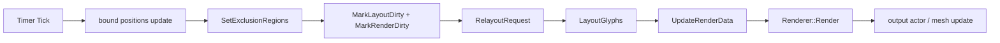
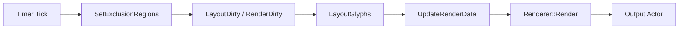
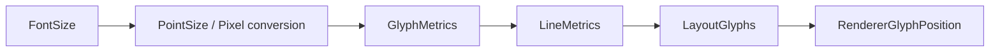
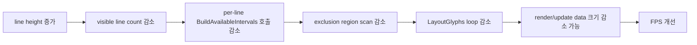

# TextVisualizer 성능 및 품질 개선 계획

## 목적

이 문서는 현재 동작 중인 `TextVisualizer` 구현을 기준으로, 이후 작업을 “성능 최적화”와 “텍스트 품질 개선”으로 분리해 정리한 계획 문서이다.

핵심 목표는 다음과 같다.

- moving bounds가 많은 상황에서 relayout / rerender 비용이 어디서 커지는지 분해한다.
- line height / baseline / font size 처리 품질이 왜 낮은지 현재 코드 기준으로 정리한다.
- 이후 작업을 작은 커밋 단위로 나눌 수 있도록 우선순위와 금지 사항을 고정한다.

이 문서는 구현 제안 문서이며, 실제 코드를 변경하지 않는다.

## 1. 현재 성능 경로 요약

현재 performance demo sample에서 moving bounds가 움직일 때 발생하는 흐름은 아래와 같다.



현재 코드 기준 단계별 비용 후보:

- `Timer Tick`
  - sample은 `Timer::New(16)`을 사용한다.
  - 실제 render frame과 tick이 동기화되어 있지 않으므로, update 요청 수와 실제 draw cadence가 어긋날 수 있다.
- `bound positions update`
  - active bound count만큼 매 tick 위치/속도/bounce 계산을 수행한다.
- `SetExclusionRegions`
  - 기존 `mExclusionRegions`와 새 region 벡터를 전체 비교한 뒤 복사한다.
- `MarkLayoutDirty + MarkRenderDirty`
  - 이후 relayout/render 경로를 모두 다시 열어 둔다.
- `LayoutGlyphs`
  - 현재 glyph advance 기반 전체 배치를 다시 수행한다.
  - line별 exclusion interval 계산도 다시 한다.
- `UpdateRenderData`
  - adapter glyph placements를 render data로 다시 변환한다.
- `Renderer::Render`
  - attached 상태여도 현재는 다시 호출된다.
- `output actor / mesh update`
  - output actor 재사용 여부와 관계없이 renderer 내부 geometry/update 비용이 다시 들어갈 수 있다.

## 2. 현재 성능 병목 후보

| 병목 후보 | 현재 동작 | 비용 | 개선 방향 | 우선순위 |
|---|---|---|---|---|
| `SetExclusionRegions()`마다 full vector compare/copy | core API는 exact compare 정책을 유지하고, performance sample에는 exclusion update threshold를 추가했다 | bounds 수가 많아질수록 tick마다 O(N) 비교 + 복사 비용이 있었고, sample threshold로 일부 redundant call을 줄인다 | core epsilon 정책은 별도 검토 | sample 1차 완료 |
| 매 tick full `LayoutGlyphs()` | bounds 이동 시 전체 glyph를 처음부터 다시 배치한다 | glyph 수가 길수록 O(glyph count * line count) 성격으로 커진다 | partial relayout 또는 unchanged layout skip | 높음 |
| 매 tick full `Renderer::Render()` | layout signature가 마지막 render와 같으면 placement-only dirty에서 render를 skip한다 | relayout 뒤 geometry/update 비용이 누적될 수 있었고, 동일 layout에서는 `UpdateRenderData()` / `Renderer::Render()` 호출을 줄인다 | signature cost와 epsilon 적절성 관찰 | 1차 완료 |
| output actor/mesh regeneration | output actor 재사용 여부와 별개로 내부 child mesh actor/renderer update가 발생할 수 있다 | actor/renderer 구조가 커질수록 비용 증가 가능 | output actor/mesh actor 재사용 정책 조사 | 중간 |
| `GetLineBaselineOffset()`의 same-line scan | `AtlasViewAdapter::GetRendererGlyphPosition()`가 glyph마다 같은 line의 glyph placements를 다시 훑는다 | 렌더 직전 좌표 보정에서 line당 반복 scan이 발생한다 | line baseline cache 추가 | 높음 |
| exclusion interval 계산 시 line마다 모든 bounds scan | 기존에는 `BuildAvailableIntervals()`가 line마다 모든 exclusion region을 확인했다. 현재는 layout pass 시작 시 y축 기준 sorted cache를 만들고 line band와 겹칠 수 있는 후보만 검사한다 | bounds 수와 line 수가 모두 커질수록 비용이 커졌고, 1차 최적화 후에는 per-line 후보 scan 비용이 줄었다 | 더 큰 bounds 수에서는 spatial index / partial relayout 검토 | 1차 완료 |
| `Dali::Vector` / `std::vector` 재할당 | 기존에는 layout 결과와 render data가 `Clear()` 후 반복 push-back 됐다. 현재는 glyph / cluster / renderable glyph count 기반 reserve를 적용했다 | 긴 텍스트에서 allocation/reallocation이 잦을 수 있었고, reserve 적용 후 반복 relayout/update에서 capacity 재사용 여지가 생겼다 | 더 큰 효과가 필요하면 `LayoutResult` object reuse / renderer internal allocation 조사 | 1차 완료 |
| logging / diagnostics overhead | 현재 `DALI_LOG_ERROR`와 diagnostics getter가 살아 있다 | sample/benchmark 시 관측값을 왜곡할 수 있다 | debug level 또는 compile-time flag로 낮춤 | 높음 |
| `render dirty` 미해제 구조 | 성공적인 render update 후 엄격한 조건을 만족하면 clear한다 | 동일 상태에서 render path 반복 진입을 줄인다 | dirty 재설정 경로와 장기 안정성 관찰 | 1차 완료 |
| sample timer tick과 actual render frame mismatch | 16ms timer가 draw frame과 항상 맞지 않는다 | update 요청 수와 실제 frame rate 체감이 달라질 수 있다 | frame callback 또는 throttled status update 검토 | 낮음 |

## 3. 빠른 최적화 후보

### A. diagnostics / log cleanup

- 현재 `TextVisualizerImpl::LogRenderDiagnostics()`는 `DALI_LOG_ERROR`를 사용한다.
- runtime diagnostics counter도 bridge / view interface 쪽에 다수 남아 있다.
- 동작 확인이 끝난 상태에서는 release path 영향이 가장 적은 형태로 내려야 한다.

권장 방향:

- `DALI_LOG_ERROR`를 debug level 또는 compile-time guard로 낮춘다.
- diagnostics counter는 유지하되 기본 실행 경로에서 문자열 formatting 비용이 생기지 않게 한다.

### B. render dirty clear 실험

- 현재는 render 성공 후에도 `mRenderDirty`를 clear하지 않는다.
- 성능 관점에서는 이 상태가 불필요한 render path 재실행 비용을 키운다.

주의:

- `IsRenderReady()`만으로 clear하면 안 된다.
- 최소 조건은 아래 수준이 필요하다.
  - `UpdateRenderData()` 성공
  - `Renderer::Render()` 성공
  - output actor attach/parent 상태 일관성 확보
  - glyph count / returned glyph count 일관성 확인

### C. redundant `SetExclusionRegions()` 회피

- bounds 값이 실질적으로 거의 같다면 `SetExclusionRegions()` 자체를 skip할 수 있다.
- core `TextVisualizer`는 여전히 `Rect<float>` exact compare만 사용한다.
- performance sample은 sample-local threshold를 사용해 움직임이 아주 작을 때 `SetExclusionRegions()` 호출 자체를 skip한다.

검토 포인트:

- core epsilon compare를 도입할지
- sample threshold가 visual fidelity와 성능 사이에서 적절한지
- 실서비스에서는 unchanged region update를 upstream에서 줄일지

### D. layout unchanged 시 `Render()` skip

- 현재는 layout dirty가 해소되면 바로 `UpdateRenderData()`와 `Render()`로 간다.
- `LayoutResult`가 이전과 사실상 같다면 render를 생략할 여지가 있다.

후보:

- 1차 구현은 완료됐다.
- `LayoutResult::CalculateSignature()`가 count / size / placement 좌표를 0.01px epsilon으로 quantize해 signature를 만든다.
- placement-only dirty에서 signature가 마지막 render와 같으면 render path를 skip한다.

### E. `LayoutResult` / render data reserve

- 1차 최적화는 완료됐다.
- `LayoutResult` 내부 `Dali::Vector`는 line / glyph placement / cluster placement count를 미리 reserve한다.
- `TextLine.fragments`는 line별 available interval count를 기준으로 reserve한다.
- `AtlasRendererBridge::Impl::mRenderData`는 renderable glyph count를 기준으로 reserve한다.
- 결과 정책은 바꾸지 않고 반복 allocation/reallocation 비용만 줄이는 방향이다.

### F. line baseline cache

- `GetRendererGlyphPosition()`는 glyph마다 `GetLineBaselineOffset()`를 호출한다.
- 현재 `GetLineBaselineOffset()`는 같은 line의 placements를 다시 scan한다.

빠른 개선 방향:

- line별 baseline offset cache를 `LayoutResult` 또는 adapter 내부에 저장
- renderer 좌표 계산 시 O(1) 조회로 변경

### G. interval optimization

- 1차 최적화는 완료됐다.
- layout pass 시작 시 exclusion region을 y 기준으로 정렬한 cache를 만든다.
- 각 line에서는 `top / bottom` 기준으로 현재 line band와 겹칠 가능성이 있는 region만 검사한다.
- blocked interval 생성 이후의 x sort / merge / available interval 생성 정책은 유지한다.
- 남은 과제는 더 큰 bounds 수에서 spatial index나 affected-line partial relayout이 필요한지 확인하는 것이다.

## 4. 중기 최적화 후보

- `Renderer::Render()` 전체 재호출 대신 geometry만 update 가능한지 조사
- `AtlasRenderer`에 direct update API를 추가하는 것이 타당한지 검토
- output actor / mesh actor 재사용 정책 확립
- moving bounds가 작게 움직일 때 partial layout 가능한지 검토
- dirty region / affected lines만 relayout
- layout result와 render data double buffering
- timer tick과 render frame sync 또는 throttling

이 항목들은 공수가 커질 수 있으므로, 빠른 최적화와 분리해서 다뤄야 한다.

## 5. 현재 품질 문제 요약

현재 품질 문제는 다음과 같다.

- pixel size 계산이 부정확해 보인다.
- `fontSize`가 point size처럼 처리되는지 pixel size처럼 처리되는지 혼재 가능성이 있다.
- line height가 너무 빡빡하다.
- baseline offset이 `max(yBearing)` 기반 임시 규칙이다.
- ascender / descender / line gap 기반 line metrics가 없다.
- glyph advance만으로 line 배치가 결정된다.
- emoji / fallback font가 섞이면 line height와 baseline이 더 어긋날 수 있다.

현재 코드 기준 근거:

- `TextPreparer::GetDefaultPointSize()`는 `fontSize * GetNumberOfPointsPerOneUnitOfPointSize()`를 사용한다.
- `LayoutEngine::UpdateLayout()` 경로는 현재 `lineHeight = 0.0f`를 넘기고, 실제 line height는 `GetPlaceholderLineHeight()`로 대체된다.
- `GetPlaceholderLineHeight()`는 사실상 `fontSize * 1.2f` 기반 임시값이다.
- renderer 좌표 보정은 `same line max(yBearing)`을 baseline처럼 사용한다.

## 6. font size / pixel size 문제 조사 계획

현재 `TextPreparer::Prepare()`에서 font size는 아래처럼 point size로 들어간다.

- `fontSize > 0`이면 그 값을 그대로 사용
- `FONT_SIZE_SCALE = 1.0f`
- `fontClient.GetNumberOfPointsPerOneUnitOfPointSize()`를 곱해 `PointSize26Dot6`로 변환

현재 확인할 항목:

- `TextVisualizer` public `FontSize`는 pixel인지 point인지
- 기존 `Label`의 `FontSize`는 어떤 단위 해석을 따르는지
- `GetNumberOfPointsPerOneUnitOfPointSize()` 적용이 현재 경로에서 맞는지
- DPI / font size scale / system scale 반영이 빠져 있는지
- sample에서 `30`으로 넣은 font size가 실제 glyph pixel height와 어느 정도 차이가 나는지

가능한 결론 후보:

### A. `TextVisualizer::FontSize`를 pixel로 정의

- 내부에서 기존 text system point size 변환을 명시적으로 관리한다.
- 장점:
  - sample과 visual intuition이 맞기 쉽다.
- 단점:
  - 기존 `Label`과 단위가 어긋날 수 있다.

### B. 기존 `Label`과 같은 단위를 따른다

- 가장 일관적인 정책이다.
- 장점:
  - 기존 text property semantics와 맞춘다.
- 단점:
  - sample에서 기대한 pixel 높이와 다를 수 있다.

### C. 정식 정책 확정 전까지 sample에서 보정값 사용

- 임시 대응으로는 가능하다.
- 다만 core semantics를 미루는 것이므로 장기 해법은 아니다.

현재 추천:

- 먼저 기존 `Label` 단위를 확인해 `TextVisualizer`도 같은 단위를 따르도록 정리하는 것이 안전하다.

## 7. line height / baseline 개선 계획

현재 구조에서는 `PreparedText`가 shaping/glyph metric까지만 보유하고, line metrics는 사실상 없다.

개선 방향:

- `PreparedText` 또는 line-metrics cache 구조에 아래를 저장
  - ascender
  - descender
  - lineGap
  - naturalLineHeight
  - baselineOffset

- `LayoutEngine::LayoutGlyphs()`에서
  - line height를 font metrics 기반으로 계산
  - glyph advance만이 아니라 line metrics를 반영해 line y progression 결정

- `AtlasViewAdapter::GetRendererGlyphPosition()`에서
  - line별 baseline offset cache를 사용
  - fallback font / emoji가 섞인 line이면 해당 line glyph들의 max ascender / descender를 반영

권장 구현 순서:

1. line metrics cache 추가
2. layout line height 계산 교체
3. renderer glyph position baseline cache 적용

## 8. 품질 개선 커밋 분해

추천 순서는 다음과 같다.

### Commit A. Clean up temporary diagnostics/logging

목표:

- `DALI_LOG_ERROR`와 임시 runtime diagnostics를 정리
- release path overhead를 낮춤

금지 사항:

- 이 커밋에서 baseline/line break 로직까지 건드리지 않는다.

### Commit B. Add line metrics cache for TextVisualizer

목표:

- ascender / descender / baseline 관련 cache 구조 추가

금지 사항:

- public API 추가 금지
- line break 정책 변경 금지

### Commit C. Use line metrics for glyph layout height and baseline

목표:

- `fontSize * 1.2` placeholder line height와 `max(yBearing)` baseline 규칙을 metrics 기반으로 대체

금지 사항:

- word/cluster line break와 섞지 않는다.

### Commit D. Clarify FontSize unit and conversion

목표:

- `FontSize` 단위 정책을 기존 text system과 맞춰 문서/코드에서 명확히 고정

금지 사항:

- sample-only 보정으로 끝내지 않는다.

### Commit E. Improve word/cluster line break

목표:

- glyph advance 순차 배치 대신 break candidate 기반 줄바꿈 품질 개선

금지 사항:

- bidi/RTL까지 같이 넣지 않는다.

### Commit F. Add render dirty clear condition

목표:

- render 성공 후 clear 가능한 조건을 도입

금지 사항:

- `IsRenderReady()`만으로 clear하지 않는다.

### Commit G. Optimize exclusion interval scanning

목표:

- line마다 모든 bounds를 scan하는 비용을 줄임

금지 사항:

- partial relayout까지 한 번에 넣지 않는다.

### Commit H. Optimize baseline offset calculation

목표:

- line baseline cache를 적용해 renderer 좌표 계산의 repeated scan 제거

금지 사항:

- glyph quality 정책 변경과 섞지 않는다.

### Commit I. Add performance counters to sample

목표:

- sample에 더 의미 있는 relayout / render / glyph count 관찰 지표 추가

금지 사항:

- core instrumentation과 섞지 않는다.

## 9. 다음 바로 할 작업 추천

현재 가장 추천하는 다음 커밋은 다음이다.

- `Commit A: Clean up temporary diagnostics/logging`

이유:

- 지금은 동작은 확인됐지만, `DALI_LOG_ERROR`와 runtime diagnostics log가 성능 관찰을 왜곡할 수 있다.
- 성능을 재보려면 먼저 debug overhead를 줄여야 한다.
- 그 다음으로 line metrics cache / baseline 개선으로 넘어가는 것이 순서상 자연스럽다.

그 다음 추천 순서:

1. diagnostics/log cleanup
2. line metrics cache
3. baseline / line height 개선
4. font size 단위 정리
5. line break 품질 개선
6. render dirty clear 조건 도입

## 10. 금지 사항

다음 원칙은 계속 유지한다.

- 기존 `TextController` 수정 금지
- 기존 `TextView` 수정 금지
- `text-atlas-renderer.*` 수정은 아직 신중히
- public API 추가는 신중히
- `render dirty clear`는 별도 커밋에서만
- 성능 최적화와 품질 개선을 한 커밋에 섞지 않기

## 11. mermaid 구조도

### 성능 경로



### 품질 경로



## 12. 정리

현재 `TextVisualizer`는 기능적으로는 “보이고, exclusion을 피하고, moving bounds를 따라 재배치되는” 단계까지 왔다.

이후의 핵심은 두 갈래다.

- 성능:
  - 불필요한 full layout / full render / logging 비용을 줄이는 것
- 품질:
  - font size, line metrics, baseline, line break 품질을 기존 text system 기대치에 가깝게 끌어올리는 것

즉 다음 단계는 “동작 여부 확인”이 아니라 “비용과 품질을 다듬는 단계”다.

## 진행: temporary diagnostics cleanup

진행 내용:

- `OnMeasure()`에 남아 있던 임시 `DALI_LOG_ERROR`를 제거했다.
- `LogRenderDiagnostics()`는 기본적으로 꺼진 compile-time 상수 guard 뒤로 이동했다.
- diagnostics getter / counter 자체는 유지한다.

현재 정책:

- 기본 빌드에서는 render diagnostics log가 출력되지 않는다.
- 필요 시 guard만 켜서 기존 bridge / view interface diagnostics를 다시 활용할 수 있다.
- 즉, future debugging용 관찰 지점은 유지하되 일반 실행 path의 log overhead는 줄인 상태다.

의미:

- performance sample 측정 전에 logging overhead를 먼저 낮췄다.
- 다음 단계의 성능 측정은 이 상태를 baseline으로 삼는 것이 적절하다.

## 진행: line metrics cache

추가 내용:

- `PreparedText`에 `LineMetrics` cache를 저장할 수 있도록 구조를 추가했다.
- 현재 cache 항목:
  - `ascender`
  - `descender`
  - `lineGap`
  - `naturalLineHeight`
  - `baselineOffset`

현재 계산 정책:

- `TextPreparer`가 glyph metrics를 얻은 뒤 fallback line metrics를 계산한다.
- 1차 계산은 glyph metrics 기반이다.
  - `ascender = max(yBearing)`
  - `descender = max(height - yBearing)`
  - `lineGap = fontSize * 0.2f` fallback
  - `naturalLineHeight = ascender + descender + lineGap`
  - `baselineOffset = ascender`
- glyph가 없으면 line metrics cache는 비어 있는 상태로 둔다.

중요:

- 이번 단계에서는 line metrics를 저장만 하고, 아직 layout line height나 renderer baseline 계산에는 사용하지 않는다.
- 즉 기존 `LayoutEngine::GetPlaceholderLineHeight()`와 `GetLineBaselineOffset()` 동작은 그대로 유지한다.

다음 계획:

- 다음 커밋에서 이 cache를 line height / baseline 계산에 실제로 연결한다.
- 현재 계산은 glyph metrics 기반 fallback이며, 향후에는 `FontClient`의 ascender / descender / line gap API를 조사해 더 정확한 font metrics 기반으로 개선해야 한다.

## 진행: use line metrics for layout and baseline

진행 내용:

- `LayoutGlyphs()`와 `LayoutPlaceholder()`가 line height를 결정할 때 `PreparedText::LineMetrics.naturalLineHeight`를 우선 사용하도록 연결했다.
- 단, caller가 explicit `lineHeight`를 넘기면 그 값이 여전히 우선한다.
- `AtlasViewAdapter::GetRendererGlyphPosition()`는 일반 경로에서 `PreparedText::LineMetrics.baselineOffset`을 먼저 사용한다.
- line metrics가 없을 때는 기존 `GetLineBaselineOffset()` fallback scan을 유지한다.

현재 의미:

- 기본 line height가 더 이상 무조건 `fontSize * 1.2f`는 아니다.
- glyph metrics 기반 fallback line height가 line 간격에 반영되므로 줄 간격이 조금 더 자연스러워진다.
- renderer glyph position도 일반 경로에서는 `same line max(yBearing)` repeated scan을 줄이고, baseline 정책을 `PreparedText` cache 쪽으로 모은다.

제한:

- 현재는 `PreparedText` level metrics 하나만 사용하므로 line별 fallback font / emoji 혼합 정확도는 제한적이다.
- 즉 line별 metrics cache가 따로 필요한 상황은 아직 남아 있다.

확인 필요:

- line별 metrics cache 필요 여부
- fallback font / emoji가 섞인 line의 ascender / descender 계산
- `FontClient`에서 font ascender / descender / lineGap을 직접 얻는 방법
- `FontSize` 단위와 line metrics 관계
- 현재 `lineGap = fontSize * 0.2f`가 적절한지
- sample에서 visual line height가 충분한지

## 진행: pixel font size and relative line height

이번 단계에서는 `TextVisualizer`의 `FontSize` 의미와 `LineHeight` 정책을 명시적으로 고정했다.

핵심 정책:

- `TextVisualizer::FontSize`는 pixel size로 정의한다.
- `LineHeight`는 relative multiplier만 지원한다.
- absolute line height는 제공하지 않는다.
- `lineHeight == -1.0f`이면 auto / natural line height를 사용한다.
- `lineHeight > 0.0f`이면 아래 공식을 사용한다.

```text
CalculatedLineHeight(px) = FontSize(px) * lineHeight
```

현재 구현 의미:

- public API에는 `SetLineHeight()`, `GetLineHeight()`, `ClearLineHeight()`가 추가된다.
- property `"lineHeight"`가 추가되며 초기값은 `-1.0f`다.
- `TextVisualizerImpl`은 relative line height를 직접 pixel line height로 계산해서 `LayoutEngine`에 넘긴다.
- `lineHeight == -1.0f`이면 `LayoutEngine`이 기존처럼 `PreparedText::LineMetrics.naturalLineHeight`를 우선 사용한다.
- `lineHeight` 변경은 prepare dirty가 아니라 layout dirty + render dirty만 발생시킨다.

기존 `Label`과의 관계:

- 개념적으로는 `Label`의 `LineHeightMode::RELATIVE` 공식과 같은 의미를 따른다.
- 단, `TextVisualizer`는 아직 `LineHeightMode` public API를 제공하지 않는다.
- absolute mode도 이번 범위에 포함하지 않는다.

확인 필요:

- `FontSize` pixel 정의와 기존 `Label` 단위가 완전히 같은지
- DPI / font scale / system scale 반영 위치
- `FontClient` point-size conversion의 정확한 의미
- `lineHeight <= 0.0f` invalid 값 정책을 계속 auto fallback으로 둘지
- 이후 absolute line height를 추가할 필요가 있는지

## 현재 관찰 결과

- line metrics 적용 후 line height가 더 자연스러워졌다.
- 텍스트가 이전보다 덜 빡빡하게 보인다.
- 같은 영역에 들어가는 visible line 수가 줄어든 것으로 보인다.
- moving bounds가 움직일 때 relayout 체감 성능도 함께 개선됐다.
- 즉, 이번 변경은 line height 품질 개선이면서 동시에 layout 성능에도 긍정적으로 작용한 사례다.

## line metrics가 성능에도 영향을 준 이유

이번 개선의 성능 효과는 아래 흐름으로 설명할 수 있다.



정리하면:

- line height가 커지면 같은 높이에 들어가는 line 수가 줄어든다.
- line 수가 줄면 `BuildAvailableIntervals()`가 호출되는 횟수도 줄어든다.
- 각 line에서 모든 exclusion bounds를 훑는 현재 구조상, line 수 감소는 곧 exclusion scan 감소로 이어진다.
- 그 결과 `LayoutGlyphs()` 전체 loop 양도 줄고, relayout 뒤 render/update 경로의 입력 크기도 완화될 수 있다.
- 즉 이번 line metrics 적용은 “품질 개선”으로 시작했지만, 현재 구조에서는 자연스럽게 성능 개선 효과도 낳는다.

## 현재 line metrics 정책

현재 정책은 다음과 같다.

- `PreparedText::LineMetrics`를 사용한다.
- `naturalLineHeight`가 있으면 layout line height에서 우선 사용한다.
- explicit `lineHeight`가 전달되면 그 값이 override한다.
- renderer glyph position 계산에서는 `baselineOffset`을 우선 사용한다.
- line metrics가 없으면 기존 fallback을 유지한다.

현재 의미:

- 기본 line height는 더 이상 무조건 `fontSize * 1.2f`가 아니다.
- baseline도 일반 경로에서는 `PreparedText`에 저장된 정책을 먼저 따른다.
- fallback path는 남겨 두었기 때문에 metrics가 없는 경우 기존 동작은 깨지지 않는다.

## 남은 제한

아직 남아 있는 제한은 다음과 같다.

- `PreparedText` level metrics 하나만 사용 중이다.
- line별 fallback font / emoji 혼합 정확도는 아직 제한적이다.
- `lineGap = fontSize * 0.2f`는 임시 fallback이다.
- `FontSize` 단위 / pixel size 해석은 아직 정리되지 않았다.

즉, 이번 단계는 “placeholder 규칙보다 낫다” 수준의 개선이지, font-system 수준의 최종 정답은 아니다.

## 진행: exclusion interval scanning optimization

최근 커밋:

- `47cb3d725372757294d15e1f03a40e31aa07a9c9`
- `Optimize TextVisualizer exclusion interval scanning`

기존 문제:

- `BuildAvailableIntervals()`가 line마다 전체 exclusion region을 scan했다.
- moving bounds가 많고 visible line 수가 많을수록 `line count x bounds count` 비용이 커졌다.
- 각 line은 전체 bounds scan 이후 vertical overlap region만 `blockedIntervals`에 넣고, 그 다음 x 방향 sort / merge를 수행했다.

변경된 구조:

- `LayoutPlaceholder()`와 `LayoutGlyphs()`가 layout pass 시작 시 exclusion region을 y축 기준으로 한 번 정렬한다.
- 각 line에서는 sorted cache를 순회하면서:
  - `region.bottom <= lineTop`이면 이미 지난 region이므로 skip한다.
  - `region.top >= lineBottom`이면 이후 region은 현재 line과 겹칠 수 없으므로 scan을 중단한다.
  - 그 외 region만 기존 vertical overlap 검사와 blocked interval 후보 생성에 사용한다.
- blocked interval 생성 이후의 x 방향 sort / merge / available interval 생성 정책은 기존과 동일하게 유지한다.
- public `LayoutEngine::BuildAvailableIntervals()` API는 그대로 유지하며, 내부에서 sorted cache helper를 사용한다.

적용 범위:

- `LayoutPlaceholder()`
- `LayoutGlyphs()`
- public `BuildAvailableIntervals()` compatibility path

기대 효과:

- moving bounds가 많을 때 line별 exclusion scan 후보 수가 줄어든다.
- visible line count가 많을수록 전체 relayout 비용 감소 효과가 커질 수 있다.
- layout 결과 정책은 유지하면서 검사 대상만 줄이는 최적화다.

남은 한계:

- bounds가 매 tick 움직이면 sorted cache는 layout pass마다 다시 생성된다.
- bounds 수가 매우 많아지면 단순 y-sort보다 더 고급 spatial index가 필요할 수 있다.
- affected line만 다시 계산하는 partial relayout은 아직 도입하지 않았다.
- render 호출 횟수나 renderer geometry update 비용은 이번 변경의 범위가 아니다.

다음 성능 최적화 후보:

- `render dirty` clear 조건 도입
- `SetExclusionRegions()` epsilon compare 또는 upstream unchanged skip 정책
- layout unchanged 시 render skip

## 진행: layout/render buffer reserve

최근 커밋:

- `Reserve TextVisualizer layout and render buffers`

기존 문제:

- `LayoutResult`의 `lines`, `glyphPlacements`, `clusterPlacements`는 `Clear()` 이후 반복 `PushBack()`으로 채워졌다.
- 각 `TextLine`의 `fragments`도 line마다 available interval 결과에 따라 반복 `PushBack()`으로 채워졌다.
- `AtlasRendererBridge::Impl::mRenderData`도 매 render data update마다 clear 후 glyph별 `push_back()`으로 채워졌다.
- 긴 텍스트와 moving bounds relayout 상황에서는 같은 규모의 layout/render data를 반복 생성하므로 allocation/reallocation 비용이 누적될 수 있다.

변경된 구조:

- `LayoutResult::Reserve()` helper를 추가해 line / glyph placement / cluster placement vector capacity를 미리 확보한다.
- `LayoutGlyphs()`는 glyph count와 estimated line count를 기준으로 `glyphPlacements`와 `lines`를 reserve한다.
- `LayoutPlaceholder()`는 cluster count와 estimated line count를 기준으로 `clusterPlacements`와 `lines`를 reserve한다.
- 각 line의 `TextLine.fragments`는 `availableIntervals.Count()`를 기준으로 reserve한다.
- `AtlasRendererBridge::UpdateRenderData()`는 renderable glyph count를 기준으로 `mRenderData.reserve()`를 호출한다.

유지한 정책:

- glyph placement / cluster placement 결과는 바꾸지 않는다.
- line break policy는 바꾸지 않는다.
- line height / font size semantics는 바꾸지 않는다.
- exclusion interval algorithm은 바꾸지 않는다.
- `Renderer::Render()` 호출 정책과 `render dirty` 정책은 바꾸지 않는다.

기대 효과:

- 같은 `LayoutResult` 객체를 반복 재사용하는 relayout path에서 `Dali::Vector` capacity 재사용 가능성이 생긴다.
- bridge render data는 `std::vector::clear()`가 capacity를 유지하므로 moving bounds update 중 repeated allocation을 줄일 수 있다.
- 효과는 glyph count / line count / renderable glyph count가 클수록 커질 수 있다.

남은 한계 / 확인 필요:

- `Dali::Vector::Clear()` 이후 capacity 유지 정책은 현재 사용 패턴상 reserve API를 믿고 사용하지만, 장기적으로 정확한 retention 정책 확인이 필요하다.
- `TextLine.fragments` reserve는 line-local copy/move 과정의 실제 효과를 더 확인해야 한다.
- render data vector capacity가 long-running moving bounds 상황에서 기대대로 유지되는지 sample/profiler 관찰이 필요하다.
- renderer 내부 mesh / actor / atlas allocation은 이번 변경 범위 밖에 남아 있다.
- 더 큰 최적화가 필요하면 `LayoutResult` object reuse 방식, partial relayout, geometry-only update를 별도로 검토해야 한다.

## 진행: render dirty clear condition

최근 커밋:

- `Add TextVisualizer render dirty clear condition`

기존 문제:

- render 성공 후에도 `mRenderDirty`를 clear하지 않아, 동일 상태에서 `OnRelayout()`이 다시 들어오면 render path가 계속 열린 상태로 남을 수 있었다.
- 특히 attached 상태에서도 `AttachRendererToHost()`가 `Renderer::Render()`를 다시 호출하는 현재 정책에서는 불필요한 full render 재호출 가능성을 줄일 필요가 있었다.

변경된 구조:

- `TextVisualizerImpl::ClearRenderDirty()` helper를 추가했다.
- `OnRelayout()`의 render path에서 render update가 성공한 경우에만 `ClearRenderDirty()`를 호출한다.
- clear 판단은 `IsRenderReady()` 하나만 보지 않고, render data update / attach 결과 / glyph diagnostics / output actor parent 상태를 함께 확인한다.

clear 필수 조건:

- `mRenderDirty == true`
- `mAtlasRendererBridge.HasRenderableGlyphs() == true`
- `UpdateRenderData() == true`
- `AttachRendererToHost() == true`
- `mAtlasRendererBridge.IsRenderReady() == true`
- `GetLastReturnedGlyphCount() > 0`
- `GetLastReturnedGlyphCount() <= GetLastRequestedGlyphCount()`
- `GetRendererOutput()` valid
- `IsRendererOutputParentedToHost() == true`

clear하지 않는 경우:

- renderable glyph가 없는 경우
- `UpdateRenderData()`가 실패한 경우
- `AttachRendererToHost()`가 실패한 경우
- renderer output actor가 없거나 host에 parented 되지 않은 경우
- renderer diagnostics에서 returned glyph count가 0이거나 requested count를 초과하는 경우

dirty가 다시 set되는 경로:

- `SetText()` / `SetFontFamily()` / `SetFontSize()`는 `MarkPrepareDirty()`를 통해 prepare + layout + render dirty를 다시 set한다.
- `SetLineHeight()`는 layout dirty + render dirty를 다시 set한다.
- `SetTextColor()`는 render dirty를 다시 set한다.
- `SetExclusionRegions()` / `ClearExclusionRegions()`는 layout dirty + render dirty를 다시 set한다.
- layout size 변경은 `OnRelayout()`에서 layout dirty + render dirty를 다시 set한다.

기대 효과:

- 동일 상태에서 `UpdateRenderData()` / `Renderer::Render()` 반복 호출을 줄인다.
- moving bounds처럼 exclusion region이 실제로 바뀌는 경우에는 기존처럼 dirty가 다시 set되어 render update가 발생한다.
- textColor만 변경되는 경우에도 render dirty가 다시 set되므로 color-only render update 경로는 유지된다.

확인 필요:

- `GetRendererOutputTotalRendererCount()`를 clear 조건에 포함할지 여부
- output actor 재생성 / 교체가 발생하는 경우 clear 조건의 장기 안정성
- render dirty false 상태에서 actor / renderer가 외부 요인으로 invalid 되는 경우
- future async render와 dirty clear 관계
- performance sample에서 FPS 개선 폭

## 진행: performance sample exclusion update threshold

최근 커밋:

- `Add TextVisualizer performance sample exclusion update threshold`

목표:

- core `TextVisualizer::SetExclusionRegions()` 정책은 변경하지 않는다.
- performance sample에서 moving bounds 변화가 매우 작을 때 redundant `SetExclusionRegions()` 호출을 줄이는 실험을 한다.
- threshold 효과를 sample status에서 바로 관찰할 수 있게 한다.

변경된 구조:

- sample이 마지막으로 적용한 exclusion regions를 `mLastAppliedExclusionRegions`에 저장한다.
- 새로 계산한 regions와 마지막 적용 regions의 rect `x / y / width / height` 차이가 모두 threshold 이하이면 `SetExclusionRegions()` 호출을 skip한다.
- region count가 다르거나 threshold가 `0.0f` 이하이면 close로 보지 않는다.
- exclusion disabled 상태에서는 이미 적용된 regions가 있을 때만 `ClearExclusionRegions()`를 호출하고 cache를 비운다.

sample 조작:

- 기본 threshold는 `0.5px`다.
- `7`: threshold 감소
- `8`: threshold 증가
- `9`: threshold reset

status 표시:

- `APPLIED`: 실제 `SetExclusionRegions()` 또는 clear가 적용된 횟수
- `SKIPPED`: threshold 때문에 `SetExclusionRegions()` 호출을 생략한 횟수
- `THRESH`: 현재 threshold pixel 값

주의:

- threshold가 너무 크면 moving bounds와 text reflow 사이에 시각적인 지연이 생겨 visual fidelity가 떨어질 수 있다.
- 이번 변경은 sample-level upstream skip 실험이며, core API epsilon compare 정책을 의미하지 않는다.
- partial relayout은 아직 도입하지 않았다.

## 진행: layout unchanged render skip

최근 커밋:

- `Skip TextVisualizer render when layout is unchanged`

목표:

- exclusion region이나 size 변경 때문에 layout dirty / render dirty가 열렸더라도, 최종 `LayoutResult`가 마지막 render에 사용한 결과와 같으면 `UpdateRenderData()` / `Renderer::Render()` 호출을 생략한다.
- public API, line break policy, layout placement policy, renderer 구현은 변경하지 않는다.

추가된 구조:

- `LayoutResult::CalculateSignature(float epsilon = 0.01f)`를 추가했다.
- signature에는 다음 항목을 포함한다.
  - `lines.Count()`
  - `clusterPlacements.Count()`
  - `glyphPlacements.Count()`
  - layout `width / height`
  - line `y / height / fragment count`
  - cluster placement `clusterIndex / x / y / width`
  - glyph placement `glyphIndex / x / y / width / height / advance`
- float 값은 `round(value / epsilon)` 방식으로 quantize한다.
- 기본 epsilon은 `0.01px`다.

render skip 조건:

- `mRenderDirty == true`
- dirty reason이 force-render가 아니라 placement-only dirty다.
- 현재 layout이 empty가 아니다.
- 마지막 성공 render의 layout signature가 존재한다.
- 현재 layout signature가 마지막 render signature와 같다.
- renderer bridge가 render-ready 상태다.
- 기존 renderer output actor가 valid하고 render host에 parented 되어 있다.

force render dirty 정책:

- `SetText()` / `SetFontFamily()` / `SetFontSize()`는 prepare dirty를 통해 force render로 처리한다.
- `SetTextColor()`는 layout이 같아도 render가 필요하므로 force render로 처리한다.
- prepare 후 첫 render도 force render로 처리한다.
- `SetExclusionRegions()` / `ClearExclusionRegions()` / size change / `SetLineHeight()`는 placement-only dirty로 처리한다.

render 성공 후:

- `IsRenderUpdateSuccessful()` 조건을 만족하면 현재 layout signature를 마지막 render signature로 저장한다.
- 그 뒤 render dirty를 clear한다.

기대 효과:

- moving bounds가 바뀌어도 최종 glyph placement가 같으면 render data 재생성과 `Renderer::Render()` 호출을 생략한다.
- performance sample threshold가 놓치는 경우에도 core 쪽에서 layout 결과 동일성을 기준으로 한 번 더 비용을 줄일 수 있다.

확인 필요:

- `0.01px` epsilon이 너무 민감하거나 둔감하지 않은지 확인
- very large glyph count에서 signature 계산 비용이 render skip 이득보다 커지는지 확인
- color / style 변화가 계속 force render로 확실히 분리되는지 확인
- future per-glyph color / style 도입 시 signature에 포함할 항목 재검토

## 진행: line-level metrics cache

최근 커밋:

- `Add TextVisualizer line-level metrics cache`

목표:

- `PreparedText` 전체 단위 metrics 하나만 쓰는 한계를 줄인다.
- fallback font / emoji / mixed script가 특정 line에만 섞이는 경우, renderer glyph position 보정에서 line별 baseline 후보를 우선 사용할 수 있게 한다.
- line break policy, line height progression, public API는 변경하지 않는다.

추가된 구조:

- `TextLineMetrics` 구조를 추가했다.
  - `ascender`
  - `descender`
  - `baselineOffset`
  - `naturalLineHeight`
  - `valid`
- `AtlasViewAdapter`가 `LayoutResult::lines`와 `PreparedText::glyphs`를 바탕으로 line-level metrics cache를 만든다.
- cache key는 현재 line의 `lineTop` 값이며, lookup은 `0.001f` tolerance를 사용한다.

cache build 정책:

- `SetPreparedText()` 또는 `SetLayoutResult()` 호출 시 cache를 다시 만든다.
- 각 `TextLine`의 fragment가 가리키는 glyph 범위를 scan한다.
- line별 계산은 glyph metrics 기반이다.
  - `ascender = max(yBearing)`
  - `descender = max(height - yBearing)`
  - `baselineOffset = ascender`
  - `naturalLineHeight = ascender + descender + PreparedText::LineMetrics.lineGap`
- line에 유효한 glyph metric이 없으면 `PreparedText::LineMetrics` fallback을 사용할 수 있다.

renderer position 우선순위:

1. `AtlasViewAdapter` line-level metrics cache
2. `PreparedText::LineMetrics.baselineOffset`
3. 기존 same-line scan fallback
4. `0.0f`

의미:

- renderer 좌표 계산은 이제 line별 glyph metrics를 우선 반영할 수 있다.
- fallback font / emoji가 일부 line에만 섞인 경우 baseline 품질 개선의 기반이 생겼다.
- 이번 커밋은 line별 `naturalLineHeight`를 layout y progression에 반영하지 않는다.

확인 필요:

- line-level `naturalLineHeight`를 `LayoutGlyphs()` y progression에도 반영할지 여부
- line마다 높이가 달라지는 variable line height 정책을 지원할지 여부
- fallback font / emoji가 많은 line에서 실제 visual improvement 확인
- cache build cost와 repeated scan 제거 이득의 균형
- line metrics cache가 장기적으로 adapter에 남아야 할지, `LayoutResult`로 이동해야 할지

## 진행: TextLine metrics cache

최근 커밋:

- `Add TextVisualizer TextLine metrics cache`

목표:

- line-level natural line height를 layout y progression에 직접 적용하기 전에, `LayoutResult`가 line별 metrics를 보유할 수 있는 기반을 만든다.
- `AtlasViewAdapter`에서만 line metrics를 재계산하던 구조를 `TextLine` 중심으로 한 단계 앞으로 옮긴다.
- public API, line break policy, `FontSize` / `LineHeight` semantics는 변경하지 않는다.

추가된 구조:

- `TextLine`에 `TextLineMetrics metrics`를 추가했다.
- `LayoutGlyphs()`는 line placement를 완료한 뒤 해당 line fragment의 glyph range를 scan해 metrics를 채운다.
  - `ascender = max(yBearing)`
  - `descender = max(height - yBearing)`
  - `baselineOffset = ascender`
  - `naturalLineHeight = ascender + descender + PreparedText::LineMetrics.lineGap`
- `LayoutPlaceholder()`는 glyph metrics가 없으므로 `TextLine.metrics.valid == false` 상태를 유지한다.

renderer baseline 우선순위:

1. `TextLine.metrics`
2. adapter-local recalculation fallback
3. `PreparedText::LineMetrics.baselineOffset`
4. 기존 same-line scan fallback
5. `0.0f`

중요한 비적용 범위:

- 이번 커밋은 variable line height를 도입하지 않는다.
- `TextLine.metrics.naturalLineHeight`를 `TextLine.height`나 다음 line y progression에 반영하지 않는다.
- explicit line height가 있으면 기존처럼 `TextLine.height`는 explicit 값으로 유지된다.

variable line height를 아직 적용하지 않는 이유:

- 현재 `LayoutGlyphs()`는 line 시작 전에 `lineHeight`로 exclusion interval vertical band를 계산한다.
- line별 natural height는 line placement가 끝난 뒤에 알 수 있다.
- 이를 y progression에 반영하려면 현재 line의 exclusion overlap 계산, 다음 line y 이동, max line guard 정책을 함께 다시 설계해야 한다.
- 따라서 이번 단계는 `TextLine.metrics` 저장과 renderer baseline 품질 개선 기반까지만 진행한다.

확인 필요:

- `TextLine.metrics`를 `LayoutResult`에 유지하는 것이 장기적으로 맞는지
- adapter cache와 `TextLine.metrics`의 역할 중복 정리
- variable line height 지원 여부
- line-level `naturalLineHeight`를 y progression에 적용하는 방식
- exclusion vertical band와 variable line height 관계
- `LayoutGlyphs()`에서 line metrics를 계산하는 비용

## 진행: performance sample label removal

최근 커밋:

- `Replace performance sample labels with TextVisualizer`

목표:

- performance sample에서 `TextVisualizer` 본문 성능을 볼 때, 주변 `Label`들의 measure / arrange / relayout 비용이 관찰값을 왜곡할 가능성을 줄인다.
- sample의 주요 text UI를 가능한 한 `TextVisualizer`로 통일한다.
- core `TextVisualizer` 구현이나 public API는 변경하지 않는다.

변경 내용:

- title text를 `Label`에서 `TextVisualizer`로 교체했다.
- status text를 `Label`에서 `TextVisualizer`로 교체했다.
- quote block text를 `Label`에서 `TextVisualizer`로 교체했다.
- quote exclusion rect는 text actor의 current property를 읽지 않고, 기존 quote block의 `position / size` 영역을 기준으로 계산한다.

단순화한 스타일:

- `TextVisualizer`가 아직 제공하지 않는 italic, async rendering, horizontal / vertical alignment, padding API는 sample에서 사용하지 않는다.
- quote padding은 `TextVisualizer`의 position / size를 직접 보정하는 방식으로 처리한다.

의미:

- sample이 `Label` 성능 영향보다 `TextVisualizer` layout / render 경로를 더 직접적으로 관찰하는 쪽에 가까워졌다.
- status text는 여전히 `SetText()`를 통해 prepare 비용을 만들 수 있으므로 기존 `STATUS_INTERVAL`과 `0` key status update toggle을 유지한다.

확인 필요:

- title / quote의 visual fidelity가 sample 목적에 충분한지 확인
- status `TextVisualizer` 업데이트 비용이 FPS 관찰에 주는 영향
- `TextVisualizer` 자체 alignment / padding / style API가 필요한지 여부

## 진행: pixel font size conversion

최근 커밋:

- `Use pixel font size conversion for TextVisualizer`

목표:

- `TextVisualizer` public `FontSize`를 pixel size로 명확히 취급한다.
- shaping / font validation으로 넘기는 내부 size는 기존 text stack과 같은 pixel-to-point 변환을 거친다.
- `LineHeight` relative 공식은 계속 public pixel font size 기준으로 유지한다.

기존 `Label` / `Controller` 조사 결과:

- `LabelImpl::SetFontSize()`와 `InputFieldImpl::SetFontSize()`는 public 값을 `Text::Controller::PIXEL_SIZE`로 `Controller::SetDefaultFontSize()`에 전달한다.
- `Controller::SetDefaultFontSize(fontSize, PIXEL_SIZE)`는 `ConvertPixelToPoint(fontSize)`를 통해 point 단위로 저장한다.
- 변환 공식은 `point = pixel * 72 / DPI`이다.
- model update 단계에서는 저장된 point size에 `GetAdjustedFontSizeScale()`과 `FontClient::GetNumberOfPointsPerOneUnitOfPointSize()`를 곱해 shaping용 `PointSize26Dot6` 값을 만든다.

`TextVisualizer` 적용 정책:

- `TextPreparer`는 `fontSize > 0.0f`인 경우 public pixel value를 `pixel * 72 / DPI`로 point size로 변환한 뒤 `PointSize26Dot6`로 확장한다.
- `fontSize <= 0.0f` fallback은 `TextAbstraction::FontClient::DEFAULT_POINT_SIZE`를 사용한다.
- `DEFAULT_POINT_SIZE`는 이미 26.6 point-size 값이므로 다시 `GetNumberOfPointsPerOneUnitOfPointSize()`를 곱하지 않는다.
- `PreparedText::SetFontSize()`에 저장되는 값은 public pixel font size 그대로 유지한다.
- `TextVisualizerImpl::CalculateEffectiveLineHeight()`의 relative 계산은 그대로 `FontSize(px) * lineHeight`를 사용한다.

변경하지 않은 범위:

- public API는 추가하지 않는다.
- `LineHeight` relative / auto semantics는 변경하지 않는다.
- line break / layout policy는 변경하지 않는다.
- 기존 `TextController`, `TextView`, `Label`, `InputField`, `AtlasRenderer` 구현은 수정하지 않는다.

확인 필요:

- `TextVisualizer`의 default font size fallback이 `Label`의 default configuration과 완전히 같은지 확인
- system / user font size scale을 `TextVisualizer`에 반영할지 여부
- DPI 변경 시 cached DPI를 갱신할 필요가 있는지 여부
- font variation / fallback font가 pixel conversion과 결합될 때의 visual consistency
- sample에서 font size 12 / 24 / 36 비교 시 기대한 visual scale이 나오는지 확인

## 진행: performance sample visual quality update

최근 커밋:

- `Improve TextVisualizer performance sample visual quality`

목표:

- performance sample의 visual fidelity를 높이되, core `TextVisualizer` 구현은 변경하지 않는다.
- 사용자가 조정한 font size, line height, content 위치 / 높이, min / max font size 값은 유지한다.
- `Label`로 되돌아가지 않고 `TextVisualizer` 중심 sample 구조를 유지한다.

변경 내용:

- moving orb exclusion을 기존 coarse band 방식에서 ellipse 기반 horizontal band 방식으로 바꿨다.
- orb 하나당 `11`개의 exclusion band를 생성한다.
- 각 band는 band center의 normalized y 값을 기준으로 `sqrt(1 - y^2)`를 계산해 ellipse 폭을 구한다.
- 기존 orb padding은 유지해 overlay View와 exclusion region이 너무 붙지 않게 한다.
- title은 parent `View` 안에 넣고, 내부 `TextVisualizer`는 local `(0, 0)`에서 `MATCH_PARENT` 크기를 사용한다.
- quote block도 parent container `View`를 갖고, accent와 quote `TextVisualizer`는 container local 좌표를 사용한다.
- quote exclusion rect는 actor current property 대신 저장된 `position / size` 기준의 전체 quote container 영역을 사용한다.
- body `TextVisualizer` surface는 title origin에서 시작해 status 영역 위까지 확장한다.
- title은 하나의 큰 rectangle이 아니라 word-level rectangle exclusion으로 body text가 글자 형상에 더 가깝게 회피하도록 한다.
- moving orb의 clamp 영역도 확장된 body surface 기준으로 바꿔 title 영역까지 이동할 수 있게 한다.
- quote와 orb의 초기 화면 위치는 기존 composition에 가깝게 유지하되, 이동 가능 영역만 title까지 확장한다.
- body sample text는 title exclusion과 확장된 surface에서도 충분히 채워지도록 문단을 추가했다.

유지한 정책:

- `TITLE_FONT_SIZE`, `BODY_FONT_SIZE`, `QUOTE_FONT_SIZE`는 변경하지 않는다.
- `BODY_LINE_HEIGHT`, `QUOTE_LINE_HEIGHT`는 변경하지 않는다.
- `CONTENT_TOP`, `CONTENT_HEIGHT`, `MIN_FONT_SIZE`, `MAX_FONT_SIZE`는 변경하지 않는다.
- italic / alignment / async rendering 등 `TextVisualizer` 미지원 style은 계속 무시한다.
- public API, render dirty clear, line break / layout algorithm은 변경하지 않는다.

확인 필요:

- orb band count `11`이 visual quality와 sample performance 사이에서 적절한지 확인
- title / quote multiline이 실제 device와 test shell에서 안정적으로 보이는지 확인
- quote container clipping이 의도한 범위에서 text를 자르는지 확인
- status update toggle을 끈 상태에서 visual-only FPS 확인

## 다음 권장 작업 재정렬

현재 기준 추천 순서는 다음과 같다.

### A. Core redundant exclusion region update policy

이유:

- performance sample threshold는 upstream skip 실험으로 들어갔다.
- core `TextVisualizer`에 epsilon compare를 넣을지는 correctness 정책을 따로 세워야 한다.

주의:

- core API에 epsilon compare를 바로 넣으면 layout correctness 정책이 흐려질 수 있다.
- public behavior를 바꾸지 않는 방향으로 별도 검토한다.

### B. Line-level line height 검토

이유:

- line-level baseline cache는 들어갔지만 layout y progression은 여전히 `PreparedText` level line height를 사용한다.
- 다음 단계는 line-level `naturalLineHeight`를 실제 layout height에 반영할지 검토하는 것이다.

### C. Verify FontSize visual scale

이유:

- public API 의미와 internal point-size conversion은 기존 `Label` / `Controller` pixel path에 맞췄다.
- 다음 단계는 sample에서 font size 12 / 24 / 36 정도의 visual scale이 기대와 맞는지 확인하는 것이다.
- system / user font size scale 반영 여부는 별도 정책 판단이 필요하다.

### D. Improve word/cluster line break

이유:

- 현재는 line height는 나아졌지만 line break 품질은 여전히 glyph advance 순차 배치에 가깝다.

현재 우선순위 재정렬의 핵심은 다음과 같다.

- line height 품질은 이제 한 단계 올라왔다.
- `FontSize` pixel size와 relative line height 정책은 고정됐다.
- exclusion interval scanning의 1차 최적화는 완료됐다.
- layout/render buffer reserve의 1차 최적화는 완료됐다.
- render dirty clear의 1차 조건은 도입됐다.
- performance sample에는 exclusion update threshold가 도입됐다.
- performance sample의 title / status / quote text는 `Label` 대신 `TextVisualizer`를 사용한다.
- layout unchanged render skip의 1차 조건은 도입됐다.
- line-level metrics cache의 1차 적용은 완료됐다.
- `TextLine.metrics` 저장 기반은 추가됐지만 variable line height는 아직 적용하지 않았다.
- `TextVisualizer` public `FontSize`는 기존 `Label` / `Controller`와 같은 pixel-to-point conversion을 거쳐 shaping에 사용된다.
- 다음 성능 후보는 core redundant update policy, partial relayout, geometry-only update처럼 더 큰 정책 판단이 필요한 작업이다.
- 품질 후보는 line-level metrics 필요성 확인, visual font scale 확인, word / cluster line break 개선을 계속 분리해서 다룬다.

## 금지 사항

다음 원칙은 계속 유지한다.

- 기존 `TextController` 수정 금지
- 기존 `TextView` 수정 금지
- `text-atlas-renderer.*` 수정 금지
- `render dirty clear`는 별도 커밋에서만
- `FontSize` 단위 정리와 line break 개선을 한 커밋에 섞지 않기
