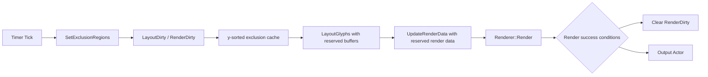

# TextVisualizer Current Optimization Status

## 목적

이 문서는 compact 이후에도 최근 `TextVisualizer` 성능 최적화와 품질 개선 상태를 정확히 이어받기 위한 현재 상태 문서다.

코드 변경 방향이 아닌 “현재까지 확정된 정책과 최근 커밋의 의미”를 고정한다. 새 세션에서는 이 문서를 먼저 읽고, 그 다음 `14-performance-and-quality-plan.ko.md`를 읽는 것을 기준으로 한다.

## 1. 현재 최신 커밋 상태

최근 중요 커밋:

- `Add TextVisualizer relative line height`
- `Add TextVisualizer line metrics cache`
- `Use TextVisualizer line metrics for layout and baseline`
- `Optimize TextVisualizer exclusion interval scanning`
- `Reserve TextVisualizer layout and render buffers`
- `Fix TextVisualizer UTC expectations`
- `Add TextVisualizer render dirty clear condition`

직전 기준 커밋:

- `ed71e35` `Fix TextVisualizer UTC expectations`

이번 커밋 최신 상태:

- render dirty clear 조건을 전용 커밋으로 도입했다.

현재 해석:

- `TextVisualizer`는 더 이상 skeleton 단계가 아니라 실제 glyph text를 화면에 표시하는 실험 렌더링 경로다.
- 최근 작업은 “보이게 만들기”에서 “moving bounds 상황의 relayout/render 비용과 line height 품질을 다듬는 단계”로 넘어왔다.
- 최신 UTC 수정 커밋은 기능 정책을 크게 바꾼 것이 아니라, 현재 의도된 render/lineHeight 정책에 맞게 테스트 기대값을 조정한 커밋이다.

## 2. 현재 동작 상태

현재 동작 상태는 다음과 같다.

- `TextVisualizer` glyph text는 화면에 보인다.
- exclusion region을 피해서 layout된다.
- moving bounds 이동 시 glyph가 재배치된다.
- performance demo sample이 존재한다.
- diagnostics/log cleanup은 완료됐다.
- line metrics 적용 후 line height가 더 자연스러워졌고, visible line 수 감소로 성능도 일부 개선됐다.
- paragraph 4 수준에서는 어느 정도 동작하지만 paragraph 8 수준은 아직 성능이 부족하다.
- 전체 `TextVisualizer` UTC는 `115 tests, 0 failures` 상태다.

현재 performance sample은 interactive moving bounds 비용을 관찰하기 위한 수동/반자동 확인 지점이다. 아직 FPS나 per-stage timing을 core instrumentation으로 고정하지는 않았다.

## 3. FontSize / LineHeight 현재 정책

현재 `TextVisualizer`의 font size와 line height 정책은 다음과 같다.

- `TextVisualizer::FontSize`는 pixel size로 정의한다.
- `LineHeight`는 relative multiplier만 지원한다.
- absolute line height는 제공하지 않는다.
- `lineHeight == -1.0f`이면 auto / natural line height를 사용한다.
- `lineHeight > 0.0f`이면 아래 공식을 사용한다.

```text
CalculatedLineHeight(px) = FontSize(px) * lineHeight
```

구현 의미:

- `LineHeight` 변경은 prepare dirty가 아니라 layout dirty + render dirty를 발생시킨다.
- `TextVisualizerImpl::SetLineHeight()`는 `MarkLayoutDirty()`, `MarkRenderDirty()`, `RelayoutRequest()`, `InvalidateMeasure()`를 수행한다.
- auto 상태에서는 `LayoutEngine`이 `PreparedText::LineMetrics.naturalLineHeight`를 사용할 수 있다.
- explicit relative line height가 있으면 caller가 계산한 pixel line height가 layout에 전달된다.

기존 `Label`과의 관계:

- 개념적으로는 `Label`의 `LineHeightMode::RELATIVE`와 같은 의미를 따른다.
- 다만 `TextVisualizer`에는 아직 `LineHeightMode` public API가 없다.
- absolute mode도 현재 제공하지 않는다.

## 4. LineMetrics 현재 상태

`PreparedText::LineMetrics`가 존재하며 다음 값을 저장한다.

- `ascender`
- `descender`
- `lineGap`
- `naturalLineHeight`
- `baselineOffset`

현재 계산 정책:

- `TextPreparer`가 glyph metrics를 기반으로 fallback line metrics를 계산한다.
- 기본 계산은 `ascender = max(yBearing)`, `descender = max(height - yBearing)`에 가깝다.
- `lineGap`은 현재 `fontSize * 0.2f` fallback이다.
- `naturalLineHeight`는 ascender / descender / lineGap을 합쳐 계산한다.
- `baselineOffset`은 ascender 기반으로 계산한다.

현재 사용 지점:

- `LayoutGlyphs()`와 `LayoutPlaceholder()`는 natural line height를 사용할 수 있다.
- explicit line height가 있으면 explicit 값이 우선한다.
- `AtlasViewAdapter`는 renderer glyph position 계산 시 `baselineOffset`을 우선 사용한다.
- metrics가 없으면 기존 same-line scan fallback을 유지한다.

남은 제한:

- 현재는 `PreparedText` level metrics 하나만 사용한다.
- line별 fallback font / emoji 혼합 정확도는 제한적이다.
- font-system 수준의 ascender / descender / lineGap 직접 조회는 아직 확인 필요다.

## 5. Exclusion Interval Scan Optimization 현재 상태

기존 문제:

- `BuildAvailableIntervals()`가 line마다 모든 exclusion region을 scan했다.
- moving bounds가 많고 visible line 수가 많을수록 `line count x bounds count` 비용이 발생했다.
- 각 line에서 vertical overlap region만 blocked interval로 넣은 뒤 x 방향 sort / merge를 수행했다.

현재 구조:

- layout pass 시작 시 exclusion region을 y 기준으로 정렬한 layout-local cache를 만든다.
- 각 line에서는 top / bottom 기준으로 overlap 가능 후보만 검사한다.
- `region.bottom <= lineTop`이면 이미 지난 region으로 보고 skip한다.
- `region.top >= lineBottom`이면 이후 region은 현재 line과 겹칠 수 없으므로 scan을 중단한다.
- blocked interval 생성 이후의 x 방향 sort / merge / available interval 생성 정책은 유지한다.

적용 범위:

- `LayoutPlaceholder()`
- `LayoutGlyphs()`
- public `BuildAvailableIntervals()` compatibility path

기대 효과:

- moving bounds가 많을 때 per-line scan 후보 수가 줄어든다.
- visible line count가 많을수록 효과가 커질 수 있다.
- layout 결과 정책은 바꾸지 않고 검사 후보만 줄인다.

남은 한계:

- bounds가 매 tick 움직이면 sorted cache는 매 layout pass마다 다시 생성된다.
- bounds 수가 매우 커지면 단순 y-sort보다 spatial index가 필요할 수 있다.
- affected lines partial relayout은 아직 도입하지 않았다.
- render 호출 횟수와 renderer geometry update 비용은 이번 최적화 범위 밖이다.

## 6. Layout / Render Buffer Reserve 현재 상태

최근 reserve 최적화는 반복 allocation / reallocation 비용을 줄이는 1차 성능 작업이다.

적용된 내용:

- `LayoutResult::Reserve()` helper가 추가됐다.
- `LayoutPlaceholder()`는 cluster count와 estimated line count 기반으로 reserve한다.
- `LayoutGlyphs()`는 glyph count와 estimated line count 기반으로 reserve한다.
- 각 `TextLine.fragments`는 `availableIntervals.Count()` 기반으로 reserve한다.
- `AtlasRendererBridge::UpdateRenderData()`는 renderable glyph count 기반으로 `std::vector` reserve를 수행한다.

유지한 정책:

- glyph placement 결과는 변경하지 않는다.
- cluster placement 결과는 변경하지 않는다.
- line break policy는 변경하지 않는다.
- line height / font size semantics는 변경하지 않는다.
- exclusion interval algorithm은 변경하지 않는다.
- `Renderer::Render()` 호출 정책과 render dirty 정책은 변경하지 않는다.

확인 필요:

- `Dali::Vector::Clear()` 이후 capacity 유지 정책은 장기 확인이 필요하다.
- `TextLine.fragments` reserve가 line-local copy / move 과정에서 어느 정도 효과가 있는지 확인이 필요하다.
- render data vector capacity가 long-running moving bounds 상황에서 유지되는지 sample/profiler 관찰이 필요하다.
- renderer internal allocation은 아직 남아 있을 수 있다.
- 더 큰 최적화를 위해 `LayoutResult` object reuse가 필요한지 확인해야 한다.

## 7. UTC 실패 수정 상태

실패했던 UTC:

- `UtcDaliTextVisualizerLineHeightChangeSmokeP`
- `UtcDaliTextVisualizerAtlasRendererBridgeAttachDuplicateP`

수정 내용:

- `UtcDaliTextVisualizerLineHeightChangeSmokeP`
  - line height 변경 후 특정 height 증가를 강하게 기대하지 않는다.
  - `SetLineHeight()` / `GetLineHeight()`와 non-zero measure 중심의 smoke test로 조정했다.
  - explicit line height 정책 자체는 layout engine test에서 별도로 확인한다.
- `UtcDaliTextVisualizerAtlasRendererBridgeAttachDuplicateP`
  - attached 상태에서도 `Renderer::Render()`를 다시 호출하는 현재 정책에 맞췄다.
  - renderer가 새 output actor를 반환할 수 있으므로 attach count 고정 기대를 완화했다.
  - 중요한 조건은 stale output actor가 누적되지 않고 최종 output actor가 host에 parented 되는 것이다.

현재 결과:

- targeted UTC passed
- 전체 `TextVisualizer` UTC: `115 tests, 0 failures`

커밋 참고:

- `Fix TextVisualizer UTC expectations`는 `--no-verify`로 생성됐다.
- 이유는 `utc-Dali-TextVisualizer.cpp`에 formatter를 전체 적용하면 unrelated formatting churn이 커지므로, 최소 diff를 유지하기 위해서다.

## 8. 현재 성능 병목 후보 재정리

| 후보 | 현재 상태 | 다음 조치 |
|---|---|---|
| diagnostics/log overhead | 정리 완료 | 유지 |
| line metrics / baseline | 1차 적용 완료 | line-level metrics 검토 |
| exclusion interval scan | 1차 최적화 완료 | spatial/partial relayout 검토 |
| buffer allocation | 1차 reserve 완료 | object reuse 검토 |
| render dirty 미해제 | 1차 clear 조건 적용 완료 | 장기 안정성 / renderer invalidation 검토 |
| redundant exclusion update | 아직 남음 | epsilon/unchanged skip 검토 |
| layout unchanged render skip | 아직 남음 | layout hash/version 검토 |
| `Renderer::Render` full call | 아직 남음 | geometry-only update 장기 검토 |

## 9. Render Dirty Clear 현재 상태

render dirty clear는 전용 성능 커밋으로 1차 조건을 도입했다.

기존 문제:

- render 성공 후에도 `mRenderDirty`가 계속 true로 남아 동일 상태에서 render path가 다시 열릴 수 있었다.
- attached 상태에서도 `AttachRendererToHost()`가 `Renderer::Render()`를 호출하는 현재 정책상, 성공한 render update 이후 dirty를 닫을 필요가 있었다.

현재 clear 조건:

- `mRenderDirty == true`
- renderable glyph가 존재한다.
- `UpdateRenderData()`가 성공한다.
- `AttachRendererToHost()`가 성공한다.
- `IsRenderReady()`가 true다.
- renderer diagnostics의 returned glyph count가 0보다 크다.
- returned glyph count가 requested glyph count 이하이다.
- renderer output actor가 valid하다.
- renderer output actor가 render host에 parented 되어 있다.

dirty가 다시 set되는 경로:

- `SetText()` / `SetFontFamily()` / `SetFontSize()`는 prepare + layout + render dirty를 다시 set한다.
- `SetLineHeight()`는 layout + render dirty를 다시 set한다.
- `SetTextColor()`는 render dirty를 다시 set한다.
- `SetExclusionRegions()` / `ClearExclusionRegions()`는 layout + render dirty를 다시 set한다.
- layout size 변경은 `OnRelayout()`에서 layout + render dirty를 다시 set한다.

현재 의도:

- 동일 상태에서 `UpdateRenderData()` / `Renderer::Render()` 반복 호출을 줄인다.
- moving bounds처럼 exclusion region이 바뀌면 render dirty가 다시 set되어 render update가 발생한다.
- `IsRenderReady()` 하나만으로 clear하지 않는다.

남은 확인 필요:

- `GetRendererOutputTotalRendererCount()`를 clear 조건에 포함할지 여부
- output actor 재생성 / 교체가 발생하는 경우 clear 조건 안정성
- render dirty false 상태에서 actor / renderer가 외부 요인으로 invalid 되는 경우
- future async render와 dirty clear 관계
- performance sample에서 FPS 개선 여부

## 10. 다음 추천 작업

현재 기준 추천 순서는 다음과 같다.

### A. Redundant exclusion region update skip

이유:

- moving bounds에서 `SetExclusionRegions()`가 매 tick vector compare / copy를 수행한다.
- epsilon compare 또는 sample-level unchanged skip을 검토할 수 있다.
- core API 정책과 sample upstream skip은 분리해서 판단해야 한다.

### B. Layout unchanged render skip

이유:

- exclusion regions가 바뀌어도 최종 glyph placement가 같을 수 있다.
- layout result가 같으면 `UpdateRenderData()` / `Renderer::Render()`를 생략할 여지가 있다.

주의:

- float comparison / hash 정책이 필요하다.
- layout version 또는 placement hash 기준을 먼저 설계해야 한다.

### C. Line-level metrics

이유:

- 현재는 `PreparedText` level metrics 하나만 사용한다.
- fallback font / emoji가 섞인 line의 line height / baseline 품질 개선이 필요하다.

### D. Word / cluster line break quality

이유:

- 현재 line break는 glyph advance sequential placement에 가깝다.
- 실제 텍스트 품질을 올리려면 word / cluster break 후보를 더 정교하게 사용해야 한다.

## 11. 다음 커밋 금지 사항

계속 유지할 원칙:

- 기존 `TextController` 수정 금지
- 기존 `TextView` 수정 금지
- existing `Label` / `InputField` 수정 금지
- `text-atlas-renderer.*` 수정 금지
- `internal/text/layouts/layout-engine.*` 수정 금지
- public API 추가는 명시 지시 없이는 금지
- `render dirty clear`는 전용 커밋에서만 다루기
- 성능 최적화와 품질 개선을 한 커밋에 섞지 않기
- `utc-Dali-TextVisualizer.cpp` formatter churn 주의

## 12. 최신 성능 경로 구조



현재 의미:

- timer tick마다 moving bounds가 갱신된다.
- `SetExclusionRegions()`는 layout dirty / render dirty를 발생시킨다.
- layout pass에서 exclusion regions를 y-sorted cache로 준비한다.
- `LayoutGlyphs()`는 reserved `LayoutResult` buffer를 사용한다.
- `UpdateRenderData()`는 renderable glyph count 기반 reserved render data를 사용한다.
- render 성공 조건을 만족하면 render dirty를 clear한다.
- 현재도 필요한 경우 `Renderer::Render()` full call은 남아 있다.

## 13. Compact 이후 복구 지침

새 세션에서는 다음 순서를 따른다.

1. 이 문서 `15-current-optimization-status.ko.md`를 먼저 읽는다.
2. 그 다음 `docs/text-visualizer/14-performance-and-quality-plan.ko.md`를 읽는다.
3. 작업 전 `git status --short`를 반드시 확인한다.
4. 최근 local commit push가 인증 문제로 실패할 수 있으므로, push 실패를 코드 문제로 보지 않는다.
5. 코드 작업 전 금지 파일과 기존 user change 여부를 다시 확인한다.

현재 가장 자연스러운 다음 작업은 redundant exclusion region update skip을 검토하는 것이다.
