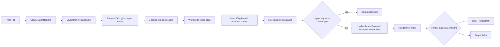

# TextVisualizer Current Optimization Status

## 목적

이 문서는 compact 이후에도 최근 `TextVisualizer` 성능 최적화와 품질 개선 상태를 정확히 이어받기 위한 현재 상태 문서다.

코드 변경 방향이 아닌 “현재까지 확정된 정책과 최근 커밋의 의미”를 고정한다. 새 세션에서는 이 문서를 먼저 읽고, 그 다음 `14-performance-and-quality-plan.ko.md`를 읽는 것을 기준으로 한다.

## 1. 현재 최신 커밋 상태

최근 중요 커밋:

- `Add TextVisualizer relative line height`
- `Add TextVisualizer line metrics cache`
- `Use TextVisualizer line metrics for layout and baseline`
- `Optimize TextVisualizer exclusion interval scanning`
- `Reserve TextVisualizer layout and render buffers`
- `Fix TextVisualizer UTC expectations`
- `Add TextVisualizer render dirty clear condition`
- `Add TextVisualizer performance sample exclusion update threshold`
- `Skip TextVisualizer render when layout is unchanged`
- `Add TextVisualizer performance sample status toggle`
- `Add TextVisualizer line-level metrics cache`
- `Add TextVisualizer TextLine metrics cache`
- `Replace performance sample labels with TextVisualizer`
- `Use pixel font size conversion for TextVisualizer`
- `Improve TextVisualizer performance sample visual quality`
- `Add TextVisualizer basic word wrap`
- `Optimize TextVisualizer word wrap lookup`
- `Optimize TextVisualizer exclusion region storage update`
- `Add optional TextVisualizer performance debug status`
- `Move TextVisualizer glyph layout cache into PreparedText`
- `Precompute TextVisualizer renderer glyph positions`
- `Reduce TextVisualizer redundant render data update`
- `Split TextVisualizer sample static and dynamic exclusions`
- `Add TextVisualizer experimental sample`

이번 작업 포함 최신 커밋:

- `Add TextVisualizer experimental sample`

최근 최적화 상태:

- render dirty clear 조건을 전용 커밋으로 도입했다.
- performance sample exclusion update threshold는 실험 후 데모 단순화를 위해 제거됐다.
- layout unchanged render skip을 도입했다.
- performance sample status text update를 `0` 키로 끄고 켤 수 있게 했다.
- renderer glyph position 계산에 line-level metrics cache를 우선 사용할 수 있게 했다.
- `LayoutGlyphs()`가 `TextLine.metrics`를 채우도록 했다.
- performance sample의 title / status / quote text를 `Label`에서 `TextVisualizer`로 교체했다.
- `TextPreparer`가 public pixel `FontSize`를 기존 `Label` / `Controller`와 같은 pixel-to-point 변환으로 shaping에 사용하도록 했다.
- performance sample의 orb exclusion을 ellipse band 기반으로 세분화하고 title / quote `TextVisualizer`를 parent `View` 안에서 layout되도록 조정했다.
- body `TextVisualizer` surface를 title origin부터 시작하도록 넓히고, title word-level exclusion과 full-surface orb movement를 적용했다.
- `LayoutGlyphs()`가 `PreparedText::LineBreakInfo`를 사용해 interval overflow 시 마지막 word break 후보를 우선 사용한다.
- word wrap lookup은 layout pass-local glyph cache를 사용해 repeated line break / glyph mapping lookup을 줄인다.
- `SetExclusionRegions()`는 exact compare 후 same-count region update를 in-place로 처리한다.
- performance sample의 detailed status는 기본 off이며, `0` key로 켠 경우에만 counters 문자열을 갱신한다.
- `PreparedText`가 stable glyph layout cache를 보관하고 `LayoutGlyphs()`가 이를 재사용한다.
- `AtlasViewAdapter`가 renderer glyph positions를 layout 연결 시점에 미리 계산하고 `GetGlyphs()` render path에서 재사용한다.
- `AtlasRendererBridge::UpdateRenderData()`는 full render data vector build 대신 lightweight validation + renderer ensure 역할로 축소됐다.
- performance sample은 static exclusions와 dynamic exclusions를 분리하고 combined exclusion vector를 member로 재사용한다.
- `text-visualizer-experimental-example.cpp`가 추가되어 기존 `text-experimental-example.cpp`의 visual simulation을 `TextVisualizer`로 비교할 수 있다.

현재 해석:

- `TextVisualizer`는 더 이상 skeleton 단계가 아니라 실제 glyph text를 화면에 표시하는 실험 렌더링 경로다.
- 최근 작업은 “보이게 만들기”에서 “moving bounds 상황의 relayout/render 비용과 line height 품질을 다듬는 단계”로 넘어왔다.
- 최신 UTC 수정 커밋은 기능 정책을 크게 바꾼 것이 아니라, 현재 의도된 render/lineHeight 정책에 맞게 테스트 기대값을 조정한 커밋이다.
- exclusion region storage update는 core exact compare 정책을 유지하면서 same-count update를 in-place로 처리하는 내부 최적화다.

## 2. 현재 동작 상태

현재 동작 상태는 다음과 같다.

- `TextVisualizer` glyph text는 화면에 보인다.
- exclusion region을 피해서 layout된다.
- moving bounds 이동 시 glyph가 재배치된다.
- performance demo sample이 존재한다.
- experimental sample은 `TextVisualizer` single surface mode와 partial tile mode를 모두 제공한다.
- performance demo sample은 주요 text UI를 `TextVisualizer` 중심으로 구성한다.
- performance demo sample은 기본 상태에서 FPS만 갱신하고 detailed counters는 만들지 않는다.
- performance demo sample의 title / quote text는 parent `View` 크기를 받아 multiline layout된다.
- moving orb exclusion은 orb 하나당 `11`개의 ellipse band를 사용한다.
- static title / drop cap / fixed column exclusions는 sample 초기화 시 cache되고, moving orb / overlay text exclusions만 tick마다 dynamic cache로 rebuild된다.
- body text는 title origin부터 status 영역 위까지 확장된 surface에서 layout된다.
- title은 word-level exclusion으로 body text가 글자 형상에 더 가깝게 회피한다.
- moving orb는 title 영역까지 포함한 확장 surface 안에서 이동한다.
- diagnostics/log cleanup은 완료됐다.
- line metrics 적용 후 line height가 더 자연스러워졌고, visible line 수 감소로 성능도 일부 개선됐다.
- line-level metrics cache가 추가되어 renderer baseline 보정 품질 개선의 기반이 생겼다.
- `LayoutResult`의 각 glyph line은 line별 metrics 후보를 보유할 수 있다.
- renderer glyph positions는 `AtlasViewAdapter` cache로 미리 계산된다.
- render data update는 glyph count만큼 별도 vector를 만들지 않고 first / last glyph smoke validation과 renderer creation gate만 수행한다.
- 기본 word wrap이 추가되어 space 등 unibreak 기반 line break 후보에서 줄바꿈할 수 있다.
- word wrap lookup에 필요한 stable glyph layout data는 prepare 단계에서 만들어진다.
- paragraph 4 수준에서는 어느 정도 동작하지만 paragraph 8 수준은 아직 성능이 부족하다.
- basic word wrap 이전 전체 `TextVisualizer` UTC는 `126 tests, 0 failures` 상태였고, 이번 변경 후 전체 UTC는 재검증이 필요하다.

현재 performance sample은 interactive moving bounds 비용을 관찰하기 위한 수동/반자동 확인 지점이다. 아직 FPS나 per-stage timing을 core instrumentation으로 고정하지는 않았다.

## 3. FontSize / LineHeight 현재 정책

현재 `TextVisualizer`의 font size와 line height 정책은 다음과 같다.

- `TextVisualizer::FontSize`는 pixel size로 정의한다.
- `LineHeight`는 relative multiplier만 지원한다.
- absolute line height는 제공하지 않는다.
- `lineHeight == -1.0f`이면 auto / natural line height를 사용한다.
- `lineHeight > 0.0f`이면 아래 공식을 사용한다.

```text
CalculatedLineHeight(px) = FontSize(px) * lineHeight
```

구현 의미:

- `LineHeight` 변경은 prepare dirty가 아니라 layout dirty + render dirty를 발생시킨다.
- `TextVisualizerImpl::SetLineHeight()`는 `MarkLayoutDirty()`, `MarkRenderDirty()`, `RelayoutRequest()`, `InvalidateMeasure()`를 수행한다.
- auto 상태에서는 `LayoutEngine`이 `PreparedText::LineMetrics.naturalLineHeight`를 사용할 수 있다.
- explicit relative line height가 있으면 caller가 계산한 pixel line height가 layout에 전달된다.

기존 `Label`과의 관계:

- 개념적으로는 `Label`의 `LineHeightMode::RELATIVE`와 같은 의미를 따른다.
- 다만 `TextVisualizer`에는 아직 `LineHeightMode` public API가 없다.
- absolute mode도 현재 제공하지 않는다.

FontSize conversion:

- `LabelImpl::SetFontSize()`와 `InputFieldImpl::SetFontSize()`는 public font size를 `Text::Controller::PIXEL_SIZE`로 `Controller::SetDefaultFontSize()`에 전달한다.
- `Controller`는 pixel size를 `point = pixel * 72 / DPI` 공식으로 point size로 변환해 저장한다.
- shaping 단계에서는 point size에 `FontClient::GetNumberOfPointsPerOneUnitOfPointSize()`를 곱해 `PointSize26Dot6` 값을 만든다.
- `TextPreparer`도 같은 pixel-to-point 변환을 사용한다.
- `PreparedText::GetFontSize()`는 public pixel font size를 그대로 반환한다.
- `fontSize <= 0.0f` fallback은 이미 26.6 단위인 `TextAbstraction::FontClient::DEFAULT_POINT_SIZE`를 사용한다.

확인 필요:

- system / user font size scale을 `TextVisualizer`에 반영할지 여부
- DPI 변경 시 cached DPI를 갱신할 필요가 있는지 여부
- default font size fallback이 `Label` 기본 configuration과 완전히 같은지 여부

## 4. LineMetrics 현재 상태

`PreparedText::LineMetrics`가 존재하며 다음 값을 저장한다.

- `ascender`
- `descender`
- `lineGap`
- `naturalLineHeight`
- `baselineOffset`

현재 계산 정책:

- `TextPreparer`가 glyph metrics를 기반으로 fallback line metrics를 계산한다.
- 기본 계산은 `ascender = max(yBearing)`, `descender = max(height - yBearing)`에 가깝다.
- `lineGap`은 현재 `fontSize * 0.2f` fallback이다.
- `naturalLineHeight`는 ascender / descender / lineGap을 합쳐 계산한다.
- `baselineOffset`은 ascender 기반으로 계산한다.

현재 사용 지점:

- `LayoutGlyphs()`와 `LayoutPlaceholder()`는 natural line height를 사용할 수 있다.
- explicit line height가 있으면 explicit 값이 우선한다.
- `AtlasViewAdapter`는 renderer glyph position 계산 시 line-level metrics cache를 먼저 사용한다.
- line cache가 없으면 `PreparedText::LineMetrics.baselineOffset`을 사용한다.
- metrics가 없으면 기존 same-line scan fallback을 유지한다.

line-level cache:

- `TextLineMetrics` 구조가 추가됐다.
- `TextLine`에 `metrics`가 추가됐다.
- `LayoutGlyphs()`는 `LayoutResult::lines`의 fragment glyph 범위를 scan해 line별 ascender / descender / baselineOffset / naturalLineHeight 후보를 계산한다.
- `AtlasViewAdapter`는 `TextLine.metrics`를 먼저 사용하고, 없으면 adapter-local 계산으로 fallback한다.
- cache lookup은 line top 기준이며 `0.001f` tolerance를 사용한다.
- 현재 metrics는 renderer position 보정에만 사용하고, layout y progression은 바꾸지 않는다.

남은 제한:

- line별 metrics 저장 기반은 들어갔지만, line별 line height 적용은 아직 없다.
- line별 fallback font / emoji 혼합 visual improvement는 sample/fixture로 추가 확인이 필요하다.
- font-system 수준의 ascender / descender / lineGap 직접 조회는 아직 확인 필요다.

## 5. Exclusion Interval Scan Optimization 현재 상태

기존 문제:

- `BuildAvailableIntervals()`가 line마다 모든 exclusion region을 scan했다.
- moving bounds가 많고 visible line 수가 많을수록 `line count x bounds count` 비용이 발생했다.
- 각 line에서 vertical overlap region만 blocked interval로 넣은 뒤 x 방향 sort / merge를 수행했다.

현재 구조:

- layout pass 시작 시 exclusion region을 y 기준으로 정렬한 layout-local cache를 만든다.
- 각 line에서는 top / bottom 기준으로 overlap 가능 후보만 검사한다.
- `region.bottom <= lineTop`이면 이미 지난 region으로 보고 skip한다.
- `region.top >= lineBottom`이면 이후 region은 현재 line과 겹칠 수 없으므로 scan을 중단한다.
- blocked interval 생성 이후의 x 방향 sort / merge / available interval 생성 정책은 유지한다.

적용 범위:

- `LayoutPlaceholder()`
- `LayoutGlyphs()`
- public `BuildAvailableIntervals()` compatibility path

기대 효과:

- moving bounds가 많을 때 per-line scan 후보 수가 줄어든다.
- visible line count가 많을수록 효과가 커질 수 있다.
- layout 결과 정책은 바꾸지 않고 검사 후보만 줄인다.

남은 한계:

- bounds가 매 tick 움직이면 sorted cache는 매 layout pass마다 다시 생성된다.
- bounds 수가 매우 커지면 단순 y-sort보다 spatial index가 필요할 수 있다.
- affected lines partial relayout은 아직 도입하지 않았다.
- render 호출 횟수와 renderer geometry update 비용은 이번 최적화 범위 밖이다.

## 6. Layout / Render Buffer Reserve 현재 상태

최근 reserve 최적화는 반복 allocation / reallocation 비용을 줄이는 1차 성능 작업이다.

적용된 내용:

- `LayoutResult::Reserve()` helper가 추가됐다.
- `LayoutPlaceholder()`는 cluster count와 estimated line count 기반으로 reserve한다.
- `LayoutGlyphs()`는 glyph count와 estimated line count 기반으로 reserve한다.
- 각 `TextLine.fragments`는 `availableIntervals.Count()` 기반으로 reserve한다.
- `AtlasRendererBridge::UpdateRenderData()`는 renderable glyph count 기반으로 `std::vector` reserve를 수행한다.

유지한 정책:

- glyph placement 결과는 변경하지 않는다.
- cluster placement 결과는 변경하지 않는다.
- line break policy는 변경하지 않는다.
- line height / font size semantics는 변경하지 않는다.
- exclusion interval algorithm은 변경하지 않는다.
- `Renderer::Render()` 호출 정책과 render dirty 정책은 변경하지 않는다.

확인 필요:

- `Dali::Vector::Clear()` 이후 capacity 유지 정책은 장기 확인이 필요하다.
- `TextLine.fragments` reserve가 line-local copy / move 과정에서 어느 정도 효과가 있는지 확인이 필요하다.
- render data vector capacity가 long-running moving bounds 상황에서 유지되는지 sample/profiler 관찰이 필요하다.
- renderer internal allocation은 아직 남아 있을 수 있다.
- 더 큰 최적화를 위해 `LayoutResult` object reuse가 필요한지 확인해야 한다.

## 7. UTC 실패 수정 상태

실패했던 UTC:

- `UtcDaliTextVisualizerLineHeightChangeSmokeP`
- `UtcDaliTextVisualizerAtlasRendererBridgeAttachDuplicateP`

수정 내용:

- `UtcDaliTextVisualizerLineHeightChangeSmokeP`
  - line height 변경 후 특정 height 증가를 강하게 기대하지 않는다.
  - `SetLineHeight()` / `GetLineHeight()`와 non-zero measure 중심의 smoke test로 조정했다.
  - explicit line height 정책 자체는 layout engine test에서 별도로 확인한다.
- `UtcDaliTextVisualizerAtlasRendererBridgeAttachDuplicateP`
  - attached 상태에서도 `Renderer::Render()`를 다시 호출하는 현재 정책에 맞췄다.
  - renderer가 새 output actor를 반환할 수 있으므로 attach count 고정 기대를 완화했다.
  - 중요한 조건은 stale output actor가 누적되지 않고 최종 output actor가 host에 parented 되는 것이다.

현재 결과:

- targeted UTC passed
- 당시 전체 `TextVisualizer` UTC: `123 tests, 0 failures`

커밋 참고:

- `Fix TextVisualizer UTC expectations`는 `--no-verify`로 생성됐다.
- 이유는 `utc-Dali-TextVisualizer.cpp`에 formatter를 전체 적용하면 unrelated formatting churn이 커지므로, 최소 diff를 유지하기 위해서다.

## 8. 현재 성능 병목 후보 재정리

| 후보 | 현재 상태 | 다음 조치 |
|---|---|---|
| diagnostics/log overhead | 정리 완료 | 유지 |
| line metrics / baseline | `TextLine.metrics` 기반 1차 적용 완료 | variable line height 설계 검토 |
| exclusion interval scan | 1차 최적화 완료 | spatial/partial relayout 검토 |
| buffer allocation | 1차 reserve 완료 | object reuse 검토 |
| render dirty 미해제 | 1차 clear 조건 적용 완료 | 장기 안정성 / renderer invalidation 검토 |
| redundant exclusion update | sample threshold 실험은 제거, core storage update 최적화 완료 | core epsilon/unchanged 정책 별도 검토 |
| layout unchanged render skip | 1차 signature skip 적용 완료 | epsilon / signature cost 검토 |
| sample Label overhead | title/status/quote TextVisualizer 교체 완료 | sample visual fidelity 확인 |
| word wrap 품질 | 기본 lineBreakInfo 기반 wrap + lookup cache 적용 완료 | cluster-perfect / bidi / emoji 품질 검토 |
| `Renderer::Render` full call | 아직 남음 | geometry-only update 장기 검토 |

## 9. Render Dirty Clear 현재 상태

render dirty clear는 전용 성능 커밋으로 1차 조건을 도입했다.

기존 문제:

- render 성공 후에도 `mRenderDirty`가 계속 true로 남아 동일 상태에서 render path가 다시 열릴 수 있었다.
- attached 상태에서도 `AttachRendererToHost()`가 `Renderer::Render()`를 호출하는 현재 정책상, 성공한 render update 이후 dirty를 닫을 필요가 있었다.

현재 clear 조건:

- `mRenderDirty == true`
- renderable glyph가 존재한다.
- `UpdateRenderData()`가 성공한다.
- `AttachRendererToHost()`가 성공한다.
- `IsRenderReady()`가 true다.
- renderer diagnostics의 returned glyph count가 0보다 크다.
- returned glyph count가 requested glyph count 이하이다.
- renderer output actor가 valid하다.
- renderer output actor가 render host에 parented 되어 있다.

dirty가 다시 set되는 경로:

- `SetText()` / `SetFontFamily()` / `SetFontSize()`는 prepare + layout + render dirty를 다시 set한다.
- `SetLineHeight()`는 layout + render dirty를 다시 set한다.
- `SetTextColor()`는 render dirty를 다시 set한다.
- `SetExclusionRegions()` / `ClearExclusionRegions()`는 layout + render dirty를 다시 set한다.
- layout size 변경은 `OnRelayout()`에서 layout + render dirty를 다시 set한다.

현재 의도:

- 동일 상태에서 `UpdateRenderData()` / `Renderer::Render()` 반복 호출을 줄인다.
- moving bounds처럼 exclusion region이 바뀌면 render dirty가 다시 set되어 render update가 발생한다.
- `IsRenderReady()` 하나만으로 clear하지 않는다.

남은 확인 필요:

- `GetRendererOutputTotalRendererCount()`를 clear 조건에 포함할지 여부
- output actor 재생성 / 교체가 발생하는 경우 clear 조건 안정성
- render dirty false 상태에서 actor / renderer가 외부 요인으로 invalid 되는 경우
- future async render와 dirty clear 관계
- performance sample에서 FPS 개선 여부

## 10. Performance Sample Exclusion Update Threshold 현재 상태

performance sample의 sample-level exclusion update threshold는 데모 단순화를 위해 제거됐다.

현재 정책:

- core `TextVisualizer::SetExclusionRegions()` exact compare 정책은 유지한다.
- sample은 moving bounds 상태를 매 tick 반영한다.
- threshold 관련 키 조작과 status 항목은 현재 sample에서 사용하지 않는다.
- redundant update 감소는 core storage update 최적화와 향후 static/dynamic exclusion split 쪽에서 다룬다.

의미:

- 데모 화면과 조작을 단순하게 유지한다.
- threshold가 visual fidelity에 영향을 줄 가능성을 제거했다.
- core API의 epsilon compare 정책은 여전히 별도 설계 대상이다.

확인 필요:

- core epsilon 정책이 필요한지, caller-level skip으로 충분한지
- sample static/dynamic exclusion split으로 threshold 없이 충분히 가벼워지는지

## 11. Layout Unchanged Render Skip 현재 상태

layout unchanged render skip은 core `TextVisualizerImpl` 내부 최적화로 1차 적용됐다.

현재 정책:

- `LayoutResult::CalculateSignature(float epsilon = 0.01f)`가 추가됐다.
- 기본 epsilon은 `0.01px`다.
- float 값은 `round(value / epsilon)` 방식으로 quantize한다.
- signature는 line / cluster / glyph placement count, layout size, line metrics, cluster placement, glyph placement 좌표와 advance를 포함한다.

skip 조건:

- render dirty가 true다.
- dirty reason이 force render가 아니라 placement-only dirty다.
- current layout이 empty가 아니다.
- 마지막 성공 render의 layout signature가 있다.
- current layout signature가 마지막 render signature와 같다.
- bridge가 render-ready 상태다.
- 기존 renderer output actor가 valid하고 render host에 parented 되어 있다.

force render dirty 정책:

- text / font family / font size 변경은 prepare dirty를 통해 force render로 처리한다.
- textColor 변경은 layout이 같아도 render가 필요하므로 force render로 처리한다.
- prepare 후 첫 render도 force render다.
- exclusion / size / lineHeight 변경은 placement-only dirty로 처리되어, layout signature가 같으면 render skip이 가능하다.

render 성공 후:

- `UpdateRenderData()` / `AttachRendererToHost()`가 성공하고 render-ready / output parent / glyph count 조건을 만족하면 current layout signature를 저장한다.
- 그 뒤 render dirty를 clear한다.

기대 효과:

- moving bounds가 계속 변해도 최종 glyph placement가 같으면 `UpdateRenderData()` / `Renderer::Render()` 호출을 생략한다.
- 기존 sample threshold 실험보다 core 쪽에서 더 직접적으로 “결과가 같은 layout”을 걸러낸다.

확인 필요:

- `0.01px` epsilon이 실제 device / font metrics에서 적절한지
- very large glyph count에서 signature 계산 비용이 skip 이득보다 큰 경우가 있는지
- future per-glyph color / style 도입 시 signature와 force-render reason 확장 필요 여부

## 12. Line-level Metrics Cache 현재 상태

line-level metrics cache는 `PreparedText` 전체 metrics의 한계를 보완하는 품질 개선 기반이다.

현재 구조:

- `TextLineMetrics`는 ascender / descender / baselineOffset / naturalLineHeight / valid를 가진다.
- `TextLine`이 `TextLineMetrics metrics`를 보유한다.
- `LayoutGlyphs()`가 line placement 완료 후 glyph range를 scan해 `TextLine.metrics`를 채운다.
- `AtlasViewAdapter`가 non-owning `PreparedText`와 `LayoutResult` 조합을 기준으로 cache를 만든다.
- `SetPreparedText()` 또는 `SetLayoutResult()`가 호출되면 cache를 rebuild한다.
- `Clear()`는 cache도 함께 비운다.

계산 정책:

- line fragment의 `glyphStart`부터 `glyphEnd`까지 glyph metrics를 scan한다.
- `ascender = max(yBearing)`
- `descender = max(height - yBearing)`
- `baselineOffset = ascender`
- `naturalLineHeight = ascender + descender + PreparedText::LineMetrics.lineGap`
- glyph 기반 metrics를 만들 수 없으면 `PreparedText::LineMetrics` fallback을 사용할 수 있다.

renderer position 우선순위:

1. `TextLine.metrics`
2. adapter-local line metrics recalculation
3. `PreparedText::LineMetrics.baselineOffset`
4. 기존 same-line scan fallback
5. `0.0f`

유지한 정책:

- public API는 추가하지 않았다.
- line break policy는 변경하지 않았다.
- layout y progression과 line height semantics는 변경하지 않았다.
- explicit line height가 있으면 `TextLine.height`는 기존 explicit 값을 유지한다.
- render dirty clear 조건은 변경하지 않았다.

variable line height를 아직 적용하지 않은 이유:

- `LayoutGlyphs()`는 현재 line 시작 전에 line height로 exclusion interval vertical band를 계산한다.
- line별 natural height는 line placement가 끝난 뒤 알 수 있다.
- 이를 바로 y progression에 쓰면 exclusion overlap 계산과 다음 line y 이동 정책이 함께 바뀐다.
- 따라서 이번 단계는 `TextLine.metrics` 저장과 renderer baseline 품질 기반까지만 진행한다.

확인 필요:

- line-level `naturalLineHeight`를 실제 layout height에 반영할지
- variable line height를 허용할지
- fallback font / emoji가 많은 line에서 visual improvement가 충분한지
- `LayoutGlyphs()`에서 line metrics를 계산하는 비용
- adapter cache와 `TextLine.metrics` 역할 중복 정리
- cache 위치를 adapter에 유지할지, 장기적으로 `LayoutResult`에 포함할지

## 13. Performance Sample Visual Quality 현재 상태

performance sample은 `TextVisualizer` 중심 관찰을 유지하면서 visual fidelity를 한 단계 보강했다.

현재 구조:

- title은 `mTitleArea` parent `View` 안에 `mTitleText`를 넣는다.
- `mTitleArea`는 기존 title 위치 / 크기를 갖고, `mTitleText`는 local `(0, 0)`에서 `MATCH_PARENT`로 채운다.
- body `TextVisualizer` surface는 title origin에서 시작해 status 영역 위까지 확장된다.
- body는 title word-level exclusion을 받아 title glyph silhouette에 가깝게 흐른다.
- quote block은 `container`, `accent`, `text`로 구성된다.
- quote `container`가 기존 quote position / size를 갖고, quote `TextVisualizer`는 container 내부 local 좌표와 inner size를 사용한다.
- quote exclusion rect는 계속 저장된 quote `position / size` 전체 영역을 사용한다.

orb exclusion:

- moving orb는 orb 하나당 `11`개의 horizontal exclusion band를 만든다.
- 각 band width는 ellipse 식 `sqrt(1 - normalizedY^2)` 기반으로 계산한다.
- 기존 orb padding은 유지한다.
- moving orb clamp 영역은 확장된 body surface 기준이라 title 영역까지 이동할 수 있다.
- fixed column bounds와 quote bounds 정책은 변경하지 않는다.

sample text:

- body surface가 title origin부터 시작하고 title exclusion 영역이 추가되어 실제 visible text가 줄어든다.
- 이를 보완하기 위해 body sample text에 추가 문단을 넣었다.

유지한 값:

- `TITLE_FONT_SIZE`
- `BODY_FONT_SIZE`
- `QUOTE_FONT_SIZE`
- `BODY_LINE_HEIGHT`
- `QUOTE_LINE_HEIGHT`
- `CONTENT_TOP`
- `CONTENT_HEIGHT`
- `MIN_FONT_SIZE`
- `MAX_FONT_SIZE`

계속 무시하는 style:

- italic
- horizontal / vertical alignment
- async rendering
- TextVisualizer-level padding API

확인 필요:

- 실제 sample 실행에서 title / quote multiline이 의도대로 보이는지 확인
- orb band count `11`의 visual quality와 FPS 균형 확인
- status update toggle off 상태에서 FPS 관찰
- TextVisualizer 자체 alignment / padding / style API 필요 여부

## 14. Basic Word Wrap 현재 상태

basic word wrap은 `TextVisualizer` 전용 `LayoutGlyphs()`에만 적용된 1차 품질 개선이다.

현재 정책:

- `PreparedText::GetLineBreakInfo()`에 저장된 unibreak 기반 `LINE_ALLOW_BREAK` / `LINE_MUST_BREAK`를 사용한다.
- ICU line break를 새로 호출하지 않는다.
- interval overflow가 발생하면 현재 interval 안의 마지막 allowed break 후보에서 먼저 줄바꿈한다.
- break 후보가 없거나 단어가 interval보다 길면 기존처럼 glyph 단위 fallback으로 배치한다.
- `LINE_MUST_BREAK`는 해당 glyph range를 배치한 뒤 현재 line을 종료하는 hard break 후보로 취급한다.
- 한 line에 여러 available interval이 있으면 interval마다 같은 range 계산을 수행한다.

유지한 범위:

- public API는 추가하지 않았다.
- 기존 `TextController`, `TextView`, `Label` / `InputField`, `text-atlas-renderer.*`는 수정하지 않았다.
- line height, baseline, render dirty clear, exclusion interval merge 정책은 변경하지 않았다.
- hyphenation, ellipsis, bidi / RTL, justification은 도입하지 않았다.

확인 필요:

- mandatory newline glyph가 shaping 결과에서 어떤 glyph range로 나타나는지 추가 fixture 확인
- complex cluster / emoji ZWJ sequence를 중간에서 자르지 않는 정책 강화
- interval 사이에서 단어를 같은 line의 다음 fragment로 보낼지 다음 line으로 보낼지 장기 정책
- Korean / Japanese / Thai word break 품질
- bidi / RTL text와 visual order

## 15. Word Wrap Lookup Optimization 현재 상태

basic word wrap 적용 후 performance sample에서 layout 비용 증가가 관찰되어, word wrap lookup을 layout pass-local cache로 최적화했다.

현재 구조:

- `LayoutGlyphs()` 시작 시 `GlyphLayoutCache`를 glyph count 기준으로 한 번 생성한다.
- glyph별 placement advance와 placement width를 cache한다.
- `prefixAdvances`를 사용해 interval scan 중 cursor x를 반복 누적 없이 계산한다.
- glyph 뒤 character boundary의 `LINE_ALLOW_BREAK` / `LINE_MUST_BREAK` 여부를 glyph index 기준 cache로 변환한다.
- fragment character start / end도 cache된 glyph-to-character 범위를 사용한다.

유지한 정책:

- word wrap 결과 정책은 바꾸지 않았다.
- overflow 시 마지막 allowed break 후보를 우선 사용한다.
- break 후보가 없으면 glyph 단위 fallback을 유지한다.
- oversized first glyph fallback을 유지한다.
- public API, line height, baseline, render dirty clear 조건은 변경하지 않았다.

남은 한계:

- interval마다 range scan 자체는 남아 있다.
- 매우 긴 텍스트에서는 cluster-level range cache나 partial layout이 필요할 수 있다.
- complex cluster / ICU / bidi / hyphenation / ellipsis는 여전히 제외다.

## 16. Label-like Measure Policy 현재 상태

`TextVisualizer` measure / relayout 기준을 editing control인 `InputField`가 아니라 display control인 `Label` 쪽 정책에 맞춰 정리했다.

현재 정책:

- `OnInitialize()`는 `LabelImpl` 기본 경로와 같이 width `FILL_TO_PARENT`, height `DIMENSION_DEPENDENCY`를 사용한다.
- fixed requested width / height는 requested size를 존중한다.
- `WRAP_CONTENT` width / height는 text natural width와 해당 width에서의 layout height를 기준으로 측정한다.
- `MATCH_PARENT` / fill parent는 positive parent constraint가 있으면 그 constraint를 사용한다.
- `OnRelayout()`은 실제 allocated size를 우선 사용하고, width가 0 이하이면 natural width를 fallback으로 사용한다.
- `OnRelayout()`은 `LabelImpl` / `InputFieldImpl`처럼 base `ViewImpl::OnRelayout()`을 호출하지 않고 내부 render host를 직접 size sync한다.
- empty text는 wrap 측정에서 `0x0`을 반환하지만 fixed requested size는 유지한다.

범위에서 제외한 것:

- `InputField`의 cursor / selection / decorator / IME / placeholder interaction
- `Label`의 TextFit / ellipsis / rich style / async rendering / marquee 특수 경로
- public API 추가

남은 확인 필요:

- 반복 `OnMeasure()` 비용을 줄이기 위한 measure cache 필요 여부
- `MATCH_PARENT` 측정 정책을 Label과 더 엄밀히 맞출지 여부
- fixed height overflow / clipping의 장기 정책

## 17. Exclusion Region Storage Update 현재 상태

`SetExclusionRegions()`는 public API와 exact compare policy를 유지한 채 내부 저장소 갱신 방식을 최적화했다.

기존 문제:

- moving bounds 상황에서는 exclusion regions가 매 tick 바뀔 수 있다.
- 기존 구현은 값이 다르면 `mExclusionRegions` 전체 assignment를 수행했다.
- region count가 같고 rect 값만 바뀌는 경우에도 저장소 전체 교체 경로가 열렸다.

현재 정책:

- `AreExclusionRegionsEqual()` exact compare는 그대로 유지한다.
- 값이 같으면 dirty를 걸지 않는다.
- 값이 다르고 region count가 같으면 기존 `mExclusionRegions` storage를 in-place update한다.
- 값이 다르고 region count가 다르면 `Clear()` 후 `Reserve()` + `PushBack()`으로 capacity 재사용 가능성을 높인다.
- `ClearExclusionRegions()`는 기존처럼 `Clear()`를 호출하고 dirty / relayout / measure invalidation 정책도 유지한다.

유지한 것:

- public API 변경 없음
- epsilon compare 도입 없음
- layout / word wrap policy 변경 없음
- render dirty clear 조건 변경 없음

확인 필요:

- `Dali::Vector::Clear()` 이후 capacity 유지 여부
- exact compare 비용 자체를 줄일 필요가 있는지
- core epsilon compare가 필요한지, 아니면 caller-level skip으로 충분한지

## 18. Optional Performance Debug Status 현재 상태

performance sample의 status 출력은 데모 기본 성능을 해치지 않도록 optional debug path로 정리했다.

현재 정책:

- `mDetailedStatusEnabled` 기본값은 `false`다.
- status off 상태에서는 `UpdateStatusText()`가 FPS만 짧게 갱신한다.
- status off 상태에서는 detailed counters 문자열을 만들지 않는다.
- `0` key를 누르면 debug status를 켠다.
- debug status on 상태에서는 rough FPS, frame, orb, exclusion, font, color 관련 counters를 `STATUS_INTERVAL`마다 표시한다.
- 다시 `0` key를 누르면 detailed counters를 끄고 FPS-only 표시로 돌아간다.

의미:

- 수요일 데모 기본 상태에서는 visual/performance를 우선한다.
- 필요할 때만 counters를 켜서 현재 sample update 경향을 확인할 수 있다.
- status `TextVisualizer`는 기본 상태에서도 FPS-only text 갱신 비용은 감수하지만, detailed counter formatting 비용은 debug on 상태로 제한한다.

확인 필요:

- debug on 상태의 status text 길이와 prepare 비용
- rough FPS와 실제 compositor / GPU frame rate의 차이
- 더 정밀한 stage timing을 sample-only로 추가할지 여부

## 19. PreparedText glyph layout cache 현재 상태

basic word wrap 이후 `LayoutGlyphs()`는 glyph advance, glyph width, prefix advance, glyph별 character range, line break 가능 여부를 layout pass마다 cache로 만들고 있었다.

현재는 이 stable cache를 `PreparedText`로 이동했다.

현재 `PreparedText::GlyphLayoutData` 항목:

- `advances`
- `widths`
- `prefixAdvances`
- `characterStarts`
- `characterEnds`
- `breakAllowedAfterGlyph`
- `breakMandatoryAfterGlyph`

현재 정책:

- `TextPreparer`가 shaping / glyph metrics / glyph mapping / line break info를 만든 뒤 `GlyphLayoutData`를 구성한다.
- `LayoutGlyphs()`는 `PreparedText`에 glyph layout data가 있으면 이를 우선 사용한다.
- test fixture 등에서 glyph layout data가 없는 `PreparedText`가 들어오면 기존 계산과 동일한 local fallback을 사용한다.
- glyph / mapping / line break setter는 stale cache를 피하기 위해 glyph layout data를 clear한다.
- word wrap, line break, exclusion, render dirty 정책은 변경하지 않았다.

의미:

- moving bounds처럼 text / font / font size는 그대로이고 exclusion만 바뀌는 상황에서 layout pass 시작 비용을 줄인다.
- memory 사용량은 glyph count에 비례해 증가한다.
- 다음 후보인 prefix advance binary search나 renderer glyph position cache의 기반이 된다.

확인 필요:

- 긴 텍스트에서 memory 증가와 CPU 감소의 균형
- glyph layout data와 future layout result / renderer position cache의 역할 분리
- word wrap range scan 자체를 더 줄일지 여부

## 진행: TextVisualizer experimental sample

`samples/text/text-visualizer-experimental-example.cpp`가 추가됐다.

목적:

- 기존 `samples/text/text-experimental-example.cpp`의 움직이는 text grid / ball simulation 룩을 유지한다.
- 기존 샘플은 `Label` tile 여러 개로 앱 레벨 partial rendering을 구성한다.
- 새 샘플은 `TextVisualizer`로 같은 시나리오를 비교한다.

render mode:

- 기본값은 `SINGLE_TEXT_VISUALIZER`이다.
- single mode는 하나의 `TextVisualizer`가 전체 grid text를 렌더링한다.
- single mode는 매 frame 전체 text buffer를 문자열로 만들고 hash가 달라진 경우에만 `SetText()`를 호출한다.
- `PARTIAL_TEXT_VISUALIZER_TILES` mode는 기존 tile dirty 구조를 유지하되 각 tile을 `Label` 대신 `TextVisualizer`로 렌더링한다.
- `5` key로 두 mode를 전환한다.

지원 / 제외:

- `1`, `4`, `7`, `9`, `0`, ESC / BACK key 동작은 유지한다.
- `2`, `3`, `6`, `8` 계열 Label-specific 기능은 `TextVisualizer` public API에 없으므로 no-op 또는 unsupported log로 둔다.
- markup color, DALI text color animation, async rendering, overflow mode, italic/rich style은 이번 범위에서 제외했다.
- 기존 `text-experimental-example.cpp`는 수정하지 않았다.

확인 필요:

- single mode에서 긴 문자열을 매 frame `SetText()`하는 비용과 tile partial mode의 비용 비교
- `TextVisualizer` word wrap이 monospace grid rendering에서 기대한 고정 셀 느낌을 충분히 유지하는지
- 추후 fixed-cell / monospace-preserve layout option이 필요한지

## 20. 다음 추천 작업

현재 기준 추천 순서는 다음과 같다.

### A. Incremental `LayoutResult` signature

이유:

- layout unchanged render skip을 위해 현재 `LayoutResult::CalculateSignature()`가 placement 전체를 scan한다.
- layout placement push 시 signature를 함께 누적하면 별도 full scan 비용을 줄일 수 있다.
- public API 영향 없이 internal `LayoutResult` 확장으로 접근 가능하다.

### B. `ViewInterface::GetGlyphs()` copy path 분석

이유:

- renderer glyph position cache와 lightweight `UpdateRenderData()` 적용 후에도 render path의 glyph info copy는 남아 있다.
- `Text::ViewInterface` contract를 유지하면서 adapter / view interface 경계에서 줄일 수 있는지 분석할 가치가 있다.
- `AtlasRenderer` 수정이 필요하면 데모 후 작업으로 분리한다.

### C. Core sorted exclusion cache 분석

이유:

- sample static / dynamic split은 완료됐지만 core layout pass에서는 combined exclusion vector를 매번 y-sort한다.
- `TextVisualizerImpl`에 sorted exclusion cache를 둘 수 있으면 layout pass 시작 비용을 더 줄일 수 있다.
- public API 없이 internal boundary에서 처리 가능한지 검토가 필요하다.

### D. Advanced word / cluster line break quality

이유:

- 기본 word wrap은 들어갔지만 glyph / character map 기반의 1차 구현이다.
- 실제 텍스트 품질을 더 올리려면 cluster-perfect break, emoji ZWJ sequence, bidi / RTL, hyphenation 등을 별도 설계해야 한다.

## 21. 다음 커밋 금지 사항

계속 유지할 원칙:

- 기존 `TextController` 수정 금지
- 기존 `TextView` 수정 금지
- existing `Label` / `InputField` 수정 금지
- `text-atlas-renderer.*` 수정 금지
- `internal/text/layouts/layout-engine.*` 수정 금지
- public API 추가는 명시 지시 없이는 금지
- `render dirty clear`는 전용 커밋에서만 다루기
- 성능 최적화와 품질 개선을 한 커밋에 섞지 않기
- `utc-Dali-TextVisualizer.cpp` formatter churn 주의

## 22. 최신 성능 경로 구조



현재 의미:

- sample의 title / status / quote text도 `TextVisualizer`를 사용한다.
- timer tick마다 moving bounds가 갱신된다.
- `SetExclusionRegions()`는 layout dirty / render dirty를 발생시킨다.
- `LayoutGlyphs()`는 `PreparedText`에 저장된 glyph layout cache를 사용한다.
- layout pass에서 exclusion regions를 y-sorted cache로 준비한다.
- `LayoutGlyphs()`는 reserved `LayoutResult` buffer를 사용한다.
- `AtlasViewAdapter`는 renderer position 계산 전 line-level metrics cache를 준비한다.
- placement-only dirty에서 layout signature가 마지막 render와 같으면 render path를 skip할 수 있다.
- `UpdateRenderData()`는 renderable glyph count 기반 reserved render data를 사용한다.
- render 성공 조건을 만족하면 render dirty를 clear한다.
- 현재도 필요한 경우 `Renderer::Render()` full call은 남아 있다.

## 23. Compact 이후 복구 지침

새 세션에서는 다음 순서를 따른다.

1. 이 문서 `15-current-optimization-status.ko.md`를 먼저 읽는다.
2. 그 다음 `docs/text-visualizer/14-performance-and-quality-plan.ko.md`를 읽는다.
3. 작업 전 `git status --short`를 반드시 확인한다.
4. 최근 local commit push가 인증 문제로 실패할 수 있으므로, push 실패를 코드 문제로 보지 않는다.
5. 코드 작업 전 금지 파일과 기존 user change 여부를 다시 확인한다.

현재 가장 자연스러운 다음 작업은 core redundant exclusion update policy 또는 line-level line height 적용 여부를 검토하는 것이다.
