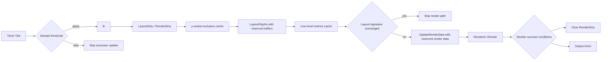

# TextVisualizer Current Optimization Status

## 목적

이 문서는 compact 이후에도 최근 `TextVisualizer` 성능 최적화와 품질 개선 상태를 정확히 이어받기 위한 현재 상태 문서다.

코드 변경 방향이 아닌 “현재까지 확정된 정책과 최근 커밋의 의미”를 고정한다. 새 세션에서는 이 문서를 먼저 읽고, 그 다음 `14-performance-and-quality-plan.ko.md`를 읽는 것을 기준으로 한다.

## 1. 현재 최신 커밋 상태

최근 중요 커밋:

- `Add TextVisualizer relative line height`
- `Add TextVisualizer line metrics cache`
- `Use TextVisualizer line metrics for layout and baseline`
- `Optimize TextVisualizer exclusion interval scanning`
- `Reserve TextVisualizer layout and render buffers`
- `Fix TextVisualizer UTC expectations`
- `Add TextVisualizer render dirty clear condition`
- `Add TextVisualizer performance sample exclusion update threshold`
- `Skip TextVisualizer render when layout is unchanged`
- `Add TextVisualizer performance sample status toggle`
- `Add TextVisualizer line-level metrics cache`
- `Add TextVisualizer TextLine metrics cache`
- `Replace performance sample labels with TextVisualizer`

이번 작업 포함 최신 커밋:

- `Replace performance sample labels with TextVisualizer`

최근 최적화 상태:

- render dirty clear 조건을 전용 커밋으로 도입했다.
- performance sample에 exclusion update threshold를 도입했다.
- layout unchanged render skip을 도입했다.
- performance sample status text update를 `0` 키로 끄고 켤 수 있게 했다.
- renderer glyph position 계산에 line-level metrics cache를 우선 사용할 수 있게 했다.
- `LayoutGlyphs()`가 `TextLine.metrics`를 채우도록 했다.
- performance sample의 title / status / quote text를 `Label`에서 `TextVisualizer`로 교체했다.

현재 해석:

- `TextVisualizer`는 더 이상 skeleton 단계가 아니라 실제 glyph text를 화면에 표시하는 실험 렌더링 경로다.
- 최근 작업은 “보이게 만들기”에서 “moving bounds 상황의 relayout/render 비용과 line height 품질을 다듬는 단계”로 넘어왔다.
- 최신 UTC 수정 커밋은 기능 정책을 크게 바꾼 것이 아니라, 현재 의도된 render/lineHeight 정책에 맞게 테스트 기대값을 조정한 커밋이다.

## 2. 현재 동작 상태

현재 동작 상태는 다음과 같다.

- `TextVisualizer` glyph text는 화면에 보인다.
- exclusion region을 피해서 layout된다.
- moving bounds 이동 시 glyph가 재배치된다.
- performance demo sample이 존재한다.
- performance demo sample은 주요 text UI를 `TextVisualizer` 중심으로 구성한다.
- diagnostics/log cleanup은 완료됐다.
- line metrics 적용 후 line height가 더 자연스러워졌고, visible line 수 감소로 성능도 일부 개선됐다.
- line-level metrics cache가 추가되어 renderer baseline 보정 품질 개선의 기반이 생겼다.
- `LayoutResult`의 각 glyph line은 line별 metrics 후보를 보유할 수 있다.
- paragraph 4 수준에서는 어느 정도 동작하지만 paragraph 8 수준은 아직 성능이 부족하다.
- 전체 `TextVisualizer` UTC는 `123 tests, 0 failures` 상태다.

현재 performance sample은 interactive moving bounds 비용을 관찰하기 위한 수동/반자동 확인 지점이다. 아직 FPS나 per-stage timing을 core instrumentation으로 고정하지는 않았다.

## 3. FontSize / LineHeight 현재 정책

현재 `TextVisualizer`의 font size와 line height 정책은 다음과 같다.

- `TextVisualizer::FontSize`는 pixel size로 정의한다.
- `LineHeight`는 relative multiplier만 지원한다.
- absolute line height는 제공하지 않는다.
- `lineHeight == -1.0f`이면 auto / natural line height를 사용한다.
- `lineHeight > 0.0f`이면 아래 공식을 사용한다.

```text
CalculatedLineHeight(px) = FontSize(px) * lineHeight
```

구현 의미:

- `LineHeight` 변경은 prepare dirty가 아니라 layout dirty + render dirty를 발생시킨다.
- `TextVisualizerImpl::SetLineHeight()`는 `MarkLayoutDirty()`, `MarkRenderDirty()`, `RelayoutRequest()`, `InvalidateMeasure()`를 수행한다.
- auto 상태에서는 `LayoutEngine`이 `PreparedText::LineMetrics.naturalLineHeight`를 사용할 수 있다.
- explicit relative line height가 있으면 caller가 계산한 pixel line height가 layout에 전달된다.

기존 `Label`과의 관계:

- 개념적으로는 `Label`의 `LineHeightMode::RELATIVE`와 같은 의미를 따른다.
- 다만 `TextVisualizer`에는 아직 `LineHeightMode` public API가 없다.
- absolute mode도 현재 제공하지 않는다.

## 4. LineMetrics 현재 상태

`PreparedText::LineMetrics`가 존재하며 다음 값을 저장한다.

- `ascender`
- `descender`
- `lineGap`
- `naturalLineHeight`
- `baselineOffset`

현재 계산 정책:

- `TextPreparer`가 glyph metrics를 기반으로 fallback line metrics를 계산한다.
- 기본 계산은 `ascender = max(yBearing)`, `descender = max(height - yBearing)`에 가깝다.
- `lineGap`은 현재 `fontSize * 0.2f` fallback이다.
- `naturalLineHeight`는 ascender / descender / lineGap을 합쳐 계산한다.
- `baselineOffset`은 ascender 기반으로 계산한다.

현재 사용 지점:

- `LayoutGlyphs()`와 `LayoutPlaceholder()`는 natural line height를 사용할 수 있다.
- explicit line height가 있으면 explicit 값이 우선한다.
- `AtlasViewAdapter`는 renderer glyph position 계산 시 line-level metrics cache를 먼저 사용한다.
- line cache가 없으면 `PreparedText::LineMetrics.baselineOffset`을 사용한다.
- metrics가 없으면 기존 same-line scan fallback을 유지한다.

line-level cache:

- `TextLineMetrics` 구조가 추가됐다.
- `TextLine`에 `metrics`가 추가됐다.
- `LayoutGlyphs()`는 `LayoutResult::lines`의 fragment glyph 범위를 scan해 line별 ascender / descender / baselineOffset / naturalLineHeight 후보를 계산한다.
- `AtlasViewAdapter`는 `TextLine.metrics`를 먼저 사용하고, 없으면 adapter-local 계산으로 fallback한다.
- cache lookup은 line top 기준이며 `0.001f` tolerance를 사용한다.
- 현재 metrics는 renderer position 보정에만 사용하고, layout y progression은 바꾸지 않는다.

남은 제한:

- line별 metrics 저장 기반은 들어갔지만, line별 line height 적용은 아직 없다.
- line별 fallback font / emoji 혼합 visual improvement는 sample/fixture로 추가 확인이 필요하다.
- font-system 수준의 ascender / descender / lineGap 직접 조회는 아직 확인 필요다.

## 5. Exclusion Interval Scan Optimization 현재 상태

기존 문제:

- `BuildAvailableIntervals()`가 line마다 모든 exclusion region을 scan했다.
- moving bounds가 많고 visible line 수가 많을수록 `line count x bounds count` 비용이 발생했다.
- 각 line에서 vertical overlap region만 blocked interval로 넣은 뒤 x 방향 sort / merge를 수행했다.

현재 구조:

- layout pass 시작 시 exclusion region을 y 기준으로 정렬한 layout-local cache를 만든다.
- 각 line에서는 top / bottom 기준으로 overlap 가능 후보만 검사한다.
- `region.bottom <= lineTop`이면 이미 지난 region으로 보고 skip한다.
- `region.top >= lineBottom`이면 이후 region은 현재 line과 겹칠 수 없으므로 scan을 중단한다.
- blocked interval 생성 이후의 x 방향 sort / merge / available interval 생성 정책은 유지한다.

적용 범위:

- `LayoutPlaceholder()`
- `LayoutGlyphs()`
- public `BuildAvailableIntervals()` compatibility path

기대 효과:

- moving bounds가 많을 때 per-line scan 후보 수가 줄어든다.
- visible line count가 많을수록 효과가 커질 수 있다.
- layout 결과 정책은 바꾸지 않고 검사 후보만 줄인다.

남은 한계:

- bounds가 매 tick 움직이면 sorted cache는 매 layout pass마다 다시 생성된다.
- bounds 수가 매우 커지면 단순 y-sort보다 spatial index가 필요할 수 있다.
- affected lines partial relayout은 아직 도입하지 않았다.
- render 호출 횟수와 renderer geometry update 비용은 이번 최적화 범위 밖이다.

## 6. Layout / Render Buffer Reserve 현재 상태

최근 reserve 최적화는 반복 allocation / reallocation 비용을 줄이는 1차 성능 작업이다.

적용된 내용:

- `LayoutResult::Reserve()` helper가 추가됐다.
- `LayoutPlaceholder()`는 cluster count와 estimated line count 기반으로 reserve한다.
- `LayoutGlyphs()`는 glyph count와 estimated line count 기반으로 reserve한다.
- 각 `TextLine.fragments`는 `availableIntervals.Count()` 기반으로 reserve한다.
- `AtlasRendererBridge::UpdateRenderData()`는 renderable glyph count 기반으로 `std::vector` reserve를 수행한다.

유지한 정책:

- glyph placement 결과는 변경하지 않는다.
- cluster placement 결과는 변경하지 않는다.
- line break policy는 변경하지 않는다.
- line height / font size semantics는 변경하지 않는다.
- exclusion interval algorithm은 변경하지 않는다.
- `Renderer::Render()` 호출 정책과 render dirty 정책은 변경하지 않는다.

확인 필요:

- `Dali::Vector::Clear()` 이후 capacity 유지 정책은 장기 확인이 필요하다.
- `TextLine.fragments` reserve가 line-local copy / move 과정에서 어느 정도 효과가 있는지 확인이 필요하다.
- render data vector capacity가 long-running moving bounds 상황에서 유지되는지 sample/profiler 관찰이 필요하다.
- renderer internal allocation은 아직 남아 있을 수 있다.
- 더 큰 최적화를 위해 `LayoutResult` object reuse가 필요한지 확인해야 한다.

## 7. UTC 실패 수정 상태

실패했던 UTC:

- `UtcDaliTextVisualizerLineHeightChangeSmokeP`
- `UtcDaliTextVisualizerAtlasRendererBridgeAttachDuplicateP`

수정 내용:

- `UtcDaliTextVisualizerLineHeightChangeSmokeP`
  - line height 변경 후 특정 height 증가를 강하게 기대하지 않는다.
  - `SetLineHeight()` / `GetLineHeight()`와 non-zero measure 중심의 smoke test로 조정했다.
  - explicit line height 정책 자체는 layout engine test에서 별도로 확인한다.
- `UtcDaliTextVisualizerAtlasRendererBridgeAttachDuplicateP`
  - attached 상태에서도 `Renderer::Render()`를 다시 호출하는 현재 정책에 맞췄다.
  - renderer가 새 output actor를 반환할 수 있으므로 attach count 고정 기대를 완화했다.
  - 중요한 조건은 stale output actor가 누적되지 않고 최종 output actor가 host에 parented 되는 것이다.

현재 결과:

- targeted UTC passed
- 전체 `TextVisualizer` UTC: `123 tests, 0 failures`

커밋 참고:

- `Fix TextVisualizer UTC expectations`는 `--no-verify`로 생성됐다.
- 이유는 `utc-Dali-TextVisualizer.cpp`에 formatter를 전체 적용하면 unrelated formatting churn이 커지므로, 최소 diff를 유지하기 위해서다.

## 8. 현재 성능 병목 후보 재정리

| 후보 | 현재 상태 | 다음 조치 |
|---|---|---|
| diagnostics/log overhead | 정리 완료 | 유지 |
| line metrics / baseline | `TextLine.metrics` 기반 1차 적용 완료 | variable line height 설계 검토 |
| exclusion interval scan | 1차 최적화 완료 | spatial/partial relayout 검토 |
| buffer allocation | 1차 reserve 완료 | object reuse 검토 |
| render dirty 미해제 | 1차 clear 조건 적용 완료 | 장기 안정성 / renderer invalidation 검토 |
| redundant exclusion update | sample threshold 적용 완료 | core epsilon/unchanged 정책 별도 검토 |
| layout unchanged render skip | 1차 signature skip 적용 완료 | epsilon / signature cost 검토 |
| sample Label overhead | title/status/quote TextVisualizer 교체 완료 | sample visual fidelity 확인 |
| `Renderer::Render` full call | 아직 남음 | geometry-only update 장기 검토 |

## 9. Render Dirty Clear 현재 상태

render dirty clear는 전용 성능 커밋으로 1차 조건을 도입했다.

기존 문제:

- render 성공 후에도 `mRenderDirty`가 계속 true로 남아 동일 상태에서 render path가 다시 열릴 수 있었다.
- attached 상태에서도 `AttachRendererToHost()`가 `Renderer::Render()`를 호출하는 현재 정책상, 성공한 render update 이후 dirty를 닫을 필요가 있었다.

현재 clear 조건:

- `mRenderDirty == true`
- renderable glyph가 존재한다.
- `UpdateRenderData()`가 성공한다.
- `AttachRendererToHost()`가 성공한다.
- `IsRenderReady()`가 true다.
- renderer diagnostics의 returned glyph count가 0보다 크다.
- returned glyph count가 requested glyph count 이하이다.
- renderer output actor가 valid하다.
- renderer output actor가 render host에 parented 되어 있다.

dirty가 다시 set되는 경로:

- `SetText()` / `SetFontFamily()` / `SetFontSize()`는 prepare + layout + render dirty를 다시 set한다.
- `SetLineHeight()`는 layout + render dirty를 다시 set한다.
- `SetTextColor()`는 render dirty를 다시 set한다.
- `SetExclusionRegions()` / `ClearExclusionRegions()`는 layout + render dirty를 다시 set한다.
- layout size 변경은 `OnRelayout()`에서 layout + render dirty를 다시 set한다.

현재 의도:

- 동일 상태에서 `UpdateRenderData()` / `Renderer::Render()` 반복 호출을 줄인다.
- moving bounds처럼 exclusion region이 바뀌면 render dirty가 다시 set되어 render update가 발생한다.
- `IsRenderReady()` 하나만으로 clear하지 않는다.

남은 확인 필요:

- `GetRendererOutputTotalRendererCount()`를 clear 조건에 포함할지 여부
- output actor 재생성 / 교체가 발생하는 경우 clear 조건 안정성
- render dirty false 상태에서 actor / renderer가 외부 요인으로 invalid 되는 경우
- future async render와 dirty clear 관계
- performance sample에서 FPS 개선 여부

## 10. Performance Sample Exclusion Update Threshold 현재 상태

performance sample에는 sample-level exclusion update threshold가 적용됐다.

현재 정책:

- core `TextVisualizer::SetExclusionRegions()` 정책은 변경하지 않는다.
- sample이 마지막으로 적용한 exclusion regions를 저장한다.
- 새 regions와 마지막 적용 regions의 `x / y / width / height` 차이가 모두 threshold 이하이면 `SetExclusionRegions()` 호출을 skip한다.
- region count가 다르면 skip하지 않는다.
- threshold가 `0.0f` 이하이면 close로 보지 않아 매번 update를 시도하는 동작에 가깝게 만든다.

기본값과 조작:

- 기본 threshold: `0.5px`
- `7`: threshold 감소
- `8`: threshold 증가
- `9`: threshold reset

status 표시:

- `APPLIED`: 실제 `SetExclusionRegions()` 또는 clear가 적용된 횟수
- `SKIPPED`: threshold로 update를 생략한 횟수
- `THRESH`: 현재 threshold 값

의미:

- moving bounds의 변화가 sub-pixel 또는 매우 작은 경우 sample에서 relayout/render dirty를 여는 호출 자체를 줄인다.
- core API의 epsilon compare 정책을 의미하지 않는다.
- threshold가 너무 크면 visual fidelity가 떨어질 수 있다.

확인 필요:

- threshold별 FPS 변화
- applied/skipped 비율과 체감 reflow 지연 사이의 균형
- core API에 epsilon 정책이 필요한지, upstream skip만으로 충분한지

## 11. Layout Unchanged Render Skip 현재 상태

layout unchanged render skip은 core `TextVisualizerImpl` 내부 최적화로 1차 적용됐다.

현재 정책:

- `LayoutResult::CalculateSignature(float epsilon = 0.01f)`가 추가됐다.
- 기본 epsilon은 `0.01px`다.
- float 값은 `round(value / epsilon)` 방식으로 quantize한다.
- signature는 line / cluster / glyph placement count, layout size, line metrics, cluster placement, glyph placement 좌표와 advance를 포함한다.

skip 조건:

- render dirty가 true다.
- dirty reason이 force render가 아니라 placement-only dirty다.
- current layout이 empty가 아니다.
- 마지막 성공 render의 layout signature가 있다.
- current layout signature가 마지막 render signature와 같다.
- bridge가 render-ready 상태다.
- 기존 renderer output actor가 valid하고 render host에 parented 되어 있다.

force render dirty 정책:

- text / font family / font size 변경은 prepare dirty를 통해 force render로 처리한다.
- textColor 변경은 layout이 같아도 render가 필요하므로 force render로 처리한다.
- prepare 후 첫 render도 force render다.
- exclusion / size / lineHeight 변경은 placement-only dirty로 처리되어, layout signature가 같으면 render skip이 가능하다.

render 성공 후:

- `UpdateRenderData()` / `AttachRendererToHost()`가 성공하고 render-ready / output parent / glyph count 조건을 만족하면 current layout signature를 저장한다.
- 그 뒤 render dirty를 clear한다.

기대 효과:

- moving bounds가 계속 변해도 최종 glyph placement가 같으면 `UpdateRenderData()` / `Renderer::Render()` 호출을 생략한다.
- performance sample threshold보다 core 쪽에서 더 직접적으로 “결과가 같은 layout”을 걸러낸다.

확인 필요:

- `0.01px` epsilon이 실제 device / font metrics에서 적절한지
- very large glyph count에서 signature 계산 비용이 skip 이득보다 큰 경우가 있는지
- future per-glyph color / style 도입 시 signature와 force-render reason 확장 필요 여부

## 12. Line-level Metrics Cache 현재 상태

line-level metrics cache는 `PreparedText` 전체 metrics의 한계를 보완하는 품질 개선 기반이다.

현재 구조:

- `TextLineMetrics`는 ascender / descender / baselineOffset / naturalLineHeight / valid를 가진다.
- `TextLine`이 `TextLineMetrics metrics`를 보유한다.
- `LayoutGlyphs()`가 line placement 완료 후 glyph range를 scan해 `TextLine.metrics`를 채운다.
- `AtlasViewAdapter`가 non-owning `PreparedText`와 `LayoutResult` 조합을 기준으로 cache를 만든다.
- `SetPreparedText()` 또는 `SetLayoutResult()`가 호출되면 cache를 rebuild한다.
- `Clear()`는 cache도 함께 비운다.

계산 정책:

- line fragment의 `glyphStart`부터 `glyphEnd`까지 glyph metrics를 scan한다.
- `ascender = max(yBearing)`
- `descender = max(height - yBearing)`
- `baselineOffset = ascender`
- `naturalLineHeight = ascender + descender + PreparedText::LineMetrics.lineGap`
- glyph 기반 metrics를 만들 수 없으면 `PreparedText::LineMetrics` fallback을 사용할 수 있다.

renderer position 우선순위:

1. `TextLine.metrics`
2. adapter-local line metrics recalculation
3. `PreparedText::LineMetrics.baselineOffset`
4. 기존 same-line scan fallback
5. `0.0f`

유지한 정책:

- public API는 추가하지 않았다.
- line break policy는 변경하지 않았다.
- layout y progression과 line height semantics는 변경하지 않았다.
- explicit line height가 있으면 `TextLine.height`는 기존 explicit 값을 유지한다.
- render dirty clear 조건은 변경하지 않았다.

variable line height를 아직 적용하지 않은 이유:

- `LayoutGlyphs()`는 현재 line 시작 전에 line height로 exclusion interval vertical band를 계산한다.
- line별 natural height는 line placement가 끝난 뒤 알 수 있다.
- 이를 바로 y progression에 쓰면 exclusion overlap 계산과 다음 line y 이동 정책이 함께 바뀐다.
- 따라서 이번 단계는 `TextLine.metrics` 저장과 renderer baseline 품질 기반까지만 진행한다.

확인 필요:

- line-level `naturalLineHeight`를 실제 layout height에 반영할지
- variable line height를 허용할지
- fallback font / emoji가 많은 line에서 visual improvement가 충분한지
- `LayoutGlyphs()`에서 line metrics를 계산하는 비용
- adapter cache와 `TextLine.metrics` 역할 중복 정리
- cache 위치를 adapter에 유지할지, 장기적으로 `LayoutResult`에 포함할지

## 13. 다음 추천 작업

현재 기준 추천 순서는 다음과 같다.

### A. Performance sample visual / FPS 확인

이유:

- sample의 title / status / quote text를 `TextVisualizer`로 교체해 `Label` measure / arrange / relayout 영향을 줄였다.
- italic / alignment / async rendering / padding 같은 `Label` 스타일은 단순화했으므로, sample 목적에 충분한 시각 품질인지 확인해야 한다.
- status text는 여전히 `SetText()` prepare 비용이 있으므로 `0` key toggle과 FPS 차이를 함께 확인한다.

### B. Core redundant exclusion region update policy

이유:

- performance sample threshold는 upstream skip 실험으로 완료됐다.
- core API에 epsilon compare를 넣을지는 layout correctness 정책을 따로 세워야 한다.

### C. Line-level line height

이유:

- `TextLine.metrics` 기반 line-level baseline cache는 들어갔다.
- fallback font / emoji가 섞인 line의 height 품질을 더 올리려면 line-level `naturalLineHeight`를 layout에 연결할지 검토해야 한다.

### D. Word / cluster line break quality

이유:

- 현재 line break는 glyph advance sequential placement에 가깝다.
- 실제 텍스트 품질을 올리려면 word / cluster break 후보를 더 정교하게 사용해야 한다.

## 14. 다음 커밋 금지 사항

계속 유지할 원칙:

- 기존 `TextController` 수정 금지
- 기존 `TextView` 수정 금지
- existing `Label` / `InputField` 수정 금지
- `text-atlas-renderer.*` 수정 금지
- `internal/text/layouts/layout-engine.*` 수정 금지
- public API 추가는 명시 지시 없이는 금지
- `render dirty clear`는 전용 커밋에서만 다루기
- 성능 최적화와 품질 개선을 한 커밋에 섞지 않기
- `utc-Dali-TextVisualizer.cpp` formatter churn 주의

## 15. 최신 성능 경로 구조



현재 의미:

- sample의 title / status / quote text도 `TextVisualizer`를 사용한다.
- timer tick마다 moving bounds가 갱신된다.
- performance sample은 threshold 이하의 exclusion 변화면 `SetExclusionRegions()` 호출을 skip할 수 있다.
- `SetExclusionRegions()`는 layout dirty / render dirty를 발생시킨다.
- layout pass에서 exclusion regions를 y-sorted cache로 준비한다.
- `LayoutGlyphs()`는 reserved `LayoutResult` buffer를 사용한다.
- `AtlasViewAdapter`는 renderer position 계산 전 line-level metrics cache를 준비한다.
- placement-only dirty에서 layout signature가 마지막 render와 같으면 render path를 skip할 수 있다.
- `UpdateRenderData()`는 renderable glyph count 기반 reserved render data를 사용한다.
- render 성공 조건을 만족하면 render dirty를 clear한다.
- 현재도 필요한 경우 `Renderer::Render()` full call은 남아 있다.

## 16. Compact 이후 복구 지침

새 세션에서는 다음 순서를 따른다.

1. 이 문서 `15-current-optimization-status.ko.md`를 먼저 읽는다.
2. 그 다음 `docs/text-visualizer/14-performance-and-quality-plan.ko.md`를 읽는다.
3. 작업 전 `git status --short`를 반드시 확인한다.
4. 최근 local commit push가 인증 문제로 실패할 수 있으므로, push 실패를 코드 문제로 보지 않는다.
5. 코드 작업 전 금지 파일과 기존 user change 여부를 다시 확인한다.

현재 가장 자연스러운 다음 작업은 core redundant exclusion update policy 또는 line-level line height 적용 여부를 검토하는 것이다.
