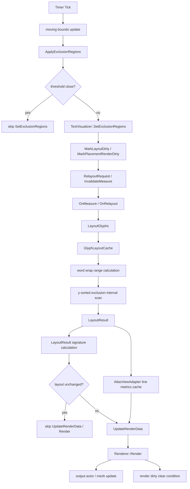

# TextVisualizer Performance Optimization Analysis

## 목적

이 문서는 현재 `TextVisualizer` 구현을 기준으로 성능 병목 후보를 코드 레벨에서 다시 정리하고, 다음 최적화 작업을 작은 커밋 단위로 우선순위화하기 위한 분석 문서다.

이번 문서는 구현 변경을 포함하지 않는다. 현재까지 빠르게 들어간 기능 / 품질 / 1차 성능 최적화의 의미를 정리하고, 다음 작업에서 어디를 먼저 볼지 결정하는 기준으로 사용한다.

## 1. 현재 Pipeline 전체 흐름

performance sample에서 animation tick이 발생하면 대략 아래 경로가 열린다.

각 단계의 실행 조건은 다음과 같다.

| 단계 | 열리는 조건 | 현재 비용 성격 |
|---|---|---|
| `Timer Tick` | sample timer `16ms` tick | 실제 GPU frame과 완전히 같지는 않음 |
| moving bounds update | animation enabled | active orb / overlay text block 수에 비례 |
| `ApplyExclusionRegions()` | animation tick 또는 조작 key | title, fixed columns, orb bands, overlay text bounds를 새 vector로 구성 |
| sample threshold | 마지막 적용 regions와 새 regions 비교 | `O(region count)` 비교, core dirty를 줄이기 위한 sample-level gate |
| `SetExclusionRegions()` | threshold 미통과 / 강제 변경 | core exact compare 후 vector copy |
| dirty set | exclusion / size / lineHeight 등 layout placement 변화 | layout dirty + placement render dirty |
| `OnMeasure()` | layout system measure | 필요 시 prepare 후 임시 `LayoutResult` 계산 |
| `OnRelayout()` | relayout request / size 변경 | prepare, layout, render path를 dirty flag 기준으로 처리 |
| `LayoutGlyphs()` | layout dirty | 현재 전체 glyph를 처음부터 다시 배치 |
| word wrap range calculation | 각 available interval | `GlyphLayoutCache`를 사용하지만 interval range scan은 남음 |
| y-sorted exclusion scan | line별 available interval 계산 | y 기준 sorted cache로 후보 scan 감소 |
| signature calculation | render dirty path 진입 전 | `LayoutResult` 전체 placement hash |
| line metrics cache | layout result adapter 연결 시 | line / fragment / glyph range scan 가능 |
| `UpdateRenderData()` | render dirty + renderable glyphs | renderable glyph count만큼 adapter lookup / vector fill |
| `Renderer::Render()` | render update 필요 | AtlasRenderer full render call, output actor / mesh update 가능 |

## 2. 현재 적용된 최적화와 효과

| 최적화 | 줄인 비용 | 현재 효과 | 남은 한계 |
|---|---|---|---|
| diagnostics / log cleanup | 기본 실행 path의 log formatting / release log 출력 | sample 관측 왜곡 감소 | diagnostics counter 자체는 남아 있음 |
| line metrics layout / baseline 적용 | 빡빡한 line height로 인한 visible line 증가 | line height 품질 개선, visible line 수 감소 | PreparedText-level metrics는 fallback font / emoji line별 차이를 충분히 반영하지 못함 |
| y-sorted exclusion scan | line마다 모든 exclusion region scan | line band와 겹칠 수 있는 후보까지만 검사 | moving bounds마다 sorted cache는 다시 생성됨 |
| layout / render buffer reserve | `Dali::Vector` / `std::vector` 반복 reallocation | 긴 text relayout / render data update에서 allocation 감소 | `LayoutResult` object reuse, renderer 내부 allocation은 남음 |
| render dirty clear condition | 성공 render 이후 render path 반복 진입 | 동일 상태에서 `UpdateRenderData()` / `Renderer::Render()` 반복 감소 | 외부 actor invalidation / async render 정책은 추가 검토 필요 |
| performance sample exclusion threshold | 아주 작은 bounds 변화의 core dirty set | sample에서 redundant `SetExclusionRegions()` 감소 | threshold가 커지면 visual fidelity 저하 가능, core API 정책은 그대로 exact |
| layout unchanged render skip | layout 결과가 같을 때 render data / render call | placement-only dirty에서 render path skip 가능 | signature 계산 비용과 skip 이득의 균형 필요 |
| line-level metrics cache | renderer glyph position baseline fallback scan | line별 baseline 품질 개선 기반 | adapter cache build / lookup 비용, LayoutResult metrics와 역할 중복 |
| word wrap lookup cache | glyph마다 반복 lineBreakInfo / glyph mapping lookup | basic word wrap 품질 유지하면서 lookup 비용 감소 | interval마다 range scan 자체는 남음 |

## 3. 현재 남은 병목 후보

### A. `LayoutGlyphs()` full relayout

현재 bounds가 움직이면 전체 glyph를 처음부터 다시 배치한다.

- affected line / affected y range 기반 partial relayout은 없다.
- word wrap 이후 각 interval에서 glyph range를 계산해야 하므로 긴 text일수록 relayout 비용이 커진다.
- line별 `BuildAvailableIntervalsFromSorted()`와 word wrap range scan이 모두 전체 relayout 안에서 반복된다.

### B. word wrap interval scan

최근 `GlyphLayoutCache`로 repeated lookup은 줄였지만, interval별 range scan은 남아 있다.

- 각 interval은 `glyphStart`부터 overflow 또는 break 후보까지 순차 scan한다.
- 긴 word / 긴 interval / 많은 exclusion interval 조합에서는 scan 비용이 누적될 수 있다.
- 다음 break candidate index cache, cluster range cache, binary-searchable advance prefix 활용 등을 검토할 수 있다.

### C. `Renderer::Render()` full call

layout이 실제로 바뀌면 여전히 `Renderer::Render()` 전체 호출이 필요하다.

- `UpdateRenderData()`가 renderable glyph count만큼 데이터를 새로 채운다.
- `AttachRendererToHost()`는 attached 상태에서도 `Renderer::Render()`를 호출한다.
- output actor는 stale actor 누적 방지 정책이 있지만, renderer 내부 mesh / child actor allocation은 아직 조사되지 않았다.
- `text-atlas-renderer.*`를 직접 수정하기 전 비용 관측이 필요하다.

### D. `LayoutResult` signature cost

layout unchanged render skip을 위해 `LayoutResult::CalculateSignature()`가 전체 placement를 hash한다.

- glyph placement count가 크면 signature 계산 자체가 `O(glyph count)` 비용이다.
- render skip으로 아끼는 비용보다 signature cost가 커지는 구간이 있을 수 있다.
- layout 생성 중 signature를 같이 누적하거나, placement-only dirty reason별로 더 싼 version 정책을 둘 수 있는지 검토가 필요하다.

### E. line-level metrics cache build

`LayoutGlyphs()`가 `TextLine.metrics`를 채우고 있지만, `AtlasViewAdapter::RebuildLineMetricsCache()`는 cache를 다시 만들고 fallback path에서는 line fragments의 glyph range를 다시 scan할 수 있다.

- 현재 renderer baseline 품질에는 도움이 된다.
- render path마다 adapter 연결이 갱신되면 cache rebuild가 비용이 될 수 있다.
- `LayoutResult`의 line metrics를 더 직접 사용하거나, line index lookup 구조를 단순화할 수 있는지 검토가 필요하다.

### F. exclusion region count 증가

sample visual quality 개선으로 orb 하나를 ellipse band 여러 개로 나누면서 exclusion region 수가 증가했다.

- y-sorted scan으로 line별 후보 수는 줄였지만, region vector build / threshold compare / sort 비용은 region count에 영향을 받는다.
- orb count와 band count를 늘리면 `SetExclusionRegions()` 전후 비용이 다시 커질 수 있다.
- spatial index 또는 active y range cache는 더 큰 bounds 수에서만 검토하는 것이 적절하다.

### G. `SetExclusionRegions()` vector compare / copy

core API는 exact compare 후 vector copy를 수행한다.

- sample threshold는 upstream skip 실험이며 core policy를 바꾸지 않는다.
- epsilon compare를 core에 넣으면 correctness 정책이 흐려질 수 있다.
- 실서비스에서는 caller가 unchanged update를 줄이는 방향과 core-level optional policy를 분리해서 판단해야 한다.

### H. status / sample overhead

performance sample 자체도 측정을 왜곡할 수 있다.

- status `TextVisualizer`는 일정 interval마다 `SetText()`를 호출하고 prepare path를 연다.
- status toggle `0`이 있으므로 measurement 시 on/off를 나눠 봐야 한다.
- Timer FPS는 실제 GPU frame FPS가 아니므로 상대 비교 지표로만 사용해야 한다.

## 4. 병목 후보 우선순위

| 우선순위 | 후보 | 효과 | 난이도 | 위험 | 추천 여부 |
|---|---|---|---|---|---|
| 1 | performance sample stage counters | 높음: 병목 판단 정확도 향상 | 낮음 | 낮음: sample-only | 강력 추천 |
| 2 | line metrics cache 역할 정리 / LayoutResult 직접 사용 | 중간 | 중간 | 낮음~중간: internal-only | 추천 |
| 3 | layout signature cost 감소 | 중간~높음 | 중간 | 중간: render skip correctness | 추천 |
| 4 | word wrap range scan 추가 최적화 | 중간 | 중간 | 중간: line break 회귀 가능 | 조건부 추천 |
| 5 | core redundant exclusion update policy | 중간 | 중간 | 높음: correctness / API semantics | 보류 |
| 6 | Renderer::Render cost 조사 | 높음 | 중간~높음 | 중간: AtlasRenderer 경계 | 조사 추천 |
| 7 | geometry-only update / renderer update API | 매우 높음 가능 | 높음 | 높음: `text-atlas-renderer.*` 영향 | 장기 |
| 8 | affected-line partial relayout | 매우 높음 가능 | 높음 | 높음: layout correctness | 장기 |

## 5. 다음 구현 후보

### A. Add performance sample stage counters

- sample-level counters로 실제 비용 경향을 관찰한다.
- core 구현과 public API를 바꾸지 않는다.
- 후보 counters:
  - tick count
  - exclusion applied / skipped
  - body `SetExclusionRegions()` call count
  - status update count
  - rough layout / render visible counters가 가능하면 debug-only로 연결
- 장점: 다음 최적화의 근거를 만든다.
- 위험: sample output 자체가 성능에 영향을 줄 수 있으므로 표시 update interval과 status toggle을 유지해야 한다.

### B. Move line metrics cache closer to `LayoutResult`

- `LayoutGlyphs()`는 이미 `TextLine.metrics`를 채운다.
- `AtlasViewAdapter`가 line metrics를 다시 계산하지 않고 `TextLine.metrics`를 더 직접 사용하도록 정리할 수 있다.
- cache lookup도 line top scan 대신 line index / fragment mapping으로 바꾸면 renderer glyph position 비용을 줄일 수 있다.
- 위험: baseline fallback priority가 바뀌면 visual diff가 생길 수 있다.

### C. Add layout result dirty / version instead of full signature hash

- 현재 `CalculateSignature()`는 render skip 판단 때 전체 placement를 hash한다.
- layout 생성 중 signature를 누적하거나, `LayoutResult`가 version / cached signature를 보유하면 별도 full scan을 줄일 수 있다.
- 위험: signature 갱신 누락 시 render skip correctness 문제가 생긴다.

### D. Optimize word wrap range scan with next break index cache

- `breakAllowedAfterGlyph` cache를 기반으로 next break candidate를 빠르게 찾는 구조를 추가한다.
- prefix advance와 함께 사용하면 일부 interval에서 scan 범위를 줄일 수 있다.
- 위험: oversized glyph, mandatory break, interval fragmentation과 결합할 때 behavior가 바뀌지 않도록 주의해야 한다.

### E. Keep core exclusion epsilon upstream-only, or design optional policy

- core `SetExclusionRegions()`에 epsilon compare를 바로 넣는 것은 보류한다.
- 먼저 sample / caller 수준 skip으로 충분한지 관찰한다.
- core에 넣는다면 explicit opt-in 또는 internal policy가 필요하다.
- 위험: small movement가 layout에 실제 영향을 줄 수 있다.

### F. Investigate `Renderer::Render()` cost with internal counters

- `text-atlas-renderer.*` 수정 없이 bridge / view interface diagnostics로 call count와 returned glyph count를 관찰한다.
- output actor descendant / renderer count도 참고 지표로 본다.
- 다음 단계에서 geometry-only update가 필요한지 판단한다.
- 위험: counter 자체가 release path overhead가 되지 않게 compile-time guard 또는 sample-only path가 필요하다.

### G. Partial relayout prototype

- moving bounds의 affected y range를 기준으로 일부 line만 relayout하는 장기 후보.
- 현재 `LayoutGlyphs()`는 sequential word wrap이므로 앞 line 변화가 뒤 line 전체에 전파될 수 있다.
- 처음부터 production path에 넣기보다 prototype / doc 설계가 필요하다.

## 6. 바로 구현 추천 1순위

다음 커밋으로는 **Add performance sample stage counters**를 추천한다.

이유:

- 현재는 “체감 성능”과 rough FPS 중심으로 판단하고 있다.
- 이미 여러 최적화가 들어가서 다음 병목은 단일 함수 하나로 단정하기 어렵다.
- core public API를 늘리지 않고 sample-only로 관측 지표를 추가할 수 있다.
- `Renderer::Render()` full call, layout unchanged skip, status update overhead, exclusion threshold 효과를 같은 화면에서 비교할 수 있다.
- 이후 `LayoutResult` signature cost를 줄일지, renderer cost를 먼저 볼지, word wrap scan을 더 줄일지 결정하는 근거가 된다.

권장 범위:

- sample 코드에 counters만 추가한다.
- status update toggle은 유지한다.
- stage timing까지 넣는다면 `std::chrono` 기반 sample-only rough timing으로 제한한다.
- core TextVisualizer에는 public getter를 추가하지 않는다.

## 7. 측정 계획

### sample 조건

다음 조합으로 비교한다.

| 조건 | 값 |
|---|---|
| paragraph repeat / text length | 현재 text, 2x, 4x |
| orb count | 0, 2, 5, 6 |
| exclusion threshold | 0.0px, 0.5px, 1.0px |
| status updates | on, off |
| font size | 16, 20, 24 |
| line height | 현재 값, +0.2, -0.2 |
| animation | on, pause |

### 측정 항목

- rough FPS
- timer tick count
- `SetExclusionRegions()` applied count
- exclusion skipped count
- status update count
- layout dirty trigger count
- render dirty trigger count
- render call count
- render skip count
- glyph placement count
- visible line count
- exclusion region count

주의:

- sample FPS는 timer 기반 rough value이며 실제 GPU frame FPS가 아니다.
- 그래도 같은 build / 같은 machine / 같은 status setting의 상대 비교에는 사용할 수 있다.
- status text 자체가 `SetText()` / prepare 비용을 만들 수 있으므로 status on/off 결과를 반드시 분리한다.

## 8. 진행: Label-like Measure Policy

`TextVisualizer`의 기본 measure / relayout 정책은 `InputField`가 아니라 `Label`에 가까운 display control 정책으로 정리했다.

조사한 `LabelImpl` 기본 경로는 다음과 같다.

- `OnInitialize()`에서 width는 `FILL_TO_PARENT`, height는 `DIMENSION_DEPENDENCY`를 기본으로 둔다.
- fixed requested width / height는 requested size를 우선한다.
- `WRAP_CONTENT` width는 text natural width를 기준으로 측정한다.
- `WRAP_CONTENT` height는 width-for-height 형태로 현재 width에서 text layout height를 계산한다.
- TextFit / ellipsis / async rendering / marquee 등 특수 경로는 이번 `TextVisualizer` 정책에 포함하지 않는다.

`TextVisualizerImpl`의 현재 정책은 다음과 같다.

| 항목 | 정책 |
|---|---|
| `OnInitialize()` | width `FILL_TO_PARENT`, height `DIMENSION_DEPENDENCY` |
| fixed width / fixed height | requested size를 반환 |
| wrap width / wrap height | natural width와 해당 width에서의 layout height를 반환 |
| match / fill parent | positive parent constraint가 있으면 그 constraint를 사용 |
| `OnRelayout()` | 실제 allocated size를 우선 사용하고, width가 0 이하이면 natural width를 fallback으로 사용 |
| empty text | wrap 측정은 `0x0`, fixed requested size는 유지 |

`OnRelayout()` lifecycle도 `LabelImpl` / `InputFieldImpl` 패턴에 맞췄다.

- `LabelImpl::OnRelayout()`과 `InputFieldImpl::OnRelayout()`은 자체 text layout / renderer update를 수행하고 `ViewImpl::OnRelayout()`을 명시 호출하지 않는다.
- `ViewImpl::OnRelayout()`은 padding / margin이 있는 경우 child를 `RelayoutContainer`에 다시 넣고, fitting / accessibility 관련 base view 처리를 수행한다.
- `TextVisualizerImpl`은 내부 `mRenderHost`를 `AddActorChild()`로 직접 소유하고 `SyncRenderHostSize()`로 크기를 직접 맞춘다.
- 따라서 `TextVisualizerImpl::OnRelayout()`도 base `ViewImpl::OnRelayout()` 호출에 의존하지 않고, 내부 render host와 renderer output lifecycle을 직접 관리한다.

`InputField`와 다르게 처리한 점:

- cursor / selection / decorator / IME / placeholder interaction은 고려하지 않는다.
- editing control 특유의 minimum editing surface나 focus behavior를 measure에 끌어오지 않는다.
- `TextVisualizer`는 text display surface이므로 text natural size와 parent allocation을 기준으로만 판단한다.

남은 확인 필요:

- `Label`의 `MATCH_PARENT` 측정은 parent arrange phase와 결합되어 더 복잡하므로, 현재 TextVisualizer의 positive constraint 사용 정책이 장기적으로 충분한지 확인이 필요하다.
- `OnMeasure()`는 local layout을 계산하므로, 반복 measure가 많아지면 별도 measure cache가 필요할 수 있다.
- fixed height에서 overflow된 text는 현재 clipping / render host size 정책에 맡긴다.

## 9. 진행: exclusion region storage update optimization

`SetExclusionRegions()`의 public 동작 의미와 exact compare 정책은 유지하면서, 내부 저장소 갱신 비용을 줄였다.

기존 비용 후보:

- `SetExclusionRegions()`는 moving bounds 상황에서 매 tick 호출될 수 있다.
- 기존 구현은 값이 달라지면 `mExclusionRegions = regions` 형태로 전체 vector assignment를 수행했다.
- region count가 같고 rect 값만 움직이는 경우에도 저장소 전체 교체 경로를 탈 수 있었다.
- 많은 region을 가진 sample / application에서는 compare 이후 copy / allocation 비용이 누적될 수 있다.

현재 저장 정책:

- 먼저 기존처럼 `AreExclusionRegionsEqual()`로 exact compare를 수행한다.
- 값이 같으면 아무 것도 하지 않는다.
- 값이 다르고 region count가 같으면 `mExclusionRegions[index] = regions[index]`로 in-place update한다.
- 값이 다르고 region count가 다르면 `Clear()` 후 `Reserve(regions.Count())`를 수행하고 `PushBack()`으로 복사한다.
- dirty 정책은 기존과 동일하게 layout dirty + placement render dirty + relayout request + measure invalidation을 수행한다.

유지한 범위:

- public API는 변경하지 않았다.
- epsilon compare는 도입하지 않았다.
- `SetExclusionRegions()`의 semantic은 변경하지 않았다.
- layout / word wrap / render dirty clear 조건은 변경하지 않았다.

확인 필요:

- `Dali::Vector::Clear()` 이후 capacity가 장기적으로 유지되는지 확인이 필요하다.
- very large region count에서 exact compare 비용 자체는 여전히 남는다.
- core epsilon compare는 correctness 정책을 흐릴 수 있으므로 별도 설계 전까지 보류한다.

## 10. 진행: optional debug status for performance sample

performance sample은 수요일 데모용 visual performance를 우선하기 위해 debug status를 optional path로 정리했다.

기존 비용 후보:

- status `TextVisualizer`도 `SetText()`가 호출되면 prepare / layout / render dirty path를 열 수 있다.
- status 문자열을 매 interval마다 만들면 `std::chrono`, FPS 계산, `std::ostringstream` formatting 비용이 sample 측정에 섞인다.
- 데모 기본 상태에서는 status 자체가 화면 구성과 성능 관측을 모두 방해할 수 있다.

현재 정책:

- debug status 기본값은 off다.
- `0` key로 debug status를 toggle한다.
- debug status off 상태에서는 `UpdateStatusText()`가 초반에 return한다.
- off 상태에서는 FPS 계산, stringstream formatting, 반복 `mStatusText.SetText()`를 수행하지 않는다.
- debug status on 상태에서만 `STATUS_INTERVAL`마다 counters/details를 표시한다.
- debug status를 끄면 status text를 빈 문자열로 한 번만 설정한다.

debug on에서 표시하는 counters:

- rough FPS
- frame count
- active orb count
- `ApplyExclusionRegions()` call count
- 실제 `SetExclusionRegions()` call count
- orb position update count
- orb view update count
- status text update count
- font size / line height / color / exclusion state

유지한 범위:

- core `TextVisualizer` 구현은 변경하지 않았다.
- public API는 추가하지 않았다.
- sample visual layout / font size / line height / body text / orb positions는 변경하지 않았다.
- layout / word wrap / render dirty clear 조건은 변경하지 않았다.

확인 필요:

- debug status on 상태에서 status text 자체가 만드는 prepare 비용
- counter 표시 길이가 데모 화면에 주는 영향
- rough FPS가 실제 GPU frame FPS가 아니라는 점

## 11. 다음 커밋 금지 사항

계속 유지할 원칙:

- 기존 `TextController` 수정 금지
- 기존 `TextView` 수정 금지
- existing `Label` / `InputField` 수정 금지
- `text-atlas-renderer.*` 수정은 분석 없이 금지
- `internal/text/layouts/layout-engine.*` 수정 금지
- public API 추가 금지
- render dirty clear 조건 변경은 전용 커밋에서만
- 성능 최적화와 품질 개선을 한 커밋에 섞지 않기
- sample 관측용 변경과 core 최적화 변경을 한 커밋에 섞지 않기

## 12. Compact 이후 복구 지침

새 세션에서는 다음 순서를 따른다.

1. 이 문서 `docs/text-visualizer/16-performance-optimization-analysis.ko.md`를 먼저 읽는다.
2. 그 다음 `docs/text-visualizer/15-current-optimization-status.ko.md`를 읽는다.
3. 성능 최적화는 이 문서의 우선순위 표를 기준으로 시작한다.
4. 작업 전 `git status --short`를 반드시 확인한다.
5. sample file에 미커밋 사용자 변경이 있으면 core 커밋에 섞지 않는다.
6. push 실패는 인증 문제일 수 있으므로 코드 문제로 단정하지 않는다.
