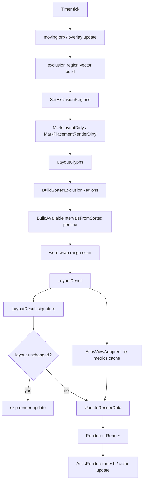

# TextVisualizer Structural Optimization Analysis

## 1. 목적

현재 `TextVisualizer` performance sample은 수요일 데모에 사용할 수 있을 정도로 visual quality와 체감 성능이 좋아졌다.

하지만 지금 상태는 아직 “정말 빠르고 가벼운 텍스트 엔진”이라기보다는, 기존 `TextController` / `TextView`를 건드리지 않고 새로운 렌더링 경로를 기능적으로 세운 단계에 가깝다. 다음 성능 개선은 단순 micro optimization보다 pipeline 구조 안의 중복 계산과 cache 경계를 줄이는 방향이 더 중요하다.

이 문서는 다음 구현 커밋을 정하기 위한 코드 분석 문서다. 구현 변경은 포함하지 않는다.

분석 축은 크게 세 가지다.

- exclusion / layout 계산 최적화
- `AtlasRenderer` / render update 비용 최적화
- prepare cache와 layout-local cache의 역할 재분배

## 2. 현재 전체 성능 경로 요약

현재 performance sample에서 moving bounds가 동작할 때 전체 경로는 대략 다음과 같다.

현재 dirty / cache 의미는 다음과 같다.

| 단계 | 현재 트리거 | 현재 cache 수준 |
|---|---|---|
| prepare | text / font / font size 변경 | `PreparedText`에 characters, line break, glyphs, glyph mapping, line metrics 저장 |
| exclusion update | sample tick / drag / key 조작 | core는 `mExclusionRegions` 저장, same-count in-place update |
| layout | exclusion / size / lineHeight 변경 | `LayoutResult` 재계산, `GlyphLayoutCache`는 layout pass-local |
| render skip 판단 | render dirty path | `LayoutResult::CalculateSignature()` full scan |
| adapter cache | layout result 연결 | line metrics cache rebuild |
| render data | render dirty path | `UpdateRenderData()`가 render data vector를 채움 |
| atlas render | render dirty path | `AtlasRenderer::Render()`가 glyph / position을 `ViewInterface`에서 다시 가져와 mesh / actor 생성 |

## 3. Exclusion / Layout 계산 병목 분석

### A. exclusion region vector build

sample의 `ApplyExclusionRegions()`는 매 tick 새 `Dali::Vector<Rect<float>> regions`를 만든다.

현재 포함되는 region은 다음과 같다.

- title line exclusion
- drop cap exclusion
- fixed column bounds
- moving orb ellipse bands
- moving overlay text bounds

코드 기준으로 보면 `mFixedColumnBounds`, title exclusion, drop cap은 거의 static이다. 반면 orb와 overlay text는 매 tick 움직인다. 현재는 이 둘을 하나의 vector로 매번 합친 뒤 core `SetExclusionRegions()`에 전달한다.

후보 개선:

- sample에서 static exclusion cache를 만들고, tick에서는 dynamic exclusions만 append한다.
- combined vector는 member로 유지해 `Clear()` 후 `Reserve()` / `PushBack()`으로 재사용한다.
- title / drop cap / fixed columns는 초기화나 style 변경 시에만 rebuild한다.
- core public API는 그대로 두고 sample-level optimization으로 처리할 수 있다.

성격:

- 수요일 데모 전 low-risk 후보.
- core behavior 영향 없음.
- 다만 sample-only라 실제 engine 구조 개선은 아니다.

### B. `SetExclusionRegions()` exact compare

현재 core는 `AreExclusionRegionsEqual()`로 exact compare를 수행한 뒤, 값이 다르면 저장소를 갱신한다. 최근 same-count update는 in-place로 바뀌었지만, 남은 비용은 여전히 있다.

- compare는 region count에 비례한다.
- moving bounds에서는 대부분 값이 달라져 compare가 거의 항상 false일 가능성이 높다.
- compare 후에도 rect copy는 필요하다.
- epsilon compare는 layout correctness risk가 있어 core 기본 정책에 넣기 어렵다.

후보 개선:

- caller가 “무조건 changed”를 아는 경우 compare를 생략하는 private/internal path가 가능한지 검토한다.
- public API 없이 `TextVisualizerImpl` 내부에서만 fast path를 만들기는 현재 public call 경계상 쉽지 않다.
- core API에 epsilon이나 unchecked update를 추가하는 것은 public semantics와 correctness를 먼저 설계해야 한다.

결론:

- 데모 전에는 core 정책 변경보다 sample-level vector reuse가 안전하다.
- core exact compare 자체를 줄이는 것은 데모 후 설계 후보로 둔다.

### C. y-sorted exclusion scan

현재 `LayoutGlyphs()`와 `LayoutPlaceholder()`는 layout pass 시작 시 `BuildSortedExclusionRegions()`를 호출한다. 이후 각 line은 `BuildAvailableIntervalsFromSorted()`로 y 후보만 본다.

비용 성격:

- sort 비용은 `O(N log N)`이다.
- N은 title / fixed / drop cap / overlay / orb bands를 모두 포함한다.
- orb band count가 11이고 active orb가 5개면 orb만 55개 region이다.
- moving bounds 때문에 현재는 layout pass마다 sort가 다시 필요하다.

후보 개선:

- static sorted regions cache와 dynamic sorted regions cache를 분리한다.
- dynamic regions만 tick마다 sort한다.
- layout pass에서는 두 sorted list를 merge하거나, static list + dynamic list를 각각 scan한다.
- 더 큰 N에서는 y bucket / spatial index를 검토한다.

주의:

- `LayoutEngine`은 현재 `Dali::Vector<Rect<float>>`를 받아 내부 anonymous namespace의 sorted vector를 만든다.
- sorted cache를 core에 유지하려면 `TextVisualizerImpl`과 `LayoutEngine` 사이의 internal signature 조정이 필요하다.
- public API는 건드리지 않아도 가능하지만, internal ownership과 invalidation 설계를 해야 한다.

### D. per-line available interval generation

`BuildAvailableIntervalsFromSorted()`는 line마다 다음 작업을 한다.

1. y-overlap 후보 region scan
2. blocked interval 생성
3. blocked interval x sort
4. merge
5. available interval 생성

현재 y-sorted scan으로 전체 region scan은 줄었지만, line마다 blocked interval sort / merge는 남아 있다.

비용 성격:

- visible line count x candidate regions 비용이다.
- line height가 자연스러워지면서 visible line count는 줄었지만, 긴 text에서는 여전히 누적된다.
- 같은 y band에서 비슷한 interval 결과가 반복될 수 있다.

후보 개선:

- line band interval cache: `(lineTop, lineHeight, exclusionVersion)` 기준으로 intervals cache.
- y bucket cache: exclusion region을 y bucket에 넣고 line마다 bucket만 조회.
- affected y range만 recompute: moving bounds의 old/new bounds가 덮는 y range만 interval cache invalidation.
- same available interval reuse: 이전 layout line의 y와 interval이 같으면 재사용.

주의:

- moving bounds가 많으면 cache invalidation이 복잡해진다.
- 현재 full relayout 구조에서는 interval cache만 넣어도 word wrap / glyph placement는 다시 돈다.

### E. full `LayoutGlyphs()` relayout

현재 exclusion이 바뀌면 전체 glyph placement를 처음부터 다시 만든다.

이 구조의 장점은 단순성과 correctness다. 단점은 moving bounds에서 매 tick 전체 text를 다시 훑는다는 점이다.

word wrap이 들어간 뒤에는 앞쪽 line의 break가 바뀌면 뒤쪽 line start glyph가 모두 달라질 수 있다. 그래서 partial relayout은 단순하지 않다.

후보 개선:

- previous layout의 line start glyph cache를 저장한다.
- affected y range 위쪽 line들은 이전 placement를 유지하고, 그 아래부터 reflow하는 prototype을 만든다.
- line start glyph / line y / available intervals가 같으면 해당 line placement reuse를 검토한다.
- static text + moving exclusions라는 전제를 활용해 prepared glyph data는 계속 재사용한다.

결론:

- 효과 가능성은 크지만 회귀 위험도 크다.
- 수요일 데모 전에는 피하고, 데모 후 prototype으로 분리하는 것이 안전하다.

### F. word wrap range scan

현재 `GlyphLayoutCache`로 glyph advance, width, prefix advance, character range, break allowed / mandatory 정보를 layout pass-local로 만든다. 하지만 interval fit 자체는 `FindGlyphRangeForInterval()`에서 `glyphStart`부터 순차 scan한다.

후보 개선:

- `nextBreakAfterGlyph` array
- `previousBreakBeforeGlyph` array
- prefix advance를 이용한 max glyph end binary search
- max glyph end 이후 previous break 후보로 보정
- mandatory break 위치를 별도 prefix/index로 찾아 line 강제 종료

어려운 점:

- glyph width와 advance 중 `max()`를 required width로 쓰는 현재 정책은 단순 prefix advance만으로 완전히 대체하기 어렵다.
- oversized first glyph fallback이 있다.
- mandatory break는 available width와 무관하게 line을 종료해야 한다.
- exclusion interval이 여러 개일 때 같은 line 다음 fragment로 보낼지 다음 line으로 보낼지 정책이 섞인다.

결론:

- next/previous break cache는 유효하지만, 먼저 stable `GlyphLayoutCache` fields를 `PreparedText`로 올리는 편이 더 안전하다.

## 4. AtlasRenderer / Render Update 병목 분석

### A. `UpdateRenderData()` 비용

`AtlasRendererBridge::UpdateRenderData()`는 renderable glyph count만큼 다음을 수행한다.

- `mAdapter->GetGlyphPlacement(index, placement)`
- `mAdapter->GetGlyphInfo(placement.glyphIndex, glyph)`
- `mImpl->mRenderData`에 glyph / placement / x / y / width / height push

그런데 실제 `AtlasRenderer::Render()` 호출 경로를 보면 `mRenderData`는 `Renderer::Render()`의 입력으로 전달되지 않는다. `AttachRendererToHost()`는 `mRenderer->Render(mViewInterface, ...)`를 호출하고, `AtlasRenderer::Render()`는 다시 `view.GetNumberOfGlyphs()`와 `view.GetGlyphs()`를 통해 glyphs / positions vector를 새로 채운다.

즉 현재 코드 기준으로 `UpdateRenderData()`는 다음 역할에 가깝다.

- renderer 생성 보장
- adapter glyph placement / glyph info validation
- render dirty clear 조건에서 사용하는 success gate
- future render data cache 후보

중복 가능성:

- 실제 Render 입력은 `TextVisualizerViewInterface::GetGlyphs()`가 다시 만든다.
- 따라서 `UpdateRenderData()`는 현재 render path에서 glyph lookup을 한 번 더 수행하는 비용일 수 있다.

후보 개선:

- `UpdateRenderData()`를 lightweight validation으로 축소한다.
- render dirty clear 조건은 `AttachRendererToHost()` 성공 + `GetLastReturnedGlyphCount()` consistency 중심으로 대체한다.
- 또는 `UpdateRenderData()`가 만든 positions / glyphs cache를 실제 `ViewInterface::GetGlyphs()`에서 재사용하도록 연결한다.

주의:

- render dirty clear 조건을 건드리는 작업이므로 별도 커밋이어야 한다.
- 지금 당장 제거하면 render success 판정이 약해질 수 있다.

### B. `ViewInterface::GetGlyphs()` 비용

`TextVisualizerViewInterface::GetGlyphs()`는 `AtlasRenderer::Render()` 내부에서 호출된다.

현재 루프는 placement count만큼 다음을 수행한다.

- adapter에서 glyph placement lookup
- prepared text에서 glyph info lookup
- `GetRendererGlyphPosition()` 호출
- renderer glyph position 계산

`GetRendererGlyphPosition()`은 line metrics cache를 우선 사용하지만, cache lookup은 lineTop 기준 vector scan이다. line count가 많으면 glyph마다 line metrics cache를 선형 scan할 수 있다.

후보 개선:

- `GlyphPlacement`에 line index를 저장한다.
- `AtlasViewAdapter`가 glyph placement index -> line metrics cache index를 미리 만든다.
- `AtlasViewAdapter`가 renderer glyph positions cache를 layout result 연결 시 미리 구성한다.
- `TextVisualizerViewInterface::GetGlyphs()`는 glyph info / position cache를 copy하는 형태로 단순화한다.

효과:

- `Renderer::Render()` path에서 반복 position 계산과 line cache lookup을 줄일 수 있다.
- `UpdateRenderData()`와 통합하면 중복 lookup 제거도 가능하다.

### C. `AtlasRenderer::Render()` full call

현재 `AtlasRenderer::Render()`는 시작 시 `UnparentAndReset(mImpl->mActor)`를 호출한다. 이후 glyph count만큼 glyph / position vector를 만들고, `AddGlyphs()`에서 mesh와 actor를 다시 만든다.

코드 기준 주요 비용:

- `Vector<GlyphInfo>` allocation / resize
- `Vector<Vector2>` allocation / resize
- `ViewInterface::GetGlyphs()` full copy
- glyph atlas cache lookup / bitmap 생성 필요 여부 확인
- meshContainer / meshContainerOutline 생성
- mesh stitch
- `RemoveText()`로 old text cache reference count decrement
- `CreateMeshActor()`에서 `VertexBuffer`, `Geometry`, `Renderer`, `Actor` 생성
- output actor child attach

후보 개선:

- same glyph count / same atlas texture / same style이면 vertex positions만 update 가능한지 조사.
- `Geometry` vertex buffer update만 가능한지 조사.
- `AtlasRenderer`에 geometry-only update API가 필요한지 검토.
- 기존 `text-atlas-renderer.*` 변경 없이 bridge / adapter cache로 줄일 수 있는 범위를 먼저 줄인다.

위험:

- `text-atlas-renderer.*`는 기존 text pipeline도 공유하는 내부 renderer다.
- 데모 전 직접 수정은 위험하다.
- geometry-only update는 효과 가능성이 크지만 데모 후 작업으로 분리해야 한다.

### D. renderer output actor lifecycle

`AtlasRendererBridge::AttachRendererToHost()`는 `Renderer::Render()`가 반환한 output actor를 host에 attach한다.

현재 정책:

- 기존 output과 새 output이 다르면 이전 output을 detach한다.
- 새 output parent가 없으면 render host에 attach한다.
- stale actor 누적을 막는다.

하지만 `AtlasRenderer::Render()` 자체가 `UnparentAndReset(mImpl->mActor)`로 내부 actor를 reset한다. 따라서 bridge에서 output actor를 재사용하더라도 renderer 내부에서 mesh actor / child actor가 재생성될 수 있다.

확인 후보:

- `GetRendererOutputDescendantCount()`
- `GetRendererOutputTotalRendererCount()`
- actor child count 변화
- mesh actor 재생성 여부
- renderer count가 매 render마다 안정적으로 유지되는지

### E. render dirty / layout signature

layout unchanged render skip은 이미 들어갔지만, signature 계산 자체는 `LayoutResult::CalculateSignature()`가 전체 line / cluster / glyph placement를 full scan한다.

비용 성격:

- `O(line count + glyph placement count + cluster placement count)`
- glyph placement가 매우 크면 render skip을 판단하기 위해 이미 큰 비용을 지불한다.
- render skip이 많이 발생하면 이 비용이 이득일 수 있지만, layout이 계속 바뀌는 경우에는 순수 overhead가 된다.

후보 개선:

- `LayoutResult` 생성 중 signature를 incremental로 누적한다.
- placement push 시 hash를 업데이트한다.
- `LayoutResult`에 cached signature와 valid flag를 둔다.
- signature 계산 비용을 render skip 판단 시점에서 layout 생성 시점으로 흡수한다.

주의:

- hash 갱신 누락은 render skip correctness 문제로 바로 이어진다.
- `LayoutPlaceholder()`와 `LayoutGlyphs()` 양쪽을 함께 다뤄야 한다.

## 5. Prepare / Layout Cache 강화 분석

`TextVisualizer`의 핵심 설계는 prepare와 layout을 분리하는 것이다.

원래 목표는 다음에 가깝다.

- text / font / fontSize 변경 시 expensive prepare 수행
- moving bounds 변경 시 prepare는 재사용
- runtime에는 layout placement만 최대한 싸게 수행

따라서 다음 최적화 방향은 runtime layout / render path에서 stable text-derived computation을 제거하고 prepare cache로 올리는 것이다.

### A. 현재 prepare cache와 layout-local cache 구분

현재 `PreparedText`에 저장된 stable data:

- UTF-32 characters
- line break info
- paragraph info
- script runs
- font runs
- shaped glyphs
- glyph metrics
- glyph to character map
- characters per glyph
- character to glyph table
- glyphs per character table
- new paragraph glyphs
- prepared-level line metrics

현재 `LayoutGlyphs()`가 매 layout pass마다 만드는 `GlyphLayoutCache`:

- glyph advances
- glyph widths
- prefix advances
- character starts
- character ends
- break allowed after glyph
- break mandatory after glyph

분석:

- 위 `GlyphLayoutCache` 항목은 대부분 text / font / fontSize가 바뀌지 않으면 변하지 않는다.
- exclusion, layout width, line height에는 직접 의존하지 않는다.
- moving bounds use case에서는 매 tick 다시 계산할 필요가 적다.
- 대신 memory 사용량은 glyph count에 비례해 늘어난다.

### B. `PreparedText`로 올릴 수 있는 stable cache 후보

| 후보 | 현재 위치 | prepare cache로 올릴 수 있는 이유 | 주의 |
|---|---|---|---|
| glyph placement advance cache | `BuildGlyphLayoutCache()` | glyph metrics 기반이며 prepare 이후 stable | font size / fallback glyph 변경 시 clear |
| glyph placement width cache | `BuildGlyphLayoutCache()` | glyph width fallback 계산도 stable | width/advance 정책 변경 시 함께 업데이트 |
| glyph character range cache | `BuildGlyphLayoutCache()` | glyphToCharacterMap + charactersPerGlyph 결과는 stable | complex cluster policy와 같이 검증 필요 |
| break allowed after glyph cache | `BuildGlyphLayoutCache()` | lineBreakInfo + glyph character end 기반 | word wrap policy 변경 시 invalidation |
| break mandatory after glyph cache | `BuildGlyphLayoutCache()` | hard break 후보도 stable | newline glyph fixture 추가 필요 |
| prefix advance cache | `BuildGlyphLayoutCache()` | glyph advance 누적합은 layout width와 무관 | character spacing 도입 시 invalidation 필요 |
| glyph base render metrics | prepared glyph info | glyph info 자체는 이미 있음 | renderer position은 layout dependent라 제외 |

추천:

- `PreparedText::GlyphLayoutData` 같은 internal struct를 추가하는 방향이 깔끔하다.
- public API는 추가하지 않고 internal getter만 둔다.
- `TextPreparer`가 shaping 직후 cache를 채우거나, `PreparedText` setter 후 lazy build를 둘 수 있다.

### C. LayoutResult / layout cache 후보

layout width와 exclusion에 의존하는 data는 `PreparedText`가 아니라 `LayoutResult` 또는 `TextVisualizerImpl` 쪽에 둬야 한다.

| 후보 | 위치 후보 | 이유 |
|---|---|---|
| line start glyph cache | `LayoutResult` 또는 `TextVisualizerImpl` | 다음 relayout warm start / partial relayout 기반 |
| available interval cache | `TextVisualizerImpl` | exclusion version + line band 기준 재사용 |
| layout signature incremental hash | `LayoutResult` | full `CalculateSignature()` scan 제거 |
| renderer glyph position cache | `AtlasViewAdapter` 또는 `LayoutResult` | `ViewInterface::GetGlyphs()` position 계산 제거 |
| glyph placement line index | `GlyphPlacement` | line metrics lookup을 O(1)에 가깝게 만듦 |

### D. static / dynamic exclusion cache

sample과 실제 use case 모두 static / dynamic exclusion이 섞일 수 있다.

현재 sample 기준:

- static: title, fixed columns, drop cap
- dynamic: moving orbs, moving overlay text

현재 core 기준:

- `SetExclusionRegions()`는 하나의 vector만 받는다.
- `LayoutGlyphs()`는 매번 `BuildSortedExclusionRegions()`를 호출한다.

후보:

- `TextVisualizerImpl`에 exclusion version과 sorted exclusion cache를 둔다.
- `SetExclusionRegions()`에서 storage update와 함께 sorted cache를 갱신한다.
- `LayoutGlyphs()`에는 이미 sorted cache를 받는 internal overload를 추가하거나, `LayoutEngine` 밖에서 interval builder를 분리한다.
- static/dynamic split은 public API 없이 sample에서 먼저 검증한다.

주의:

- `LayoutEngine` anonymous namespace에 있는 sorted type을 외부로 꺼내야 할 수 있다.
- internal API 노출 범위를 최소화해야 한다.

### E. cache invalidation 정책

캐시 강화에서 가장 중요한 것은 invalidation이다.

| 변화 | PreparedText cache | Layout cache | Render cache |
|---|---|---|---|
| text 변경 | clear | clear | clear |
| font family 변경 | clear | clear | clear |
| font size 변경 | clear | clear | clear |
| line height 변경 | keep prepare | clear layout | clear render |
| text color 변경 | keep prepare | keep layout | clear render |
| exclusion 변경 | keep prepare | clear layout | clear render |
| size 변경 | keep prepare | clear layout | clear render |
| status/sample text 변경 | 해당 `TextVisualizer`만 clear | 해당 control만 clear | 해당 control만 clear |

### F. cache 강화 우선 구현 후보

1. Move stable `GlyphLayoutCache` fields into `PreparedText`
   - advances
   - widths
   - character starts / ends
   - break allowed / mandatory
   - prefix advances
   - 효과: `LayoutGlyphs()` 시작 비용 감소
   - 위험: `PreparedText` memory 증가
   - public API 영향 없음

2. Cache sorted exclusion regions in `TextVisualizerImpl`
   - `SetExclusionRegions()` 때 sorted cache 갱신
   - `LayoutGlyphs()`는 sorted cache 사용
   - 효과: layout pass마다 sort 제거
   - 위험: `LayoutEngine` internal API 경계 조정 필요

3. Incremental `LayoutResult` signature
   - placement push 중 hash 누적
   - 효과: `CalculateSignature()` full scan 제거
   - 위험: hash 갱신 누락 가능

4. Precompute renderer glyph positions after layout
   - `AtlasViewAdapter` cache
   - `ViewInterface::GetGlyphs()`는 copy 위주
   - 효과: render path 비용 감소
   - 위험: cache invalidation 필요

## 6. 진행: stable glyph layout cache in `PreparedText`

이번 구현에서 layout pass마다 만들던 stable glyph layout cache를 `PreparedText`로 이동했다.

이전 구조:

- `LayoutGlyphs()` 시작 시마다 layout-local `GlyphLayoutCache`를 만들었다.
- cache에는 glyph advance, glyph width, prefix advance, glyph별 character range, glyph 이후 line break 가능 여부가 들어 있었다.
- 이 값들은 text / font / font size / shaping 결과가 바뀌지 않으면 동일하지만, moving bounds relayout 때마다 다시 계산됐다.

현재 구조:

- `PreparedText::GlyphLayoutData`가 stable glyph layout cache를 보관한다.
- `TextPreparer`가 shaping, glyph metrics, glyph-to-character mapping, line break info 준비 후 `GlyphLayoutData`를 만든다.
- `LayoutGlyphs()`는 `preparedText.HasGlyphLayoutData()`가 true이면 이 cache를 사용한다.
- 수동 test fixture나 legacy prepared object처럼 cache가 없는 경우에는 기존 계산과 같은 local fallback을 사용한다.

cache fields:

- `advances`
- `widths`
- `prefixAdvances`
- `characterStarts`
- `characterEnds`
- `breakAllowedAfterGlyph`
- `breakMandatoryAfterGlyph`

유지한 정책:

- word wrap policy는 변경하지 않았다.
- glyph placement, line break, exclusion interval, render dirty 정책은 변경하지 않았다.
- layout width / exclusion region에 의존하는 데이터는 여전히 `LayoutEngine` / `LayoutResult`에 남긴다.
- `PreparedText`의 glyph / mapping / line break setter는 stale cache 방지를 위해 glyph layout cache를 clear한다.

효과:

- moving bounds처럼 text / font / font size는 그대로이고 exclusion만 바뀌는 경우, `LayoutGlyphs()` 진입 시 반복 계산이 줄어든다.
- memory 사용은 glyph count에 비례해 증가한다.
- word wrap 이후 늘어난 layout pass 시작 비용을 prepare 단계로 올리는 1차 구조 개선이다.

확인 필요:

- 매우 긴 텍스트에서 memory 증가량과 layout CPU 감소의 균형
- prefix advance cache를 이용한 binary search word wrap으로 이어갈지 여부
- glyph layout cache와 future line start / renderer position cache의 역할 분리

## 7. 진행: precomputed renderer glyph positions

이번 구현에서 `AtlasViewAdapter`가 renderer glyph position cache를 보관하도록 했다.

이전 구조:

- `TextVisualizerViewInterface::GetGlyphs()`는 render path에서 glyph마다 `AtlasViewAdapter::GetRendererGlyphPosition()`을 호출했다.
- `GetRendererGlyphPosition()`은 placement와 glyph info를 조회하고, line metrics cache 또는 fallback scan으로 baseline offset을 찾아 renderer position을 계산했다.
- layout result가 바뀌지 않으면 이 position은 stable하지만, render call마다 반복 계산될 수 있었다.

현재 구조:

- `AtlasViewAdapter`가 `PreparedText`와 `LayoutResult`를 받은 시점에 renderer glyph positions를 미리 계산한다.
- line metrics cache를 먼저 rebuild한 뒤 position cache를 rebuild한다.
- `GetRendererGlyphPosition()`은 cache hit 시 cached position을 반환한다.
- cache가 없거나 invalid한 경우 기존 계산 경로로 fallback한다.

cache invalidation:

- `SetPreparedText()`는 line metrics cache와 renderer glyph position cache를 rebuild한다.
- `SetLayoutResult()`도 두 cache를 rebuild한다.
- `Clear()`는 두 cache를 clear한다.
- `SetControlSize()`는 glyph position과 무관하므로 cache를 invalidate하지 않는다.
- `SetTextColor()`도 position과 무관하므로 cache를 invalidate하지 않는다.

유지한 정책:

- renderer position 계산 공식은 변경하지 않았다.
- word wrap, layout, exclusion, render dirty clear 조건은 변경하지 않았다.
- `TextVisualizerViewInterface::GetGlyphs()` API 흐름은 유지하고 adapter cache를 통해 비용만 줄인다.

남은 한계:

- glyph info copy는 여전히 render path에서 발생한다.
- `UpdateRenderData()`와 renderer position cache 사이에 중복 가능성이 남아 있다.
- `AtlasRenderer::Render()` full call과 mesh / actor recreation 비용은 그대로 남아 있다.

확인 필요:

- long text에서 position cache memory 증가량
- `UpdateRenderData()`를 position cache와 통합하거나 축소할 수 있는지
- glyph index -> renderer position direct copy path가 더 필요한지

## 8. 진행: reduce redundant `UpdateRenderData`

이번 구현에서 `AtlasRendererBridge::UpdateRenderData()`의 역할을 full render data build에서 lightweight validation + renderer ensure로 축소했다.

이전 구조:

- `UpdateRenderData()`가 renderable glyph count만큼 adapter placement와 glyph info를 순회했다.
- 순회 결과를 `mRenderData` vector에 push했다.
- 하지만 `AtlasRenderer::Render()`는 이 vector를 직접 입력으로 받지 않고, `TextVisualizerViewInterface::GetGlyphs()`를 통해 glyphs / positions를 다시 요청했다.
- renderer glyph position cache가 생긴 뒤에는 position 계산도 adapter 쪽에서 이미 준비되어 있어 full vector build의 중복성이 더 커졌다.

현재 구조:

- `UpdateRenderData()`는 adapter가 renderable glyphs를 갖는지 확인한다.
- renderer instance 생성을 보장한다.
- first / last glyph placement, glyph info, renderer position만 smoke validation한다.
- validated glyph count와 validation 상태만 bridge 내부에 저장한다.
- `mRenderData` vector와 glyph count만큼의 per-glyph push loop는 제거했다.

유지한 safety gate:

- `AttachRendererToHost()`는 기존처럼 `Renderer::Render()`를 호출한다.
- `TextVisualizerViewInterface::GetGlyphs()` diagnostics는 last requested / returned glyph count를 기록한다.
- render dirty clear는 기존처럼 `UpdateRenderData()` success, attach success, render ready, output actor, output parent, returned glyph count 조건을 모두 본다.
- 즉 `IsRenderReady()`만으로 render dirty를 clear하지 않는 정책은 유지된다.

유지한 정책:

- `Renderer::Render()` 호출 횟수와 attach 정책은 변경하지 않았다.
- `AtlasRenderer` 자체는 수정하지 않았다.
- layout, word wrap, exclusion, font size, line height 정책은 변경하지 않았다.

남은 한계:

- `Renderer::Render()` full call은 여전히 남아 있다.
- `ViewInterface::GetGlyphs()`는 glyph info copy를 계속 수행한다.
- geometry-only update 또는 `AtlasRenderer` 내부 mesh reuse는 데모 후 후보로 남긴다.

## 9. 최적화 후보 risk / effect 표

| 후보 | 효과 가능성 | 구현 난이도 | 회귀 위험 | 파일 영향 | 추천 단계 |
|---|---|---|---|---|---|
| Move stable `GlyphLayoutCache` fields into `PreparedText` | 중간~높음 | 중간 | 낮음~중간 | `prepared-text.*`, `text-preparer.cpp`, `layout-engine.cpp` | 1차 완료 |
| sample static/dynamic exclusion split | 중간 | 낮음 | 낮음 | sample only | 데모 전 가능 |
| combined exclusion vector reuse | 낮음~중간 | 낮음 | 낮음 | sample only | 데모 전 가능 |
| cached sorted exclusion regions in `TextVisualizerImpl` | 중간 | 중간 | 중간 | `text-visualizer-impl.*`, `layout-engine.*` internal | 데모 전 후보, 신중 |
| prefix advance binary search word wrap | 중간 | 중간 | 중간 | `layout-engine.cpp` | 데모 후 또는 충분한 UTC 후 |
| next / previous break candidate cache | 중간 | 중간 | 중간 | `PreparedText` or `layout-engine.cpp` | 데모 후 또는 별도 최적화 |
| reduce `UpdateRenderData()` if redundant | 중간~높음 | 중간 | 낮음~중간 | `atlas-renderer-bridge.*`, dirty success 조건 | 1차 완료 |
| precomputed renderer glyph positions | 중간~높음 | 중간 | 낮음~중간 | `atlas-view-adapter.*`, view interface | 1차 완료 |
| glyph placement line index | 중간 | 중간 | 중간 | `layout-types.h`, `layout-engine.cpp`, adapter | 데모 후 권장 |
| incremental `LayoutResult` signature | 중간 | 중간 | 중간 | `layout-types.h`, `layout-engine.cpp` | 데모 전 가능하지만 신중 |
| `AtlasRenderer` geometry-only update investigation | 높음 | 높음 | 높음 | `text-atlas-renderer.*` | 데모 후 |
| partial relayout prototype | 높음 | 높음 | 높음 | layout engine / impl 전반 | 데모 후 |

## 10. 다음 바로 구현할 후보 3개

### 1. Sample static / dynamic exclusion split and vector reuse

현재 기준 추천 1순위다.

이유:

- 수요일 데모 전 가장 안전하다.
- static title / drop cap / fixed columns를 매 tick 다시 push하는 비용을 줄인다.
- core API나 layout algorithm에 영향이 없다.
- sample visual behavior를 유지하면서 update path를 가볍게 만들 수 있다.

주의:

- sample-only라 engine 구조 개선은 제한적이다.
- static bounds가 font size / title style 변경과 연동되는 경우 invalidation을 명확히 해야 한다.

### 2. Incremental `LayoutResult` signature

추천 2순위다.

이유:

- layout unchanged render skip을 위해 `LayoutResult::CalculateSignature()`가 full scan을 수행한다.
- placement push 중 signature를 함께 누적하면 별도 full scan 비용을 줄일 수 있다.
- public API 영향 없이 internal `LayoutResult` 확장으로 가능하다.

주의:

- hash 갱신 누락이 correctness에 영향을 줄 수 있으므로 UTC를 충분히 유지한다.
- signature policy 자체는 바꾸지 않는다.

### 3. `ViewInterface::GetGlyphs()` copy path 분석

추천 3순위다.

이유:

- renderer position cache와 lightweight `UpdateRenderData()`가 들어간 뒤에도 glyph info copy는 render path에 남아 있다.
- glyph info와 cached position을 더 직접적인 배열로 제공할 수 있는지 조사할 수 있다.
- `AtlasRenderer` 수정 없이 adapter / view interface 경계에서 줄일 수 있는 여지가 있는지 확인한다.

주의:

- `Text::ViewInterface` contract를 바꾸지 않는다.
- `AtlasRenderer` 변경이 필요해지면 데모 후 작업으로 분리한다.

## 11. 수요일 데모 전 / 데모 후 작업 분리

### 데모 전 안전 작업

- sample static/dynamic exclusion split
- sample combined exclusion vector reuse
- incremental `LayoutResult` signature only if UTC scope is clear
- optional debug status 유지 / FPS-only 기본 상태 유지
- existing diagnostics는 기본 off 유지

데모 전 원칙:

- public API 추가 금지
- `TextController` / `TextView` / `Label` / `InputField` 수정 금지
- `text-atlas-renderer.*` 수정 금지
- visual output이 바뀌는 최적화는 피한다.

### 데모 후 작업

- `AtlasRenderer` geometry-only update 조사 및 prototype
- partial relayout prototype
- shape-based exclusion API 설계
- public incremental exclusion API 설계
- bidi / cluster / emoji quality improvements
- variable line height 설계

데모 후 원칙:

- 효과가 큰 구조 변경은 별도 branch / fixture / screenshot 비교와 함께 진행한다.
- 기존 renderer 공유 경로를 건드리는 변경은 충분한 regression 범위를 확보한다.

## 12. 측정 / 검증 계획

### 조건

| 조건 | 값 |
|---|---|
| status | off(FPS-only), on(debug counters) |
| orb count | 2, 5, 6 |
| band count | 5, 11 |
| text length | current, shorter, longer |
| threshold | 현재 sample에는 없음, 재도입 branch 또는 이전 build와 비교 시 on/off |
| word wrap | current only |
| font size | 16, 20, 24 |
| line height | current, +0.2, -0.2 |

### 측정 항목

- rough FPS
- `SetExclusionRegions()` count
- layout count if available
- render call count if diagnostics enabled
- render skip count if diagnostics enabled
- glyph placement count
- visible line count
- exclusion region count
- renderer output renderer count
- `ViewInterface::GetGlyphs()` call count
- last requested / returned glyph count

주의:

- sample FPS는 rough value다.
- status on은 측정 왜곡 가능성이 있다.
- debug counters는 off일 때 detailed formatting 비용이 없어야 한다.
- 정확한 CPU profiling이 필요하면 sample-only timing 또는 external profiler로 분리한다.

## 13. 결론

현재 남은 최적화는 단순 micro optimization보다 pipeline 구조 중복 제거가 중요하다.

특히 먼저 확인해야 할 부분은 `UpdateRenderData()`와 `Renderer::Render()` / `ViewInterface` 데이터 경로의 중복 여부다. 현재 코드 기준으로 `UpdateRenderData()`가 만든 `mRenderData`는 `AtlasRenderer::Render()`에 직접 전달되지 않고, `Render()`는 `ViewInterface::GetGlyphs()`로 glyphs / positions를 다시 얻는다. 이 경로는 render update 비용을 줄일 수 있는 중요한 후보지만, render dirty clear 조건과 연결되어 있으므로 별도 커밋에서 조심히 다뤄야 한다.

exclusion 쪽은 static / dynamic 분리와 vector/cache 재사용이 수요일 전 low-risk 후보에 가깝다. 반면 partial relayout은 효과 가능성은 크지만 word wrap 전파 때문에 데모 후 prototype으로 분리하는 것이 맞다.

이번 구현으로 가장 자연스러웠던 1순위 후보인 **Move stable `GlyphLayoutCache` fields into `PreparedText`**는 1차 완료됐다.

이 변경의 의미:

- `TextVisualizer`의 핵심 설계인 prepare / layout 분리에 가장 잘 맞는다.
- word wrap 이후 layout pass마다 반복 생성되는 stable cache 비용을 줄인다.
- moving bounds에서는 text / font / fontSize가 유지되므로 효과가 직접적이다.
- public API 영향이 없다.
- `AtlasRenderer` 수정 없이 적용 가능하다.
- partial relayout이나 geometry-only update보다 위험이 낮다.

이번 구현으로 render path 후보 중 하나였던 **Precompute renderer glyph positions in `AtlasViewAdapter`**도 1차 완료됐다.

이번 구현으로 **Reduce redundant `UpdateRenderData()`**도 1차 완료됐다. `UpdateRenderData()`는 더 이상 glyph count만큼 render data vector를 만들지 않고, renderer ensure와 lightweight validation gate 역할만 수행한다.

이제 다음 구조 최적화 후보는 exclusion update path와 남은 render copy path 쪽이다. 데모 전에는 sample static / dynamic exclusion split처럼 visual output과 core policy를 건드리지 않는 작업이 가장 안전하다. render 쪽은 `ViewInterface::GetGlyphs()` copy path 분석과 incremental layout signature를 작은 커밋으로 이어갈 수 있다.

다음 세션에서 구조 최적화를 시작한다면 이 문서와 `15-current-optimization-status.ko.md`를 먼저 읽고, 위 후보 중 demo risk가 낮은 항목부터 작은 커밋으로 진행하는 것을 권장한다.
