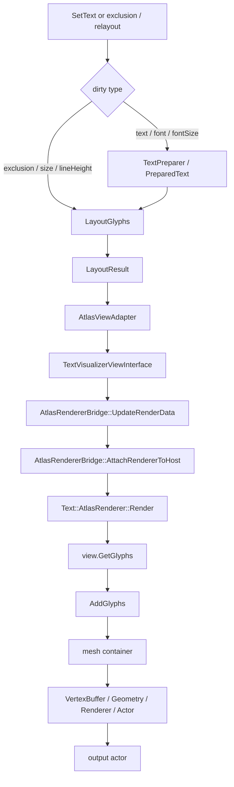

# TextVisualizer Atlas Render Update Cost Analysis

## 1. 현재 관찰

`text-visualizer-experimental-example.cpp`를 통해 기존 `Label` tile 방식과 `TextVisualizer` tile 방식을 비교했을 때, 체감 성능 차이가 크지 않았다.

현재 해석은 다음과 같다.

- `TextVisualizer` wrapper 자체가 가장 큰 병목은 아닐 가능성이 높다.
- `Single TextVisualizer` mode는 전체 text buffer를 하나의 문자열로 만들고 `SetText()` / render update를 수행하므로 full update 비용이 크다.
- `Partial TextVisualizer tile` mode는 dirty tile만 `SetText()` 하지만, dirty tile이 많거나 renderer update 비용이 크면 `Label` tile 방식과 큰 차이가 나기 어렵다.
- 지금까지 줄인 비용은 주로 prepare / layout / adapter 중복 계산이다.
- 남은 큰 비용 후보는 shared `AtlasRenderer::Render()` backend의 full rebuild 경로다.

따라서 다음 core 성능 분석 축은 control 종류가 아니라 `SetText()` 이후 render update, `ViewInterface::GetGlyphs()`, atlas mesh / actor / renderer update 비용이다.

## 2. 현재 TextVisualizer Update Path

현재 `TextVisualizer` update path는 변경 종류에 따라 prepare 또는 layout에서 시작하지만, render update 시점에는 공통적으로 `AtlasRenderer` backend를 사용한다.



현재 각 단계의 의미는 다음과 같다.

| 단계 | 현재 역할 | 최근 최적화 상태 |
|---|---|---|
| `PreparedText` | glyph shaping, glyph metrics, line break, glyph layout cache 보관 | stable `GlyphLayoutData`를 prepare 단계로 이동 |
| `LayoutGlyphs()` | exclusion / word wrap 기반 glyph placement 생성 | y-sorted exclusion, buffer reserve, word wrap lookup cache 적용 |
| `AtlasViewAdapter` | `LayoutResult` / `PreparedText`를 renderer view 형태로 연결 | line metrics cache와 renderer glyph position cache 적용 |
| `UpdateRenderData()` | renderer ensure + lightweight validation | full render data vector build 제거 |
| `AttachRendererToHost()` | `Renderer::Render()` 호출, output actor attach | output parent consistency와 render dirty clear gate 유지 |
| `AtlasRenderer::Render()` | glyph vector 획득, atlas mesh 생성, actor 반환 | 아직 full rebuild 성격이 남아 있음 |

## 3. `AtlasRenderer::Render()` 비용 분석

분석 대상은 `dali-ui-foundation/internal/text/rendering/atlas/text-atlas-renderer.cpp`의 `AtlasRenderer::Render()`와 `Impl::AddGlyphs()`이다.

### 3.1 Render 시작 시 actor reset

`AtlasRenderer::Render()`는 시작하자마자 다음을 수행한다.

```cpp
UnparentAndReset(mImpl->mActor);
```

즉 이전 render output actor를 재사용하는 구조가 아니라, 기존 actor handle을 unparent/reset한 뒤 새 output actor를 만들 수 있는 경로다. `TextVisualizer`의 `AtlasRendererBridge::AttachRendererToHost()`는 새 output actor가 돌아올 수 있음을 전제로 이전 output actor detach와 새 actor attach를 처리한다.

비용 후보:

- 기존 actor unparent
- output actor 재생성 가능성
- host child attach / detach
- render tree mutation

### 3.2 glyph / position vector build

`Render()`는 `view.GetNumberOfGlyphs()`를 호출한 뒤 매 render마다 local `Vector<GlyphInfo>`와 `Vector<Vector2>`를 만든다.

```cpp
Vector<GlyphInfo> glyphs;
glyphs.Resize(numberOfGlyphs);

Vector<Vector2> positions;
positions.Resize(numberOfGlyphs);

numberOfGlyphs = view.GetGlyphs(glyphs.Begin(), positions.Begin(), alignmentOffset, 0u, numberOfGlyphs);
```

`TextVisualizerViewInterface::GetGlyphs()`는 placement count만큼 다음을 수행한다.

- `AtlasViewAdapter::GetGlyphPlacement()`
- `AtlasViewAdapter::GetGlyphInfo()`
- `AtlasViewAdapter::GetRendererGlyphPosition()`
- output `glyphs[]` / `positions[]` copy

최근 `AtlasViewAdapter`가 renderer glyph positions를 미리 계산하므로 position 계산 비용은 줄었다. 하지만 `Render()`의 glyph / position vector allocation / resize / copy는 여전히 남아 있다.

### 3.3 AddGlyphs 내부 mesh container build

`Impl::AddGlyphs()`는 매 render마다 다음 local container를 만든다.

```cpp
std::vector<MeshRecord> meshContainer;
std::vector<MeshRecord> meshContainerOutline;
Vector<Extent> underlineExtents;
Vector<Extent> strikethroughExtents;
```

그 뒤 glyph 전체를 순회하며 다음 일을 수행한다.

- view style state 조회
- underline / strikethrough runs 조회
- block size 계산
- glyph atlas cache lookup / reference update
- glyph별 mesh 생성
- mesh stitching
- underline / strikethrough mesh 생성 가능성

`TextVisualizerViewInterface`는 대부분의 style 기능을 false/null로 돌려주지만, `AtlasRenderer` 코드는 generic text renderer라 해당 branch와 container 준비 비용을 지나간다.

### 3.4 glyph atlas texture lookup / upload 조건

glyph loop 안에서는 `CacheGlyph()`를 통해 glyph atlas slot을 찾거나 추가한다. glyph bitmap 자체는 atlas/glyph manager에 cache될 수 있지만, render update마다 glyph별 lookup과 reference count update는 수행된다.

또한 `AddGlyphs()`는 새 text cache를 만들고 마지막에 기존 cache를 제거한다.

```cpp
Vector<TextCacheEntry> newTextCache;
...
RemoveText();
mTextCache.Swap(newTextCache);
```

`RemoveText()`는 이전 `mTextCache`를 순회하며 glyph manager reference count를 감소시킨다.

비용 후보:

- glyph별 atlas slot lookup
- missing glyph atlas upload 가능성
- previous text cache reference decrement
- new text cache swap

### 3.5 Geometry / VertexBuffer / Renderer / Actor 생성

`CreateMeshActor()`는 mesh record마다 다음 객체를 새로 만든다.

```cpp
VertexBuffer quadVertices = VertexBuffer::New(mQuadVertexFormat);
quadVertices.SetData(...);

Geometry quadGeometry = Geometry::New();
quadGeometry.AddVertexBuffer(quadVertices);
quadGeometry.SetIndexBuffer(...);

Dali::Renderer renderer = Dali::Renderer::New(quadGeometry, shader);
Actor actor = Actor::New();
actor.AddRenderer(renderer);
```

즉 layout / glyph positions가 바뀔 때 기존 geometry의 vertex buffer만 update하는 경로가 아니라, mesh record 기준으로 `VertexBuffer`, `Geometry`, `Renderer`, `Actor`가 새로 만들어지는 경로다.

shader object 자체는 `mShaderL8` / `mShaderRgba`로 cache되지만, renderer / geometry / actor는 render마다 새로 생성될 수 있다.

### 3.6 output actor child 구성

`CreateActors()`는 `mActor`가 없으면 새 parent actor를 만들고, mesh record마다 `CreateMeshActor()` 결과를 child로 추가한다.

drop shadow가 있으면 shadow actor도 추가할 수 있다. `TextVisualizerViewInterface`는 shadow를 사용하지 않지만, generic path는 해당 분기 구조를 갖는다.

현재 `TextVisualizer`는 `AtlasRendererBridge::AttachRendererToHost()`에서 output actor를 host에 붙인다. 하지만 `AtlasRenderer::Render()` 시작에서 `mImpl->mActor`가 reset되므로 output actor reuse는 제한적이다.

### 3.7 비용 표

| 단계 | 매 render마다 수행 여부 | 비용 후보 | 재사용 가능성 |
|---|---|---|---|
| `UnparentAndReset(mActor)` | 예 | actor detach/reset, render tree mutation | output actor lifecycle 재설계 필요 |
| glyph / position vector 생성 | 예 | `Vector` resize, `GetGlyphs()` copy | preallocated internal buffer 또는 direct view 필요 |
| `ViewInterface::GetGlyphs()` | 예 | placement/glyph lookup, glyph info copy, position copy | adapter cache 강화 가능 |
| style / decoration state 조회 | 예 | generic renderer branch 비용 | TextVisualizer-only lightweight path 가능 |
| `CalculateBlocksSize()` | 예 | glyph list scan, font/block size lookup | glyph/font stable cache 가능성 |
| glyph atlas lookup/cache | 예 | glyph별 slot lookup, cache ref update | atlas cache는 있으나 per-render lookup은 남음 |
| `RemoveText()` | 예 | previous text cache reference decrement | geometry-only update 시 줄일 수 있음 |
| mesh container build | 예 | mesh vector allocation, mesh stitch | persistent mesh/vertex buffer 필요 |
| `VertexBuffer::New()` / `SetData()` | 예 | GPU/update buffer allocation/copy | same topology면 vertex buffer update 가능성 |
| `Geometry::New()` | 예 | geometry object 생성 | geometry reuse 가능성 |
| `Renderer::New()` | 예 | renderer object 생성, texture/shader binding | renderer reuse 가능성 |
| mesh actor 생성 | 예 | actor allocation, property setup, child attach | actor reuse 가능성 |

## 4. 현재 TextVisualizer Cache가 줄인 비용 / 못 줄인 비용

이미 줄인 비용:

- `PreparedText`가 glyph layout data를 보관해 `LayoutGlyphs()` 시작 비용을 줄였다.
- `LayoutGlyphs()`는 y-sorted exclusion scan과 word wrap lookup cache를 사용한다.
- `LayoutResult` / render buffers reserve로 반복 allocation을 일부 줄였다.
- render dirty clear condition으로 동일 상태에서 불필요한 render 재호출을 줄였다.
- layout unchanged render skip으로 placement-only dirty가 결과를 바꾸지 않는 경우 render path를 생략할 수 있다.
- `AtlasViewAdapter`가 renderer glyph positions를 미리 계산한다.
- `UpdateRenderData()`는 full render data vector build 대신 lightweight validation으로 축소됐다.

아직 줄이지 못한 비용:

- `AtlasRenderer::Render()` 내부 glyph / position vector build
- `TextVisualizerViewInterface::GetGlyphs()` copy path
- `AddGlyphs()`의 glyph 전체 순회와 generic style / decoration path
- mesh container build
- `RemoveText()` / `mTextCache` reference count update
- `VertexBuffer`, `Geometry`, `Renderer`, `Actor` 재생성
- output actor lifecycle reset
- geometry-only update path 부재

핵심은 `TextVisualizer`의 prepare / layout / adapter cache가 좋아져도, render backend가 매번 full mesh / actor rebuild를 수행하면 전체 체감 성능 개선이 제한될 수 있다는 점이다.

## 5. Label과 큰 차이가 안 나는 이유 가설

### A. `Label`도 결국 shared text renderer backend 비용을 탄다

기존 `Label`은 `TextController` / `TextView` 경로를 사용하지만, glyph atlas render backend는 결국 같은 `Text::AtlasRenderer` 계열 비용을 사용할 수 있다. 따라서 control wrapper가 달라도 backend mesh / actor rebuild 비용이 크면 차이가 줄어든다.

### B. `TextVisualizer`도 `AtlasRenderer::Render()` full call을 사용한다

`TextVisualizer`는 기존 `TextController`를 우회하지만, 최종 render는 `AtlasRendererBridge`를 통해 `Text::AtlasRenderer::Render()`를 호출한다. 즉 layout path는 새로워졌지만 render backend는 공유한다.

### C. prepare/layout 비용을 줄여도 full render update가 남아 있다

TextVisualizer는 moving bounds use case에서 prepare 재사용과 layout cache를 강화했다. 하지만 매 frame text 자체가 바뀌거나 tile text가 바뀌면 render dirty가 열리고 `Renderer::Render()` full path가 실행된다.

experimental sample에서는 ball / trail glyph가 계속 바뀌므로 `SetText()` 기반 update가 많다. 이 경우 `TextVisualizer`의 exclusion/layout 장점보다 render update 비용이 더 크게 보일 수 있다.

### D. tile partial rendering은 dirty tile 수가 충분히 적을 때만 이득이 크다

기존 `Label` tile 방식과 `TextVisualizer` tile 방식 모두 dirty tile 수가 많아지면 여러 control이 동시에 text update / render update를 수행한다.

dirty region이 넓거나 ball count가 많으면 partial tile의 이점이 줄어든다.

### E. single TextVisualizer mode는 full text update라 partial tile보다 불리할 수 있다

single mode는 하나의 surface라는 구조적 단순함이 있지만, 매 frame 전체 grid 문자열이 바뀌면 전체 glyph vector / mesh가 다시 만들어진다.

따라서 single mode는 TextVisualizer의 “large text surface” 기준 비교로는 좋지만, animated text grid처럼 대부분 glyph가 계속 변하는 workload에서는 partial tile보다 불리할 수 있다.

## 6. 다음 구현 후보

### 후보 1. `AtlasRenderer` geometry-only update 가능성 조사

목표:

- 기존 output actor / renderer / geometry를 유지한다.
- glyph count, atlas texture, mesh topology가 같거나 유사한 경우 vertex buffer data만 update한다.
- `VertexBuffer::SetData()` 또는 유사 update만 수행하는 경로를 만든다.

장점:

- render backend full rebuild 비용을 직접 줄인다.
- moving bounds처럼 glyph identity는 같고 positions만 바뀌는 `TextVisualizer` 본래 목표와 잘 맞는다.

위험:

- `text-atlas-renderer.*` 수정이 필요할 가능성이 높다.
- 기존 `Label`, `InputField`, text style, markup, decoration 경로와 공유되므로 회귀 위험이 크다.
- 데모 후 별도 prototype으로 분리하는 것이 안전하다.

### 후보 2. TextVisualizer 전용 lightweight atlas renderer path

목표:

- 기존 `Text::AtlasRenderer`의 style/editor-heavy generic path를 피한다.
- `PreparedText`, `LayoutResult`, renderer positions cache를 직접 사용한다.
- TextVisualizer가 지원하지 않는 markup / underline / strikethrough / shadow / hyphenation branch를 제거한 단순 mesh update path를 만든다.

장점:

- 기존 text pipeline 회귀 위험을 줄일 수 있다.
- TextVisualizer 실험 경로의 목적에 맞는 backend를 만들 수 있다.

위험:

- atlas glyph manager / mesh factory reuse 설계가 필요하다.
- renderer backend 중복 구현이 생길 수 있다.
- 장기 후보이며 데모 전 작업으로는 크다.

### 후보 3. `ViewInterface::GetGlyphs()` copy path 축소

목표:

- `AtlasRenderer::Render()`가 요구하는 glyph / position data를 더 직접 제공한다.
- adapter의 cached positions와 prepared glyph vector를 최대한 copy-only로 연결한다.

가능한 방향:

- adapter에 contiguous glyph info / position cache를 함께 구성한다.
- `TextVisualizerViewInterface::GetGlyphs()`에서 placement lookup을 줄인다.
- `AtlasRenderer` contract를 바꾸지 않는 선에서 `GetGlyphs()` 루프를 단순화한다.

한계:

- `Render()`가 여전히 local `Vector<GlyphInfo>` / `Vector<Vector2>`를 만들고 copy한다.
- renderer contract를 바꾸지 않으면 큰 폭의 개선은 제한적일 수 있다.

### 후보 4. tile partial rendering에서 dirty tile count 줄이기

목표:

- sample architecture 차원에서 dirty tile 수를 줄인다.
- tile size, dirty region expansion, impact decay, update threshold를 조정한다.

장점:

- core / renderer 변경이 없다.
- 데모 전 low-risk로 시도 가능하다.

한계:

- TextVisualizer core 최적화가 아니라 workload 조정이다.
- visual fidelity와 trade-off가 있다.

### 후보 5. `SetText()` 없는 geometry update API

목표:

- text / glyph sequence가 같고 position만 바뀌는 경우 `SetText()`와 prepare를 건너뛴다.
- layout result 또는 exclusion 변화에 따라 geometry만 갱신한다.

의미:

- TextVisualizer의 원래 목표인 “text/font/fontSize 변경 시 prepare, moving bounds 변경 시 layout/render만” 구조에 더 잘 맞는다.
- glyph identity가 stable한 moving bounds sample에서는 큰 효과 가능성이 있다.

위험:

- internal API 설계가 필요하다.
- renderer backend가 geometry-only update를 지원해야 효과가 크다.

## 7. 데모 전 / 데모 후 분리

데모 전 안전 작업:

- debug counters로 dirty tile count / render call count / glyph count 확인
- sample setting 조정
- status off/on 측정 분리
- dirty tile size / ball count / update frequency 실험
- core code 변경 없이 workload 특성 관찰

데모 후 작업:

- `AtlasRenderer` geometry-only update prototype
- TextVisualizer-only renderer path 설계
- `ViewInterface::GetGlyphs()` direct/cached data path 검토
- public/internal geometry update API 검토
- partial relayout prototype

특히 `text-atlas-renderer.*`는 기존 `Label`, `InputField`, `TextView`와 공유되므로 데모 전에는 수정하지 않는 것이 안전하다.

## 8. 결론

`Label`과 `TextVisualizer`의 tile mode 성능 차이가 크지 않다는 관찰은 `TextVisualizer` wrapper가 병목이라는 뜻보다는, shared `AtlasRenderer` backend cost가 병목일 가능성이 크다는 신호로 해석하는 편이 맞다.

지금까지의 최적화는 다음 비용을 줄였다.

- prepare 이후 stable text-derived 계산
- layout pass-local lookup
- adapter position 계산
- redundant render data vector build
- layout unchanged render skip

하지만 다음 비용은 아직 남아 있다.

- `AtlasRenderer::Render()` full call
- `ViewInterface::GetGlyphs()` copy
- mesh / vertex buffer / geometry / renderer / actor rebuild
- previous text cache reference count update
- output actor reset / attach lifecycle

따라서 다음 큰 성능 개선 방향은 `AtlasRenderer::Render()` full rebuild를 줄이는 것이다.

다만 이 영역은 기존 text pipeline과 공유되는 backend이므로 바로 수정하지 않는다. 데모 전에는 분석과 counters 중심으로 관찰하고, 데모 후에 `AtlasRenderer` geometry-only update 또는 `TextVisualizer` 전용 lightweight renderer path를 별도 prototype으로 분리하는 것이 안전하다.
