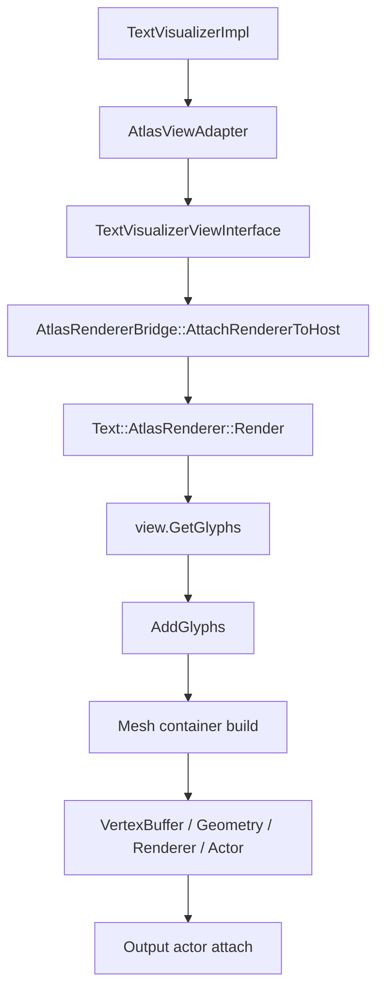

# TextVisualizer Render Optimization Phase 2 Plan

## 1. Phase 2 목적

Phase 1은 `TextVisualizer`의 first stable version이다.

Phase 1에서는 기존 `TextController` / `TextView`를 수정하지 않고 별도 경로로 다음 기능을 동작시켰다.

- prepare / shaping / glyph metrics cache
- exclusion 기반 layout
- moving bounds demo
- word wrap
- atlas renderer bridge
- render dirty clear
- layout unchanged render skip
- prepare / layout / adapter cache 최적화

Phase 2는 “layout 이후 render update 비용”을 줄이는 단계다.

핵심 목표는 다음 문장으로 고정한다.

> `TextVisualizer`의 차별화 포인트는 text를 매 frame 새로 만드는 것이 아니라, prepared glyph data를 유지한 상태에서 layout / exclusion / glyph position 변화에 빠르게 반응하는 것이다.

따라서 Phase 2의 primary target은 **prepare 이후 layout-dynamic text**다.

## 2. Phase 1 완료 범위 요약

### PreparedText

Phase 1의 `PreparedText`는 다음 stable data를 보관한다.

- UTF-32 characters
- line break info
- paragraph info
- script / font run 기반 shaping 결과
- glyphs
- glyph metrics
- glyph-to-character map
- characters-per-glyph
- character-to-glyph / glyphs-per-character tables
- prepared-level line metrics
- stable `GlyphLayoutData`
  - advance
  - width
  - prefix advance
  - character start / end
  - break allowed / mandatory after glyph

이 범위는 text / font / font size가 변하지 않는 동안 재사용된다.

### Layout

Phase 1의 layout 경로는 다음을 지원한다.

- exclusion region 회피 layout
- y-sorted exclusion scan
- basic word wrap
- line metrics 기반 natural line height
- `TextLine.metrics`
- `LayoutResult::Reserve()`
- placeholder / glyph layout buffer reserve
- layout result signature

아직 partial relayout은 없다. exclusion 또는 size 변경 시 `LayoutGlyphs()`는 전체 placement를 다시 계산한다.

### Adapter

`AtlasViewAdapter`는 `PreparedText`와 `LayoutResult`를 render-ready view 형태로 연결한다.

현재 adapter cache는 다음을 포함한다.

- line-level metrics cache
- renderer glyph position cache
- text color / control size / layout size

renderer glyph positions는 layout result 연결 시점에 미리 계산된다. 따라서 `TextVisualizerViewInterface::GetGlyphs()`는 glyph position 계산을 매번 반복하지 않고 cache를 우선 사용한다.

### Bridge

`AtlasRendererBridge`는 다음 역할을 수행한다.

- render host lifecycle 관리
- `TextVisualizerViewInterface` 연결
- `Text::AtlasRenderer::Render()` 호출
- output actor attach / detach
- lightweight `UpdateRenderData()` validation
- render dirty clear success gate
- render diagnostics getter 제공

`UpdateRenderData()`는 더 이상 glyph count만큼 full render data vector를 만들지 않는다. 현재는 renderer ensure와 first / last glyph smoke validation 중심의 lightweight gate다.

### Sample

Phase 1 sample 상태는 다음과 같다.

- `text-visualizer-performance-example.cpp`
  - `TextVisualizer` 중심 performance demo
  - moving orb / overlay text
  - static / dynamic exclusion split
  - optional debug status
  - FPS-only default status
  - window-wide orb movement
  - foreground title / overlay text layering
- `text-visualizer-experimental-example.cpp`
  - 기존 `text-experimental-example.cpp`의 text grid simulation을 `TextVisualizer`로 비교
  - `SINGLE_TEXT_VISUALIZER`
  - `PARTIAL_TEXT_VISUALIZER_TILES`

## 3. Phase 2 Primary Workload

### A. Layout-Dynamic Workload

Phase 2의 primary workload는 다음과 같다.

- text content stable
- glyph sequence stable
- font / style stable
- prepared glyph data stable
- exclusion regions move
- layout result changes
- glyph positions change
- render output must update

예시는 다음과 같다.

- PreText-like editorial demo
- moving object collision with paragraphs
- live image / object avoidance
- animated exclusion bounds
- prepared long-form text reflow

최적화 목표는 다음이다.

- no re-prepare
- minimal relayout
- minimal render update
- ideally geometry-only update

Phase 2에서 가장 중요한 질문은 “glyph identity는 그대로인데 position만 바뀌는 경우, 왜 renderer가 매번 full rebuild를 해야 하는가?”다.

## 4. Non-Primary Workload

### B. Content-Dynamic Workload

Phase 2의 non-primary workload는 다음이다.

- text content changes every frame
- glyph sequence changes
- `SetText()` frequently called
- prepare / shaping / string rebuild is dominant

예시는 다음과 같다.

- `text-experimental` ASCII raster
- terminal / canvas-like dynamic text grid
- tile text animation
- per-frame content generation

이 workload도 가치가 있지만 성격이 다르다.

현재 `TextVisualizer`가 강점을 보이려는 지점은 “prepared glyph를 유지하고 placement만 빠르게 바꾸는 것”이다. content-dynamic workload는 별도 전략이 필요하다.

가능한 별도 전략:

- monospace dynamic text renderer
- fixed-cell glyph cache
- tile-level persistent glyph buffers
- content-diff renderer update

Phase 2는 이 workload를 먼저 최적화하지 않는다.

## 5. Current Render Bottleneck

현재 render update path는 다음과 같다.



Phase 1은 prepare / layout / adapter 비용을 줄였다. 하지만 `Text::AtlasRenderer::Render()`는 여전히 generic full render update 경로를 수행한다.

코드 기준으로 현재 `AtlasRenderer::Render()`는 다음 일을 할 수 있다.

- render 시작 시 `UnparentAndReset(mImpl->mActor)`
- glyph / position vector 생성
- `view.GetGlyphs()` 호출
- `AddGlyphs()` 호출
- style / decoration branch 확인
- glyph atlas lookup / cache reference update
- `RemoveText()`로 previous text cache ref count 감소
- mesh container 생성
- `VertexBuffer::New()`
- `Geometry::New()`
- `Dali::Renderer::New()`
- mesh actor 생성
- output actor child 구성

이 경로가 남아 있으면, layout-dynamic workload에서 `LayoutGlyphs()`가 빨라져도 최종 frame cost는 renderer backend full rebuild에 의해 제한된다.

## 6. Why Not Modify AtlasRenderer Directly First

`Text::AtlasRenderer`는 기존 text pipeline과 공유된다.

영향 가능 대상:

- `Label`
- `InputField`
- 기존 `TextView`
- 기존 `TextController` 기반 rendering
- markup / style / decoration
- text fit / ellipsis / cutout

`AtlasRenderer`는 `TextVisualizer`가 현재 필요로 하지 않는 많은 기능을 지원한다.

- underline
- strikethrough
- shadow
- outline
- background
- markup color
- hyphen
- ellipsis
- cutout
- color glyph / emoji
- generic style runs

따라서 `text-atlas-renderer.*`를 먼저 수정하면 기존 text stack 회귀 위험이 크다.

Phase 2의 첫 방향은 다음과 같이 잡는다.

1. 기존 `AtlasRenderer`는 그대로 둔다.
2. `TextVisualizer` 전용 lightweight renderer prototype을 별도 internal 경로로 설계한다.
3. prototype이 유효하면 나중에 `AtlasRenderer`에 geometry-only update path를 통합할지, 별도 renderer로 유지할지 결정한다.

## 7. TextVisualizer-Only Lightweight Renderer Prototype Direction

추천 component 이름:

```text
TextVisualizerGlyphRenderer
```

위치 후보:

```text
dali-ui-foundation/internal/text/text-visualizer/rendering/
```

책임:

- output actor 소유
- mesh actor / renderer / geometry lifecycle 관리
- `PreparedText` + `LayoutResult` + `AtlasViewAdapter` cache 사용
- renderer glyph positions cache 사용
- current `TextVisualizer` scope만 지원
- glyph position만 바뀌는 경우 actor / renderer / geometry 재생성 회피 시도
- 가능한 경우 vertex buffer / geometry data in-place update

지원 범위:

- glyph rendering
- single text color
- prepared glyph sequence
- layout result / glyph positions update
- fallback to existing `AtlasRenderer` 가능

명시적 non-goals:

- full `Label` feature 지원
- rich markup 지원
- underline / strikethrough / shadow / outline 지원
- ellipsis / text fit 지원
- editing / selection / cursor / decorator 지원
- 기존 `AtlasRenderer` 글로벌 대체

## 8. Prototype Design Candidates

### Candidate A. Bridge-Level Cached Output With Existing AtlasRenderer

내용:

- 기존 `Text::AtlasRenderer`를 계속 사용한다.
- bridge / adapter / `ViewInterface` overhead만 더 줄인다.
- output attach path를 최소화한다.

장점:

- low risk
- 기존 renderer behavior 유지
- 기존 fallback과 동일

한계:

- `AddGlyphs()` / mesh / actor rebuild를 해결하지 못한다.
- Phase 2 핵심 병목을 직접 줄이지 못할 가능성이 크다.

### Candidate B. TextVisualizer-Only Renderer Using Existing Atlas Cache Helpers

내용:

- `internal/text/text-visualizer` 아래 새 renderer class를 둔다.
- existing atlas glyph manager / mesh helper를 가능한 범위에서 사용한다.
- `PreparedText` glyphs와 cached renderer positions로 mesh를 만든다.
- actor / renderer / geometry를 renderer 내부에 유지한다.
- 같은 glyph sequence / atlas page / style이면 geometry-only update를 시도한다.

장점:

- primary workload와 직접 맞는다.
- 기존 `Label` / `InputField` renderer를 건드리지 않는다.
- 성공 시 Phase 2 value를 가장 잘 증명할 수 있다.

위험:

- atlas cache helper 접근성이 부족할 수 있다.
- `Text::AtlasRenderer::Impl` 내부 logic을 일부 중복할 수 있다.
- atlas page split / color glyph 처리가 생각보다 복잡할 수 있다.

추천:

- 가장 먼저 feasibility를 확인한다.
- helper access가 부족하면 필요한 internal access point를 문서화한다.

### Candidate C. TextVisualizer-Only Renderer With Temporary Simple Texture Path

내용:

- 빠른 prototype을 위해 간단한 texture / mesh path를 별도로 만든다.
- existing atlas infra를 일부 우회한다.

장점:

- MVP를 빨리 만들 수 있다.
- geometry-only update structure를 독립적으로 검증할 수 있다.

위험:

- glyph atlas behavior가 incomplete할 수 있다.
- duplicate renderer logic이 커질 수 있다.
- fallback font / emoji / atlas page handling이 빠질 수 있다.

결론:

- 실험 prototype으로만 허용한다.
- production path로 바로 삼지 않는다.

### Candidate D. Modify Text::AtlasRenderer With Geometry-Only Update Path

내용:

- 기존 `Text::AtlasRenderer`에 persistent actor / renderer / geometry path를 추가한다.
- stable glyph sequence에서 vertex buffer만 update한다.

장점:

- 가장 integrated한 방향이다.
- 기존 text stack도 장기적으로 이득을 볼 수 있다.

위험:

- shared renderer 회귀 위험이 가장 크다.
- style / markup / decoration / ellipsis 조합 검증 범위가 넓다.

결론:

- Phase 2 later step이다.
- 첫 구현 커밋으로는 적절하지 않다.

## 9. Required Data For Lightweight Renderer

`TextVisualizerGlyphRenderer`가 필요한 data는 다음과 같다.

### From PreparedText

- glyphs
- glyph index
- font id
- glyph metrics
- glyph identity for atlas lookup
- glyph style flags
- optional text buffer / glyph-to-character map

### From LayoutResult / AtlasViewAdapter

- glyph placements
- cached renderer glyph positions
- layout size
- control size
- text color
- renderable glyph count

### From Existing Atlas Infrastructure

- glyph bitmap / atlas slot lookup
- atlas texture
- texture coordinates
- atlas page id
- mesh generation helper
- shader
- texture set
- pixel format split

## 10. Key Technical Questions

다음 구현 전 반드시 확인해야 할 질문이다.

1. `TextVisualizer`가 사용할 수 있는 existing atlas / glyph cache class는 무엇인가?
2. glyph atlas cache 접근이 `Text::AtlasRenderer::Impl` 안에 숨겨져 있는가?
3. `AtlasGlyphManager` / `AtlasMeshFactory`를 새 renderer에서 직접 사용할 수 있는가?
4. mesh generation helper를 재사용할 수 있는가, 아니면 중복 구현이 필요한가?
5. DALi `VertexBuffer` data는 생성 후 안정적으로 update할 수 있는가?
6. `Geometry` / `Renderer`를 유지한 채 vertex buffer data만 교체할 수 있는가?
7. 하나의 mesh actor로 충분한가, atlas page별 multiple mesh actor가 필요한가?
8. 현재 `AtlasRenderer`는 texture / pixel format / atlas page 기준으로 mesh를 어떻게 split하는가?
9. textColor는 shader uniform인지 vertex color인지, lightweight path에서 어떻게 맞출 것인가?
10. color glyph / emoji와 L8 glyph가 섞이면 renderer / shader split이 어떻게 필요한가?
11. `RemoveText()` / glyph reference count를 lightweight renderer가 어떻게 관리해야 하는가?
12. 기존 `AtlasRenderer` fallback과 output actor lifecycle을 어떻게 공존시킬 것인가?
13. `TextVisualizerGlyphRenderer` MVP가 `text-atlas-renderer.*` 수정 없이 가능한가?

## 11. Phase 2 Implementation Steps

### Commit 1. Phase 2 plan document

현재 커밋이다.

목표:

- Phase 2 target 고정
- render bottleneck 고정
- prototype 방향 고정
- 다음 구현 단위 정리

### Commit 2. Inspect atlas cache access points

목표:

- `AtlasGlyphManager` / `AtlasMeshFactory` 접근 가능성 확인
- `Text::AtlasRenderer::Impl` private dependency 목록화
- `TextVisualizerGlyphRenderer` MVP에 필요한 minimum class / method 정리

형태:

- md-only 또는 tiny internal probe
- behavior change 없음

커밋 후보명:

```text
Inspect TextVisualizer lightweight renderer dependencies
```

### Commit 3. Add TextVisualizerGlyphRenderer skeleton

목표:

- 새 class files 추가
- output actor lifecycle skeleton
- renderer state reset / clear
- no active usage
- no actual glyph rendering

검증:

- empty state UTC
- no behavior change

### Commit 4. Add simple glyph mesh build prototype

목표:

- existing atlas cache helper 사용 가능하면 사용
- static text 1회 draw prototype
- `TextVisualizer` active path에는 아직 연결하지 않거나 internal feature flag 뒤에 둔다.

검증:

- simple text visual smoke
- atlas page / renderer count 확인

### Commit 5. Integrate optional renderer path into AtlasRendererBridge

목표:

- 기존 `Text::AtlasRenderer` path를 fallback으로 유지
- internal switch로 lightweight renderer path 사용
- public API 없음
- 실패 시 기존 renderer path 사용

검증:

- 기존 TextVisualizer UTC
- performance sample visual smoke
- actor leak check

### Commit 6. Geometry-only update

목표:

- same glyph sequence
- same atlas pages
- same style
- positions only changed
- vertex buffer / geometry data update only

검증:

- moving bounds FPS 비교
- output renderer count 안정성
- stale actor 없음

### Commit 7. Decide integration direction

결정:

- TextVisualizer-only renderer로 유지
- 또는 proven path를 `AtlasRenderer` shared geometry-only update로 추출

## 12. Validation Plan

각 구현 단계에서 확인할 항목:

- `UtcDaliTextVisualizer`
- performance sample build
- visual smoke
- existing `AtlasRenderer` path fallback
- lightweight path comparison

workload:

- stable text + moving exclusions
- text color change
- font size change
- text change
- empty text
- long text
- fallback font / mixed glyph
- color glyph / emoji
- multiple atlas pages if possible

metrics:

- render call count
- actor count
- renderer count
- output child count
- glyph count
- glyph placement count
- FPS rough
- visual correctness
- memory growth
- stale actor leak
- fallback frequency

주의:

- sample FPS는 rough value다.
- status debug on 상태는 measurement를 왜곡할 수 있다.
- first target은 layout-dynamic workload다.

## 13. Risks

Phase 2 renderer prototype의 주요 risk:

- glyph atlas access가 너무 private할 수 있다.
- `Text::AtlasRenderer` logic을 중복할 수 있다.
- fallback font behavior가 빠질 수 있다.
- color glyph / emoji 처리가 어렵다.
- atlas page splitting이 복잡할 수 있다.
- shader / textColor 적용이 기존 output과 다를 수 있다.
- actor / renderer lifecycle bug가 생길 수 있다.
- stale actor / stale glyph reference가 누적될 수 있다.
- visual output이 기존 `AtlasRenderer`와 달라질 수 있다.
- existing renderer fallback과 bridge state가 꼬일 수 있다.
- 너무 일찍 `AtlasRenderer`에 통합하면 `Label` / `InputField` regression risk가 커진다.

## 14. Decision Criteria

prototype이 가치 있다고 판단할 조건:

- stable text + moving exclusion case에서 명확한 개선이 있다.
- visual output이 기존 `AtlasRenderer` path와 충분히 일치한다.
- actor / renderer count가 frame마다 증가하지 않는다.
- output actor lifecycle이 안정적이다.
- no stale actor accumulation.
- no obvious memory growth.
- code가 `Label` / `InputField` path와 격리된다.
- fallback path가 남아 있다.

가치가 부족한 경우:

- 기존 `AtlasRenderer` path를 유지한다.
- `ViewInterface::GetGlyphs()` copy path만 더 줄인다.
- 데모 후 `AtlasRenderer` shared geometry-only update 설계로 전환한다.

## 15. Next Immediate Work

이 문서 다음 추천 작업:

```text
Inspect TextVisualizer lightweight renderer dependencies
```

해당 작업에서 답해야 하는 것:

- 어떤 file / class가 필요한가?
- `TextVisualizer`가 atlas glyph cache에 접근할 수 있는가?
- `AtlasMeshFactory`를 재사용할 수 있는가?
- `VertexBuffer` / `Geometry` reuse가 가능한가?
- MVP renderer에 필요한 최소 기능은 무엇인가?
- 새 renderer 위치는 `internal/text/text-visualizer/rendering/`이 맞는가?
- 기존 `AtlasRenderer` fallback과 bridge를 어떻게 공존시킬 것인가?

이 작업은 가능하면 문서 중심으로 시작하고, 필요한 경우 compile-only skeleton은 별도 커밋으로 분리한다.

## 16. Conclusion

Phase 2는 layout-dynamic render update 최적화 단계다.

현재 `TextVisualizer`는 prepare / layout / adapter cache를 상당 부분 갖췄지만, 최종 render backend는 여전히 `Text::AtlasRenderer::Render()` full rebuild 경로를 사용한다.

다음 큰 성능 가치는 다음에서 온다.

- prepared glyph sequence 유지
- placement / position만 변경
- renderer output actor 유지
- mesh / geometry / renderer 재사용
- vertex buffer data만 update

첫 구현 방향은 shared `AtlasRenderer` 직접 수정이 아니라, `TextVisualizer` 전용 `TextVisualizerGlyphRenderer` prototype이다. 이 prototype으로 가치와 위험을 분리해 검증한 뒤, 장기적으로 shared `AtlasRenderer` geometry-only path에 통합할지 결정한다.

content-dynamic workload는 중요하지만 별도 문제다. Phase 2 설계를 content-dynamic ASCII raster workload에 맞추지 않는다.
