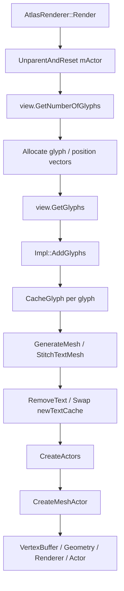
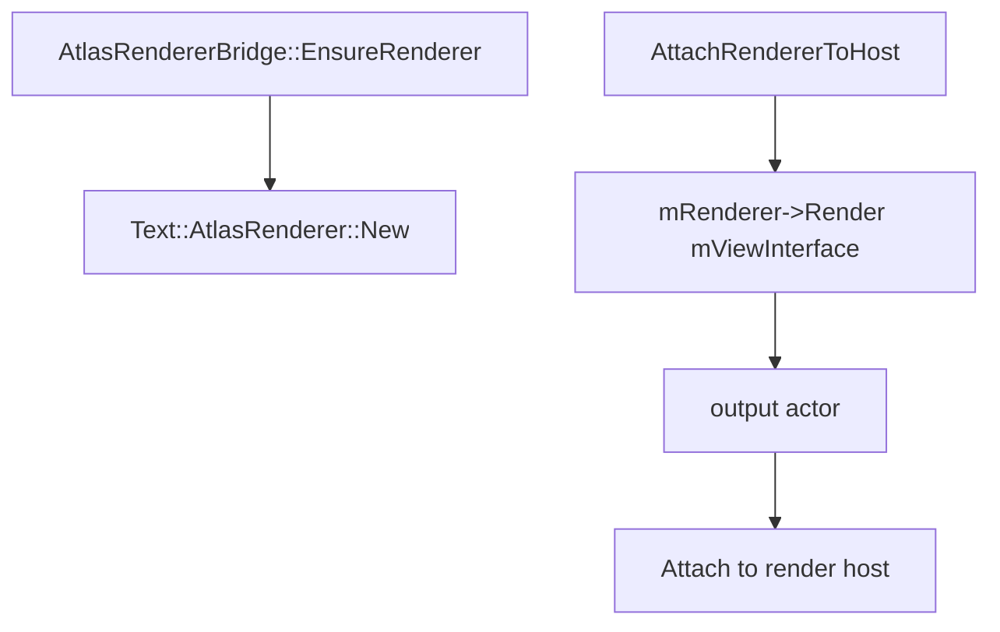
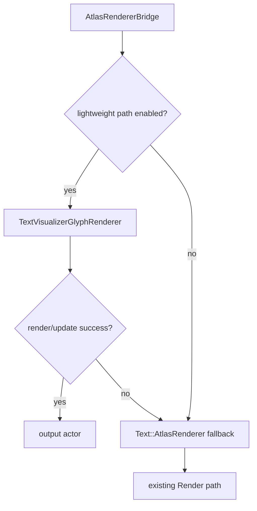

# TextVisualizer Lightweight Renderer Dependency Analysis

## 1. 목적

이 문서는 Phase 2의 다음 구현 후보인 `TextVisualizerGlyphRenderer`를 만들 수 있는지 확인하기 위한 dependency 분석이다.

핵심 질문은 다음이다.

- 기존 atlas glyph cache / mesh helper를 재사용할 수 있는가?
- glyph atlas cache와 mesh 생성 로직이 `Text::AtlasRenderer::Impl` 내부에 너무 강하게 숨겨져 있는가?
- `TextVisualizer` 전용 renderer MVP를 만들려면 어떤 internal dependency가 필요한가?

이번 분석의 결론부터 적으면 다음과 같다.

- `AtlasGlyphManager`, `AtlasManager::Mesh2D`, `AtlasMeshFactory`는 새 renderer에서 접근 가능한 internal/public handle 또는 helper로 보인다.
- 하지만 `CacheGlyph()`, `MeshRecord`, `TextCacheEntry`, `CreateActors()`, `CreateMeshActor()`, `RemoveText()`는 `text-atlas-renderer.cpp`의 `AtlasRenderer::Impl` private 구현 안에 있다.
- 따라서 skeleton은 바로 추가할 수 있지만, 실제 rendering MVP는 helper extraction 또는 제한된 중복 구현이 필요하다.
- 기존 `text-atlas-renderer.*`를 바로 수정하지 않으려면 Phase 2 prototype은 `TextVisualizerGlyphRenderer`가 필요한 최소 logic을 독립적으로 보유하고, 기존 `AtlasRenderer` path를 fallback으로 유지하는 방향이 가장 안전하다.

## 2. 현재 AtlasRenderer 구성 요약

`Text::AtlasRenderer`의 public surface는 작다.

| 항목 | 현재 위치 | 접근성 | 외부 재사용 가능성 | 비고 |
|---|---|---|---|---|
| `Text::AtlasRenderer` | `text-atlas-renderer.h` | public internal class | `Renderer::Render()` 호출만 가능 | 실제 구현은 `Impl`에 숨겨짐 |
| `AtlasRenderer::Impl` | `text-atlas-renderer.cpp` | private | 직접 재사용 불가 | cache / mesh / actor lifecycle 대부분 보유 |
| `Render()` | `AtlasRenderer` method | public virtual override | 기존 renderer path로만 사용 가능 | 시작 시 `UnparentAndReset(mImpl->mActor)` 수행 |
| `AddGlyphs()` | `Impl` method | private | 직접 재사용 불가 | generic style / decoration / mesh build 포함 |
| `CacheGlyph()` | `Impl` method | private | 직접 재사용 불가 | glyph bitmap 생성, atlas add, ref count update 포함 |
| `GenerateMesh()` | `Impl` method | private | 직접 재사용 불가 | atlas mesh 생성 + color + text cache entry 처리 |
| `CreateActors()` | `Impl` method | private | 직접 재사용 불가 | mesh record마다 actor 생성 |
| `CreateMeshActor()` | `Impl` method | private | 직접 재사용 불가 | `VertexBuffer`, `Geometry`, `Renderer`, `Actor` 생성 |
| `RemoveText()` | `Impl` method | private | 직접 재사용 불가 | 이전 `mTextCache` ref count 감소 |
| `TextCacheEntry` | `Impl` nested struct | private | 직접 재사용 불가 | glyph ref count lifecycle에 필요 |
| `MeshRecord` | anonymous namespace struct | cpp-local | 직접 재사용 불가 | atlas id + mesh data 보관 |
| shader handles | `Impl::mShaderL8`, `mShaderRgba` | private | 직접 재사용 불가 | shader source symbol은 별도 generated header에 있음 |

현재 `Render()` 흐름은 다음과 같다.



이 구조에서 `TextVisualizerGlyphRenderer`가 그대로 호출할 수 있는 것은 `Text::AtlasRenderer::Render()`뿐이다. Phase 2가 줄이려는 full rebuild 비용은 대부분 `Impl` private method 내부에 있으므로, 기존 renderer 호출만으로는 geometry-only update를 만들기 어렵다.

## 3. Atlas Glyph Cache 접근성

`AtlasGlyphManager` 자체는 접근 가능하다.

관련 public/internal API:

- `AtlasGlyphManager::Get()`
- `AtlasGlyphManager::IsCached(fontId, glyphIndex, style, slot)`
- `AtlasGlyphManager::Add(glyph, style, bitmap, slot)`
- `AtlasGlyphManager::GenerateMeshData(imageId, position, mesh)`
- `AtlasGlyphManager::SetNewAtlasSize(width, height, blockWidth, blockHeight)`
- `AtlasGlyphManager::GetPixelFormat(atlasId)`
- `AtlasGlyphManager::GetTextures(atlasId)`
- `AtlasGlyphManager::AdjustReferenceCount(fontId, glyphIndex, style, delta)`
- `AtlasGlyphManager::GetMetrics()`

즉 atlas slot lookup, texture set lookup, mesh data generation 자체는 `TextVisualizerGlyphRenderer`에서 사용할 수 있다.

하지만 `Text::AtlasRenderer::Impl::CacheGlyph()`는 단순 wrapper가 아니다. 현재 구현은 다음 책임을 함께 수행한다.

- `FontClient::GetDefaultTextAtlasSize()` / `GetMaximumTextAtlasSize()` 조회
- glyph cached 여부 확인
- uncached glyph bitmap 생성
- color glyph 여부 확인
- compressed glyph buffer decompress
- `PixelData` 생성
- atlas block size 갱신
- atlas size 성장 정책 적용
- `AtlasGlyphManager::Add()` 호출
- cached glyph reference count 증가

또한 ref count 감소는 `Impl::RemoveText()`가 `mTextCache`를 순회하면서 `AtlasGlyphManager::AdjustReferenceCount(..., -1)`로 수행한다.

| 기능 | 현재 위치 | 외부 재사용 가능성 | `TextVisualizer` renderer에 필요한 조치 |
|---|---|---|---|
| atlas singleton 획득 | `AtlasGlyphManager::Get()` | 가능 | 새 renderer가 handle 보유 가능 |
| glyph cached lookup | `AtlasGlyphManager::IsCached()` | 가능 | style key를 동일하게 구성해야 함 |
| glyph bitmap 생성 | `AtlasRenderer::Impl::CacheGlyph()` 내부 | 직접 재사용 불가 | helper 추출 또는 중복 구현 필요 |
| atlas add | `AtlasGlyphManager::Add()` | 가능 | bitmap 생성 후 직접 호출 가능 |
| atlas size / block policy | `CacheGlyph()` 내부 | 직접 재사용 불가 | 최소 복제 또는 helper 추출 필요 |
| mesh data 생성 | `AtlasGlyphManager::GenerateMeshData()` | 가능 | slot image id와 renderer position 필요 |
| texture set 조회 | `AtlasGlyphManager::GetTextures()` | 가능 | atlas page별 renderer에 필요 |
| pixel format 조회 | `AtlasGlyphManager::GetPixelFormat()` | 가능 | L8 / BGRA shader 선택에 필요 |
| ref count 증가 | `CacheGlyph()` 또는 `AdjustReferenceCount()` | 가능하지만 정책 필요 | 새 renderer가 own text cache를 가져야 함 |
| ref count 감소 | `RemoveText()` private | 직접 재사용 불가 | 새 renderer가 자체 cache로 감소 처리 필요 |

정리하면 atlas cache storage는 재사용 가능하지만, glyph cache lifecycle helper는 private이다. MVP renderer는 자체 `TextVisualizerGlyphCacheEntry`와 `CacheGlyphForTextVisualizer()` 같은 internal helper가 필요할 가능성이 높다.

## 4. Mesh Generation 접근성

mesh 관련 기본 자료구조는 접근 가능하다.

- `AtlasManager::Vertex2D`
- `AtlasManager::Mesh2D`
- `AtlasManager::AtlasSlot`
- `AtlasMeshFactory::CreateQuad()`
- `AtlasMeshFactory::AppendMesh()`

`AtlasGlyphManager::GenerateMeshData()`도 slot image id와 position을 받아 `Mesh2D`를 채울 수 있다.

반면 현재 renderer의 mesh container와 actor 생성 정책은 private이다.

| 기능 | 현재 위치 | 재사용 가능성 | 위험 |
|---|---|---|---|
| glyph quad 생성 | `AtlasGlyphManager::GenerateMeshData()` / `AtlasMeshFactory::CreateQuad()` | 가능 | glyph cache slot을 정확히 확보해야 함 |
| mesh append | `AtlasMeshFactory::AppendMesh()` | 가능 | atlas page별 split 정책을 직접 관리해야 함 |
| `MeshRecord` | `text-atlas-renderer.cpp` anonymous namespace | 직접 재사용 불가 | 새 renderer가 자체 record struct 필요 |
| mesh container build | `Impl::AddGlyphs()` local `std::vector<MeshRecord>` | 직접 재사용 불가 | 새 renderer가 glyph loop 구현 필요 |
| underline / strikethrough mesh | `Impl` private helpers | 재사용 불가 | MVP에서는 미지원 / fallback |
| shader 선택 | `Impl::CreateMeshActor()` | 직접 재사용 불가 | generated shader source를 새 renderer에서 직접 써야 할 수 있음 |
| texture set binding | `CreateMeshActor()` + `mGlyphManager.GetTextures()` | 부분 가능 | actor/renderer lifecycle 직접 구현 필요 |
| actor / renderer 생성 | `CreateMeshActor()` | 직접 재사용 불가 | 새 renderer가 자체 구현 필요 |

MVP에서 필요한 mesh policy는 기존 `Text::AtlasRenderer`보다 훨씬 작게 잡을 수 있다.

- glyph별 mesh를 atlas id 기준으로 append한다.
- atlas id마다 하나의 mesh record를 만든다.
- L8 atlas는 monochrome shader를 사용한다.
- BGRA atlas는 color glyph shader를 사용한다.
- underline / outline / shadow / markup color는 fallback 또는 unsupported로 둔다.

단, color glyph / emoji가 섞이면 atlas pixel format이 BGRA일 수 있으므로 atlas page split과 shader 선택은 MVP에서도 고려해야 한다.

## 5. VertexBuffer / Geometry Reuse 가능성

DALi public rendering API 기준으로 geometry-only update의 기본 재료는 있다.

확인한 API:

- `VertexBuffer::New(Property::Map&)`
- `VertexBuffer::SetData(const void* data, uint32_t size)`
- `VertexBuffer::GetSize()`
- `Geometry::New()`
- `Geometry::AddVertexBuffer(VertexBuffer&)`
- `Geometry::RemoveVertexBuffer(uint32_t index)`
- `Geometry::SetIndexBuffer(const uint16_t* indices, uint32_t count)`
- `Geometry::SetIndexBuffer(const uint32_t* indices, uint32_t count)`
- `Renderer::New(Geometry&, Shader&)`
- `Renderer::SetGeometry(Geometry&)`
- `Renderer::SetTextures(TextureSet&)`

`VertexBuffer::SetData()` 문서상 `size`는 buffer를 expand 또는 contract할 수 있다. 따라서 같은 `VertexBuffer` handle을 유지한 채 vertex data를 다시 보낼 수 있는 API는 존재한다.

다만 geometry-only update MVP에는 topology 조건이 있다.

| 조건 | 처리 가능성 | 설명 |
|---|---|---|
| glyph count 동일 | 높음 | vertex / index count가 같거나 비슷하면 `SetData()` 중심 update 가능 |
| glyph count 변경 | 중간 | `SetData()`는 expand/contract 가능하지만 index buffer도 갱신해야 할 수 있음 |
| atlas page split 동일 | 높음 | 기존 actor / renderer / texture set 유지 가능 |
| atlas page split 변경 | 낮음-중간 | mesh actor / renderer 수와 texture set이 바뀔 수 있어 rebuild 필요 |
| glyph sequence 동일 | 높음 | primary workload의 핵심 조건 |
| glyph sequence 변경 | 낮음 | cache/refcount/topology가 바뀌므로 fallback 또는 rebuild 필요 |
| textColor 변경 | 중간 | 현재 `AtlasRenderer`는 vertex color + shader property를 사용한다. single color라면 vertex color update 또는 shader uniform update 후보 |
| color glyph 섞임 | 중간 | BGRA atlas shader / L8 shader split을 유지해야 함 |

현재 `Text::AtlasRenderer::CreateMeshActor()`는 매 render마다 다음을 새로 만든다.

```cpp
VertexBuffer quadVertices = VertexBuffer::New(mQuadVertexFormat);
quadVertices.SetData(...);

Geometry quadGeometry = Geometry::New();
quadGeometry.AddVertexBuffer(quadVertices);
quadGeometry.SetIndexBuffer(...);

Dali::Renderer renderer = Dali::Renderer::New(quadGeometry, shader);
```

`TextVisualizerGlyphRenderer`는 이 handle들을 보관하면 다음 update에서 다음을 시도할 수 있다.

1. atlas page split이 유지되면 기존 `Actor` / `Renderer` / `Geometry` / `VertexBuffer` 유지
2. vertex positions만 바뀌면 `VertexBuffer::SetData()` 호출
3. index count가 바뀌면 `Geometry::SetIndexBuffer()` 호출
4. atlas page split이 바뀌면 해당 mesh actor set rebuild

즉 DALi API만 보면 geometry-only update MVP는 가능성이 있다. 단 실제 renderer lifecycle과 render-thread update cost는 prototype으로 검증해야 한다.

## 6. TextVisualizerGlyphRenderer MVP Scope

MVP 지원 범위:

- single text color
- normal monochrome atlas glyph
- prepared glyph sequence
- cached renderer positions
- atlas id 기준 mesh split
- output actor lifecycle
- existing atlas cache 사용
- unsupported condition이면 existing `Text::AtlasRenderer` path fallback

가능하면 MVP에서 포함할 범위:

- BGRA color glyph atlas page split
- atlas page별 texture set / shader 선택
- same glyph sequence + same atlas split에서 vertex buffer update

MVP 미지원 범위:

- underline
- strikethrough
- shadow
- outline
- background
- markup color
- ellipsis
- hyphen
- cutout
- editing / cursor / selection
- full `Text::ViewInterface` style runs

MVP fallback 조건 후보:

- outline width non-zero
- shadow offset non-zero
- underline / strikethrough enabled
- color indices / markup colors present
- hyphen data present
- elided glyph range active
- atlas page split이 기존 cached mesh topology와 맞지 않고 safe rebuild path가 아직 없을 때

현재 `TextVisualizerViewInterface`는 대부분의 unsupported style API를 false/null/default로 반환하므로, `TextVisualizer` 기본 경로에서는 fallback 조건이 자주 발생하지 않을 가능성이 높다.

## 7. Reuse Strategy 후보

### 후보 A. Existing AtlasRenderer internal helper extraction

내용:

- `CacheGlyph()`
- `TextCacheEntry`
- `MeshRecord`
- `CreateMeshActor()` 일부
- shader / texture set setup

위 logic을 공용 internal helper로 추출한다.

장점:

- duplicate renderer logic을 줄일 수 있다.
- 기존 atlas behavior와 더 잘 맞출 수 있다.
- ref count / block size 정책을 공유할 수 있다.

위험:

- `text-atlas-renderer.*` 수정이 필요하다.
- 기존 text pipeline 회귀 위험이 있다.
- helper 경계 설계가 생각보다 커질 수 있다.

### 후보 B. TextVisualizerGlyphRenderer가 필요한 최소 logic을 복제

내용:

- 새 renderer가 `AtlasGlyphManager`를 직접 사용한다.
- glyph bitmap 생성 / atlas add / ref count cache를 최소 구현한다.
- atlas id별 mesh record를 자체 구조체로 만든다.
- actor / renderer / geometry lifecycle을 자체 관리한다.

장점:

- 기존 `Label` / `InputField` path에 영향이 없다.
- Phase 2 prototype 가치를 빠르게 확인할 수 있다.
- `TextVisualizer` primary workload에 맞게 scope를 작게 유지할 수 있다.

위험:

- glyph cache policy가 기존 renderer와 drift될 수 있다.
- glyph ref count 누락 시 memory / atlas slot leak 위험이 있다.
- color glyph / fallback font / atlas block size edge case에서 차이가 날 수 있다.

### 후보 C. Existing AtlasRenderer에 geometry-only API 추가

내용:

- `Text::AtlasRenderer` 자체에 persistent mesh update path를 추가한다.
- stable glyph sequence에서 vertex buffer만 update한다.

장점:

- 장기적으로 가장 통합적인 방향이다.
- 기존 text renderer도 이득을 볼 수 있다.

위험:

- shared renderer 회귀 위험이 가장 크다.
- markup / decoration / ellipsis / color glyph 조합 검증 범위가 넓다.
- Phase 2 첫 구현으로는 과하다.

### 후보 D. Hybrid

내용:

- Phase 2 prototype은 후보 B로 시작한다.
- 성능 가치가 확인되면 후보 A helper extraction 또는 후보 C shared geometry update로 정리한다.

추천:

- **후보 D**를 추천한다.
- 첫 구현은 `TextVisualizerGlyphRenderer` skeleton으로 시작한다.
- 실제 rendering MVP는 `AtlasRenderer::Impl` private logic을 직접 건드리지 않고 필요한 최소 logic을 새 renderer에 둔다.
- prototype이 유효하면 helper extraction 여부를 다시 판단한다.

## 8. Required New Files If Prototype Proceeds

예상 파일:

```text
dali-ui-foundation/internal/text/text-visualizer/rendering/text-visualizer-glyph-renderer.h
dali-ui-foundation/internal/text/text-visualizer/rendering/text-visualizer-glyph-renderer.cpp
```

MVP가 커지면 다음 파일을 분리할 수 있다.

```text
dali-ui-foundation/internal/text/text-visualizer/rendering/text-visualizer-glyph-mesh-builder.h
dali-ui-foundation/internal/text/text-visualizer/rendering/text-visualizer-glyph-mesh-builder.cpp
```

예상 내부 구조:

- `TextVisualizerGlyphRenderer`
  - output actor lifecycle
  - mesh actor / renderer / geometry cache
  - render / clear / detach
  - fallback 가능 여부 판단
- `TextVisualizerGlyphMeshBuilder`
  - glyph cache lookup
  - atlas id별 mesh build
  - vertex / index data 생성
  - atlas page split 결과 반환

CMake:

- 현재 tizen foundation build는 `build/tizen/dali-ui-foundation/CMakeLists.txt`에서 `FILE(GLOB_RECURSE ALL_SOURCES "${FOUNDATION_ROOT_SRC_DIR}/*.cpp")`로 source를 수집한다.
- 따라서 새 `.cpp` 파일은 해당 build에서는 자동 포함될 가능성이 높다.
- 다른 build system이 있다면 별도 source list 확인이 필요하다.

## 9. Integration Point

현재 bridge path:



Phase 2 후보 path:



권장 integration:

- `AtlasRendererBridge`가 기존 `Text::RendererPtr mRenderer`와 별개로 `TextVisualizerGlyphRenderer`를 소유한다.
- 처음에는 compile-time guard 또는 internal bool로만 lightweight path를 선택한다.
- public API는 추가하지 않는다.
- fallback은 항상 기존 `Text::AtlasRenderer` path로 둔다.
- render dirty clear condition은 fallback / lightweight 결과 모두에서 output actor parented, glyph count consistency, render ready 조건을 만족해야 한다.

처음 skeleton 단계에서는 active path에 연결하지 않는 것이 안전하다.

## 10. Validation Plan

### Skeleton 단계

- empty state UTC
- renderer object create / clear smoke
- output actor 없음 상태 검증
- bridge에 아직 연결하지 않음
- no active behavior change

### Rendering prototype 단계

- simple ASCII text
- single text color
- empty text
- moving exclusion re-render
- long text
- fallback case
- color glyph / emoji smoke if possible

### 비교 조건

- existing `AtlasRenderer` path
- lightweight path
- stable text + moving exclusions
- text color change
- font size change
- text change

### 측정 항목

- actor count
- renderer count
- output child count
- render call count
- glyph count
- rough FPS
- memory growth
- stale actor leak
- atlas glyph count / atlas count if metrics available

## 11. Risk List

주요 위험은 다음과 같다.

- `AtlasRenderer::Impl` private dependency가 많다.
- glyph bitmap creation / atlas block size policy를 중복하면 기존 renderer와 behavior drift가 생길 수 있다.
- glyph ref count 관리 누락 시 atlas slot leak 또는 premature remove가 발생할 수 있다.
- atlas page split을 잘못 처리하면 일부 glyph가 잘못된 texture로 그려질 수 있다.
- BGRA color glyph / emoji shader mismatch 가능성이 있다.
- L8 shader / RGBA shader selection을 잘못하면 color 또는 alpha가 다르게 보일 수 있다.
- actor / renderer / geometry lifecycle bugs가 stale actor leak으로 이어질 수 있다.
- duplicate renderer logic 증가로 maintenance cost가 생긴다.
- future integration 때 helper extraction 비용이 생길 수 있다.

## 12. Final Recommendation

결론은 **A. `TextVisualizerGlyphRenderer` skeleton 진행 가능**이다.

단, 실제 glyph rendering MVP는 다음 중 하나가 필요하다.

1. `AtlasRenderer::Impl` helper 일부를 공용 internal helper로 추출
2. `TextVisualizerGlyphRenderer`가 필요한 최소 glyph cache / mesh build logic을 제한적으로 복제

Phase 2 첫 구현으로는 2번이 더 안전하다. 기존 `text-atlas-renderer.*`를 건드리지 않고 prototype value를 확인할 수 있기 때문이다.

권장 다음 커밋:

```text
Add TextVisualizerGlyphRenderer skeleton
```

권장 범위:

- `internal/text/text-visualizer/rendering/` 아래 class skeleton 추가
- output actor / clear lifecycle만 구현
- active render path에 연결하지 않음
- no behavior change
- UTC는 empty lifecycle smoke 중심

그 다음 커밋에서 glyph cache / mesh build MVP를 별도로 진행한다.

## 13. 진행: TextVisualizerGlyphRenderer Skeleton

`TextVisualizerGlyphRenderer` skeleton class를 추가했다.

추가 위치:

```text
dali-ui-foundation/internal/text/text-visualizer/rendering/text-visualizer-glyph-renderer.h
dali-ui-foundation/internal/text/text-visualizer/rendering/text-visualizer-glyph-renderer.cpp
```

현재 구현 범위:

- constructor / destructor
- `Clear()`
- render host setter / getter
- output actor 생성
- output actor attach / detach
- empty lifecycle UTC

명시적으로 아직 하지 않는 것:

- glyph mesh build
- atlas glyph cache 접근
- `VertexBuffer` / `Geometry` / `Renderer` 생성
- `PreparedText` / `LayoutResult` 처리
- `AtlasRendererBridge` active path 연결

즉 이번 skeleton은 Phase 2 prototype을 위한 isolated class만 추가한다. 기존 `Text::AtlasRenderer` fallback path와 현재 `TextVisualizer` render path는 변경하지 않는다.

다음 단계:

```text
Prototype TextVisualizer glyph mesh builder
```

또는 더 작게:

```text
Add TextVisualizerGlyphRenderer empty output lifecycle tests
```

실제 rendering MVP로 넘어갈 때는 glyph cache ref count, atlas page split, shader 선택, vertex/index buffer reuse 정책을 별도 커밋으로 다룬다.

## 14. Compact 이후 복구 지침

새 세션에서는 다음 순서로 읽는다.

1. `docs/text-visualizer/20-lightweight-renderer-dependency-analysis.ko.md`
2. `docs/text-visualizer/19-render-optimization-phase2-plan.ko.md`
3. `docs/text-visualizer/18-atlas-render-update-cost-analysis.ko.md`
4. `docs/text-visualizer/15-current-optimization-status.ko.md`

작업 전에는 항상 `git status --short`를 확인한다.

Phase 2 구현에서는 `text-atlas-renderer.*`를 바로 수정하지 않는다. 먼저 `TextVisualizer` 전용 isolated prototype을 만들고, 효과가 확인된 뒤 shared renderer 통합 여부를 판단한다.
