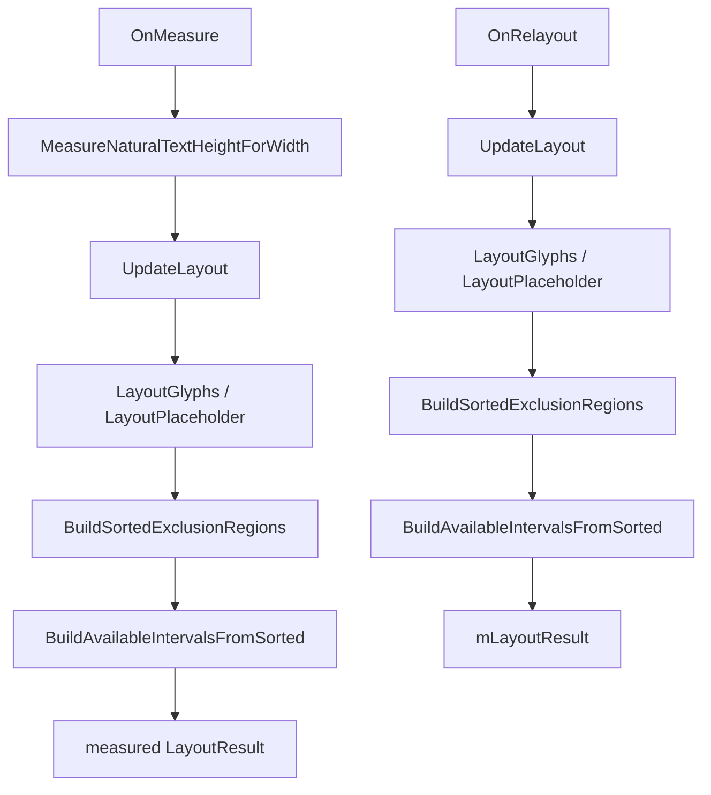

# TextVisualizer Exclusion / Layout Optimization Analysis

## 1. 목적

이 문서는 `TextVisualizer`의 exclusion layout 경로에서 남아 있는 중복 계산 후보를 정리하고, 이번 커밋에서 적용한 low-risk 개선 범위를 기록한다.

현재 primary workload는 text / font / glyph sequence가 stable하고, moving bounds / exclusion / layout result / glyph positions만 자주 바뀌는 layout-dynamic text다. 따라서 prepare 이후 runtime path에서 반복되는 layout 계산을 줄이는 것이 중요하다.

## 2. 현재 exclusion layout 경로

현재 relayout 경로는 다음 흐름을 갖는다.

`OnMeasure()`가 wrap height 계산을 위해 layout을 수행하고, 같은 width / same prepared text / same line height / same exclusion state로 곧바로 `OnRelayout()`이 호출되면 `UpdateLayout()`이 중복될 수 있다.

## 3. 후보 분석

| 후보 | 효과 가능성 | 위험 | 이번 판단 |
|---|---:|---:|---|
| measure layout cache | 중간 | 낮음 | 적용 |
| sorted exclusion cache | 중간 | 중간 | 보류 |
| exact compare epsilon | 낮음-중간 | 높음 | 보류 |
| available interval cache | 중간 | 높음 | 보류 |

### A. OnMeasure / OnRelayout 중복 layout

`OnMeasure()`는 fixed width + wrap height, wrap width + wrap height 같은 Label-like measure에서 natural height를 계산하기 위해 local `LayoutResult`를 만든다.

이후 parent가 같은 width로 `OnRelayout()`을 호출하면 exclusion sort, interval generation, word wrap scan, glyph placement가 한 번 더 수행될 수 있다.

이번 커밋에서는 `OnMeasure()`에서 만든 `LayoutResult`를 `TextVisualizerImpl` 내부 cache에 저장하고, `OnRelayout()`에서 같은 layout width일 때 이를 재사용한다.

### B. sorted exclusion cache

`LayoutGlyphs()` / `LayoutPlaceholder()`는 layout pass마다 `BuildSortedExclusionRegions()`를 호출한다.

이 정렬은 exclusion set이 바뀌지 않는 동안 재사용할 수 있지만, 현재 `LayoutEngine`은 plain `Dali::Vector<Rect<float>>`를 입력으로 받아 내부 local sorted cache를 만든다.

core에서 sorted cache를 유지하려면 다음 중 하나가 필요하다.

- `TextVisualizerImpl`이 sorted exclusions를 보유하고 `LayoutEngine` internal overload에 전달
- `LayoutEngine`에 sorted exclusion input type 추가
- static / dynamic exclusion을 core 내부에서 분리

internal API 경계와 invalidation 범위가 커지므로 이번 커밋에서는 구현하지 않는다.

### C. exclusion equality / update cost

`SetExclusionRegions()`는 exact compare 정책을 유지한다.

moving bounds 상황에서는 region 값이 대부분 매 tick 달라져 compare가 false가 되기 쉽다. 하지만 epsilon compare를 core에 넣으면 text avoidance correctness와 public semantic이 흐려진다.

따라서 현재 정책은 다음과 같이 유지한다.

- core는 exact compare 유지
- same-count storage update는 in-place 유지
- epsilon / threshold는 sample-level 실험으로만 둔다

### D. available interval cache

line y / line height / exclusion version 기반으로 available interval cache를 만들 수 있다.

하지만 word wrap과 line y progression은 서로 영향을 주고, moving bounds의 old / new y range invalidation이 필요하다. 또한 partial relayout 없이 interval cache만 넣으면 최종 glyph placement scan은 여전히 필요하다.

이 후보는 데모 후 partial relayout / affected y range 설계와 함께 보는 편이 안전하다.

## 4. 이번 적용: measured layout result cache

추가된 내부 상태:

- `mMeasuredLayoutCache`
- `mMeasuredLayoutWidth`
- `mHasMeasuredLayoutCache`

정책:

- `MeasureNaturalTextHeightForWidth()`가 `UpdateLayout()` 결과를 cache한다.
- `OnRelayout()`에서 `mLayoutDirty == true`이고 layout width가 cache width와 같으면 cache를 `mLayoutResult`로 복사한다.
- cache를 사용한 뒤에는 cache를 clear한다.
- width 비교 tolerance는 `0.001f`다.

## 5. Invalidation 정책

cache는 다음 경우 clear된다.

| 변화 | 처리 |
|---|---|
| text 변경 | `MarkPrepareDirty()`에서 clear |
| font family 변경 | `MarkPrepareDirty()`에서 clear |
| font size 변경 | `MarkPrepareDirty()`에서 clear |
| explicit `Prepare()` | prepare 시작 시 clear |
| line height 변경 | `SetLineHeight()`에서 clear |
| exclusion 변경 | `SetExclusionRegions()` / `ClearExclusionRegions()`에서 clear |

text color 변경은 layout result에 영향을 주지 않으므로 cache를 clear하지 않는다.

size 변경은 cache key인 layout width로 판단한다. `OnRelayout()`이 cache와 다른 width로 들어오면 cache를 사용하지 않고 기존처럼 `UpdateLayout()`을 수행한다.

## 6. 기대 효과와 한계

기대 효과:

- fixed width + wrap height에서 measure 직후 relayout되는 일반 control lifecycle의 중복 layout을 줄인다.
- exclusion이 많은 sample에서 measure / relayout이 같은 width로 이어질 때 sort / interval scan / word wrap scan을 한 번 절약할 수 있다.
- public API와 layout policy를 바꾸지 않는다.

한계:

- `LayoutResult` copy 비용이 있다.
- OnMeasure가 호출되지 않는 pure relayout path에는 효과가 없다.
- 매 frame exclusion 변경으로 measure가 다시 열리는 상황에서는 layout 자체는 계속 필요하다.
- sorted exclusion cache와 partial relayout은 아직 남은 후보로 둔다.

## 7. 다음 후보

다음 low-risk 후보는 sorted exclusion cache를 `TextVisualizerImpl`과 `LayoutEngine` internal boundary에서 어떻게 넘길지 설계하는 것이다.

다만 실제 큰 성능 개선은 다음 축과 함께 봐야 한다.

- layout result incremental signature
- affected y range 기반 partial relayout
- TextVisualizer-only renderer geometry update

이번 커밋은 exclusion layout path의 가장 안전한 중복 제거만 적용한다.
